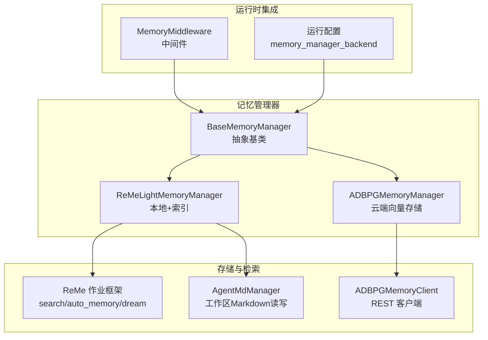
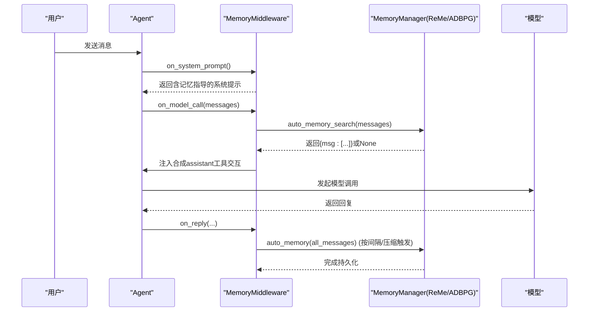
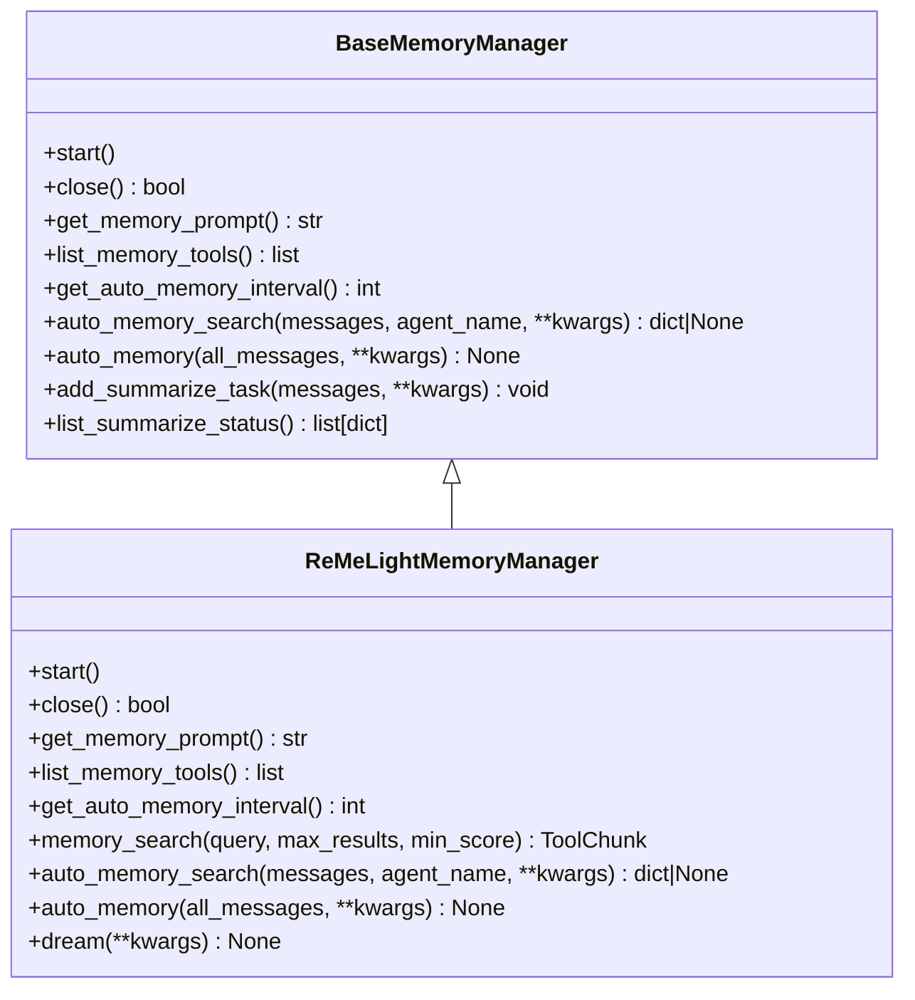
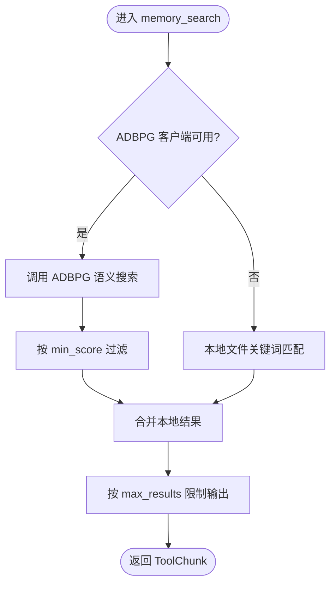
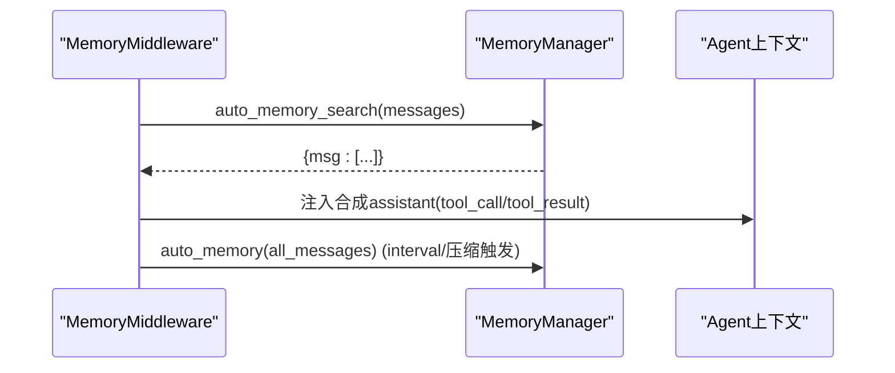
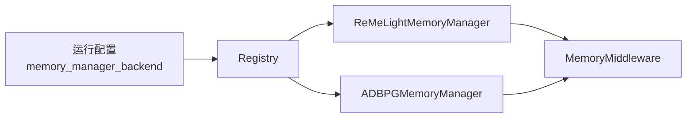

# 记忆工具系统

<cite>
**本文引用的文件**   
- [base_memory_manager.py](file://src/qwenpaw/agents/memory/base_memory_manager.py)
- [adbpg_memory_manager.py](file://src/qwenpaw/agents/memory/adbpg_memory_manager.py)
- [adbpg_client.py](file://src/qwenpaw/agents/memory/adbpg_client.py)
- [reme_light_memory_manager.py](file://src/qwenpaw/agents/memory/reme_light_memory_manager.py)
- [prompts.py](file://src/qwenpaw/agents/memory/prompts.py)
- [adbpg_prompts.py](file://src/qwenpaw/agents/memory/adbpg_prompts.py)
- [middlewares.py](file://src/qwenpaw/agents/middlewares.py)
- [config.py](file://src/qwenpaw/config/config.py)
- [agent_md_manager.py](file://src/qwenpaw/agents/memory/agent_md_manager.py)
- [test_base_memory_manager.py](file://tests/unit/agents/memory/test_base_memory_manager.py)
</cite>

## 目录
1. [简介](#简介)
2. [项目结构](#项目结构)
3. [核心组件](#核心组件)
4. [架构总览](#架构总览)
5. [详细组件分析](#详细组件分析)
6. [依赖关系分析](#依赖关系分析)
7. [性能与并发](#性能与并发)
8. [故障排查指南](#故障排查指南)
9. [结论](#结论)
10. [附录：使用示例与扩展指南](#附录使用示例与扩展指南)

## 简介
本文件系统性梳理 QwenPaw 的记忆工具系统，覆盖以下关键主题：
- 记忆工具的注册机制与暴露方式（memory_search、list_memories 等）
- 参数校验与处理逻辑（查询语法、过滤条件、结果分页）
- 自动记忆搜索触发机制（预回复阶段检索、后回复阶段提取）
- 记忆提示词模板系统（动态生成、个性化定制、多语言支持）
- 中间件集成（请求拦截、上下文注入、结果裁剪）
- 并发访问、事务一致性与性能优化策略
- 自定义记忆工具的扩展指南

## 项目结构
记忆子系统位于 agents/memory 下，包含抽象基类、具体后端实现、REST 客户端、提示词模板以及工作区 Markdown 管理。运行时通过中间件将记忆能力注入 AgentScope 的推理链路。

图表来源
- [base_memory_manager.py:33-116](file://src/qwenpaw/agents/memory/base_memory_manager.py#L33-L116)
- [reme_light_memory_manager.py:101-214](file://src/qwenpaw/agents/memory/reme_light_memory_manager.py#L101-L214)
- [adbpg_memory_manager.py:32-158](file://src/qwenpaw/agents/memory/adbpg_memory_manager.py#L32-L158)
- [adbpg_client.py:22-138](file://src/qwenpaw/agents/memory/adbpg_client.py#L22-L138)
- [agent_md_manager.py:12-106](file://src/qwenpaw/agents/memory/agent_md_manager.py#L12-L106)
- [middlewares.py:46-108](file://src/qwenpaw/agents/middlewares.py#L46-L108)
- [config.py:1284-1294](file://src/qwenpaw/config/config.py#L1284-L1294)

章节来源
- [base_memory_manager.py:33-116](file://src/qwenpaw/agents/memory/base_memory_manager.py#L33-L116)
- [config.py:1284-1294](file://src/qwenpaw/config/config.py#L1284-L1294)

## 核心组件
- BaseMemoryManager：定义生命周期、工具列表、自动记忆接口、摘要任务队列、自动搜索消息构造与清理等通用能力。
- ReMeLightMemoryManager：基于 ReMe 应用/作业框架，提供语义搜索、自动记忆、自动总结（dream）、工作区文件管理等能力。
- ADBPGMemoryManager：基于 AnalyticDB for PostgreSQL 的云端长期记忆，提供 REST 增删查与自动持久化。
- ADBPGMemoryClient：HTTP 异步客户端，封装 /v3/memories/add 与 /v3/memories/search 调用。
- MemoryMiddleware：在 on_system_prompt/on_model_call/on_reply/on_compress_context 钩子中注入记忆提示、执行自动检索与批量持久化。
- AgentMdManager：安全地读写工作区与 memory/digest 目录下的 Markdown 文件，提供路径防护与元信息列举。

章节来源
- [base_memory_manager.py:33-116](file://src/qwenpaw/agents/memory/base_memory_manager.py#L33-L116)
- [reme_light_memory_manager.py:101-214](file://src/qwenpaw/agents/memory/reme_light_memory_manager.py#L101-L214)
- [adbpg_memory_manager.py:32-158](file://src/qwenpaw/agents/memory/adbpg_memory_manager.py#L32-L158)
- [adbpg_client.py:22-138](file://src/qwenpaw/agents/memory/adbpg_client.py#L22-L138)
- [middlewares.py:46-108](file://src/qwenpaw/agents/middlewares.py#L46-L108)
- [agent_md_manager.py:12-106](file://src/qwenpaw/agents/memory/agent_md_manager.py#L12-L106)

## 架构总览
记忆系统在运行时以“中间件 + 管理器”的方式接入 AgentScope 推理循环：
- 系统提示注入：on_system_prompt 追加记忆指导语
- 预回复自动检索：on_model_call 根据最新用户轮次构建查询并调用 manager.auto_memory_search，将合成 assistant 工具交互插入上下文
- 后回复自动提取：on_reply 收集待处理的轮次标记，按间隔或压缩阈值触发 manager.auto_memory
- 压缩时汇总：on_compress_context 在即将压缩前触发 flush，避免丢失重要上下文

图表来源
- [middlewares.py:61-108](file://src/qwenpaw/agents/middlewares.py#L61-L108)
- [middlewares.py:111-167](file://src/qwenpaw/agents/middlewares.py#L111-L167)
- [base_memory_manager.py:270-315](file://src/qwenpaw/agents/memory/base_memory_manager.py#L270-L315)

## 详细组件分析

### 抽象基类：BaseMemoryManager
职责与关键点
- 生命周期：start/close；获取提示 get_memory_prompt；工具列表 list_memory_tools
- 自动记忆：auto_memory_search（预回复）、auto_memory（后回复）
- 自动搜索消息构造：_build_auto_memory_search_msg 生成带 thinking/tool_call/tool_result 的合成 assistant 消息，并记录 usage 估算
- 自动轮次状态：get_auto_memory_turn_state 维护 per-session 的 pending/seen/touched_at，TTL 过期清理
- 摘要任务队列：add_summarize_task/list_summarize_status 串行执行 summarize，便于后台整理
- 自动搜索块清理：message_without_auto_memory_search/_messages_without_auto_memory_search 用于从 all_messages 剔除合成块，避免重复写入

复杂度与边界
- _build_query 仅取最近一条 user 文本，截断至固定长度，避免过长查询
- 估算 token 数采用字节长度除以一个可配置的除数，降低开销

章节来源
- [base_memory_manager.py:33-116](file://src/qwenpaw/agents/memory/base_memory_manager.py#L33-L116)
- [base_memory_manager.py:139-239](file://src/qwenpaw/agents/memory/base_memory_manager.py#L139-L239)
- [base_memory_manager.py:270-315](file://src/qwenpaw/agents/memory/base_memory_manager.py#L270-L315)
- [base_memory_manager.py:317-360](file://src/qwenpaw/agents/memory/base_memory_manager.py#L317-L360)
- [base_memory_manager.py:361-463](file://src/qwenpaw/agents/memory/base_memory_manager.py#L361-L463)
- [test_base_memory_manager.py:193-283](file://tests/unit/agents/memory/test_base_memory_manager.py#L193-L283)

### ReMe 记忆管理器：ReMeLightMemoryManager
职责与关键点
- 启动与关闭：start 初始化 ReMe 应用并可重建索引；close 取消后台 worker 并关闭 ReMe
- 提示词：get_memory_prompt 基于 prompts.build_memory_guidance_prompt 动态生成，支持 zh/en 多语言与 daily_dir 注入
- 工具列表：list_memory_tools 暴露 memory_search
- 自动记忆间隔：get_auto_memory_interval 读取运行配置
- 自动检索：auto_memory_search 调用 ReMe search 作业，若命中则构造合成 assistant 消息注入上下文
- 自动提取：auto_memory 通过 add_summarize_task 提交到后台队列，最终由 ReMe auto_memory 作业持久化
- 自动总结（dream）：dream 触发 ReMe auto_dream 作业
- 结果回写：ReMe 作业结果经 inbox 事件推送，便于控制台查看

参数校验与处理
- memory_search 对空 query 进行错误返回；min_score 默认 0，避免混合评分体系误伤
- auto_memory_search 严格检查 enabled 开关与 max_results 下限

图表来源
- [base_memory_manager.py:33-116](file://src/qwenpaw/agents/memory/base_memory_manager.py#L33-L116)
- [reme_light_memory_manager.py:101-214](file://src/qwenpaw/agents/memory/reme_light_memory_manager.py#L101-L214)
- [reme_light_memory_manager.py:380-538](file://src/qwenpaw/agents/memory/reme_light_memory_manager.py#L380-L538)

章节来源
- [reme_light_memory_manager.py:101-214](file://src/qwenpaw/agents/memory/reme_light_memory_manager.py#L101-L214)
- [reme_light_memory_manager.py:380-538](file://src/qwenpaw/agents/memory/reme_light_memory_manager.py#L380-L538)
- [prompts.py:47-57](file://src/qwenpaw/agents/memory/prompts.py#L47-L57)

### ADBPG 记忆管理器：ADBPGMemoryManager
职责与关键点
- 启动：从运行配置加载 adbpg_memory_config，校验必填项并创建 ADBPGMemoryClient
- 隔离模式：根据 memory_isolation 决定 effective_agent_id/user_id/run_id
- 提示词：get_memory_prompt 选择 ADBPG_MEMORY_GUIDANCE_ZH/EN
- 工具列表：list_memory_tools 暴露 memory_search
- 自动记忆间隔：返回 1，即每轮都尝试持久化用户消息
- 自动检索：auto_memory_search 调用 memory_search 并将结果合成 assistant 消息注入
- 自动提取：auto_memory 去重已持久化的 user 消息，调度后台 add_memory 任务
- memory_search：合并 ADBPG 语义搜索结果与本地 MEMORY.md/memory/*.md 关键词匹配结果，按分数/命中数量排序并限制输出条数

图表来源
- [adbpg_memory_manager.py:255-333](file://src/qwenpaw/agents/memory/adbpg_memory_manager.py#L255-L333)
- [adbpg_memory_manager.py:388-431](file://src/qwenpaw/agents/memory/adbpg_memory_manager.py#L388-L431)

章节来源
- [adbpg_memory_manager.py:32-158](file://src/qwenpaw/agents/memory/adbpg_memory_manager.py#L32-L158)
- [adbpg_memory_manager.py:177-250](file://src/qwenpaw/agents/memory/adbpg_memory_manager.py#L177-L250)
- [adbpg_memory_manager.py:255-333](file://src/qwenpaw/agents/memory/adbpg_memory_manager.py#L255-L333)
- [adbpg_memory_manager.py:388-431](file://src/qwenpaw/agents/memory/adbpg_memory_manager.py#L388-L431)

### ADBPG 客户端：ADBPGMemoryClient
职责与关键点
- add_memory：POST /v3/memories/add/，携带 messages、identity、run_id、metadata
- search_memory：POST /v3/memories/search/，filters 包含 agent_id/user_id，top_k=limit；兼容返回 dict/list
- 超时与异常：区分 timeout 警告与其他错误日志，失败返回空列表
- 连接管理：AsyncClient 复用，close 释放资源

章节来源
- [adbpg_client.py:22-138](file://src/qwenpaw/agents/memory/adbpg_client.py#L22-L138)

### 中间件：MemoryMiddleware
职责与关键点
- on_system_prompt：注入 get_memory_prompt 指导语
- on_model_call：检测自动化来源跳过；否则基于最新 user 轮次标记执行 auto_memory_search，将合成的 tool_call/tool_result 注入上下文
- on_reply：收集 pending 轮次标记，按 interval 或压缩阈值触发 flush_auto_memory
- on_compress_context：在压缩前判断是否触发 flush
- 辅助方法：_extract_memory_messages 仅保留 tool_call/tool_result 类型的合成消息；_messages_for_user_turns 精确截取轮次范围

图表来源
- [middlewares.py:61-108](file://src/qwenpaw/agents/middlewares.py#L61-L108)
- [middlewares.py:111-167](file://src/qwenpaw/agents/middlewares.py#L111-L167)
- [middlewares.py:243-328](file://src/qwenpaw/agents/middlewares.py#L243-L328)

章节来源
- [middlewares.py:46-108](file://src/qwenpaw/agents/middlewares.py#L46-L108)
- [middlewares.py:111-167](file://src/qwenpaw/agents/middlewares.py#L111-L167)
- [middlewares.py:243-328](file://src/qwenpaw/agents/middlewares.py#L243-L328)

### 提示词模板系统
- ReMe 模板：build_memory_guidance_prompt(language, daily_dir) 动态注入 daily_dir，支持 zh/en
- ADBPG 模板：直接返回对应语言的长指导语，强调主动检索与自动记录原则

章节来源
- [prompts.py:47-57](file://src/qwenpaw/agents/memory/prompts.py#L47-L57)
- [adbpg_prompts.py:5-71](file://src/qwenpaw/agents/memory/adbpg_prompts.py#L5-L71)

### 工作区 Markdown 管理：AgentMdManager
职责与关键点
- 路径安全：sanitize_md_name/normalize_md_path/assert_within_dir 防止路径穿越
- 目录组织：working_dir、memory_dir、digest_dir 自动创建
- 列举与读写：list_working_mds/read/write_working_md、list_memory_mds/read/write_memory_md
- 元信息：返回 size、created_time、modified_time 等

章节来源
- [agent_md_manager.py:12-106](file://src/qwenpaw/agents/memory/agent_md_manager.py#L12-L106)
- [agent_md_manager.py:107-252](file://src/qwenpaw/agents/memory/agent_md_manager.py#L107-L252)

## 依赖关系分析
- 管理器注册：BaseMemoryManager.memory_registry 提供后端解析 get_memory_manager_backend，未找到时回退首个注册后端
- 运行配置：RunningConfig.memory_manager_backend 指定默认后端（remelight），同时支持 adbpg_memory_config 与 reme_light_memory_config
- 中间件装配：BaseMemoryManager.build_middlewares 返回 MemoryMiddleware(memory_manager=self)，由上层组装到 Agent

图表来源
- [base_memory_manager.py:470-509](file://src/qwenpaw/agents/memory/base_memory_manager.py#L470-L509)
- [config.py:1284-1294](file://src/qwenpaw/config/config.py#L1284-L1294)
- [middlewares.py:91-99](file://src/qwenpaw/agents/middlewares.py#L91-L99)

章节来源
- [base_memory_manager.py:470-509](file://src/qwenpaw/agents/memory/base_memory_manager.py#L470-L509)
- [config.py:1284-1294](file://src/qwenpaw/config/config.py#L1284-L1294)
- [middlewares.py:91-99](file://src/qwenpaw/agents/middlewares.py#L91-L99)

## 性能与并发
- 自动记忆批处理：BaseMemoryManager 内部使用 asyncio.Queue 串行执行 summarize，避免并发竞争与锁复杂化
- 非阻塞持久化：ADBPGMemoryManager._schedule_add 使用 create_task 异步写入，不阻塞主流程
- 本地文件搜索：在 executor 线程池中执行，避免阻塞事件循环
- 自动搜索消息用量估算：基于字节长度与可配置除数估算 input_tokens，减少真实计数开销
- 中间件节流：on_reply 按 interval 聚合轮次，避免频繁触发；on_compress_context 在压缩前统一 flush，减少碎片化写入

章节来源
- [base_memory_manager.py:361-463](file://src/qwenpaw/agents/memory/base_memory_manager.py#L361-L463)
- [adbpg_memory_manager.py:364-387](file://src/qwenpaw/agents/memory/adbpg_memory_manager.py#L364-L387)
- [adbpg_memory_manager.py:302-317](file://src/qwenpaw/agents/memory/adbpg_memory_manager.py#L302-L317)
- [base_memory_manager.py:211-239](file://src/qwenpaw/agents/memory/base_memory_manager.py#L211-L239)
- [middlewares.py:136-167](file://src/qwenpaw/agents/middlewares.py#L136-L167)

## 故障排查指南
常见问题与定位
- 自动搜索无结果
  - 检查 auto_memory_search_config.enabled 与 max_results 设置
  - 确认 memory_search 返回为空或“No relevant memories found.”
  - 参考测试用例验证 _build_query 行为与合成消息字段
- 自动提取未触发
  - 确认 get_auto_memory_interval 返回值与 on_reply 的 pending 计数
  - 检查 on_compress_context 的压缩阈值与 summarize_when_compact 开关
- ADBPG 不可用
  - 检查 adbpg_memory_config.rest_base_url/rest_api_key 是否配置
  - 关注客户端超时与异常日志，确认网络与鉴权
- 本地文件搜索失败
  - 检查工作区路径权限与文件编码，注意异常捕获与降级

章节来源
- [adbpg_memory_manager.py:55-115](file://src/qwenpaw/agents/memory/adbpg_memory_manager.py#L55-L115)
- [adbpg_client.py:71-121](file://src/qwenpaw/agents/memory/adbpg_client.py#L71-L121)
- [test_base_memory_manager.py:193-283](file://tests/unit/agents/memory/test_base_memory_manager.py#L193-L283)

## 结论
QwenPaw 的记忆工具系统以“抽象基类 + 多后端实现 + 中间件注入”的架构，提供了灵活的长期记忆能力。ReMe 后端侧重本地文件与索引，ADBPG 后端侧重云端向量检索；两者均支持自动检索与自动提取，并通过中间件无缝融入 AgentScope 推理链路。通过合理的并发与节流策略，系统在可用性、性能与一致性之间取得平衡。

## 附录：使用示例与扩展指南

### 工具调用示例（对话中使用记忆功能）
- 手动检索
  - 调用 memory_search(query="某项目决策", max_results=5, min_score=0.1)
  - 返回包含来源与片段的结果，供模型引用
- 自动检索（无需显式调用）
  - 在 on_model_call 阶段，中间件会根据最新用户消息自动检索并注入合成 assistant 消息
- 自动提取（无需显式调用）
  - 在 on_reply 阶段，按 interval 或压缩阈值触发 auto_memory，持久化相关轮次

章节来源
- [adbpg_memory_manager.py:255-333](file://src/qwenpaw/agents/memory/adbpg_memory_manager.py#L255-L333)
- [middlewares.py:74-108](file://src/qwenpaw/agents/middlewares.py#L74-L108)
- [middlewares.py:111-167](file://src/qwenpaw/agents/middlewares.py#L111-L167)

### 参数验证与处理要点
- 查询语法
  - ReMe：query 不能为空，否则返回错误；min_score 建议保持 0 以避免混合评分误伤
  - ADBPG：query 为自由文本，服务端负责语义匹配；本地文件侧做分词命中统计
- 过滤条件
  - ADBPG：filters 包含 agent_id/user_id；run_id 仅用于 add 兼容
  - 本地文件：按段落粒度计算命中比例，按 score 降序
- 结果分页
  - 通过 max_results/top_k 控制返回条目数；超出部分丢弃

章节来源
- [reme_light_memory_manager.py:380-425](file://src/qwenpaw/agents/memory/reme_light_memory_manager.py#L380-L425)
- [adbpg_memory_manager.py:281-333](file://src/qwenpaw/agents/memory/adbpg_memory_manager.py#L281-L333)
- [adbpg_client.py:71-121](file://src/qwenpaw/agents/memory/adbpg_client.py#L71-L121)

### 自动记忆搜索触发机制
- 预回复阶段
  - on_model_call 检测自动化来源，若非自动化则执行 auto_memory_search，将合成 assistant 消息注入
- 后回复阶段
  - on_reply 累积轮次标记，达到 interval 或压缩阈值时触发 auto_memory

章节来源
- [middlewares.py:74-108](file://src/qwenpaw/agents/middlewares.py#L74-L108)
- [middlewares.py:111-167](file://src/qwenpaw/agents/middlewares.py#L111-L167)

### 记忆提示词模板系统
- 动态生成：build_memory_guidance_prompt 注入 daily_dir
- 个性化定制：不同后端提供各自指导语（ReMe/ADBPG）
- 多语言支持：zh/en 两套模板

章节来源
- [prompts.py:47-57](file://src/qwenpaw/agents/memory/prompts.py#L47-L57)
- [adbpg_prompts.py:5-71](file://src/qwenpaw/agents/memory/adbpg_prompts.py#L5-L71)

### 与中间件的集成
- 请求拦截：on_system_prompt 注入提示词
- 上下文注入：on_model_call 注入合成工具交互
- 结果缓存：当前实现未引入额外缓存层，依赖后端自身能力
- 错误处理：中间件捕获异常并记录日志，不影响主流程

章节来源
- [middlewares.py:61-108](file://src/qwenpaw/agents/middlewares.py#L61-L108)
- [middlewares.py:111-167](file://src/qwenpaw/agents/middlewares.py#L111-L167)

### 并发访问、事务一致性与性能优化
- 并发访问
  - 摘要任务串行执行，避免并发写冲突
  - 持久化任务异步提交，不阻塞主流程
- 事务一致性
  - 去重机制：ADBPG 端跟踪 persisted_msg_ids，避免重复写入
  - 合成消息清理：_messages_without_auto_memory_search 确保不会二次持久化
- 性能优化
  - 估算 token 数、executor 并行本地搜索、按 interval 聚合写入

章节来源
- [base_memory_manager.py:361-463](file://src/qwenpaw/agents/memory/base_memory_manager.py#L361-L463)
- [adbpg_memory_manager.py:232-250](file://src/qwenpaw/agents/memory/adbpg_memory_manager.py#L232-L250)
- [adbpg_memory_manager.py:302-317](file://src/qwenpaw/agents/memory/adbpg_memory_manager.py#L302-L317)
- [base_memory_manager.py:211-239](file://src/qwenpaw/agents/memory/base_memory_manager.py#L211-L239)

### 自定义记忆工具扩展指南
- 步骤
  1) 继承 BaseMemoryManager，实现 start/close/get_memory_prompt/list_memory_tools 等必要方法
  2) 在 list_memory_tools 中返回自定义工具函数（如 list_memories、delete_memory 等）
  3) 如需自动记忆，实现 auto_memory_search/auto_memory，并在 get_auto_memory_interval 中返回期望间隔
  4) 使用 @memory_registry.register("your_backend") 注册后端
  5) 在运行配置中将 memory_manager_backend 设置为 your_backend
- 注意事项
  - 工具签名需返回 ToolChunk，遵循 Agentscope 约定
  - 自动搜索合成消息应使用 _build_auto_memory_search_msg，保证 usage 与 block id 元数据正确
  - 对 I/O 操作使用异步或线程池，避免阻塞事件循环

章节来源
- [base_memory_manager.py:33-116](file://src/qwenpaw/agents/memory/base_memory_manager.py#L33-L116)
- [base_memory_manager.py:470-509](file://src/qwenpaw/agents/memory/base_memory_manager.py#L470-L509)
- [base_memory_manager.py:139-239](file://src/qwenpaw/agents/memory/base_memory_manager.py#L139-L239)