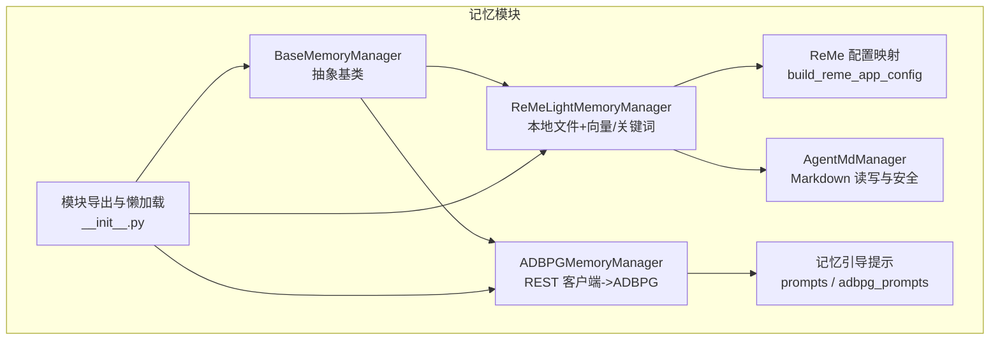
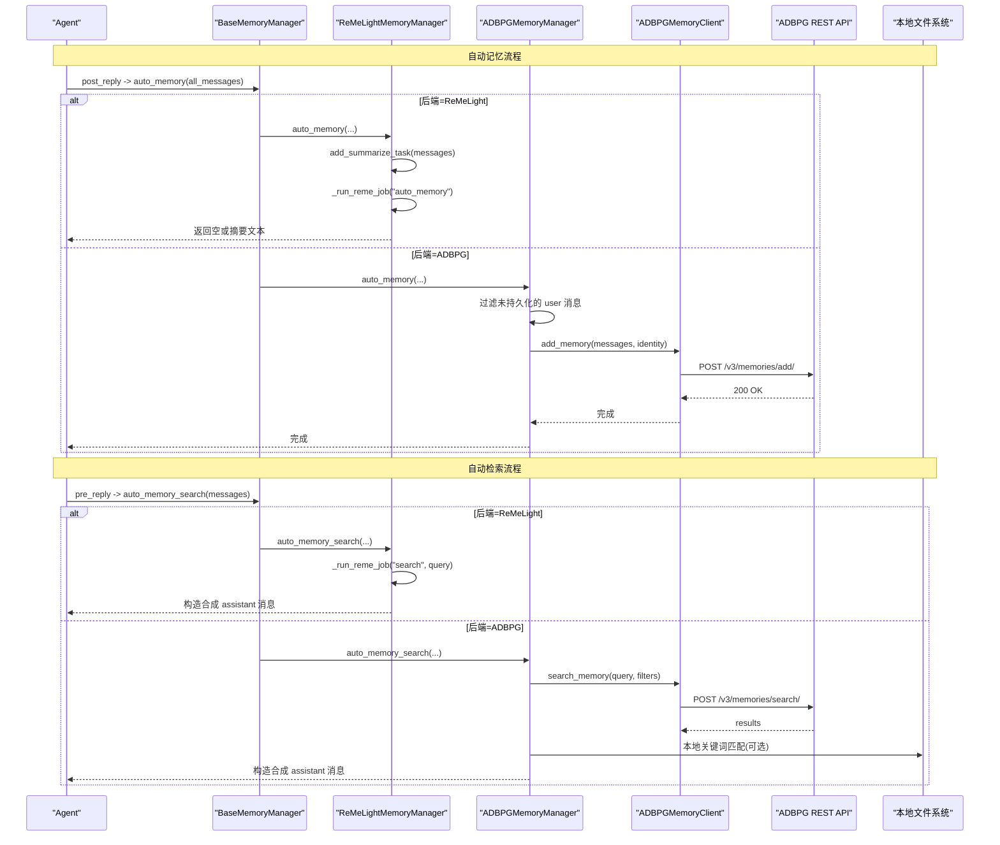
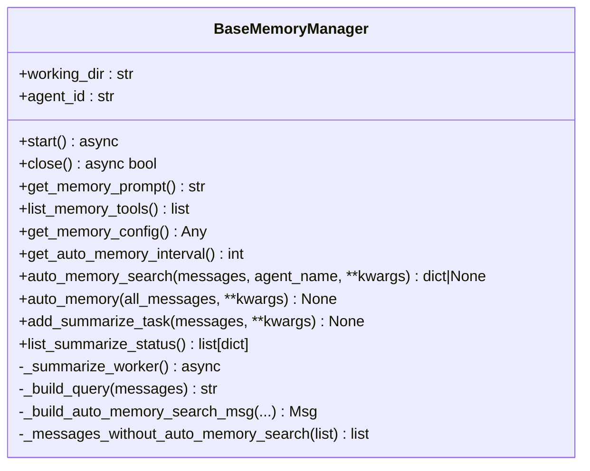
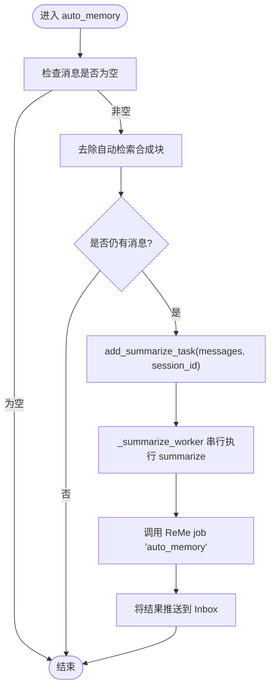
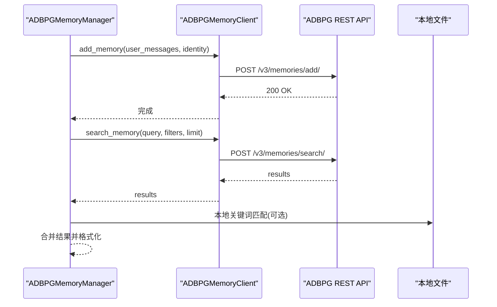
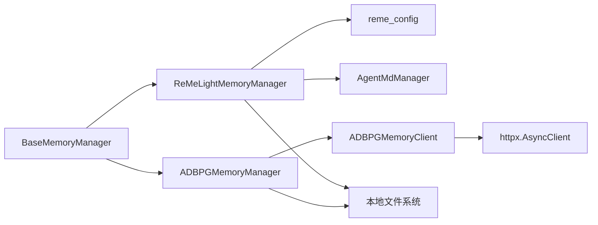

# 长期语义记忆

<cite>
**本文引用的文件**   
- [base_memory_manager.py](file://src/qwenpaw/agents/memory/base_memory_manager.py)
- [adbpg_memory_manager.py](file://src/qwenpaw/agents/memory/adbpg_memory_manager.py)
- [adbpg_client.py](file://src/qwenpaw/agents/memory/adbpg_client.py)
- [adbpg_prompts.py](file://src/qwenpaw/agents/memory/adbpg_prompts.py)
- [reme_light_memory_manager.py](file://src/qwenpaw/agents/memory/reme_light_memory_manager.py)
- [reme_config.py](file://src/qwenpaw/agents/memory/reme_config.py)
- [agent_md_manager.py](file://src/qwenpaw/agents/memory/agent_md_manager.py)
- [prompts.py](file://src/qwenpaw/agents/memory/prompts.py)
- [__init__.py](file://src/qwenpaw/agents/memory/__init__.py)
</cite>

## 目录
1. [简介](#简介)
2. [项目结构](#项目结构)
3. [核心组件](#核心组件)
4. [架构总览](#架构总览)
5. [详细组件分析](#详细组件分析)
6. [依赖关系分析](#依赖关系分析)
7. [性能与优化](#性能与优化)
8. [故障排查指南](#故障排查指南)
9. [结论](#结论)
10. [附录：配置与集成示例](#附录配置与集成示例)

## 简介
本文件系统性梳理 QwenPaw 的“长期语义记忆”子系统，围绕以下目标展开：
- 基于 ReMe v0.4.0 的轻量级记忆实现（ReMeLightMemoryManager）：语义向量存储、相似性搜索与知识图谱构建。
- ADBPG 内存管理器的数据库设计要点（通过 REST API 访问）、索引策略与查询优化建议。
- 轻量级记忆管理器工作机制：文件存储格式、元数据管理与版本控制。
- Agent MD 管理器的文档化能力：自动生成、更新策略与一致性保证。
- 配置示例：如何设置不同的长期记忆后端（remelight 与 adbpg）。
- 与搜索工具的集成：自动记忆提取与智能推荐。
- 数据迁移、备份恢复与性能调优。
- 开发自定义记忆后端的指导。

## 项目结构
QwenPaw 的记忆模块位于 agents/memory 下，采用“抽象基类 + 多后端实现”的分层组织方式：
- 抽象基类 BaseMemoryManager：定义生命周期、工具注册、自动记忆与自动检索等统一接口。
- 后端实现：
  - ReMeLightMemoryManager：基于 ReMe 应用框架，使用本地文件与向量/关键词混合检索。
  - ADBPGMemoryManager：通过 REST 客户端访问云端 ADBPG 服务进行语义记忆存取。
- 辅助模块：
  - reme_config：将 QwenPaw 的配置映射为 ReMe 应用配置。
  - agent_md_manager：工作区与记忆目录下的 Markdown 读写与路径安全校验。
  - prompts / adbpg_prompts：注入到系统提示中的记忆引导语。
  - __init__.py：集中导出并延迟加载主动式记忆相关符号以避免循环导入。

图示来源
- [base_memory_manager.py:33-116](file://src/qwenpaw/agents/memory/base_memory_manager.py#L33-L116)
- [reme_light_memory_manager.py:101-214](file://src/qwenpaw/agents/memory/reme_light_memory_manager.py#L101-L214)
- [adbpg_memory_manager.py:32-158](file://src/qwenpaw/agents/memory/adbpg_memory_manager.py#L32-L158)
- [agent_md_manager.py:12-46](file://src/qwenpaw/agents/memory/agent_md_manager.py#L12-L46)
- [reme_config.py:23-52](file://src/qwenpaw/agents/memory/reme_config.py#L23-L52)
- [prompts.py:47-57](file://src/qwenpaw/agents/memory/prompts.py#L47-L57)
- [adbpg_prompts.py:5-36](file://src/qwenpaw/agents/memory/adbpg_prompts.py#L5-L36)
- [__init__.py:1-70](file://src/qwenpaw/agents/memory/__init__.py#L1-L70)

章节来源
- [__init__.py:1-70](file://src/qwenpaw/agents/memory/__init__.py#L1-L70)

## 核心组件
- BaseMemoryManager
  - 提供统一的启动/关闭、工具注册、自动记忆与自动检索钩子；内置后台摘要任务队列与状态追踪。
  - 暴露 get_auto_memory_interval、auto_memory_search、auto_memory 等扩展点供后端定制。
- ReMeLightMemoryManager
  - 以 ReMe 应用为核心，负责 auto_memory、search、dream 等作业执行；将结果推送至 Inbox。
  - 支持在启动时重建索引、注入当前 LLM 模型、Windows 兼容的会话 ID 编码。
- ADBPGMemoryManager
  - 通过 ADBPGMemoryClient 调用 REST API 完成 add/search；结合本地文件做关键词补充检索。
  - 支持按 agent/user/run 隔离维度持久化用户消息，并在每次对话轮次自动追加。
- AgentMdManager
  - 对 working_dir 与 memory/digest 目录进行安全的 Markdown 读写，包含路径穿越防护与相对路径规范化。
- 配置与提示
  - reme_config 将 QwenPaw 的 embedding 与目录结构映射为 ReMe 组件配置。
  - prompts/adbpg_prompts 提供面向不同后端的系统提示模板。

章节来源
- [base_memory_manager.py:33-116](file://src/qwenpaw/agents/memory/base_memory_manager.py#L33-L116)
- [reme_light_memory_manager.py:101-214](file://src/qwenpaw/agents/memory/reme_light_memory_manager.py#L101-L214)
- [adbpg_memory_manager.py:32-158](file://src/qwenpaw/agents/memory/adbpg_memory_manager.py#L32-L158)
- [agent_md_manager.py:12-46](file://src/qwenpaw/agents/memory/agent_md_manager.py#L12-L46)
- [reme_config.py:23-52](file://src/qwenpaw/agents/memory/reme_config.py#L23-L52)
- [prompts.py:47-57](file://src/qwenpaw/agents/memory/prompts.py#L47-L57)
- [adbpg_prompts.py:5-36](file://src/qwenpaw/agents/memory/adbpg_prompts.py#L5-L36)

## 架构总览
整体由“抽象基类 + 多后端 + 外部服务”构成：
- 抽象层：BaseMemoryManager 定义统一契约。
- 后端层：
  - ReMeLightMemoryManager：本地文件 + 向量/关键词混合检索 + 作业编排。
  - ADBPGMemoryManager：REST 客户端 + 服务端语义抽取 + 本地关键词补充。
- 外部服务：
  - ADBPG REST API：提供 memories/add 与 memories/search。
  - ReMe 应用：提供 search/auto_memory/auto_dream/reindex 等作业。

图示来源
- [base_memory_manager.py:270-315](file://src/qwenpaw/agents/memory/base_memory_manager.py#L270-L315)
- [reme_light_memory_manager.py:456-527](file://src/qwenpaw/agents/memory/reme_light_memory_manager.py#L456-L527)
- [adbpg_memory_manager.py:177-246](file://src/qwenpaw/agents/memory/adbpg_memory_manager.py#L177-L246)
- [adbpg_client.py:39-121](file://src/qwenpaw/agents/memory/adbpg_client.py#L39-L121)

## 详细组件分析

### 抽象基类 BaseMemoryManager
- 职责
  - 生命周期：start/close 抽象方法；默认 get_memory_prompt/get_memory_config/list_memory_tools。
  - 自动记忆：auto_memory 钩子；后台 summarize 任务队列与状态跟踪。
  - 自动检索：auto_memory_search 钩子；构建合成 assistant 消息并估算 token 用量。
  - 工具注册：list_memory_tools 返回 memory_search 等工具函数。
- 关键机制
  - 自动记忆轮次去重：_persisted_msg_ids 避免重复写入。
  - 合成消息清洗：_messages_without_auto_memory_search 移除内部块，避免污染上下文。
  - Token 估算：基于配置的字节/token 除数估算输入 token。

图示来源
- [base_memory_manager.py:33-116](file://src/qwenpaw/agents/memory/base_memory_manager.py#L33-L116)
- [base_memory_manager.py:270-315](file://src/qwenpaw/agents/memory/base_memory_manager.py#L270-L315)
- [base_memory_manager.py:361-463](file://src/qwenpaw/agents/memory/base_memory_manager.py#L361-L463)

章节来源
- [base_memory_manager.py:33-116](file://src/qwenpaw/agents/memory/base_memory_manager.py#L33-L116)
- [base_memory_manager.py:270-315](file://src/qwenpaw/agents/memory/base_memory_manager.py#L270-L315)
- [base_memory_manager.py:361-463](file://src/qwenpaw/agents/memory/base_memory_manager.py#L361-L463)

### ReMe 轻量级记忆管理器（ReMeLightMemoryManager）
- 职责
  - 初始化 ReMe 应用，注入 QwenPaw 当前 LLM 模型。
  - 启动时可重建索引；支持 auto_memory、search、dream、reindex 等作业。
  - 将作业结果推送到 Inbox，便于 UI 展示与审计。
- 关键特性
  - Windows 安全会话 ID 编码：避免非法文件名字符。
  - 自动记忆间隔：从运行配置读取 reme_light_memory_config.auto_memory_interval。
  - 自动检索：根据 enabled 开关与 max_results 参数触发 search 作业。
  - 工具：memory_search 作为 agent 可调用工具。

图示来源
- [reme_light_memory_manager.py:502-527](file://src/qwenpaw/agents/memory/reme_light_memory_manager.py#L502-L527)
- [base_memory_manager.py:361-463](file://src/qwenpaw/agents/memory/base_memory_manager.py#L361-L463)
- [reme_light_memory_manager.py:278-360](file://src/qwenpaw/agents/memory/reme_light_memory_manager.py#L278-L360)

章节来源
- [reme_light_memory_manager.py:101-214](file://src/qwenpaw/agents/memory/reme_light_memory_manager.py#L101-L214)
- [reme_light_memory_manager.py:456-527](file://src/qwenpaw/agents/memory/reme_light_memory_manager.py#L456-L527)
- [reme_light_memory_manager.py:278-360](file://src/qwenpaw/agents/memory/reme_light_memory_manager.py#L278-L360)

### ADBPG 内存管理器（ADBPGMemoryManager）
- 职责
  - 解析 agent 配置中的 adbpg_memory_config，建立 ADBPGMemoryClient。
  - 支持按 agent/user/run 隔离维度持久化用户消息。
  - 自动记忆：每轮新增 user 消息即异步追加；自动检索：根据开关与阈值触发搜索。
  - 工具：memory_search 同时检索 ADBPG 与本地 MEMORY.md/memory/*.md。
- 关键特性
  - 失败降级：网络异常或超时不影响主流程，仅记录日志。
  - 本地关键词补充：当 ADBPG 无结果或分数过低时，回退到本地文件关键词匹配。

图示来源
- [adbpg_memory_manager.py:163-246](file://src/qwenpaw/agents/memory/adbpg_memory_manager.py#L163-L246)
- [adbpg_client.py:39-121](file://src/qwenpaw/agents/memory/adbpg_client.py#L39-L121)
- [adbpg_memory_manager.py:388-431](file://src/qwenpaw/agents/memory/adbpg_memory_manager.py#L388-L431)

章节来源
- [adbpg_memory_manager.py:32-158](file://src/qwenpaw/agents/memory/adbpg_memory_manager.py#L32-L158)
- [adbpg_memory_manager.py:163-246](file://src/qwenpaw/agents/memory/adbpg_memory_manager.py#L163-L246)
- [adbpg_client.py:39-121](file://src/qwenpaw/agents/memory/adbpg_client.py#L39-L121)

### ADBPG 客户端（ADBPGMemoryClient）
- 职责
  - 封装 HTTP 请求头、超时与重试策略。
  - 提供 add_memory 与 search_memory 两个核心接口。
  - 输出等效 curl 调试信息，便于问题定位。
- 关键行为
  - 身份字段：agent_id、user_id 作为过滤器传入。
  - 错误处理：区分超时与其他异常，返回空结果以保证健壮性。

章节来源
- [adbpg_client.py:1-157](file://src/qwenpaw/agents/memory/adbpg_client.py#L1-L157)

### Agent MD 管理器（AgentMdManager）
- 职责
  - 维护 working_dir、memory_dir、digest_dir 三个目录。
  - 提供 read/write/list 操作，并对路径进行严格校验，防止路径穿越。
- 关键特性
  - 路径规范化：统一斜杠、拒绝 .. 与空名。
  - 目录边界检查：resolve 后再比较，确保不会逃逸受控目录。
  - 时间戳元数据：创建/修改时间以 UTC ISO 格式返回。

章节来源
- [agent_md_manager.py:12-106](file://src/qwenpaw/agents/memory/agent_md_manager.py#L12-L106)
- [agent_md_manager.py:107-168](file://src/qwenpaw/agents/memory/agent_md_manager.py#L107-L168)
- [agent_md_manager.py:169-252](file://src/qwenpaw/agents/memory/agent_md_manager.py#L169-L252)

### ReMe 配置映射（reme_config）
- 职责
  - 将 QwenPaw 的 running.reme_light_memory_config 与 embedding 配置转换为 ReMe Application 所需字典。
  - 定义 jobs（search、auto_memory、auto_dream、reindex 等）与 components（as_embedding、embedding_store、file_store 等）。
- 关键特性
  - 嵌入后端适配：openai/dashscope/gemini/ollama 等。
  - 索引监听规则：可按需启用 raw log 目录扫描。
  - 目录映射：workspace_dir、daily_dir、digest_dir、resource_dir 等。

章节来源
- [reme_config.py:23-52](file://src/qwenpaw/agents/memory/reme_config.py#L23-L52)
- [reme_config.py:55-540](file://src/qwenpaw/agents/memory/reme_config.py#L55-L540)
- [reme_config.py:633-696](file://src/qwenpaw/agents/memory/reme_config.py#L633-L696)

### 提示词模板（prompts / adbpg_prompts）
- 职责
  - 向系统提示中注入记忆使用指引，包括何时检索、如何避免覆盖、敏感信息保护等。
  - 针对 ADBPG 后端强调“云端自动提取”、“先搜后答”的原则。

章节来源
- [prompts.py:7-57](file://src/qwenpaw/agents/memory/prompts.py#L7-L57)
- [adbpg_prompts.py:5-71](file://src/qwenpaw/agents/memory/adbpg_prompts.py#L5-L71)

## 依赖关系分析
- 模块内依赖
  - ReMeLightMemoryManager 依赖 reme_config 生成 ReMe 应用配置，并通过 _run_reme_job 调度作业。
  - ADBPGMemoryManager 依赖 ADBPGMemoryClient 访问 REST API，并结合本地文件做关键词检索。
  - 两者均继承自 BaseMemoryManager，遵循统一生命周期与工具注册约定。
- 外部依赖
  - httpx：ADBPG 客户端的异步 HTTP 客户端。
  - ReMe 应用：提供搜索、自动记忆、自动梦想、重建索引等作业。
  - 文件系统：MEMORY.md、memory/*.md、digest/* 等。

图示来源
- [base_memory_manager.py:33-116](file://src/qwenpaw/agents/memory/base_memory_manager.py#L33-L116)
- [reme_light_memory_manager.py:101-214](file://src/qwenpaw/agents/memory/reme_light_memory_manager.py#L101-L214)
- [adbpg_memory_manager.py:32-158](file://src/qwenpaw/agents/memory/adbpg_memory_manager.py#L32-L158)
- [adbpg_client.py:22-37](file://src/qwenpaw/agents/memory/adbpg_client.py#L22-L37)

章节来源
- [base_memory_manager.py:33-116](file://src/qwenpaw/agents/memory/base_memory_manager.py#L33-L116)
- [reme_light_memory_manager.py:101-214](file://src/qwenpaw/agents/memory/reme_light_memory_manager.py#L101-L214)
- [adbpg_memory_manager.py:32-158](file://src/qwenpaw/agents/memory/adbpg_memory_manager.py#L32-L158)
- [adbpg_client.py:22-37](file://src/qwenpaw/agents/memory/adbpg_client.py#L22-L37)

## 性能与优化
- ReMe 侧
  - 向量权重与候选倍数：search 作业中 vector_weight 与 candidate_multiplier 影响召回质量与耗时。
  - 缓存策略：embedding_store 的 enable_cache、max_cache_size、max_batch_size 可提升吞吐。
  - 索引监听：watch_dirs 与 watch_suffixes 控制增量更新范围，减少不必要的全量重建。
- ADBPG 侧
  - 超时与重试：search_timeout 与底层 HTTP 超时共同决定稳定性；建议在网关层做限流与熔断。
  - 过滤维度：合理设置 agent_id/user_id 以减少检索空间。
  - 本地回退：当云端不可用时，利用本地关键词匹配保障可用性。
- 通用
  - 自动记忆间隔：根据业务场景调整 interval，避免频繁写入造成抖动。
  - 合成消息估算：token_count_estimate_divisor 用于快速估算，降低开销。

章节来源
- [reme_config.py:143-177](file://src/qwenpaw/agents/memory/reme_config.py#L143-L177)
- [reme_config.py:611-630](file://src/qwenpaw/agents/memory/reme_config.py#L611-L630)
- [adbpg_client.py:14-37](file://src/qwenpaw/agents/memory/adbpg_client.py#L14-L37)
- [base_memory_manager.py:211-238](file://src/qwenpaw/agents/memory/base_memory_manager.py#L211-L238)

## 故障排查指南
- ReMe 启动失败
  - 现象：ReMe start 抛出异常，日志显示“ReMe start failed”。
  - 排查：确认 embedding 配置是否完整（model_name、api_key/base_url），检查 ReMe 应用目录权限。
- 自动记忆未生效
  - 现象：auto_memory 未写入文件或云端。
  - 排查：检查 reme_light_memory_config.auto_memory_interval 与 adbpg_memory_config.enabled；确认 session_id 非空。
- ADBPG 检索超时
  - 现象：search_memory 报 timeout 警告。
  - 排查：增大 search_timeout；检查网络连通性与服务端负载；必要时开启本地回退。
- 路径穿越风险
  - 现象：写入 memory 目录时报错。
  - 排查：确认 md_name/md_path 经过 _sanitize_md_name/_normalize_md_path 校验，避免包含 .. 或绝对路径。

章节来源
- [reme_light_memory_manager.py:139-153](file://src/qwenpaw/agents/memory/reme_light_memory_manager.py#L139-L153)
- [adbpg_client.py:112-121](file://src/qwenpaw/agents/memory/adbpg_client.py#L112-L121)
- [agent_md_manager.py:51-106](file://src/qwenpaw/agents/memory/agent_md_manager.py#L51-L106)

## 结论
QwenPaw 的长期语义记忆系统通过抽象基类统一了多后端实现，既支持基于 ReMe 的本地文件与向量/关键词混合检索，也支持基于 ADBPG 的云端语义记忆。系统在自动记忆、自动检索、作业编排与结果通知方面提供了完善的扩展点，并通过路径安全、失败降级与性能调优保障了稳定性与可用性。

## 附录：配置与集成示例

### 配置项概览
- ReMe 轻量级记忆（remelight）
  - running.reme_light_memory_config
    - daily_dir：每日笔记目录
    - digest_dir：摘要目录
    - metadata_dir/session_dir/mem_session_dir/resource_dir：ReMe 工作目录映射
    - embedding_model_config：嵌入模型配置（backend/model_name/api_key/base_url/dimensions/enable_cache/max_cache_size/max_input_length/max_batch_size）
    - auto_memory_interval：自动记忆轮次间隔
    - rebuild_memory_index_on_start：启动时重建索引
    - auto_memory_search_config.enabled/max_results：自动检索开关与上限
- ADBPG 记忆（adbpg）
  - running.adbpg_memory_config
    - rest_base_url/rest_api_key：REST 端点与鉴权
    - search_timeout：检索超时
    - memory_isolation：是否按 agent 隔离（否则共享）

章节来源
- [reme_config.py:23-52](file://src/qwenpaw/agents/memory/reme_config.py#L23-L52)
- [reme_config.py:633-696](file://src/qwenpaw/agents/memory/reme_config.py#L633-L696)
- [adbpg_memory_manager.py:55-98](file://src/qwenpaw/agents/memory/adbpg_memory_manager.py#L55-L98)

### 选择后端与注册
- 通过 registry 注册后端名称：
  - remelight：对应 ReMeLightMemoryManager
  - adbpg：对应 ADBPGMemoryManager
- 运行时通过 get_memory_manager_backend(backend) 获取具体实现类。

章节来源
- [__init__.py:9-14](file://src/qwenpaw/agents/memory/__init__.py#L9-L14)
- [base_memory_manager.py:470-508](file://src/qwenpaw/agents/memory/base_memory_manager.py#L470-L508)

### 与搜索工具集成
- 自动记忆提取
  - ReMe：auto_memory 作业将对话事实写入每日笔记，并可触发 dream 整合。
  - ADBPG：每轮新增 user 消息异步追加，服务端完成事实抽取。
- 智能推荐
  - auto_memory_search 在 pre_reply 阶段根据最近用户消息构建查询，若找到相关记忆则插入合成 assistant 消息，增强回答准确性。

章节来源
- [reme_light_memory_manager.py:456-527](file://src/qwenpaw/agents/memory/reme_light_memory_manager.py#L456-L527)
- [adbpg_memory_manager.py:177-246](file://src/qwenpaw/agents/memory/adbpg_memory_manager.py#L177-L246)
- [base_memory_manager.py:270-315](file://src/qwenpaw/agents/memory/base_memory_manager.py#L270-L315)

### 数据迁移、备份恢复与版本控制
- 迁移与重建
  - ReMe：reindex 作业可清空文件存储并从现有文件重建索引；可在启动时自动执行。
- 备份与恢复
  - 直接备份 workspace 目录（含 daily_dir、digest_dir、resource_dir 等）即可恢复记忆状态。
- 版本控制
  - ReMe 提供 version 作业返回包版本；文件层面可通过操作系统时间戳与元数据进行变更追踪。

章节来源
- [reme_config.py:124-142](file://src/qwenpaw/agents/memory/reme_config.py#L124-L142)
- [reme_config.py:118-123](file://src/qwenpaw/agents/memory/reme_config.py#L118-L123)
- [agent_md_manager.py:107-142](file://src/qwenpaw/agents/memory/agent_md_manager.py#L107-L142)

### 开发自定义记忆后端
- 步骤
  - 继承 BaseMemoryManager，实现 start/close/get_memory_prompt/list_memory_tools 等抽象方法。
  - 在模块中通过 @memory_registry.register("your_backend") 注册后端名称。
  - 按需实现 auto_memory/auto_memory_search/summarize/dream 等扩展点。
  - 在 get_memory_config 中返回后端特定配置，供中间件或 UI 使用。
- 注意事项
  - 保持工具签名一致，返回 ToolChunk。
  - 注意失败降级与日志记录，避免阻塞主流程。
  - 如需持久化，遵循 AgentMdManager 的路径安全规范。

章节来源
- [base_memory_manager.py:58-89](file://src/qwenpaw/agents/memory/base_memory_manager.py#L58-L89)
- [base_memory_manager.py:470-508](file://src/qwenpaw/agents/memory/base_memory_manager.py#L470-L508)
- [agent_md_manager.py:51-106](file://src/qwenpaw/agents/memory/agent_md_manager.py#L51-L106)