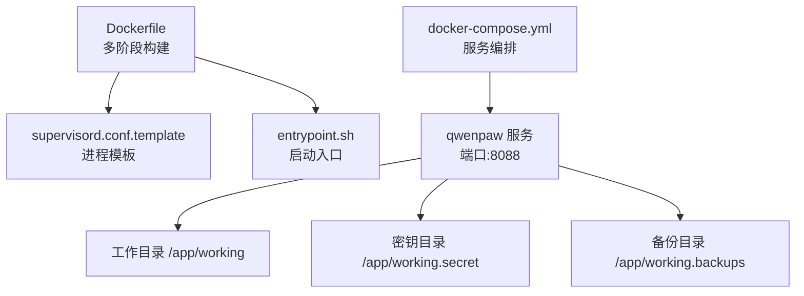
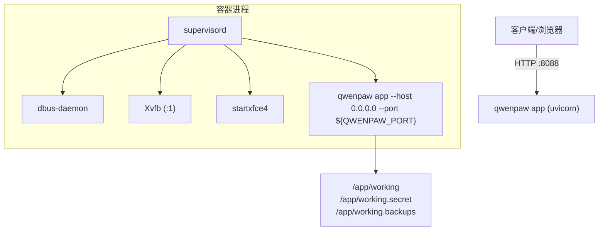
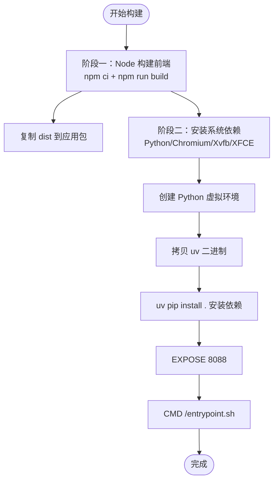
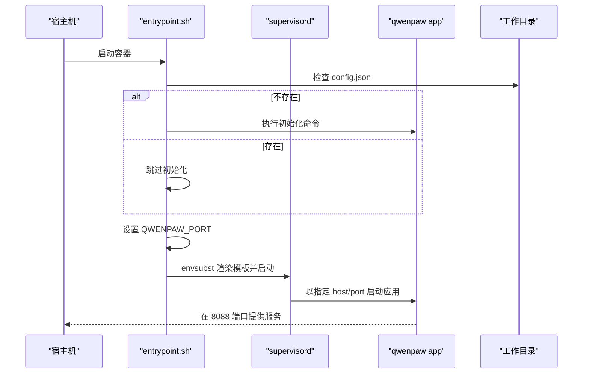
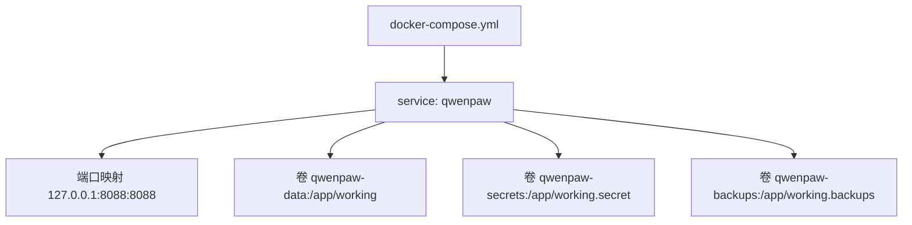
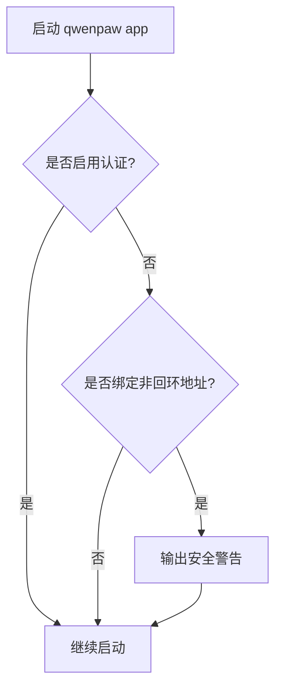
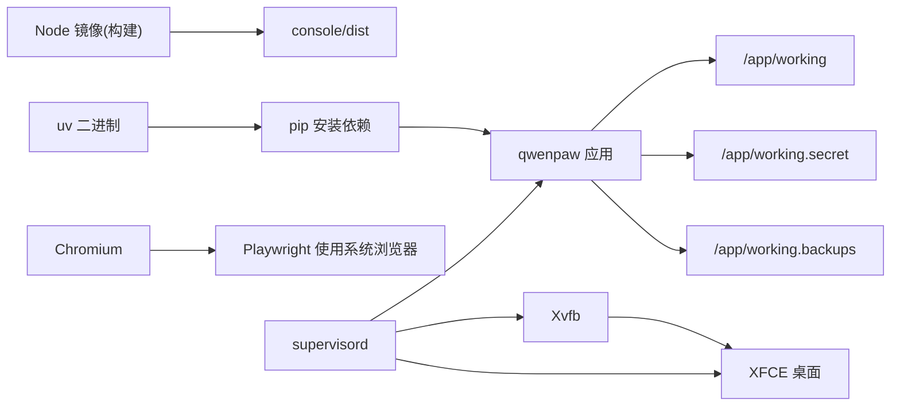

# Docker 容器化

<cite>
**本文引用的文件**
- [deploy/Dockerfile](file://deploy/Dockerfile)
- [docker-compose.yml](file://docker-compose.yml)
- [deploy/entrypoint.sh](file://deploy/entrypoint.sh)
- [deploy/config/supervisord.conf.template](file://deploy/config/supervisord.conf.template)
- [src/qwenpaw/cli/app_cmd.py](file://src/qwenpaw/cli/app_cmd.py)
</cite>

## 目录
1. [简介](#简介)
2. [项目结构](#项目结构)
3. [核心组件](#核心组件)
4. [架构总览](#架构总览)
5. [详细组件分析](#详细组件分析)
6. [依赖关系分析](#依赖关系分析)
7. [性能与优化](#性能与优化)
8. [故障诊断与排错](#故障诊断与排错)
9. [结论](#结论)
10. [附录：环境变量与端口映射](#附录环境变量与端口映射)

## 简介
本章节面向初学者与有经验的开发者，系统化说明 QwenPaw 的 Docker 容器化方案。内容涵盖镜像构建过程、多阶段构建优化、容器编排配置、运行参数与环境变量、日志与监控最佳实践等，帮助你在本地或生产环境稳定部署并高效运维 QwenPaw。

## 项目结构
QwenPaw 的容器化相关资产集中在 deploy 目录与仓库根目录的 docker-compose.yml 中：
- deploy/Dockerfile：定义多阶段镜像构建流程（前端构建、Python 依赖安装、运行时基础镜像）。
- deploy/config/supervisord.conf.template：进程管理模板，由入口脚本渲染后启动应用与桌面环境。
- deploy/entrypoint.sh：容器启动入口，负责初始化配置、安全提示、端口注入与进程托管。
- docker-compose.yml：服务编排，声明数据卷、端口映射与默认环境变量。

图示来源
- [deploy/Dockerfile:1-112](file://deploy/Dockerfile#L1-L112)
- [deploy/config/supervisord.conf.template:1-43](file://deploy/config/supervisord.conf.template#L1-L43)
- [deploy/entrypoint.sh:1-52](file://deploy/entrypoint.sh#L1-L52)
- [docker-compose.yml:1-27](file://docker-compose.yml#L1-L27)

章节来源
- [deploy/Dockerfile:1-112](file://deploy/Dockerfile#L1-L112)
- [docker-compose.yml:1-27](file://docker-compose.yml#L1-L27)

## 核心组件
- 多阶段镜像构建
  - 第一阶段：使用 Node 镜像构建前端控制台（console），产出静态资源 dist。
  - 第二阶段：基于 Node 镜像安装 Python 运行时、Chromium、Xvfb、XFCE 等系统依赖；使用 uv 加速 pip 安装；复制前端 dist 到应用包内；暴露 8088 端口。
- 进程管理
  - 通过 supervisord 管理 dbus、xvfb、xfce4 与 qwenpaw app 四个进程，确保无头浏览器与 GUI 能力可用。
- 启动入口
  - entrypoint.sh 负责首次初始化配置、安全警告、端口注入、生成 supervisord 配置并启动主进程。
- 编排与持久化
  - docker-compose.yml 定义三个命名卷用于工作区、密钥与备份，默认将 8088 端口绑定至本机。

章节来源
- [deploy/Dockerfile:1-112](file://deploy/Dockerfile#L1-L112)
- [deploy/config/supervisord.conf.template:1-43](file://deploy/config/supervisord.conf.template#L1-L43)
- [deploy/entrypoint.sh:1-52](file://deploy/entrypoint.sh#L1-L52)
- [docker-compose.yml:1-27](file://docker-compose.yml#L1-L27)

## 架构总览
下图展示了容器内的关键进程与外部访问路径的关系。

图示来源
- [deploy/config/supervisord.conf.template:1-43](file://deploy/config/supervisord.conf.template#L1-L43)
- [deploy/entrypoint.sh:1-52](file://deploy/entrypoint.sh#L1-L52)
- [docker-compose.yml:1-27](file://docker-compose.yml#L1-L27)

## 详细组件分析

### 镜像构建与多阶段优化
- 构建阶段一（console-builder）
  - 使用 Node 镜像作为构建器，安装依赖并执行构建命令，产出 console/dist。
- 构建阶段二（运行时镜像）
  - 基础镜像为 Node slim，安装 Python 运行时、虚拟环境、系统库、Chromium、Xvfb、XFCE 等。
  - 设置 Playwright 使用系统 Chromium，避免重复下载。
  - 使用 uv 加速 Python 依赖安装，减少缓存与构建时间。
  - 将 console/dist 复制到应用包目录，供后端静态资源服务。
  - 暴露 8088 端口，CMD 指向 entrypoint.sh。

图示来源
- [deploy/Dockerfile:1-112](file://deploy/Dockerfile#L1-L112)

章节来源
- [deploy/Dockerfile:1-112](file://deploy/Dockerfile#L1-L112)

### 进程管理与启动流程
- supervisord 模板定义了四个程序：
  - dbus：系统总线守护进程。
  - xvfb：虚拟显示服务器，提供 DISPLAY=:1。
  - xfce4：轻量桌面环境，等待 X11 socket 就绪后启动。
  - app：QwenPaw FastAPI 应用，监听 0.0.0.0:${QWENPAW_PORT}。
- entrypoint.sh 的职责：
  - 若工作目录缺少 config.json，则自动执行初始化命令。
  - 当未启用认证且非回环地址绑定时，输出安全警告。
  - 使用 envsubst 将 QWENPAW_PORT 注入模板，生成最终 supervisord 配置并启动。

图示来源
- [deploy/entrypoint.sh:1-52](file://deploy/entrypoint.sh#L1-L52)
- [deploy/config/supervisord.conf.template:1-43](file://deploy/config/supervisord.conf.template#L1-L43)

章节来源
- [deploy/entrypoint.sh:1-52](file://deploy/entrypoint.sh#L1-L52)
- [deploy/config/supervisord.conf.template:1-43](file://deploy/config/supervisord.conf.template#L1-L43)

### 服务编排与数据卷
- 服务名：qwenpaw
- 镜像：agentscope/qwenpaw:latest
- 端口映射：127.0.0.1:8088 -> 8088
- 数据卷：
  - qwenpaw-data -> /app/working（工作区）
  - qwenpaw-secrets -> /app/working.secret（密钥）
  - qwenpaw-backups -> /app/working.backups（备份）
- 可选环境变量（示例注释）：
  - QWENPAW_AUTH_ENABLED=true
  - QWENPAW_AUTH_USERNAME=admin
  - QWENPAW_AUTH_PASSWORD=yourpassword

图示来源
- [docker-compose.yml:1-27](file://docker-compose.yml#L1-L27)

章节来源
- [docker-compose.yml:1-27](file://docker-compose.yml#L1-L27)

### 应用启动与安全提示
- 应用命令行入口支持 host、port、log-level 等参数，默认监听 127.0.0.1:8088。
- 当 host 为 0.0.0.0 且未启用认证时，会输出安全警告，建议限制网络访问或启用认证。
- 容器入口也进行相同的安全提示逻辑，双重保障。

图示来源
- [src/qwenpaw/cli/app_cmd.py:28-50](file://src/qwenpaw/cli/app_cmd.py#L28-L50)
- [deploy/entrypoint.sh:16-34](file://deploy/entrypoint.sh#L16-L34)

章节来源
- [src/qwenpaw/cli/app_cmd.py:1-151](file://src/qwenpaw/cli/app_cmd.py#L1-L151)
- [deploy/entrypoint.sh:1-52](file://deploy/entrypoint.sh#L1-L52)

## 依赖关系分析
- 构建期依赖
  - Node 镜像用于前端构建。
  - uv 二进制用于加速 Python 依赖安装。
- 运行期依赖
  - Python 虚拟环境与已安装的 Python 包。
  - Chromium 与 Playwright 使用系统 Chromium。
  - Xvfb 与 XFCE 提供无头图形环境。
  - supervisord 统一进程管理。
- 外部集成点
  - 端口 8088 对外暴露。
  - 三个数据卷用于持久化工作区、密钥与备份。

图示来源
- [deploy/Dockerfile:1-112](file://deploy/Dockerfile#L1-L112)
- [deploy/config/supervisord.conf.template:1-43](file://deploy/config/supervisord.conf.template#L1-L43)
- [docker-compose.yml:1-27](file://docker-compose.yml#L1-L27)

章节来源
- [deploy/Dockerfile:1-112](file://deploy/Dockerfile#L1-L112)
- [deploy/config/supervisord.conf.template:1-43](file://deploy/config/supervisord.conf.template#L1-L43)
- [docker-compose.yml:1-27](file://docker-compose.yml#L1-L27)

## 性能与优化
- 多阶段构建
  - 前端构建与运行时镜像分离，减小最终镜像体积。
- 依赖安装优化
  - 使用 uv 替代原生 pip，显著缩短安装时间。
  - 清理 apt 列表与缓存，减少镜像层大小。
- 浏览器与自动化
  - 使用系统 Chromium 并通过环境变量禁用 Playwright 自行下载，避免重复体积与网络开销。
- 进程管理
  - supervisord 统一管理子进程，便于重启策略与日志收集。
- 端口与网络
  - 默认仅绑定 127.0.0.1，降低外网暴露风险；如需公网访问，请配合反向代理与认证。

[本节为通用指导，不直接分析具体文件]

## 故障诊断与排错
- 常见问题定位
  - 端口冲突：确认宿主机 8088 未被占用，或在 compose 中调整映射。
  - 权限问题：确保数据卷挂载目录具备读写权限。
  - 认证未启用：若绑定 0.0.0.0 且未启用认证，会收到安全警告，建议启用认证或限制访问。
- 日志查看
  - supervisord 主日志：/var/log/supervisord.log
  - 应用日志：/var/log/app.out.log、/var/log/app.err.log
  - 桌面与显示：/var/log/xvfb.err.log、/var/log/dbus.err.log
- 调试步骤
  - 进入容器：docker exec -it qwenpaw sh
  - 查看进程状态：supervisorctl status
  - 查看实时日志：tail -f /var/log/app.out.log
  - 检查端口：ss -tlnp | grep 8088
  - 验证配置：cat /etc/supervisor/conf.d/supervisord.conf

章节来源
- [deploy/config/supervisord.conf.template:1-43](file://deploy/config/supervisord.conf.template#L1-L43)
- [deploy/entrypoint.sh:1-52](file://deploy/entrypoint.sh#L1-L52)

## 结论
QwenPaw 的容器化方案采用多阶段构建与 supervisord 进程管理，结合数据卷实现可移植与可观测性。通过合理的环境变量与端口映射，可在本地快速体验，在生产环境中配合反向代理与认证机制实现安全稳定的服务交付。

[本节为总结性内容，不直接分析具体文件]

## 附录：环境变量与端口映射
- 关键环境变量
  - QWENPAW_PORT：应用监听端口，默认 8088。
  - QWENPAW_WORKING_DIR：工作目录，默认 /app/working。
  - QWENPAW_SECRET_DIR：密钥目录，默认 /app/working.secret。
  - QWENPAW_BACKUP_DIR：备份目录，默认 /app/working.backups。
  - QWENPAW_DISABLED_CHANNELS/QWENPAW_ENABLED_CHANNELS：通道过滤开关。
  - PLAYWRIGHT_CHROMIUM_EXECUTABLE_PATH：指向系统 Chromium。
  - QWENPAW_RUNNING_IN_CONTAINER：标识容器运行模式。
- 端口映射
  - 默认：127.0.0.1:8088 -> 8088
  - 可通过 docker-compose.yml 或 docker run -p 自定义映射。
- 认证相关（示例）
  - QWENPAW_AUTH_ENABLED=true
  - QWENPAW_AUTH_USERNAME=admin
  - QWENPAW_AUTH_PASSWORD=yourpassword

章节来源
- [deploy/Dockerfile:21-34](file://deploy/Dockerfile#L21-L34)
- [deploy/Dockerfile:82-86](file://deploy/Dockerfile#L82-L86)
- [deploy/Dockerfile:103-109](file://deploy/Dockerfile#L103-L109)
- [deploy/config/supervisord.conf.template:14-24](file://deploy/config/supervisord.conf.template#L14-L24)
- [deploy/entrypoint.sh:45-51](file://deploy/entrypoint.sh#L45-L51)
- [docker-compose.yml:17-26](file://docker-compose.yml#L17-L26)