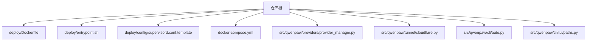
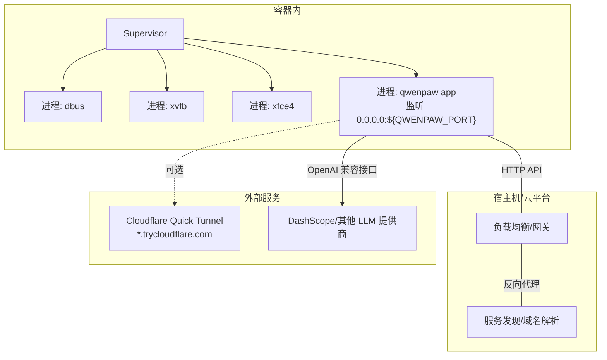
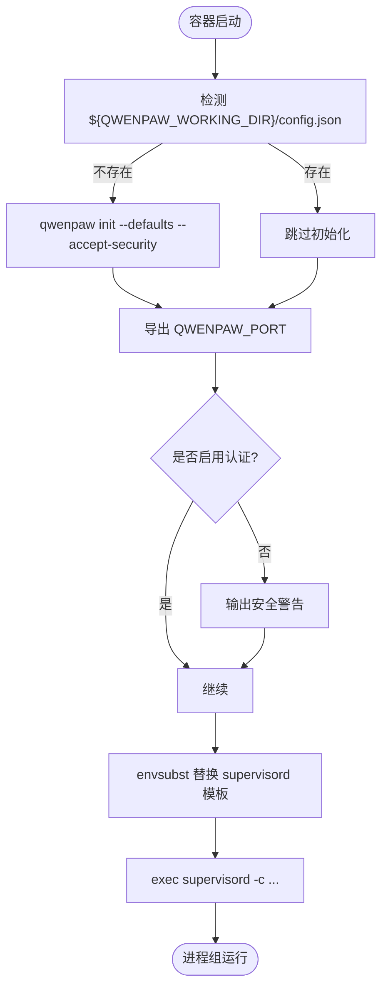
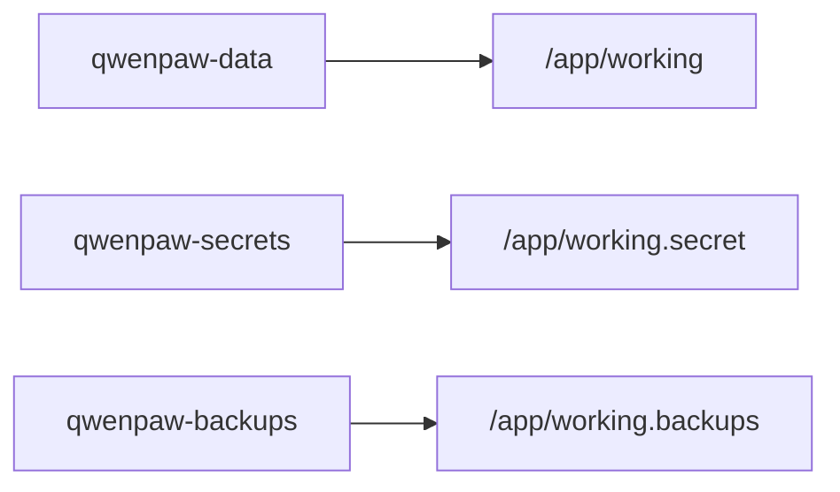
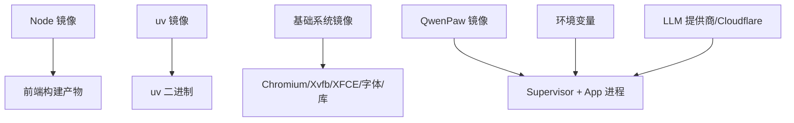

# 云平台部署

<cite>
**本文引用的文件列表**
- [README.md](file://README.md)
- [Dockerfile](file://deploy/Dockerfile)
- [entrypoint.sh](file://deploy/entrypoint.sh)
- [supervisord.conf.template](file://deploy/config/supervisord.conf.template)
- [docker-compose.yml](file://docker-compose.yml)
- [provider_manager.py](file://src/qwenpaw/providers/provider_manager.py)
- [cloudflare.py](file://src/qwenpaw/tunnel/cloudflare.py)
- [auto.py](file://src/qwenpaw/cli/auto.py)
- [paths.py](file://src/qwenpaw/cli/tui/paths.py)
</cite>

## 目录
1. [简介](#简介)
2. [项目结构](#项目结构)
3. [核心组件](#核心组件)
4. [架构总览](#架构总览)
5. [详细组件分析](#详细组件分析)
6. [依赖关系分析](#依赖关系分析)
7. [性能与高可用](#性能与高可用)
8. [云原生部署方案](#云原生部署方案)
9. [监控、日志与告警](#监控日志与告警)
10. [故障排查指南](#故障排查指南)
11. [结论](#结论)

## 简介
本文件面向在主流云平台（阿里云、AWS、Azure 等）部署 QwenPaw 的工程师与运维人员，提供从容器镜像构建、编排与服务发现、负载均衡与高可用、密钥与安全组、自动扩缩容与健康检查、到监控日志与告警的全链路实践。文档既适合初学者快速上手，也为有经验的开发者提供深入的技术细节与可操作示例。

QwenPaw 提供官方 Docker 镜像与 Compose 示例，支持通过环境变量注入配置与密钥，并通过 Supervisor 管理多进程（应用、Xvfb、桌面环境），便于在容器化环境中稳定运行。同时内置多种模型提供商（含阿里云 DashScope 等）与 Cloudflare Quick Tunnel 能力，有助于在不同网络环境下快速暴露服务或集成外部平台。

## 项目结构
与云平台部署直接相关的核心文件位于 deploy 目录与根级 docker-compose.yml，以及运行时关键模块：



图示来源
- [Dockerfile:1-112](file://deploy/Dockerfile#L1-L112)
- [entrypoint.sh:1-52](file://deploy/entrypoint.sh#L1-L52)
- [supervisord.conf.template:1-43](file://deploy/config/supervisord.conf.template#L1-L43)
- [docker-compose.yml:1-27](file://docker-compose.yml#L1-L27)
- [provider_manager.py:886-980](file://src/qwenpaw/providers/provider_manager.py#L886-L980)
- [cloudflare.py:1-50](file://src/qwenpaw/tunnel/cloudflare.py#L1-L50)
- [auto.py:31-68](file://src/qwenpaw/cli/auto.py#L31-L68)
- [paths.py:1-34](file://src/qwenpaw/cli/tui/paths.py#L1-L34)

章节来源
- [README.md:218-261](file://README.md#L218-L261)
- [Dockerfile:1-112](file://deploy/Dockerfile#L1-L112)
- [entrypoint.sh:1-52](file://deploy/entrypoint.sh#L1-L52)
- [supervisord.conf.template:1-43](file://deploy/config/supervisord.conf.template#L1-L43)
- [docker-compose.yml:1-27](file://docker-compose.yml#L1-L27)

## 核心组件
- 容器镜像与启动流程
  - 镜像构建阶段：前端构建与 Python 依赖安装分离，使用 uv 加速安装；预装 Chromium 及 Xvfb/XFCE 以支持无头浏览器与 GUI 工具链。
  - 运行时入口：entrypoint 负责初始化配置、端口替换、安全提示与启动 Supervisor。
  - 进程管理：Supervisor 模板定义 app、dbus、xvfb、xfce4 四个子进程，确保依赖顺序与重启策略。
- 数据卷与持久化
  - working、working.secret、working.backups 三个卷分别承载工作目录、密钥与备份归档。
- 模型提供商与云服务集成
  - ProviderManager 内置多家云厂商 LLM 接入（如阿里云 DashScope、ModelScope、火山引擎等），支持按区域切换 base_url。
- 隧道与外网暴露
  - Cloudflare Quick Tunnel 驱动可在本地快速生成公网 URL，适用于临时调试或轻量发布。
- 健康检查与 CLI 自检
  - CLI 自动命令会访问 /version 端点校验守护进程可达性，可作为健康探针参考。
- 日志路径
  - TUI 状态与日志路径由 paths.py 管理，遵循平台默认位置或环境变量覆盖。

章节来源
- [Dockerfile:1-112](file://deploy/Dockerfile#L1-L112)
- [entrypoint.sh:1-52](file://deploy/entrypoint.sh#L1-L52)
- [supervisord.conf.template:1-43](file://deploy/config/supervisord.conf.template#L1-L43)
- [docker-compose.yml:1-27](file://docker-compose.yml#L1-L27)
- [provider_manager.py:886-980](file://src/qwenpaw/providers/provider_manager.py#L886-L980)
- [cloudflare.py:1-50](file://src/qwenpaw/tunnel/cloudflare.py#L1-L50)
- [auto.py:31-68](file://src/qwenpaw/cli/auto.py#L31-L68)
- [paths.py:1-34](file://src/qwenpaw/cli/tui/paths.py#L1-L34)

## 架构总览
下图展示了 QwenPaw 在容器中的进程结构与对外暴露方式，以及与上游模型服务的交互关系。



图示来源
- [supervisord.conf.template:14-24](file://deploy/config/supervisord.conf.template#L14-L24)
- [Dockerfile:103-111](file://deploy/Dockerfile#L103-L111)
- [cloudflare.py:1-50](file://src/qwenpaw/tunnel/cloudflare.py#L1-L50)
- [provider_manager.py:886-980](file://src/qwenpaw/providers/provider_manager.py#L886-L980)

## 详细组件分析

### 容器镜像与启动流程
- 构建阶段
  - 前端构建：Node 镜像中执行 npm ci 与 build，产出 dist 并复制到最终镜像。
  - Python 依赖：基于 uv 源镜像拷贝 uv 二进制，使用 uv pip install 加速安装。
  - 系统依赖：安装 Chromium、Xvfb、XFCE、字体与必要库，设置 Playwright 使用系统 Chromium。
- 运行阶段
  - 环境变量：WORKSPACE_DIR、QWENPAW_WORKING_DIR、QWENPAW_SECRET_DIR、QWENPAW_BACKUP_DIR、QWENPAW_PORT、QWENPAW_RUNNING_IN_CONTAINER 等。
  - 通道过滤：支持 QWENPAW_DISABLED_CHANNELS 与 QWENPAW_ENABLED_CHANNELS 控制启用/禁用渠道。
- 入口脚本
  - 若未检测到 config.json，则执行 qwenpaw init --defaults --accept-security 完成首次初始化。
  - 根据 QWENPAW_AUTH_ENABLED 输出安全提示，避免在无鉴权情况下将服务暴露给不可信网络。
  - 使用 envsubst 替换 supervisord 模板中的端口变量后启动 supervisor。



图示来源
- [entrypoint.sh:36-51](file://deploy/entrypoint.sh#L36-L51)
- [Dockerfile:21-34](file://deploy/Dockerfile#L21-L34)
- [Dockerfile:103-111](file://deploy/Dockerfile#L103-L111)

章节来源
- [Dockerfile:1-112](file://deploy/Dockerfile#L1-L112)
- [entrypoint.sh:1-52](file://deploy/entrypoint.sh#L1-L52)

### 进程管理与依赖顺序
- Supervisor 模板定义了四个程序：
  - dbus：系统消息总线
  - xvfb：虚拟显示
  - xfce4：桌面环境
  - app：QwenPaw Web 服务，绑定 0.0.0.0 与动态端口
- 优先级与重启策略保证依赖顺序与稳定性。

```mermaid
classDiagram
class Supervisor {
+program : dbus
+program : xvfb
+program : xfce4
+program : app
+priority : 10/20/30
+autorestart : unexpected/true
}
class AppProcess {
+command : qwenpaw app --host 0.0.0.0 --port ${QWENPAW_PORT}
+environment : DISPLAY, PLAYWRIGHT_*, QWENPAW_RUNNING_IN_CONTAINER
}
Supervisor --> AppProcess : "管理"
```

图示来源
- [supervisord.conf.template:7-43](file://deploy/config/supervisord.conf.template#L7-L43)

章节来源
- [supervisord.conf.template:1-43](file://deploy/config/supervisord.conf.template#L1-L43)

### 数据卷与持久化
- 三个命名卷：
  - qwenpaw-data：工作目录（会话、记忆、技能等）
  - qwenpaw-secrets：密钥与敏感配置
  - qwenpaw-backups：备份归档
- 在 Compose 中映射至容器内部固定路径，便于跨实例共享与备份。



图示来源
- [docker-compose.yml:3-27](file://docker-compose.yml#L3-L27)

章节来源
- [docker-compose.yml:1-27](file://docker-compose.yml#L1-L27)

### 模型提供商与云服务集成
- ProviderManager 内置多家云厂商 OpenAI 兼容接口，包括阿里云 DashScope（国内与国际区）、ModelScope、火山引擎等，支持按区域选择 base_url。
- 在云端部署时，建议通过环境变量或控制台配置对应 provider 的 API Key，并在“设置 → 模型”中启用目标提供商与模型。

章节来源
- [provider_manager.py:886-980](file://src/qwenpaw/providers/provider_manager.py#L886-L980)
- [README.md:356-372](file://README.md#L356-L372)

### 隧道与外网暴露
- Cloudflare Quick Tunnel 驱动通过启动 cloudflared 子进程，将本地端口转发为 *.trycloudflare.com 公网地址，适用于临时调试或轻量发布。
- 注意：生产环境建议使用云厂商负载均衡与域名证书，而非临时隧道。

章节来源
- [cloudflare.py:1-50](file://src/qwenpaw/tunnel/cloudflare.py#L1-L50)

### 健康检查与 CLI 自检
- CLI 自动命令会 HEAD /version 探测守护进程可达性，可作为健康探针实现参考。
- 在生产编排中，建议对 /healthz 或 /version 配置就绪/存活探针。

章节来源
- [auto.py:31-68](file://src/qwenpaw/cli/auto.py#L31-L68)

### 日志路径与采集
- TUI 状态与日志路径由 paths.py 管理，遵循平台默认位置或环境变量覆盖。
- 容器内应用日志可通过 stdout/stderr 收集，结合 Supervisor 日志文件统一汇聚。

章节来源
- [paths.py:1-34](file://src/qwenpaw/cli/tui/paths.py#L1-L34)
- [supervisord.conf.template:1-6](file://deploy/config/supervisord.conf.template#L1-L6)

## 依赖关系分析
- 容器镜像依赖
  - Node 镜像用于前端构建
  - uv 镜像提供 Python 包管理器
  - 系统层依赖 Chromium、Xvfb、XFCE、字体与库
- 运行时依赖
  - Supervisor 管理多进程
  - 环境变量控制端口、工作目录、密钥目录、通道过滤、容器标识
  - 可选 Cloudflare Tunnel 与外部 LLM 提供商



图示来源
- [Dockerfile:1-112](file://deploy/Dockerfile#L1-L112)
- [supervisord.conf.template:14-24](file://deploy/config/supervisord.conf.template#L14-L24)

章节来源
- [Dockerfile:1-112](file://deploy/Dockerfile#L1-L112)

## 性能与高可用
- 单副本 vs 多副本
  - 当前镜像包含 GUI 相关依赖（Xvfb/XFCE），在多副本横向扩展时需评估资源占用与 GPU/CPU 需求。
  - 若仅需 API 能力，可考虑裁剪 GUI 依赖以降低内存与 CPU 开销。
- 水平扩展
  - 通过负载均衡分发请求，配合外部存储（NFS/云盘）共享工作目录与密钥目录，确保会话与配置一致性。
- 优雅停机
  - 利用 Supervisor 的 stopwaitsecs 与 autorestart=unexpected 提升稳定性。
- 资源隔离
  - 在编排平台中限制 CPU/内存配额，避免单个实例影响整体集群。

[本节为通用指导，不直接分析具体文件]

## 云原生部署方案

### 阿里云
- 一键部署
  - 使用阿里云 ComputeNest 提供的 QwenPaw 服务进行一键创建实例，详见 README 中的链接说明。
- ECS + 容器镜像
  - 拉取官方镜像或自建镜像，挂载数据卷，配置环境变量（API Key、端口、认证开关）。
  - 通过 SLB 暴露 8088 端口，开启 HTTPS 与域名解析。
- 密钥管理
  - 使用 KMS 或 Secrets Manager 注入环境变量，避免明文写入镜像或配置文件。
- 安全组
  - 仅开放 SLB 到 ECS 的内网端口，SLB 监听 443/80 并回源至 8088。
- 监控与日志
  - 使用云监控采集 CPU/内存/磁盘指标；使用 SLS 聚合容器 stdout/stderr 与应用日志。
- 自动扩缩容
  - 基于弹性伸缩组与 SLB 健康检查，按 CPU/内存阈值或自定义指标扩缩容。

章节来源
- [README.md:265-268](file://README.md#L265-L268)
- [Dockerfile:103-111](file://deploy/Dockerfile#L103-L111)
- [docker-compose.yml:17-27](file://docker-compose.yml#L17-L27)

### AWS
- EKS 部署
  - 使用 Helm Chart 或 Kustomize 部署 Deployment/Service/Ingress，挂载 PVC 作为数据卷。
  - 通过 ALB Ingress 暴露服务，启用 TLS 与 WAF。
- 密钥管理
  - 使用 AWS Secrets Manager 或 EKS External Secrets Operator 注入环境变量。
- 安全组与网络
  - 限制 Pod 所在节点的安全组入站规则，仅允许 ALB 流量进入。
- 监控与日志
  - 使用 CloudWatch Container Insights 采集指标；使用 CloudWatch Logs 聚合日志。
- 自动扩缩容
  - 使用 Cluster Autoscaler 与 Horizontal Pod Autoscaler，基于 CPU/内存或自定义指标扩缩。

章节来源
- [Dockerfile:103-111](file://deploy/Dockerfile#L103-L111)
- [docker-compose.yml:17-27](file://docker-compose.yml#L17-L27)

### Azure
- AKS 部署
  - 使用 Helm Chart 或 YAML 清单部署 Deployment/Service/Ingress，挂载 Azure Disk/PVC。
  - 通过 Application Gateway Ingress Controller 暴露服务，启用 WAF 与 TLS。
- 密钥管理
  - 使用 Azure Key Vault 与 CSI Driver 注入环境变量或挂载 Secret。
- 安全组与网络
  - 使用 NSG 限制节点入站，仅允许 AGIC 流量进入。
- 监控与日志
  - 使用 Azure Monitor for Containers 采集指标；使用 Log Analytics 聚合日志。
- 自动扩缩容
  - 使用 KEDA 与 HPA，基于队列长度或自定义指标扩缩。

章节来源
- [Dockerfile:103-111](file://deploy/Dockerfile#L103-L111)
- [docker-compose.yml:17-27](file://docker-compose.yml#L17-L27)

### Kubernetes 通用要点
- 健康检查
  - 就绪探针：GET /version 或 /healthz，返回 2xx 表示就绪。
  - 存活探针：GET /version，失败则触发重启。
- 服务发现
  - Service 暴露 ClusterIP，Ingress 暴露公网域名。
- 配置与密钥
  - ConfigMap 存放非敏感配置，Secret 存放 API Key 与敏感信息。
- 扩缩容
  - HPA 基于 CPU/内存或自定义指标；Cluster Autoscaler 调整节点数。
- 灾难恢复
  - 定期备份 PVC 数据（working、secret、backups），演练恢复流程。

章节来源
- [auto.py:31-68](file://src/qwenpaw/cli/auto.py#L31-L68)
- [docker-compose.yml:17-27](file://docker-compose.yml#L17-L27)

## 监控、日志与告警

### 监控集成
- 指标采集
  - 容器层：CPU、内存、磁盘、网络 IO。
  - 应用层：请求量、错误率、延迟（可由业务埋点补充）。
- 告警策略
  - 基于阈值（CPU>80%、内存>85%、错误率>1%）与复合条件（低可用+高延迟）触发告警。
- 多云适配
  - 阿里云：云监控 + 事件中心
  - AWS：CloudWatch + SNS
  - Azure：Azure Monitor + Action Groups

[本节为通用指导，不直接分析具体文件]

### 日志聚合
- 容器日志
  - 收集 stdout/stderr，统一发送至 SLS/CloudWatch/Log Analytics。
- 应用日志
  - Supervisor 管理的各进程日志文件集中挂载与轮转。
- 结构化日志
  - 建议输出 JSON 格式，便于检索与分析。

章节来源
- [supervisord.conf.template:1-6](file://deploy/config/supervisord.conf.template#L1-L6)
- [paths.py:1-34](file://src/qwenpaw/cli/tui/paths.py#L1-L34)

### 健康检查与自愈
- 就绪探针
  - 使用 /version 或 /healthz 判断服务是否就绪。
- 存活探针
  - 周期探测，失败则重启容器。
- 自愈策略
  - 结合编排平台的重启策略与滚动更新，降低人工干预。

章节来源
- [auto.py:31-68](file://src/qwenpaw/cli/auto.py#L31-L68)

## 故障排查指南
- 无法访问 Console
  - 检查端口映射与环境变量 QWENPAW_PORT 是否正确。
  - 确认负载均衡与域名解析已生效。
- 认证未启用导致安全风险
  - 若未设置 QWENPAW_AUTH_ENABLED=true，入口脚本会输出安全警告，建议启用认证或限制网络访问。
- 模型调用失败
  - 检查 Provider 配置与 API Key 是否正确，base_url 是否与区域匹配。
- 浏览器/截图功能异常
  - 确认 Xvfb 与 XFCE 进程正常启动，DISPLAY 环境变量正确。
- 日志定位
  - 查看 Supervisor 日志与应用日志，必要时开启更详细的日志级别。

章节来源
- [entrypoint.sh:16-34](file://deploy/entrypoint.sh#L16-L34)
- [supervisord.conf.template:14-24](file://deploy/config/supervisord.conf.template#L14-L24)
- [provider_manager.py:886-980](file://src/qwenpaw/providers/provider_manager.py#L886-L980)

## 结论
QwenPaw 提供了完善的容器化与编排基础，结合云厂商的服务能力可实现高可用、可扩展与安全的云端部署。通过合理的数据卷规划、密钥管理、负载均衡与健康检查，可以在阿里云、AWS、Azure 等平台稳定运行。配合监控与日志体系，能够快速定位问题并保障服务质量。对于需要临时暴露的场景，可使用 Cloudflare Quick Tunnel；生产环境推荐使用云厂商的负载均衡与域名证书。