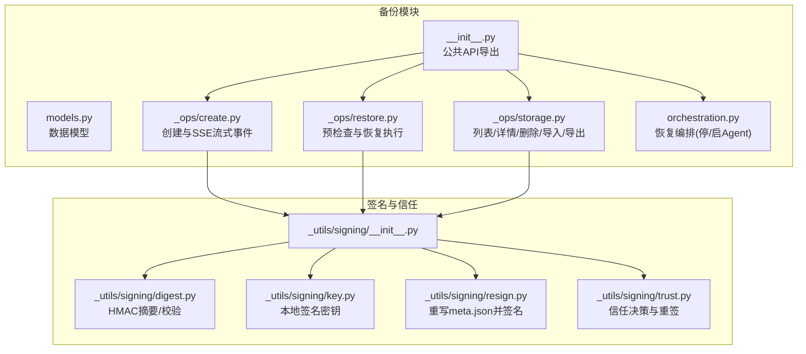
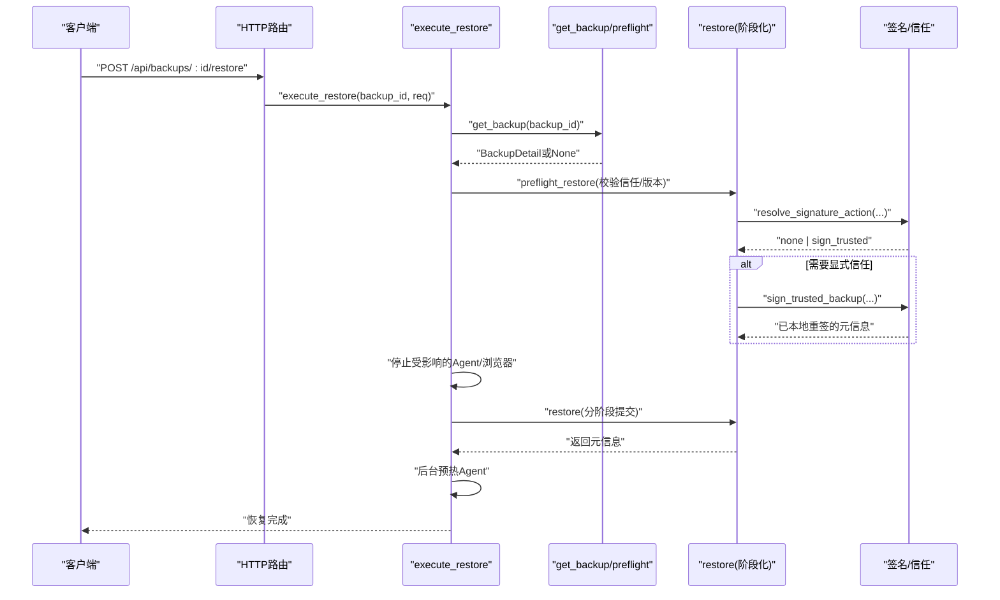
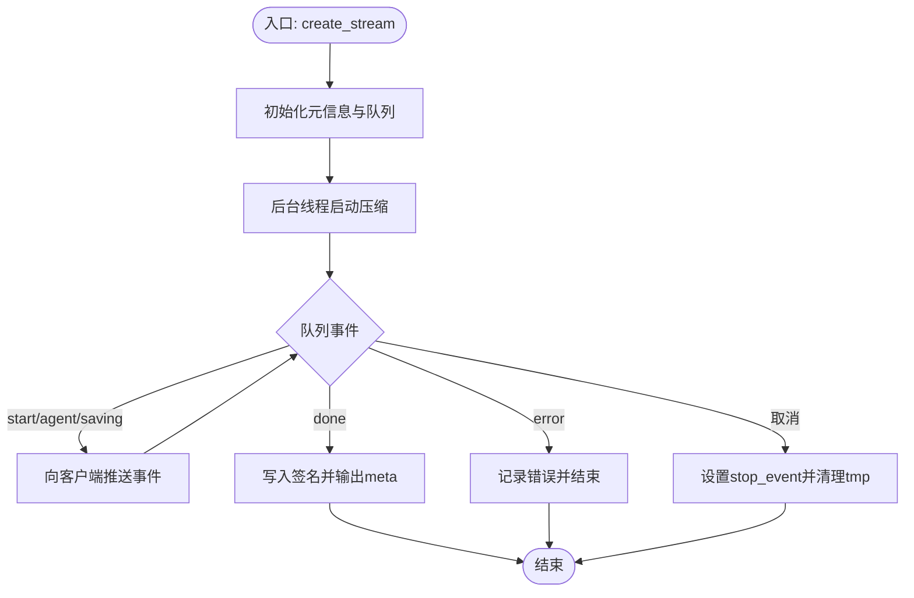
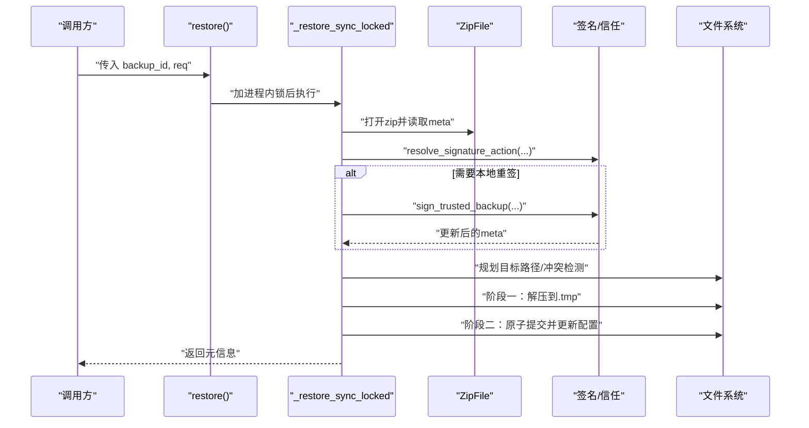
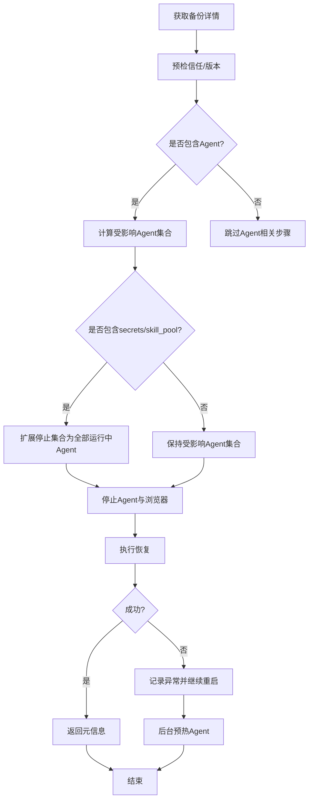
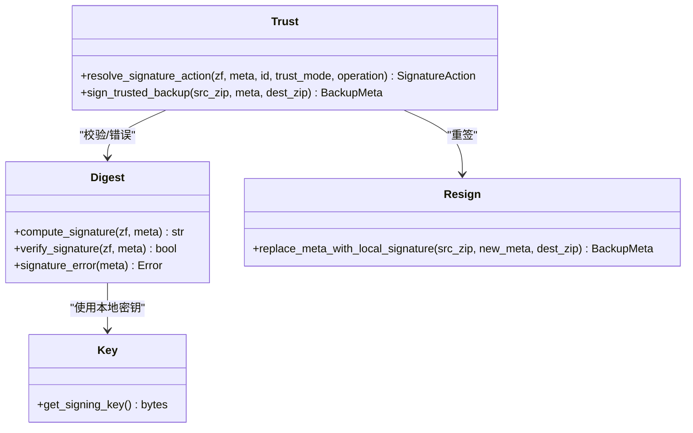
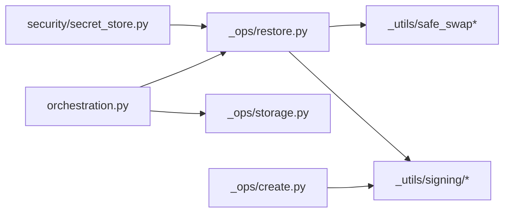

# 备份和恢复

<cite>
**本文引用的文件**   
- [src/qwenpaw/backup/__init__.py](file://src/qwenpaw/backup/__init__.py)
- [src/qwenpaw/backup/models.py](file://src/qwenpaw/backup/models.py)
- [src/qwenpaw/backup/orchestration.py](file://src/qwenpaw/backup/orchestration.py)
- [src/qwenpaw/backup/_ops/create.py](file://src/qwenpaw/backup/_ops/create.py)
- [src/qwenpaw/backup/_ops/restore.py](file://src/qwenpaw/backup/_ops/restore.py)
- [src/qwenpaw/backup/_ops/storage.py](file://src/qwenpaw/backup/_ops/storage.py)
- [src/qwenpaw/backup/_utils/signing/__init__.py](file://src/qwenpaw/backup/_utils/signing/__init__.py)
- [src/qwenpaw/backup/_utils/signing/digest.py](file://src/qwenpaw/backup/_utils/signing/digest.py)
- [src/qwenpaw/backup/_utils/signing/key.py](file://src/qwenpaw/backup/_utils/signing/key.py)
- [src/qwenpaw/backup/_utils/signing/resign.py](file://src/qwenpaw/backup/_utils/signing/resign.py)
- [src/qwenpaw/backup/_utils/signing/trust.py](file://src/qwenpaw/backup/_utils/signing/trust.py)
- [src/qwenpaw/security/secret_store.py](file://src/qwenpaw/security/secret_store.py)
</cite>

## 目录
1. [简介](#简介)
2. [项目结构](#项目结构)
3. [核心组件](#核心组件)
4. [架构总览](#架构总览)
5. [详细组件分析](#详细组件分析)
6. [依赖关系分析](#依赖关系分析)
7. [性能与可扩展性](#性能与可扩展性)
8. [故障排查指南](#故障排查指南)
9. [结论](#结论)
10. [附录：操作与配置示例](#附录操作与配置示例)

## 简介
本章节面向 QwenPaw 的备份与恢复系统，系统性阐述数据备份策略、增量与全量机制、签名验证与完整性校验、加密存储安全、自动化任务与调度、存储空间管理、数据恢复流程、版本回滚与灾难恢复、远程存储集成与监控等主题。文档既适合初学者快速上手，也为有经验的开发者提供深入的技术细节与可落地的实践建议。

## 项目结构
QwenPaw 的备份与恢复子系统位于 src/qwenpaw/backup 下，采用“操作层 + 工具层 + 编排层”的分层设计：
- 操作层（_ops）：负责创建、恢复、存储管理等具体业务逻辑
- 工具层（_utils）：包含签名、元数据、安全交换等通用能力
- 编排层（orchestration.py）：对外暴露高层 API，协调停止/恢复/重启等跨进程动作
- 模型定义（models.py）：统一的数据结构与请求/响应模型

图表来源
- [src/qwenpaw/backup/__init__.py:1-22](file://src/qwenpaw/backup/__init__.py#L1-L22)
- [src/qwenpaw/backup/models.py:1-164](file://src/qwenpaw/backup/models.py#L1-L164)
- [src/qwenpaw/backup/_ops/create.py:1-225](file://src/qwenpaw/backup/_ops/create.py#L1-L225)
- [src/qwenpaw/backup/_ops/restore.py:1-739](file://src/qwenpaw/backup/_ops/restore.py#L1-L739)
- [src/qwenpaw/backup/_ops/storage.py:1-288](file://src/qwenpaw/backup/_ops/storage.py#L1-L288)
- [src/qwenpaw/backup/orchestration.py:1-188](file://src/qwenpaw/backup/orchestration.py#L1-L188)
- [src/qwenpaw/backup/_utils/signing/__init__.py:1-34](file://src/qwenpaw/backup/_utils/signing/__init__.py#L1-L34)
- [src/qwenpaw/backup/_utils/signing/digest.py:1-128](file://src/qwenpaw/backup/_utils/signing/digest.py#L1-L128)
- [src/qwenpaw/backup/_utils/signing/key.py:1-122](file://src/qwenpaw/backup/_utils/signing/key.py#L1-L122)
- [src/qwenpaw/backup/_utils/signing/resign.py:1-69](file://src/qwenpaw/backup/_utils/signing/resign.py#L1-L69)
- [src/qwenpaw/backup/_utils/signing/trust.py:1-85](file://src/qwenpaw/backup/_utils/signing/trust.py#L1-L85)

章节来源
- [src/qwenpaw/backup/__init__.py:1-22](file://src/qwenpaw/backup/__init__.py#L1-L22)

## 核心组件
- 数据模型
  - BackupScope：控制备份范围（工作区、全局配置、密钥、技能池）
  - BackupMeta：备份元信息（ID、名称、时间、版本、作用域、签名、信任标记等）
  - CreateBackupRequest / RestoreBackupRequest / DeleteBackupsRequest/Response：请求与响应模型
  - BackupDetail：在元信息基础上增加按 Agent 维度的统计信息
- 创建与流式进度
  - create_stream：异步生成器，通过后台线程压缩并在主循环中投递 SSE 事件
- 恢复编排
  - execute_restore：先进行信任与版本校验，再停止相关 Agent/浏览器，执行恢复，最后后台预热 Agent
- 存储管理
  - list_backups/get_backup/delete_backups/export_backup/import_backup：对备份文件的增删查改与导入导出
- 签名与信任
  - digest/key/resign/trust：基于 HMAC-SHA256 的本地签名方案，支持“本地签名/外部签名/无签名”三类归档的信任判定与重签

章节来源
- [src/qwenpaw/backup/models.py:1-164](file://src/qwenpaw/backup/models.py#L1-L164)
- [src/qwenpaw/backup/_ops/create.py:1-225](file://src/qwenpaw/backup/_ops/create.py#L1-L225)
- [src/qwenpaw/backup/orchestration.py:1-188](file://src/qwenpaw/backup/orchestration.py#L1-L188)
- [src/qwenpaw/backup/_ops/storage.py:1-288](file://src/qwenpaw/backup/_ops/storage.py#L1-L288)
- [src/qwenpaw/backup/_utils/signing/__init__.py:1-34](file://src/qwenpaw/backup/_utils/signing/__init__.py#L1-L34)
- [src/qwenpaw/backup/_utils/signing/digest.py:1-128](file://src/qwenpaw/backup/_utils/signing/digest.py#L1-L128)
- [src/qwenpaw/backup/_utils/signing/key.py:1-122](file://src/qwenpaw/backup/_utils/signing/key.py#L1-L122)
- [src/qwenpaw/backup/_utils/signing/resign.py:1-69](file://src/qwenpaw/backup/_utils/signing/resign.py#L1-L69)
- [src/qwenpaw/backup/_utils/signing/trust.py:1-85](file://src/qwenpaw/backup/_utils/signing/trust.py#L1-L85)

## 架构总览
下图展示了从 HTTP 路由到备份/恢复核心逻辑的调用链，以及签名与信任边界。

图表来源
- [src/qwenpaw/backup/orchestration.py:1-188](file://src/qwenpaw/backup/orchestration.py#L1-L188)
- [src/qwenpaw/backup/_ops/restore.py:1-739](file://src/qwenpaw/backup/_ops/restore.py#L1-L739)
- [src/qwenpaw/backup/_ops/storage.py:1-288](file://src/qwenpaw/backup/_ops/storage.py#L1-L288)
- [src/qwenpaw/backup/_utils/signing/trust.py:1-85](file://src/qwenpaw/backup/_utils/signing/trust.py#L1-L85)

## 详细组件分析

### 备份创建与流式进度
- 关键特性
  - 使用 ZIP_DEFLATED 压缩，写入临时文件后原子替换目标 .zip
  - 后台线程执行压缩，主循环通过 asyncio.Queue 接收事件，避免阻塞事件循环
  - 支持取消：客户端断开时设置 stop_event，线程在下一个取消点退出并清理临时文件
  - 完成后计算并写入本地签名，最终输出 done 事件携带完整元信息
- 事件类型
  - start：开始，附带 total_agents 与 percent=0
  - agent：每个 Agent 处理进度
  - saving：进入保存阶段（约90%）
  - done：完成，percent=100，附带 meta
  - error：异常信息
- 适用场景
  - 前端 SSE 展示实时进度；适合大体积工作区的长耗时备份

图表来源
- [src/qwenpaw/backup/_ops/create.py:1-225](file://src/qwenpaw/backup/_ops/create.py#L1-L225)

章节来源
- [src/qwenpaw/backup/_ops/create.py:1-225](file://src/qwenpaw/backup/_ops/create.py#L1-L225)

### 恢复流程与原子提交
- 前置校验
  - preflight_restore：仅读取 zip 与元信息，进行信任与版本校验，不写盘
- 两阶段提交
  - 阶段一（staging）：将 config/secrets/skill_pool/workspaces 解压到各自目标的 .tmp 目录
  - 阶段二（commit）：原子替换目标目录与配置文件，必要时重载主密钥缓存
- 并发与锁
  - 进程内使用 asyncio.Lock 串行化 restore 请求
  - 文件系统级使用进程锁保护目录 rename 等原子操作
- 冲突检测
  - 新 Agent 目标路径不得与未参与恢复的其他 Agent 冲突
  - 同一批次内不同 Agent 不得解析到相同物理目录
- 配置合并模式
  - full：完全覆盖 config.json（含 agents.profiles）
  - custom：顶层键来自备份，agents.profiles 以当前本地为基线，仅覆盖被恢复的 Agent，避免“幽灵条目”

图表来源
- [src/qwenpaw/backup/_ops/restore.py:1-739](file://src/qwenpaw/backup/_ops/restore.py#L1-L739)
- [src/qwenpaw/backup/_utils/signing/trust.py:1-85](file://src/qwenpaw/backup/_utils/signing/trust.py#L1-L85)

章节来源
- [src/qwenpaw/backup/_ops/restore.py:1-739](file://src/qwenpaw/backup/_ops/restore.py#L1-L739)

### 恢复编排（停止/恢复/重启）
- 执行顺序
  - 获取备份详情 -> 预检信任与版本 -> 确定受影响 Agent -> 停止这些 Agent 及受影响的浏览器实例 -> 执行恢复 -> 失败也保证重启 -> 后台预热 Agent
- 文件句柄与 Windows 兼容性
  - 当 include_secrets/include_skill_pool 为真时，会扩展停止集合至所有运行中的 Agent，以避免目录重命名失败
- 浏览器状态
  - 根据 Agent 的 workspace_dir 定位浏览器状态目录，提前关闭受控浏览器，防止占用导致恢复失败

图表来源
- [src/qwenpaw/backup/orchestration.py:1-188](file://src/qwenpaw/backup/orchestration.py#L1-L188)

章节来源
- [src/qwenpaw/backup/orchestration.py:1-188](file://src/qwenpaw/backup/orchestration.py#L1-L188)

### 存储管理（列表/详情/删除/导入/导出）
- 列表与详情
  - 遍历备份目录，解析每个 zip 的 meta.json，并按 created_at 倒序排序
  - 详情接口额外扫描 workspaces 前缀的文件，统计每个 Agent 的文件数与大小，并尝试读取 agent.json 获取可读名称
- 删除
  - 批量删除，记录成功与失败原因
- 导入
  - 校验 zip 有效性、meta.json 存在性与签名信任策略
  - 若 ID 冲突且未允许覆盖，抛出冲突错误；否则移动或重签后落盘
- 导出
  - 返回 zip 路径与备份名称，供上层下载

章节来源
- [src/qwenpaw/backup/_ops/storage.py:1-288](file://src/qwenpaw/backup/_ops/storage.py#L1-L288)

### 签名、完整性与信任
- 签名算法
  - 基于 HMAC-SHA256，固定 scheme 前缀，对“规范化元信息字节 + 非目录 zip 条目（按文件名排序）+ 内容长度”做流式摘要
  - 排除 meta.json 自身，避免自引用
- 本地密钥
  - 每安装一份维护一个私钥文件，权限收紧，支持符号链接拒绝与原子创建
- 信任策略
  - none：本地签名匹配，直接可用
  - sign_trusted：用户显式信任（legacy 或 foreign），随后用本地密钥重签，后续走本地签名路径
- 错误语义
  - 无签名、未知 scheme、签名不匹配分别给出稳定错误码，便于上层提示

图表来源
- [src/qwenpaw/backup/_utils/signing/digest.py:1-128](file://src/qwenpaw/backup/_utils/signing/digest.py#L1-L128)
- [src/qwenpaw/backup/_utils/signing/key.py:1-122](file://src/qwenpaw/backup/_utils/signing/key.py#L1-L122)
- [src/qwenpaw/backup/_utils/signing/resign.py:1-69](file://src/qwenpaw/backup/_utils/signing/resign.py#L1-L69)
- [src/qwenpaw/backup/_utils/signing/trust.py:1-85](file://src/qwenpaw/backup/_utils/signing/trust.py#L1-L85)

章节来源
- [src/qwenpaw/backup/_utils/signing/digest.py:1-128](file://src/qwenpaw/backup/_utils/signing/digest.py#L1-L128)
- [src/qwenpaw/backup/_utils/signing/key.py:1-122](file://src/qwenpaw/backup/_utils/signing/key.py#L1-L122)
- [src/qwenpaw/backup/_utils/signing/resign.py:1-69](file://src/qwenpaw/backup/_utils/signing/resign.py#L1-L69)
- [src/qwenpaw/backup/_utils/signing/trust.py:1-85](file://src/qwenpaw/backup/_utils/signing/trust.py#L1-L85)

## 依赖关系分析
- 模块耦合
  - orchestration 依赖 storage 与 restore，同时依赖配置加载与外部 Agent/浏览器管理回调
  - restore 依赖 signing 与 safe_swap 工具，确保原子性与一致性
  - create 依赖 signing 与 meta 工具，完成压缩与签名
- 外部依赖
  - 安全密钥重载：恢复 secrets 后需刷新主密钥缓存，避免解密失败
- 潜在风险
  - 多进程并发恢复：已通过进程锁与目录重命名原子性规避
  - 文件句柄占用：Windows 上需确保关闭浏览器与停止 Agent

图表来源
- [src/qwenpaw/backup/orchestration.py:1-188](file://src/qwenpaw/backup/orchestration.py#L1-L188)
- [src/qwenpaw/backup/_ops/restore.py:1-739](file://src/qwenpaw/backup/_ops/restore.py#L1-L739)
- [src/qwenpaw/backup/_ops/create.py:1-225](file://src/qwenpaw/backup/_ops/create.py#L1-L225)
- [src/qwenpaw/backup/_utils/signing/__init__.py:1-34](file://src/qwenpaw/backup/_utils/signing/__init__.py#L1-L34)
- [src/qwenpaw/security/secret_store.py:377-410](file://src/qwenpaw/security/secret_store.py#L377-L410)

章节来源
- [src/qwenpaw/backup/orchestration.py:1-188](file://src/qwenpaw/backup/orchestration.py#L1-L188)
- [src/qwenpaw/backup/_ops/restore.py:1-739](file://src/qwenpaw/backup/_ops/restore.py#L1-L739)
- [src/qwenpaw/backup/_ops/create.py:1-225](file://src/qwenpaw/backup/_ops/create.py#L1-L225)
- [src/qwenpaw/backup/_utils/signing/__init__.py:1-34](file://src/qwenpaw/backup/_utils/signing/__init__.py#L1-L34)
- [src/qwenpaw/security/secret_store.py:377-410](file://src/qwenpaw/security/secret_store.py#L377-L410)

## 性能与可扩展性
- 压缩与I/O
  - 后台线程压缩 + 流式写入，避免内存峰值；SSE 事件通过队列解耦，降低阻塞
- 并发控制
  - 进程内异步锁 + 进程级文件锁，保障多请求下的正确性
- 原子性
  - 使用 .tmp 暂存与 replace 实现原子提交，失败自动回滚
- 可扩展方向
  - 增量备份：可在现有全量 zip 基础上引入差异快照与索引，结合元信息 version 字段演进
  - 并行化：按 Agent 维度并行打包与校验，注意共享资源（如 skill_pool）的互斥
  - 远端存储：在 export/import 层抽象对象存储适配器，实现上传/下载/校验

[本节为通用指导，无需源码引用]

## 故障排查指南
- 常见错误与定位
  - 备份不存在：检查备份 ID 与 BACKUP_DIR 下是否存在对应 zip
  - 签名不匹配/未知 scheme：确认是否为本地签名；若非本地签名，需在导入/恢复前显式信任
  - 目标目录被占用：关闭浏览器与相关进程，或在恢复前停止 Agent
  - 主密钥不一致：恢复 secrets 后需刷新主密钥缓存，否则旧凭据无法解密
- 日志与诊断
  - 关注“备份创建失败”“恢复目标仍在使用”“签名信任警告”等关键字
  - 使用详情接口查看各 Agent 的文件数与大小，辅助判断数据规模与耗时

章节来源
- [src/qwenpaw/backup/_ops/create.py:1-225](file://src/qwenpaw/backup/_ops/create.py#L1-L225)
- [src/qwenpaw/backup/_ops/restore.py:1-739](file://src/qwenpaw/backup/_ops/restore.py#L1-L739)
- [src/qwenpaw/backup/_ops/storage.py:1-288](file://src/qwenpaw/backup/_ops/storage.py#L1-L288)
- [src/qwenpaw/backup/_utils/signing/digest.py:1-128](file://src/qwenpaw/backup/_utils/signing/digest.py#L1-L128)
- [src/qwenpaw/security/secret_store.py:377-410](file://src/qwenpaw/security/secret_store.py#L377-L410)

## 结论
QwenPaw 的备份与恢复系统以“原子提交 + 本地签名 + 显式信任”为核心，兼顾安全性与可用性。通过流式压缩与 SSE 反馈提升用户体验，通过严格的冲突检测与并发控制保障一致性。建议在生产环境结合定时任务与远端存储，形成“本地快速恢复 + 异地容灾”的组合策略。

[本节为总结，无需源码引用]

## 附录：操作与配置示例

- 自动化备份任务
  - 使用系统 cron 或应用内定时任务，周期性调用 create_stream 并监听 done 事件，记录结果与指标
  - 建议保留最近 N 份全量备份，并结合空间阈值触发清理
- 备份策略与调度
  - 全量备份：每日一次，包含工作区、全局配置与技能池；密钥按需选择
  - 增量备份（建议）：在全量基础上记录变更清单，恢复时先拉取最近全量再应用增量
- 存储空间管理
  - 定期扫描 BACKUP_DIR，统计 zip 大小与数量，超过阈值则删除最旧的备份
  - 对 import 的冲突进行告警与人工确认
- 数据恢复流程
  - 标准恢复：选择备份 -> 预检信任 -> 停止相关 Agent/浏览器 -> 执行恢复 -> 后台预热
  - 版本回滚：选择历史备份 -> 使用 full/custom 模式 -> 谨慎评估配置覆盖范围
  - 灾难恢复：异地导入备份 -> 显式信任 -> 恢复 -> 验证服务健康
- 远程存储集成
  - 在 export/import 层对接对象存储（如 S3/OSS），实现上传/下载/校验
  - 传输过程启用 HTTPS 与完整性校验（服务端侧再次校验签名）
- 监控与告警
  - 指标：备份成功率、平均耗时、失败原因分布、磁盘使用率
  - 告警：连续失败、磁盘空间不足、签名信任异常、恢复目标占用

[本节为概念性指导，无需源码引用]