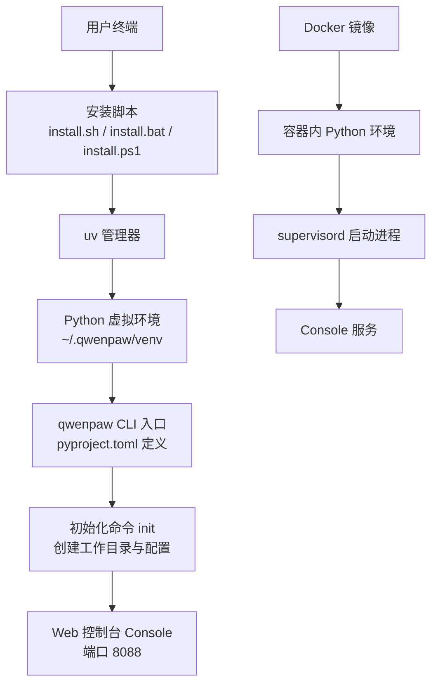
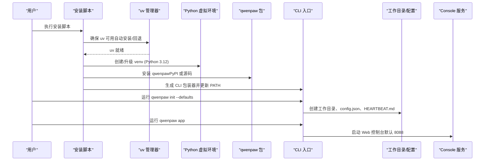
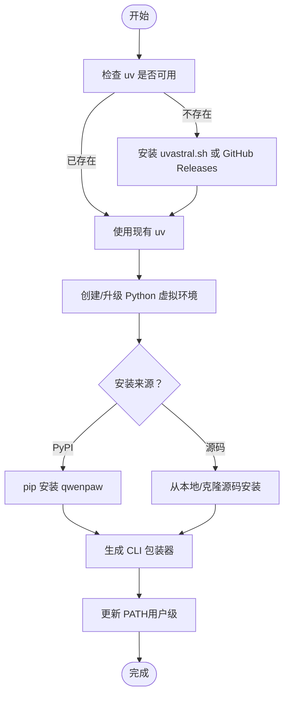
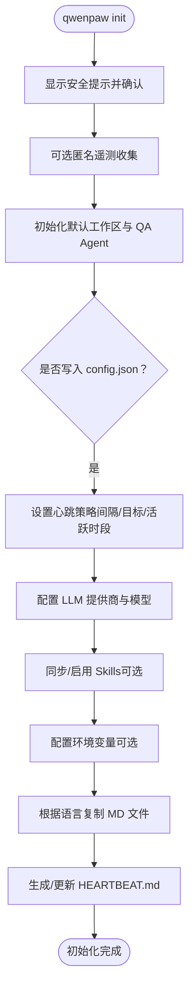
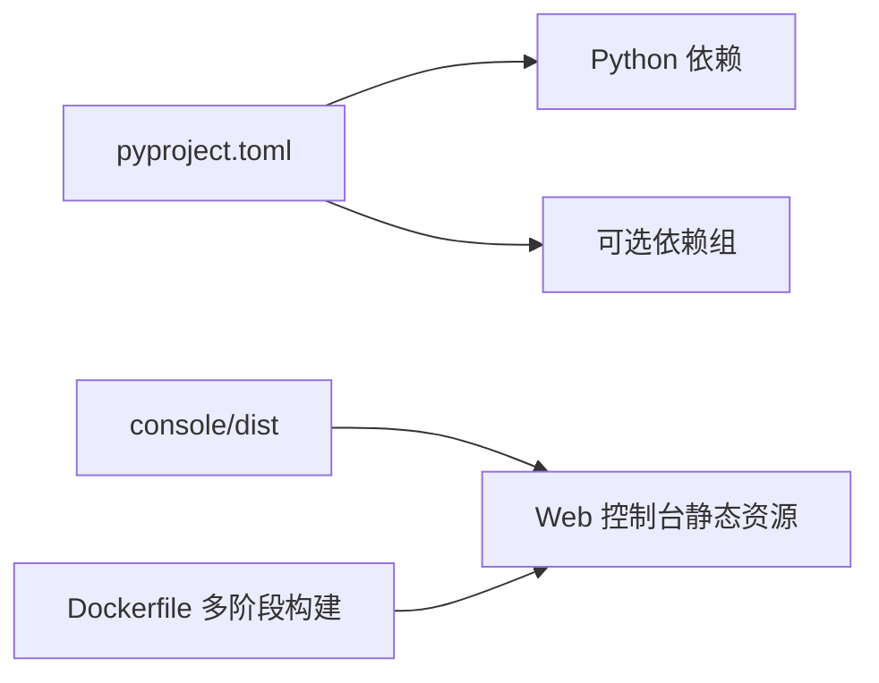

# 本地部署

<cite>
**本文引用的文件**   
- [README.md](file://README.md)
- [README_zh.md](file://README_zh.md)
- [scripts/install.sh](file://scripts/install.sh)
- [scripts/install.bat](file://scripts/install.bat)
- [scripts/install.ps1](file://scripts/install.ps1)
- [deploy/Dockerfile](file://deploy/Dockerfile)
- [pyproject.toml](file://pyproject.toml)
- [src/qwenpaw/cli/init_cmd.py](file://src/qwenpaw/cli/init_cmd.py)
- [src/qwenpaw/config/config.py](file://src/qwenpaw/config/config.py)
</cite>

## 目录
1. [简介](#简介)
2. [项目结构](#项目结构)
3. [核心组件](#核心组件)
4. [架构总览](#架构总览)
5. [详细组件分析](#详细组件分析)
6. [依赖分析](#依赖分析)
7. [性能考虑](#性能考虑)
8. [故障排除指南](#故障排除指南)
9. [结论](#结论)
10. [附录](#附录)

## 简介
本指南面向在本地环境部署 QwenPaw 的用户，覆盖从环境准备、依赖安装、配置初始化到服务启动的完整流程。文档同时给出 Windows、macOS、Linux 的安装脚本使用方法，说明 Python 虚拟环境与 uv 的管理方式、环境变量与基础配置文件的作用，并对比开发环境与生产环境的差异配置。内容兼顾初学者与有经验的开发者，力求步骤清晰、可操作、可复现。

## 项目结构
QwenPaw 提供多种本地部署路径：
- 通过 pip 或源码安装（Python 包）
- 通过一键安装脚本（自动管理 uv 与虚拟环境）
- 通过 Docker 镜像运行
- 桌面应用（Tauri 打包）

图表来源
- [scripts/install.sh:108-136](file://scripts/install.sh#L108-L136)
- [scripts/install.bat:170-233](file://scripts/install.bat#L170-L233)
- [scripts/install.ps1:123-193](file://scripts/install.ps1#L123-L193)
- [pyproject.toml:104-106](file://pyproject.toml#L104-L106)
- [deploy/Dockerfile:103-111](file://deploy/Dockerfile#L103-L111)

章节来源
- [README.md:104-174](file://README.md#L104-L174)
- [README_zh.md:104-174](file://README_zh.md#L104-L174)
- [pyproject.toml:104-106](file://pyproject.toml#L104-L106)
- [deploy/Dockerfile:1-111](file://deploy/Dockerfile#L1-L111)

## 核心组件
- 安装器与虚拟环境
  - 安装脚本负责检测/安装 uv、创建 Python 虚拟环境、安装 qwenpaw 包、生成 CLI 包装器、更新 PATH。
  - 支持从 PyPI 安装或从源码安装；Windows 脚本内置 GitHub Releases 回退下载 uv 的逻辑。
- CLI 与初始化
  - 通过 pyproject.toml 暴露 qwenpaw 命令；init 子命令交互式创建工作目录、默认配置、心跳模板、模型提供商等。
- Web 控制台
  - 默认监听 8088 端口；前端资源由 console/dist 构建产物注入到包中或通过 Docker 多阶段构建复制。
- Docker 运行时
  - 使用 supervisord 管理进程；预装 Chromium 用于 Playwright；通过环境变量控制通道过滤与端口。

章节来源
- [scripts/install.sh:108-136](file://scripts/install.sh#L108-L136)
- [scripts/install.bat:170-233](file://scripts/install.bat#L170-L233)
- [scripts/install.ps1:123-193](file://scripts/install.ps1#L123-L193)
- [pyproject.toml:104-106](file://pyproject.toml#L104-L106)
- [src/qwenpaw/cli/init_cmd.py:152-176](file://src/qwenpaw/cli/init_cmd.py#L152-L176)
- [deploy/Dockerfile:1-111](file://deploy/Dockerfile#L1-L111)

## 架构总览
下图展示本地部署的关键流程：安装器 → uv → 虚拟环境 → qwenpaw CLI → 初始化 → 启动服务。

图表来源
- [scripts/install.sh:108-136](file://scripts/install.sh#L108-L136)
- [scripts/install.bat:170-233](file://scripts/install.bat#L170-L233)
- [scripts/install.ps1:123-193](file://scripts/install.ps1#L123-L193)
- [pyproject.toml:104-106](file://pyproject.toml#L104-L106)
- [src/qwenpaw/cli/init_cmd.py:152-176](file://src/qwenpaw/cli/init_cmd.py#L152-L176)

## 详细组件分析

### 安装脚本与虚拟环境（Windows/macOS/Linux）
- macOS/Linux（install.sh）
  - 自动检测/安装 uv，优先尝试官方源，不可用时切换阿里云镜像。
  - 在 ~/.qwenpaw 下创建 venv（Python 3.12），安装 qwenpaw，生成 CLI 包装器，追加 PATH。
  - 若存在 console/dist 或 npm 可用，则构建/复制前端资源以启用 Web UI。
- Windows（install.bat / install.ps1）
  - 支持 -Version、-FromSource、-SourceDir、-Extras、-Prerelease、-UvPath 等参数。
  - 自动查找 PATH 或常见位置中的 uv；失败时先尝试 astral.sh，再回退 GitHub Releases。
  - 写入用户级 PATH（避免修改系统级），生成 .ps1 与 .cmd 包装器。
  - 对输入进行安全校验，防止参数注入。

图表来源
- [scripts/install.sh:108-136](file://scripts/install.sh#L108-L136)
- [scripts/install.bat:170-233](file://scripts/install.bat#L170-L233)
- [scripts/install.ps1:123-193](file://scripts/install.ps1#L123-L193)

章节来源
- [scripts/install.sh:1-377](file://scripts/install.sh#L1-L377)
- [scripts/install.bat:1-568](file://scripts/install.bat#L1-L568)
- [scripts/install.ps1:1-482](file://scripts/install.ps1#L1-L482)

### 初始化与基础配置（init 命令）
- 工作目录与配置文件
  - 首次运行 init 会创建工作目录、config.json、HEARTBEAT.md 等基础文件。
  - 支持 --defaults 非交互模式与 --accept-security 跳过安全确认（适合脚本化）。
- 模型与频道
  - 若无激活的 LLM，将引导配置提供商与模型；可选配置频道与环境变量。
- 技能与语言
  - 同步 Skill Pool 到工作区，按语言复制 MD 文件，记录已安装语言。

图表来源
- [src/qwenpaw/cli/init_cmd.py:152-176](file://src/qwenpaw/cli/init_cmd.py#L152-L176)
- [src/qwenpaw/cli/init_cmd.py:247-331](file://src/qwenpaw/cli/init_cmd.py#L247-L331)
- [src/qwenpaw/cli/init_cmd.py:367-392](file://src/qwenpaw/cli/init_cmd.py#L367-L392)
- [src/qwenpaw/cli/init_cmd.py:393-431](file://src/qwenpaw/cli/init_cmd.py#L393-L431)
- [src/qwenpaw/cli/init_cmd.py:442-489](file://src/qwenpaw/cli/init_cmd.py#L442-L489)
- [src/qwenpaw/cli/init_cmd.py:491-531](file://src/qwenpaw/cli/init_cmd.py#L491-L531)

章节来源
- [src/qwenpaw/cli/init_cmd.py:152-176](file://src/qwenpaw/cli/init_cmd.py#L152-L176)
- [src/qwenpaw/cli/init_cmd.py:247-331](file://src/qwenpaw/cli/init_cmd.py#L247-L331)
- [src/qwenpaw/cli/init_cmd.py:367-392](file://src/qwenpaw/cli/init_cmd.py#L367-L392)
- [src/qwenpaw/cli/init_cmd.py:393-431](file://src/qwenpaw/cli/init_cmd.py#L393-L431)
- [src/qwenpaw/cli/init_cmd.py:442-489](file://src/qwenpaw/cli/init_cmd.py#L442-L489)
- [src/qwenpaw/cli/init_cmd.py:491-531](file://src/qwenpaw/cli/init_cmd.py#L491-L531)

### 服务启动与端口
- 启动命令
  - 安装完成后，运行 qwenpaw app 启动 Web 控制台，默认监听 127.0.0.1:8088。
- Docker 启动
  - 镜像暴露 8088 端口；可通过环境变量 QWENPAW_PORT 调整；使用 supervisord 管理进程。
- 本地连接外部模型服务（如 Ollama/LM Studio）
  - 容器内 localhost 指向自身，需通过 host.docker.internal 或宿主网络访问宿主机服务。

章节来源
- [README.md:104-174](file://README.md#L104-L174)
- [README_zh.md:104-174](file://README_zh.md#L104-L174)
- [deploy/Dockerfile:103-111](file://deploy/Dockerfile#L103-L111)

### 环境变量与基础配置文件
- 关键环境变量（示例）
  - WORKSPACE_DIR、QWENPAW_WORKING_DIR、QWENPAW_SECRET_DIR、QWENPAW_BACKUP_DIR（容器内默认路径）
  - QWENPAW_DISABLED_CHANNELS、QWENPAW_ENABLED_CHANNELS（通道白名单/黑名单）
  - QWENPAW_PORT（服务端口）
  - PLAYWRIGHT_*（Playwright 相关）
- 配置文件
  - config.json：包含心跳、Agent 默认、频道、模型等配置项。
  - HEARTBEAT.md：心跳任务查询模板。
- 配置模型
  - 使用 Pydantic 模型描述配置结构，支持字段别名、验证与迁移逻辑（例如 weixin→wechat）。

章节来源
- [deploy/Dockerfile:21-33](file://deploy/Dockerfile#L21-L33)
- [deploy/Dockerfile:88-100](file://deploy/Dockerfile#L88-L100)
- [src/qwenpaw/config/config.py:495-534](file://src/qwenpaw/config/config.py#L495-L534)
- [src/qwenpaw/config/config.py:549-568](file://src/qwenpaw/config/config.py#L549-L568)

## 依赖分析
- Python 版本要求
  - requires-python: >=3.11,<3.14；安装脚本默认使用 Python 3.12。
- 核心依赖
  - agentscope、mcp、httpx、uvicorn、apscheduler、playwright、textual、openai 等。
- 可选依赖组
  - test、dev、local、whisper、full、sip、sip-livekit 等，按需安装。
- 前端资源
  - console/dist 构建产物需复制到 src/qwenpaw/console 或由 Docker 多阶段构建注入。

图表来源
- [pyproject.toml:1-71](file://pyproject.toml#L1-L71)
- [pyproject.toml:113-144](file://pyproject.toml#L113-L144)
- [deploy/Dockerfile:8-11](file://deploy/Dockerfile#L8-L11)
- [deploy/Dockerfile:96-100](file://deploy/Dockerfile#L96-L100)

章节来源
- [pyproject.toml:1-71](file://pyproject.toml#L1-L71)
- [pyproject.toml:113-144](file://pyproject.toml#L113-L144)
- [deploy/Dockerfile:8-11](file://deploy/Dockerfile#L8-L11)
- [deploy/Dockerfile:96-100](file://deploy/Dockerfile#L96-L100)

## 性能考虑
- 前端构建
  - 首次安装或源码安装时，npm ci + build 可能耗时较长；建议提前缓存 node_modules 或使用离线镜像。
- 模型推理
  - 本地模型（QwenPaw Local/Ollama/LM Studio）需合理设置上下文长度与量化级别，平衡速度与质量。
- 浏览器自动化
  - Playwright 使用系统 Chromium，避免重复下载；容器内需安装必要库与字体。
- 进程管理
  - 生产环境建议使用 supervisord 或 systemd 管理服务，配合日志轮转与健康检查。

[本节为通用指导，不直接分析具体文件]

## 故障排除指南
- uv 无法自动安装
  - 手动安装 uv 后重试；或在受限环境中使用 -UvPath 指定路径。
- PowerShell 受限语言模式（Windows LTSC/企业）
  - 脚本可能无法自动更新 PATH；按提示手动添加 %USERPROFILE%\.qwenpaw\bin 到用户 PATH。
- 未找到 qwenpaw 命令
  - 打开新终端或 source 对应 shell 配置文件；确认 PATH 已包含安装目录。
- Web UI 不可用
  - 检查 console/dist 是否存在；若源码安装，请安装 Node.js 并执行构建；或重新运行安装脚本。
- 容器内无法访问宿主机模型服务
  - 使用 host.docker.internal 或 --network=host（Linux）；并在设置中将 Base URL 改为宿主机地址。

章节来源
- [scripts/install.bat:170-233](file://scripts/install.bat#L170-L233)
- [scripts/install.ps1:123-193](file://scripts/install.ps1#L123-L193)
- [README.md:235-261](file://README.md#L235-L261)
- [README_zh.md:235-261](file://README_zh.md#L235-L261)

## 结论
通过安装脚本与 uv 管理，QwenPaw 可在 Windows、macOS、Linux 上快速本地部署；init 命令简化了工作目录与基础配置；Web 控制台默认 8088 端口便于本地调试。生产环境推荐 Docker 部署并使用 supervisord 管理进程，结合环境变量实现通道过滤与端口定制。遵循本文步骤与排障建议，可高效完成开发与生产环境的差异化配置。

[本节为总结性内容，不直接分析具体文件]

## 附录
- 常用命令速查
  - 安装（macOS/Linux）：curl ... | bash
  - 安装（Windows CMD）：curl ... -o install.bat && install.bat
  - 安装（Windows PowerShell）：irm ... | iex
  - 初始化：qwenpaw init --defaults
  - 启动服务：qwenpaw app
- 开发环境 vs 生产环境差异
  - 开发：本地 pip 或源码安装，开启前端构建，便于调试；端口 8088 仅绑定 127.0.0.1。
  - 生产：Docker 镜像 + supervisord，固定端口与卷挂载，通道白名单/黑名单，日志与监控集成。

章节来源
- [README.md:104-174](file://README.md#L104-L174)
- [README_zh.md:104-174](file://README_zh.md#L104-L174)
- [deploy/Dockerfile:103-111](file://deploy/Dockerfile#L103-L111)