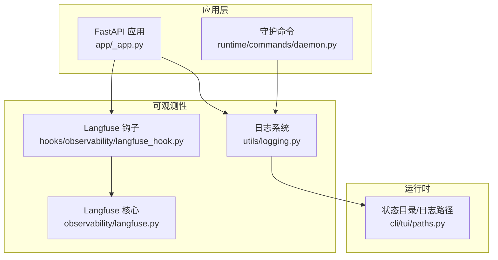
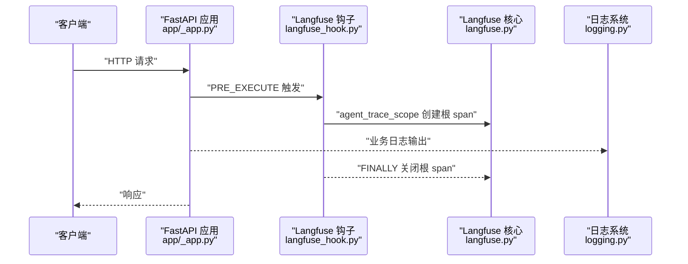
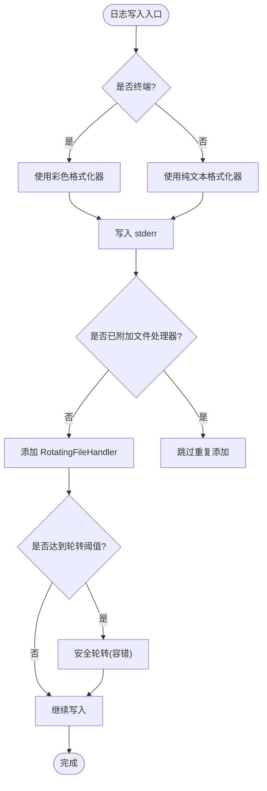
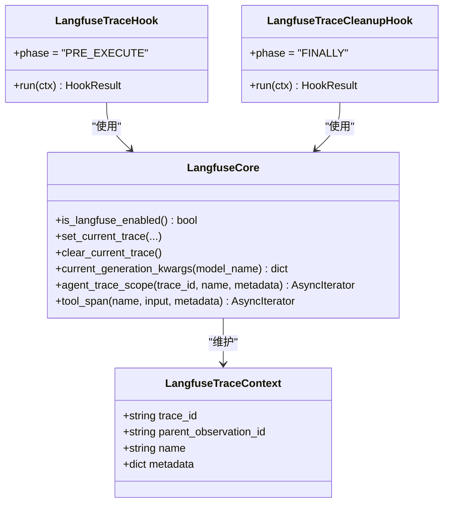
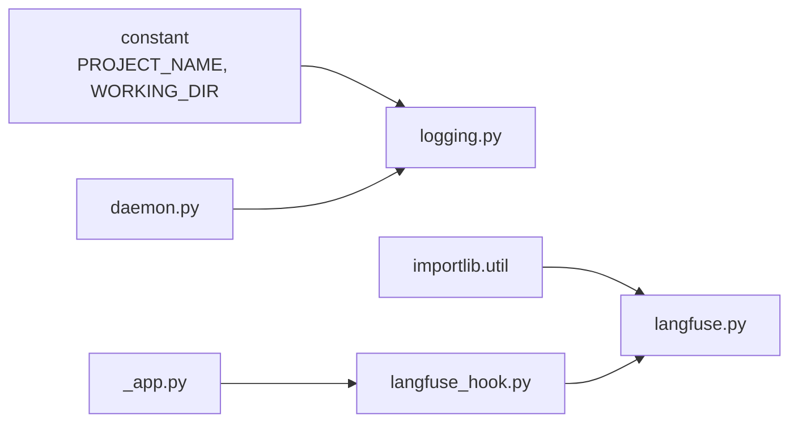

# 监控和日志

<cite>
**本文引用的文件**   
- [src/qwenpaw/utils/logging.py](file://src/qwenpaw/utils/logging.py)
- [src/qwenpaw/observability/langfuse.py](file://src/qwenpaw/observability/langfuse.py)
- [src/qwenpaw/hooks/observability/langfuse_hook.py](file://src/qwenpaw/hooks/observability/langfuse_hook.py)
- [src/qwenpaw/app/_app.py](file://src/qwenpaw/app/_app.py)
- [src/qwenpaw/runtime/commands/daemon.py](file://src/qwenpaw/runtime/commands/daemon.py)
- [src/qwenpaw/cli/tui/paths.py](file://src/qwenpaw/cli/tui/paths.py)
- [tests/unit/observability/test_langfuse_context.py](file://tests/unit/observability/test_langfuse_context.py)
</cite>

## 目录
1. [简介](#简介)
2. [项目结构](#项目结构)
3. [核心组件](#核心组件)
4. [架构总览](#架构总览)
5. [详细组件分析](#详细组件分析)
6. [依赖关系分析](#依赖关系分析)
7. [性能与可观测性建议](#性能与可观测性建议)
8. [故障排查指南](#故障排查指南)
9. [结论](#结论)
10. [附录：集成与配置示例](#附录集成与配置示例)

## 简介
本章节面向 QwenPaw 的“监控与日志”能力，系统性梳理应用内日志输出、结构化日志格式、日志轮转与集中式管理方案；同时介绍分布式追踪（Langfuse）在 Agent 请求链路中的接入方式，以及如何在生产环境结合 Prometheus、Grafana、ELK Stack 进行指标采集、可视化与告警。文档兼顾初学者友好与资深开发者的技术深度，提供架构图、时序图与流程图，并给出关键路径引用以便快速定位实现。

## 项目结构
QwenPaw 的监控与日志相关代码主要分布在以下位置：
- 日志子系统：utils/logging.py
- 分布式追踪（Langfuse）：observability/langfuse.py 与 hooks/observability/langfuse_hook.py
- 应用启动与生命周期：app/_app.py
- 守护进程命令与日志查看：runtime/commands/daemon.py
- CLI/TUI 状态目录与默认日志路径：cli/tui/paths.py
- 单元测试验证追踪上下文：tests/unit/observability/test_langfuse_context.py

图表来源
- [src/qwenpaw/app/_app.py:162-210](file://src/qwenpaw/app/_app.py#L162-L210)
- [src/qwenpaw/utils/logging.py:154-188](file://src/qwenpaw/utils/logging.py#L154-L188)
- [src/qwenpaw/hooks/observability/langfuse_hook.py:21-64](file://src/qwenpaw/hooks/observability/langfuse_hook.py#L21-L64)
- [src/qwenpaw/observability/langfuse.py:114-174](file://src/qwenpaw/observability/langfuse.py#L114-L174)
- [src/qwenpaw/runtime/commands/daemon.py:1-48](file://src/qwenpaw/runtime/commands/daemon.py#L1-L48)
- [src/qwenpaw/cli/tui/paths.py:15-34](file://src/qwenpaw/cli/tui/paths.py#L15-L34)

章节来源
- [src/qwenpaw/app/_app.py:162-210](file://src/qwenpaw/app/_app.py#L162-L210)
- [src/qwenpaw/utils/logging.py:154-188](file://src/qwenpaw/utils/logging.py#L154-L188)
- [src/qwenpaw/hooks/observability/langfuse_hook.py:21-64](file://src/qwenpaw/hooks/observability/langfuse_hook.py#L21-L64)
- [src/qwenpaw/observability/langfuse.py:114-174](file://src/qwenpaw/observability/langfuse.py#L114-L174)
- [src/qwenpaw/runtime/commands/daemon.py:1-48](file://src/qwenpaw/runtime/commands/daemon.py#L1-L48)
- [src/qwenpaw/cli/tui/paths.py:15-34](file://src/qwenpaw/cli/tui/paths.py#L15-L34)

## 核心组件
- 日志子系统
  - 控制台彩色格式化输出与文件输出分离
  - 基于 RotatingFileHandler 的日志轮转（大小限制与备份数量）
  - Windows 下文件锁兼容处理，避免权限错误导致日志中断
  - 命名空间隔离（仅输出本项目日志），支持附加到第三方模块（如 apscheduler）
- 分布式追踪（Langfuse）
  - 可选依赖，未安装时自动降级为无操作
  - 通过 ContextVar 维护当前 trace 上下文
  - agent_trace_scope 创建根 span，tool_span 记录工具调用
  - 生命周期钩子在 PRE_EXECUTE/FINALLY 阶段自动开启/关闭根 span
- 应用启动与守护命令
  - 启动时添加项目级文件处理器，统一写入 qwenpaw.log
  - 守护命令支持 logs 子命令直接读取项目日志路径

章节来源
- [src/qwenpaw/utils/logging.py:88-130](file://src/qwenpaw/utils/logging.py#L88-L130)
- [src/qwenpaw/utils/logging.py:216-261](file://src/qwenpaw/utils/logging.py#L216-L261)
- [src/qwenpaw/observability/langfuse.py:35-65](file://src/qwenpaw/observability/langfuse.py#L35-L65)
- [src/qwenpaw/observability/langfuse.py:114-174](file://src/qwenpaw/observability/langfuse.py#L114-L174)
- [src/qwenpaw/hooks/observability/langfuse_hook.py:21-64](file://src/qwenpaw/hooks/observability/langfuse_hook.py#L21-L64)
- [src/qwenpaw/app/_app.py:162-188](file://src/qwenpaw/app/_app.py#L162-L188)
- [src/qwenpaw/runtime/commands/daemon.py:29-48](file://src/qwenpaw/runtime/commands/daemon.py#L29-L48)

## 架构总览
下图展示了从 HTTP 请求进入 FastAPI 应用，到日志输出与 Langfuse 追踪的全链路。

图表来源
- [src/qwenpaw/app/_app.py:162-210](file://src/qwenpaw/app/_app.py#L162-L210)
- [src/qwenpaw/hooks/observability/langfuse_hook.py:21-64](file://src/qwenpaw/hooks/observability/langfuse_hook.py#L21-L64)
- [src/qwenpaw/observability/langfuse.py:114-174](file://src/qwenpaw/observability/langfuse.py#L114-L174)
- [src/qwenpaw/utils/logging.py:154-188](file://src/qwenpaw/utils/logging.py#L154-L188)

## 详细组件分析

### 日志子系统（结构化日志、轮转与集中式管理）
- 控制台输出
  - 使用 ColorFormatter 对级别着色，并在非终端环境下自动禁用颜色
  - 输出包含时间、级别、相对路径与行号，便于快速定位
- 文件输出与轮转
  - 使用 _SafeRotatingFileHandler 继承 RotatingFileHandler，捕获 Windows 下的 PermissionError，确保日志不丢失
  - 默认单文件大小上限与备份数量可配置（例如 5MiB、3 份）
  - 通过 add_project_file_handler 将文件处理器附加到项目命名空间，并可选择附加到第三方模块（如 apscheduler）
- 过滤与降噪
  - 提供 SuppressPathAccessLogFilter 用于过滤特定路径的访问日志
- 集中式日志管理
  - 统一日志文件名与路径常量，便于外部收集器（如 Filebeat/Fluent Bit）抓取
  - 守护命令 daemon logs 可直接读取项目日志路径，方便运维

图表来源
- [src/qwenpaw/utils/logging.py:55-86](file://src/qwenpaw/utils/logging.py#L55-L86)
- [src/qwenpaw/utils/logging.py:88-106](file://src/qwenpaw/utils/logging.py#L88-L106)
- [src/qwenpaw/utils/logging.py:108-130](file://src/qwenpaw/utils/logging.py#L108-L130)
- [src/qwenpaw/utils/logging.py:132-152](file://src/qwenpaw/utils/logging.py#L132-L152)
- [src/qwenpaw/utils/logging.py:216-261](file://src/qwenpaw/utils/logging.py#L216-L261)

章节来源
- [src/qwenpaw/utils/logging.py:55-86](file://src/qwenpaw/utils/logging.py#L55-L86)
- [src/qwenpaw/utils/logging.py:88-106](file://src/qwenpaw/utils/logging.py#L88-L106)
- [src/qwenpaw/utils/logging.py:108-130](file://src/qwenpaw/utils/logging.py#L108-L130)
- [src/qwenpaw/utils/logging.py:132-152](file://src/qwenpaw/utils/logging.py#L132-L152)
- [src/qwenpaw/utils/logging.py:154-188](file://src/qwenpaw/utils/logging.py#L154-L188)
- [src/qwenpaw/utils/logging.py:216-261](file://src/qwenpaw/utils/logging.py#L216-L261)

### 分布式追踪（Langfuse）
- 可选依赖与可用性检测
  - is_langfuse_enabled 检查环境变量与模块可用性，失败则返回 False
- 上下文传播
  - set_current_trace/clear_current_trace/current_generation_kwargs 基于 ContextVar 维护当前 trace
- 根 span 与工具 span
  - agent_trace_scope 创建根 span，异常时标记 ERROR 并正确结束
  - tool_span 在当前 trace 下创建工具观察，记录输入输出与错误状态
- 生命周期钩子
  - LangfuseTraceHook 在 PRE_EXECUTE 阶段创建根 span，LangfuseTraceCleanupHook 在 FINALLY 阶段关闭
  - 优先级设计保证会话/代理元数据可用后再创建 trace

图表来源
- [src/qwenpaw/observability/langfuse.py:21-32](file://src/qwenpaw/observability/langfuse.py#L21-L32)
- [src/qwenpaw/observability/langfuse.py:35-65](file://src/qwenpaw/observability/langfuse.py#L35-L65)
- [src/qwenpaw/observability/langfuse.py:67-112](file://src/qwenpaw/observability/langfuse.py#L67-L112)
- [src/qwenpaw/observability/langfuse.py:114-174](file://src/qwenpaw/observability/langfuse.py#L114-L174)
- [src/qwenpaw/observability/langfuse.py:176-225](file://src/qwenpaw/observability/langfuse.py#L176-L225)
- [src/qwenpaw/hooks/observability/langfuse_hook.py:21-64](file://src/qwenpaw/hooks/observability/langfuse_hook.py#L21-L64)
- [src/qwenpaw/hooks/observability/langfuse_hook.py:67-88](file://src/qwenpaw/hooks/observability/langfuse_hook.py#L67-L88)

章节来源
- [src/qwenpaw/observability/langfuse.py:35-65](file://src/qwenpaw/observability/langfuse.py#L35-L65)
- [src/qwenpaw/observability/langfuse.py:114-174](file://src/qwenpaw/observability/langfuse.py#L114-L174)
- [src/qwenpaw/observability/langfuse.py:176-225](file://src/qwenpaw/observability/langfuse.py#L176-L225)
- [src/qwenpaw/hooks/observability/langfuse_hook.py:21-64](file://src/qwenpaw/hooks/observability/langfuse_hook.py#L21-L64)
- [src/qwenpaw/hooks/observability/langfuse_hook.py:67-88](file://src/qwenpaw/hooks/observability/langfuse_hook.py#L67-L88)
- [tests/unit/observability/test_langfuse_context.py:41-92](file://tests/unit/observability/test_langfuse_context.py#L41-L92)

### 应用启动与守护命令
- 启动流程
  - lifespan 中调用 add_project_file_handler(LOG_FILE_PATH)，确保所有项目日志写入统一文件
  - 后台任务加载插件、启动代理与服务，期间持续输出日志
- 守护命令
  - /daemon logs 子命令直接读取 LOG_FILE_PATH，便于快速查看运行日志

章节来源
- [src/qwenpaw/app/_app.py:162-188](file://src/qwenpaw/app/_app.py#L162-L188)
- [src/qwenpaw/app/_app.py:449-487](file://src/qwenpaw/app/_app.py#L449-L487)
- [src/qwenpaw/runtime/commands/daemon.py:29-48](file://src/qwenpaw/runtime/commands/daemon.py#L29-L48)

## 依赖关系分析
- 日志子系统
  - 依赖 constant.PROJECT_NAME 与 WORKING_DIR 确定命名空间与日志路径
  - 通过 logging.handlers.RotatingFileHandler 实现轮转
- Langfuse 追踪
  - 可选依赖 langfuse，通过 importlib.util.find_spec 检测
  - 通过 ContextVar 跨异步函数传播上下文
- 应用与钩子
  - app/_app.py 在启动时注册 Langfuse 钩子类，使每个 Agent 请求具备完整追踪
  - runtime/commands/daemon.py 复用 LOG_FILE_PATH 常量以提供日志查看

图表来源
- [src/qwenpaw/utils/logging.py:11-31](file://src/qwenpaw/utils/logging.py#L11-L31)
- [src/qwenpaw/observability/langfuse.py:35-65](file://src/qwenpaw/observability/langfuse.py#L35-L65)
- [src/qwenpaw/app/_app.py:379-395](file://src/qwenpaw/app/_app.py#L379-L395)
- [src/qwenpaw/runtime/commands/daemon.py:18-48](file://src/qwenpaw/runtime/commands/daemon.py#L18-L48)

章节来源
- [src/qwenpaw/utils/logging.py:11-31](file://src/qwenpaw/utils/logging.py#L11-L31)
- [src/qwenpaw/observability/langfuse.py:35-65](file://src/qwenpaw/observability/langfuse.py#L35-L65)
- [src/qwenpaw/app/_app.py:379-395](file://src/qwenpaw/app/_app.py#L379-L395)
- [src/qwenpaw/runtime/commands/daemon.py:18-48](file://src/qwenpaw/runtime/commands/daemon.py#L18-L48)

## 性能与可观测性建议
- 日志性能
  - 使用 RotatingFileHandler 控制单文件大小与备份数，避免磁盘写放大
  - 在非终端环境禁用彩色输出，减少字符串拼接开销
- 追踪开销
  - Langfuse 为可选依赖，未启用时对性能零影响
  - 建议在高频路径上谨慎记录大对象，避免序列化成本过高
- 指标与告警（概念性建议）
  - 可通过中间件或路由层暴露自定义指标端点（例如 /metrics），由 Prometheus 抓取
  - 结合 Grafana 构建仪表盘，展示请求量、延迟分布、错误率等
  - 针对关键业务指标（如 LLM 调用成功率、工具调用耗时）设置告警规则

[本节为通用指导，无需源码引用]

## 故障排查指南
- 日志无法写入或轮转失败
  - 检查 Windows 下是否有其他进程占用日志文件；_SafeRotatingFileHandler 会尝试恢复，但仍需确认权限
  - 确认 add_project_file_handler 是否被调用且路径存在
- 追踪未生效
  - 确认 LANGFUSE_SECRET_KEY 已设置且 langfuse 模块可用
  - 检查 LangfuseTraceHook 是否成功注册（app/_app.py 启动流程）
- 守护命令无法查看日志
  - 确认 daemon logs 使用的 LOG_FILE_PATH 与实际日志路径一致

章节来源
- [src/qwenpaw/utils/logging.py:88-106](file://src/qwenpaw/utils/logging.py#L88-L106)
- [src/qwenpaw/utils/logging.py:216-261](file://src/qwenpaw/utils/logging.py#L216-L261)
- [src/qwenpaw/observability/langfuse.py:35-65](file://src/qwenpaw/observability/langfuse.py#L35-L65)
- [src/qwenpaw/app/_app.py:379-395](file://src/qwenpaw/app/_app.py#L379-L395)
- [src/qwenpaw/runtime/commands/daemon.py:29-48](file://src/qwenpaw/runtime/commands/daemon.py#L29-L48)

## 结论
QwenPaw 的监控与日志体系以“轻量、可靠、可扩展”为核心目标：日志子系统提供结构化输出与安全的轮转机制，Langfuse 追踪以可选依赖形式无缝嵌入 Agent 生命周期，并通过生命周期钩子自动化管理。配合统一的日志路径与守护命令，运维人员可以快速定位问题。在生产环境中，建议结合 Prometheus/Grafana/ELK Stack 完善指标采集、可视化与集中式日志管理，形成完整的可观测性闭环。

[本节为总结，无需源码引用]

## 附录：集成与配置示例

### 日志配置要点
- 控制台与文件输出分离，命名空间隔离
- 轮转策略：单文件大小与备份数量
- Windows 兼容性：文件锁容错
- 统一日志路径：LOG_FILE_PATH 常量

章节来源
- [src/qwenpaw/utils/logging.py:154-188](file://src/qwenpaw/utils/logging.py#L154-L188)
- [src/qwenpaw/utils/logging.py:216-261](file://src/qwenpaw/utils/logging.py#L216-L261)
- [src/qwenpaw/cli/tui/paths.py:15-34](file://src/qwenpaw/cli/tui/paths.py#L15-L34)

### 分布式追踪（Langfuse）配置
- 环境变量：LANGFUSE_SECRET_KEY
- 模块可用性：langfuse 与 langfuse.openai
- 生命周期钩子：LangfuseTraceHook 与 LangfuseTraceCleanupHook
- 上下文传播：ContextVar 与 current_generation_kwargs

章节来源
- [src/qwenpaw/observability/langfuse.py:35-65](file://src/qwenpaw/observability/langfuse.py#L35-L65)
- [src/qwenpaw/observability/langfuse.py:114-174](file://src/qwenpaw/observability/langfuse.py#L114-L174)
- [src/qwenpaw/hooks/observability/langfuse_hook.py:21-64](file://src/qwenpaw/hooks/observability/langfuse_hook.py#L21-L64)
- [tests/unit/observability/test_langfuse_context.py:41-92](file://tests/unit/observability/test_langfuse_context.py#L41-L92)

### 监控系统集成（Prometheus、Grafana、ELK Stack）
- Prometheus
  - 在应用层暴露 /metrics 端点（自定义中间件或路由），采集请求量、延迟、错误率等指标
  - 配置 prometheus.yml 抓取目标，部署 exporter 与 server
- Grafana
  - 连接 Prometheus 数据源，创建仪表盘展示关键指标
  - 配置告警规则（如错误率阈值、延迟 P99）
- ELK Stack
  - 使用 Filebeat/Fluent Bit 抓取 qwenpaw.log 文件
  - 在 Elasticsearch 中建立索引模式，Kibana 中创建日志面板与告警

[本节为通用集成指导，无需源码引用]