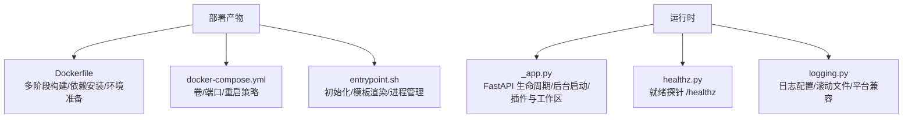
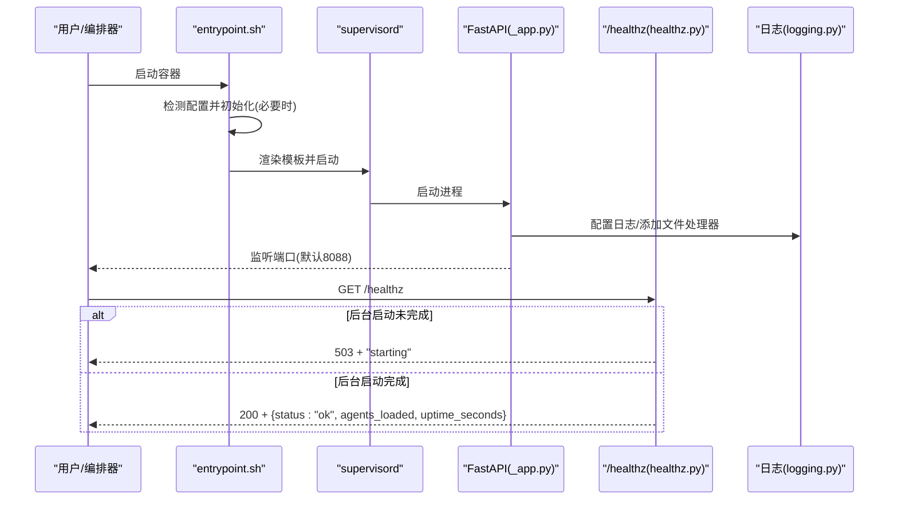
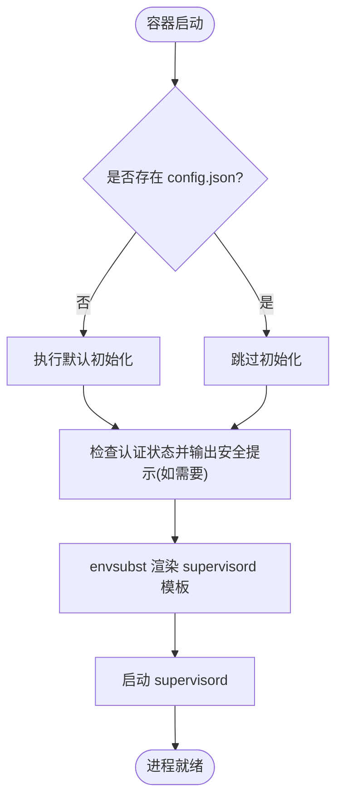
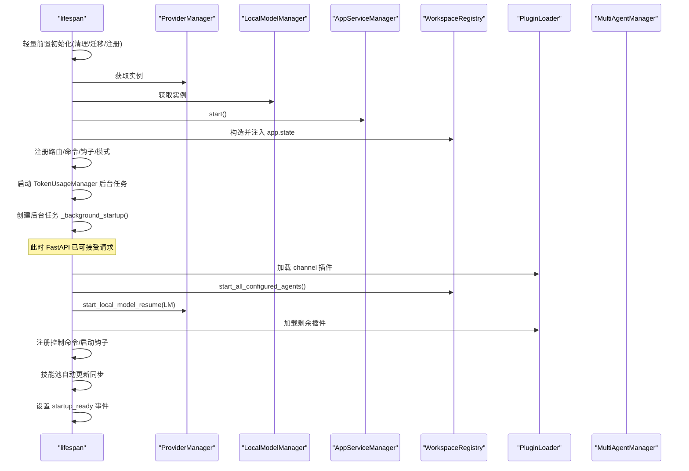
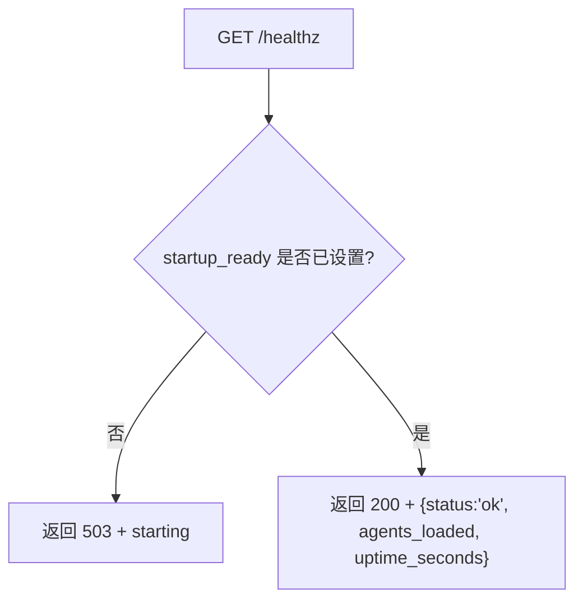
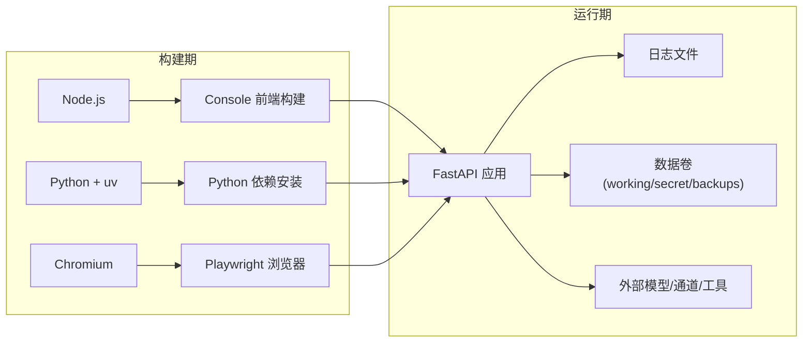

# 部署和运维

<cite>
**本文引用的文件**   
- [README.md](file://README.md)
- [Dockerfile](file://deploy/Dockerfile)
- [docker-compose.yml](file://docker-compose.yml)
- [entrypoint.sh](file://deploy/entrypoint.sh)
- [_app.py](file://src/qwenpaw/app/_app.py)
- [healthz.py](file://src/qwenpaw/app/routers/healthz.py)
- [logging.py](file://src/qwenpaw/utils/logging.py)
</cite>

## 目录
1. [简介](#简介)
2. [项目结构](#项目结构)
3. [核心组件](#核心组件)
4. [架构总览](#架构总览)
5. [详细组件分析](#详细组件分析)
6. [依赖关系分析](#依赖关系分析)
7. [性能与可观测性](#性能与可观测性)
8. [故障排查指南](#故障排查指南)
9. [结论](#结论)
10. [附录：配置与环境变量](#附录配置与环境变量)

## 简介
本章节面向 QwenPaw 的部署与运维，覆盖本地部署、Docker 容器化、云平台部署、监控与日志管理。文档基于仓库中的实际实现，给出镜像构建、容器编排、健康检查、启动流程、数据持久化、安全提示等关键细节，并提供初学者友好的说明与进阶实践建议。

## 项目结构
与部署和运维直接相关的顶层结构与文件如下：
- deploy/Dockerfile：多阶段构建前端、安装 Python 依赖、准备 Chromium 与 Playwright、暴露端口、定义入口脚本
- docker-compose.yml：声明卷、服务、端口映射与重启策略
- deploy/entrypoint.sh：容器启动时初始化配置、环境变量注入、supervisord 模板渲染与进程管理
- src/qwenpaw/app/_app.py：FastAPI 应用生命周期、后台启动任务、插件与工作区注册、中间件挂载
- src/qwenpaw/app/routers/healthz.py：就绪探针 /healthz
- src/qwenpaw/utils/logging.py：日志框架、控制台彩色输出、滚动文件写入、Windows 兼容处理

图表来源
- [Dockerfile:1-112](file://deploy/Dockerfile#L1-L112)
- [docker-compose.yml:1-27](file://docker-compose.yml#L1-L27)
- [entrypoint.sh:1-52](file://deploy/entrypoint.sh#L1-L52)
- [_app.py:1-800](file://src/qwenpaw/app/_app.py#L1-L800)
- [healthz.py:1-35](file://src/qwenpaw/app/routers/healthz.py#L1-L35)
- [logging.py:1-261](file://src/qwenpaw/utils/logging.py#L1-L261)

章节来源
- [README.md:218-261](file://README.md#L218-L261)
- [Dockerfile:1-112](file://deploy/Dockerfile#L1-L112)
- [docker-compose.yml:1-27](file://docker-compose.yml#L1-L27)
- [entrypoint.sh:1-52](file://deploy/entrypoint.sh#L1-L52)
- [_app.py:1-800](file://src/qwenpaw/app/_app.py#L1-L800)
- [healthz.py:1-35](file://src/qwenpaw/app/routers/healthz.py#L1-L35)
- [logging.py:1-261](file://src/qwenpaw/utils/logging.py#L1-L261)

## 核心组件
- 容器镜像构建（Dockerfile）
  - 使用 Node 基础镜像构建 Console 前端静态资源
  - 通过 uv 加速 Python 包安装
  - 安装 Chromium 并配置 Playwright 使用系统浏览器
  - 设置工作目录、端口、频道过滤参数、容器运行标记
- 容器编排（docker-compose.yml）
  - 定义三个命名卷：工作数据、密钥、备份
  - 默认映射 127.0.0.1:8088，自动重启
- 容器入口（entrypoint.sh）
  - 首次无配置时执行初始化
  - 未启用认证且绑定到外部网络时输出安全警告
  - 使用 envsubst 渲染 supervisord 模板并启动
- Web 应用（_app.py）
  - FastAPI lifespan 中完成轻量前置初始化与后台重任务
  - 注册中间件（Agent 上下文、认证、CORS）、挂载路由
  - 后台启动：加载插件、启动 Agent、恢复本地模型、技能池同步等
- 健康检查（healthz.py）
  - 在后台启动完成后返回 200，否则返回 503
  - 返回已加载 Agent 列表与运行时长
- 日志（logging.py）
  - 控制台彩色输出、滚动文件写入、Windows 文件锁定容错
  - 将 APScheduler 日志附加到同一文件

章节来源
- [Dockerfile:1-112](file://deploy/Dockerfile#L1-L112)
- [docker-compose.yml:1-27](file://docker-compose.yml#L1-L27)
- [entrypoint.sh:1-52](file://deploy/entrypoint.sh#L1-L52)
- [_app.py:1-800](file://src/qwenpaw/app/_app.py#L1-L800)
- [healthz.py:1-35](file://src/qwenpaw/app/routers/healthz.py#L1-L35)
- [logging.py:1-261](file://src/qwenpaw/utils/logging.py#L1-L261)

## 架构总览
QwenPaw 在容器中由 entrypoint.sh 启动 supervisord，supervisord 拉起 FastAPI 应用；应用通过 lifespan 进行快速前置初始化后，立即接受请求，同时后台任务继续完成插件与工作区加载。健康探针 /healthz 用于编排层就绪判断。

图表来源
- [entrypoint.sh:1-52](file://deploy/entrypoint.sh#L1-L52)
- [_app.py:1-800](file://src/qwenpaw/app/_app.py#L1-L800)
- [healthz.py:1-35](file://src/qwenpaw/app/routers/healthz.py#L1-L35)
- [logging.py:1-261](file://src/qwenpaw/utils/logging.py#L1-L261)

## 详细组件分析

### Docker 镜像构建与优化
- 多阶段构建
  - console-builder：仅构建前端静态资源，不进入最终镜像
  - runtime：包含 Python 环境、Chromium、Playwright、应用代码与文档
- 关键环境变量
  - WORKSPACE_DIR、QWENPAW_WORKING_DIR、QWENPAW_SECRET_DIR、QWENPAW_BACKUP_DIR
  - QWENPAW_PORT、QWENPAW_RUNNING_IN_CONTAINER、PLAYWRIGHT_*
  - 频道过滤：QWENPAW_DISABLED_CHANNELS / QWENPAW_ENABLED_CHANNELS
- 依赖与工具
  - 使用 uv 加速 pip 安装
  - 预装 Chromium 并通过环境变量指向系统浏览器，避免重复下载
- 安全与兼容性
  - 为 Chromium 禁用沙箱以适配容器环境
  - 提供 .dockerignore 配合构建

章节来源
- [Dockerfile:1-112](file://deploy/Dockerfile#L1-L112)

### 容器编排与数据持久化
- 卷设计
  - qwenpaw-data：工作目录（会话、记忆、技能等）
  - qwenpaw-secrets：密钥与敏感配置
  - qwenpaw-backups：备份归档
- 端口与重启
  - 默认映射 127.0.0.1:8088，限制本机访问
  - restart: always 保障自愈
- 扩展
  - 可通过 environment 传入认证开关与凭据
  - 如需直连宿主机 Ollama/LM Studio，参考 README 提供的 host.docker.internal 或 --network=host 方案

章节来源
- [docker-compose.yml:1-27](file://docker-compose.yml#L1-L27)
- [README.md:218-261](file://README.md#L218-L261)

### 启动流程与安全提示
- 初始化
  - 若工作目录缺少 config.json，则执行一次默认初始化
- 安全告警
  - 当未启用认证且服务可能被外部访问时，打印安全提示
- 进程管理
  - 通过 envsubst 替换端口占位符，生成 supervisord 配置并启动

图表来源
- [entrypoint.sh:1-52](file://deploy/entrypoint.sh#L1-L52)

章节来源
- [entrypoint.sh:1-52](file://deploy/entrypoint.sh#L1-L52)

### Web 应用生命周期与后台任务
- 快速前置初始化
  - 清理恢复残留、自动注册、代理配置校验、遥测收集（可选）、旧配置迁移、会话导入（失败不阻塞）
- 基础设施创建
  - ProviderManager、LocalModelManager、AppServiceManager、WorkspaceRegistry
  - 自动注册 @api_action 路由、内置命令、生命周期钩子、PromptContributor、内置模式
- 后台启动
  - 加载 channel 插件 → 启动所有配置的 Agent → 恢复本地模型 → 加载其余插件 → 注册控制命令与启动钩子 → 技能池自动更新同步
- 优雅关闭
  - 执行插件关闭钩子、停止本地模型服务、停止 AppServiceManager、停止 MultiAgentManager、并行停止 TokenUsageManager/浏览器/HUB 客户端

图表来源
- [_app.py:1-800](file://src/qwenpaw/app/_app.py#L1-L800)

章节来源
- [_app.py:1-800](file://src/qwenpaw/app/_app.py#L1-L800)

### 健康检查接口
- 行为
  - 若 startup_ready 未设置，返回 503 与“后台启动进行中”
  - 否则返回 200，包含 status、agents_loaded、uptime_seconds
- 用途
  - Kubernetes/编排器就绪探针
  - 负载均衡与健康巡检

图表来源
- [healthz.py:1-35](file://src/qwenpaw/app/routers/healthz.py#L1-L35)

章节来源
- [healthz.py:1-35](file://src/qwenpaw/app/routers/healthz.py#L1-L35)

### 日志体系与文件轮转
- 控制台输出
  - 彩色格式化、相对路径、文件名与行号前缀
- 文件输出
  - 滚动文件处理器，单文件上限与保留份数
  - Windows 下对文件锁定导致的旋转异常进行容错
- 命名空间隔离
  - 仅输出本项目命名空间日志，避免第三方库噪音
- 附加日志
  - 将 APScheduler 日志附加到同一文件，便于统一采集

章节来源
- [logging.py:1-261](file://src/qwenpaw/utils/logging.py#L1-L261)

## 依赖关系分析
- 构建期依赖
  - Node.js（构建 Console 前端）
  - Python + uv（安装 Python 依赖）
  - Chromium（Playwright 使用系统浏览器）
- 运行期依赖
  - FastAPI 应用、supervisord（进程管理）
  - 文件系统卷（工作目录、密钥、备份）
- 外部集成
  - 云模型 API（DashScope/OpenAI/Anthropic/Gemini 等）
  - 本地推理后端（Ollama/LM Studio/QwenPaw Local）
  - 通道（钉钉/飞书/Telegram/Discord/iMessage 等）

图表来源
- [Dockerfile:1-112](file://deploy/Dockerfile#L1-L112)
- [_app.py:1-800](file://src/qwenpaw/app/_app.py#L1-L800)
- [logging.py:1-261](file://src/qwenpaw/utils/logging.py#L1-L261)

章节来源
- [Dockerfile:1-112](file://deploy/Dockerfile#L1-L112)
- [_app.py:1-800](file://src/qwenpaw/app/_app.py#L1-L800)
- [logging.py:1-261](file://src/qwenpaw/utils/logging.py#L1-L261)

## 性能与可观测性
- 启动性能
  - 前台只做轻量初始化，后台任务异步完成，尽快响应首个请求
  - 通过 readiness 探针避免将流量导向尚未就绪的实例
- 日志与可观测性
  - 结构化时间戳与级别的前缀格式，便于集中采集
  - 滚动文件避免磁盘写满
  - 可在生产环境结合侧车/Collector 统一收集 stdout/stderr 与日志文件
- 浏览器与自动化
  - 使用系统 Chromium 减少镜像体积与启动开销
  - 按需启用浏览器相关能力，避免不必要的资源占用

[本节为通用指导，无需特定文件引用]

## 故障排查指南
- 无法访问控制台
  - 确认端口映射与防火墙规则
  - 使用 /healthz 判断服务是否就绪
- 首次启动缓慢
  - 后台任务仍在加载插件与 Agent，等待 readiness 后再接入流量
- 权限与文件锁
  - Windows 环境下日志旋转可能遇到文件锁定，已做容错；仍建议避免外部程序长时间独占日志文件
- 认证与安全
  - 若未启用认证且服务暴露于非受信网络，请根据入口脚本的安全提示开启认证或限制访问范围
- 连接宿主 Ollama/LM Studio
  - 使用 host.docker.internal 或 --network=host 方式，并在模型设置中修改 Base URL

章节来源
- [healthz.py:1-35](file://src/qwenpaw/app/routers/healthz.py#L1-L35)
- [entrypoint.sh:1-52](file://deploy/entrypoint.sh#L1-L52)
- [logging.py:1-261](file://src/qwenpaw/utils/logging.py#L1-L261)
- [README.md:218-261](file://README.md#L218-L261)

## 结论
QwenPaw 的部署方案围绕“快速可用、数据持久化、可观测、可扩展”展开：Dockerfile 提供稳定可复现的镜像构建；docker-compose 简化编排与数据卷管理；entrypoint.sh 保证首次初始化与安全提示；_app.py 的生命周期与后台任务确保服务快速就绪；/healthz 提供就绪探针；logging.py 提供跨平台的日志能力。在生产环境中，建议结合编排器的就绪探针、日志收集与密钥管理最佳实践，以获得高可用与可维护的部署形态。

[本节为总结，无需特定文件引用]

## 附录：配置与环境变量
- 镜像构建与运行
  - NODE_IMAGE / UV_IMAGE：可替换的基础镜像源
  - QWENPAW_DISABLED_CHANNELS / QWENPAW_ENABLED_CHANNELS：频道白名单/黑名单
  - QWENPAW_PORT：服务端口（默认 8088）
  - QWENPAW_RUNNING_IN_CONTAINER：容器运行标记
  - PLAYWRIGHT_CHROMIUM_EXECUTABLE_PATH / PLAYWRIGHT_SKIP_BROWSER_DOWNLOAD：使用系统 Chromium
- 数据与密钥
  - QWENPAW_WORKING_DIR：工作目录（默认 /app/working）
  - QWENPAW_SECRET_DIR：密钥目录（默认 /app/working.secret）
  - QWENPAW_BACKUP_DIR：备份目录（默认 /app/working.backups）
- 认证与网络
  - QWENPAW_AUTH_ENABLED / QWENPAW_AUTH_USERNAME / QWENPAW_AUTH_PASSWORD：认证开关与凭据
  - 宿主机服务访问：host.docker.internal 或 --network=host
- 日志
  - 日志文件位于工作目录下，按大小轮转并保留若干份

章节来源
- [Dockerfile:1-112](file://deploy/Dockerfile#L1-L112)
- [docker-compose.yml:1-27](file://docker-compose.yml#L1-L27)
- [entrypoint.sh:1-52](file://deploy/entrypoint.sh#L1-L52)
- [logging.py:1-261](file://src/qwenpaw/utils/logging.py#L1-L261)