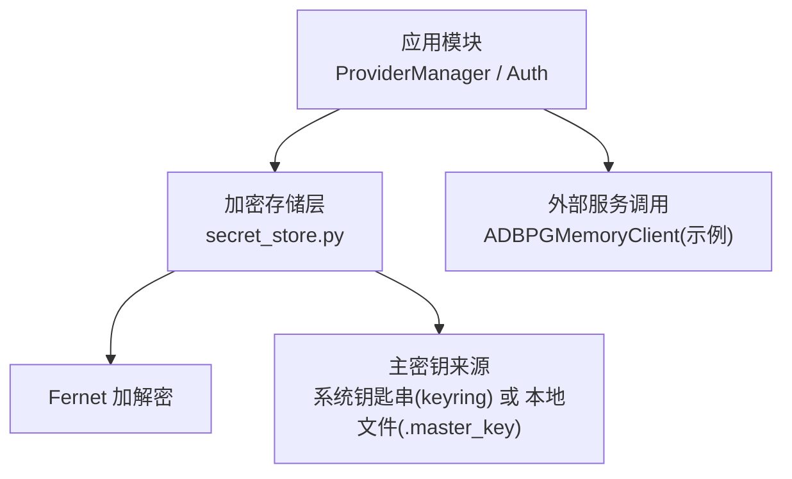
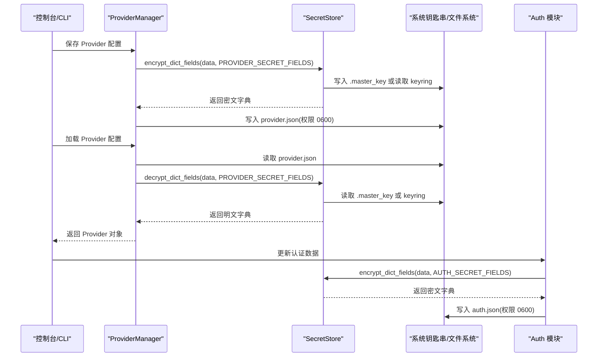
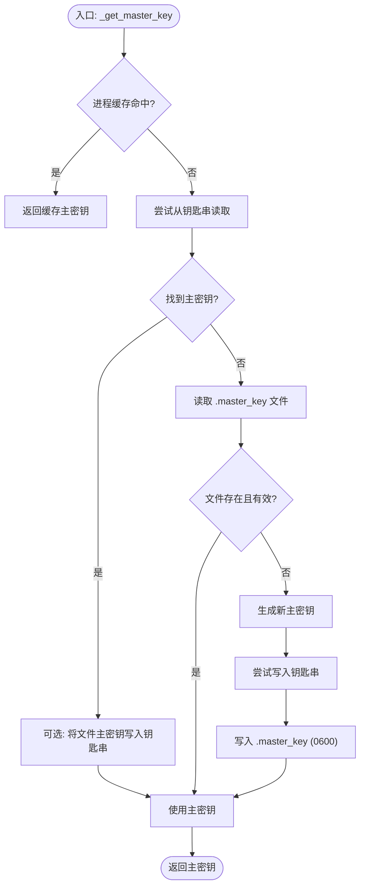
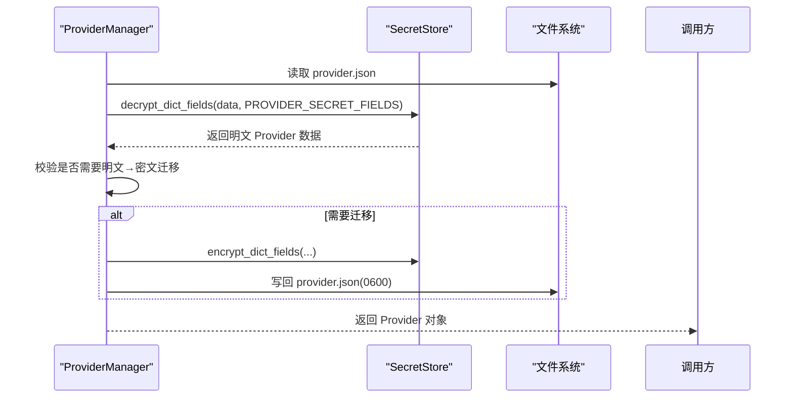
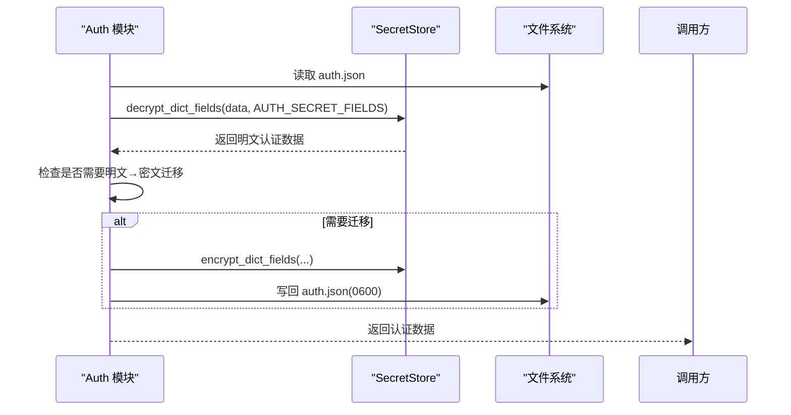
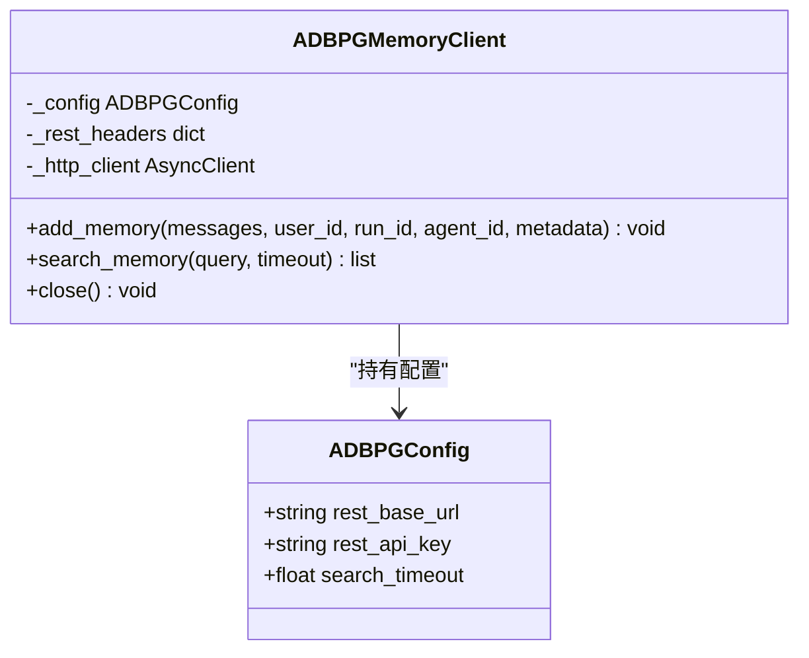
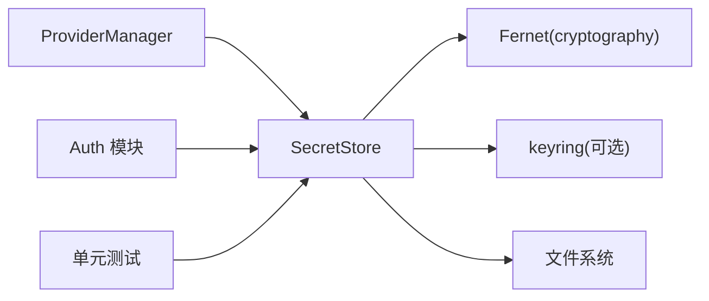

# 密钥存储方案

<cite>
**本文引用的文件**   
- [secret_store.py](file://src/qwenpaw/security/secret_store.py)
- [provider_manager.py](file://src/qwenpaw/providers/provider_manager.py)
- [auth.py](file://src/qwenpaw/app/auth.py)
- [adbpg_client.py](file://src/qwenpaw/agents/memory/adbpg_client.py)
- [test_secret_store.py](file://tests/unit/security/test_secret_store.py)
</cite>

## 目录
1. [简介](#简介)
2. [项目结构](#项目结构)
3. [核心组件](#核心组件)
4. [架构总览](#架构总览)
5. [详细组件分析](#详细组件分析)
6. [依赖关系分析](#依赖关系分析)
7. [性能与可用性](#性能与可用性)
8. [故障排查指南](#故障排查指南)
9. [结论](#结论)
10. [附录：平台适配与最佳实践](#附录平台适配与最佳实践)

## 简介
本方案为 QwenPaw 提供统一的“敏感信息加密存储层”，用于安全地持久化 API 密钥、令牌、证书路径等敏感数据。其核心目标包括：
- 使用 Fernet（AES-128-CBC + HMAC-SHA256）对敏感字段进行透明加解密
- 主密钥优先存放于操作系统钥匙串，不可用时回退到本地受限权限文件
- 在读取时自动识别并迁移明文旧值至密文格式
- 提供面向字典字段的批量加解密工具，供 Provider 配置与认证数据模块复用
- 支持备份恢复后的主密钥热重载，确保运行期缓存与系统钥匙串一致

该方案覆盖 API 密钥、数据库密码、证书文件路径等常见敏感类型，并通过严格的文件权限控制与降级策略保障可用性与安全性。

## 项目结构
围绕密钥存储的关键代码位于以下位置：
- 加密存储层：src/qwenpaw/security/secret_store.py
- Provider 配置读写（含 api_key 加密）：src/qwenpaw/providers/provider_manager.py
- 认证数据读写（含 jwt_secret 加密）：src/qwenpaw/app/auth.py
- 外部 REST 客户端示例（展示如何消费已解密的密钥）：src/qwenpaw/agents/memory/adbpg_client.py
- 单元测试（验证字典字段加解密行为）：tests/unit/security/test_secret_store.py

图表来源
- [secret_store.py:1-467](file://src/qwenpaw/security/secret_store.py#L1-L467)
- [provider_manager.py:1860-1975](file://src/qwenpaw/providers/provider_manager.py#L1860-L1975)
- [auth.py:230-260](file://src/qwenpaw/app/auth.py#L230-L260)
- [adbpg_client.py:1-138](file://src/qwenpaw/agents/memory/adbpg_client.py#L1-L138)

章节来源
- [secret_store.py:1-467](file://src/qwenpaw/security/secret_store.py#L1-L467)
- [provider_manager.py:1860-1975](file://src/qwenpaw/providers/provider_manager.py#L1860-L1975)
- [auth.py:230-260](file://src/qwenpaw/app/auth.py#L230-L260)
- [adbpg_client.py:1-138](file://src/qwenpaw/agents/memory/adbpg_client.py#L1-L138)

## 核心组件
- 主密钥管理
  - 优先级：进程内缓存 → 系统钥匙串 → 本地文件 → 生成新密钥并写入
  - 线程安全：双检锁保证并发安全
  - 超时保护：对 keyring 访问设置超时，避免在无桌面环境的 Linux 上阻塞
  - 兼容处理：支持从旧 CoPaw 钥匙串项迁移；支持按安装目录派生独立账户名，避免多实例冲突
- Fernet 加解密
  - 以主密钥前 32 字节构造 Fernet Key
  - 密文带 ENC: 前缀，便于识别与迁移
  - 解密失败时返回原始值，避免崩溃
- 字典字段批量加解密
  - encrypt_dict_fields / decrypt_dict_fields 针对指定字段集合操作
  - 提供 PROVIDER_SECRET_FIELDS 与 AUTH_SECRET_FIELDS 两类字段清单
- 备份恢复后热重载
  - reload_master_key_from_disk 清除进程缓存并同步钥匙串

章节来源
- [secret_store.py:85-322](file://src/qwenpaw/security/secret_store.py#L85-L322)
- [secret_store.py:324-375](file://src/qwenpaw/security/secret_store.py#L324-L375)
- [secret_store.py:429-467](file://src/qwenpaw/security/secret_store.py#L429-L467)
- [secret_store.py:382-423](file://src/qwenpaw/security/secret_store.py#L382-L423)

## 架构总览
下图展示了 Provider 配置与认证数据的完整生命周期：保存时加密、加载时解密、必要时触发明文→密文迁移。

图表来源
- [provider_manager.py:1860-1975](file://src/qwenpaw/providers/provider_manager.py#L1860-L1975)
- [auth.py:230-260](file://src/qwenpaw/app/auth.py#L230-L260)
- [secret_store.py:429-467](file://src/qwenpaw/security/secret_store.py#L429-L467)

## 详细组件分析

### 加密存储层（SecretStore）
- 主密钥获取流程
  - 进程缓存命中则直接返回
  - 否则尝试从系统钥匙串读取，若失败再读取本地 .master_key
  - 若均不存在则生成新主密钥，优先写入钥匙串，同时落盘文件
- 加解密接口
  - encrypt(value) → ENC:<base64-ciphertext>
  - decrypt(value) → 明文或原值（失败降级）
  - is_encrypted(value) → 是否密文
- 字典字段工具
  - encrypt_dict_fields(data, fields)
  - decrypt_dict_fields(data, fields)
- 备份恢复热重载
  - reload_master_key_from_disk() 清理缓存并同步钥匙串

图表来源
- [secret_store.py:287-322](file://src/qwenpaw/security/secret_store.py#L287-L322)
- [secret_store.py:244-285](file://src/qwenpaw/security/secret_store.py#L244-L285)
- [secret_store.py:168-242](file://src/qwenpaw/security/secret_store.py#L168-L242)

章节来源
- [secret_store.py:85-322](file://src/qwenpaw/security/secret_store.py#L85-L322)
- [secret_store.py:324-375](file://src/qwenpaw/security/secret_store.py#L324-L375)
- [secret_store.py:429-467](file://src/qwenpaw/security/secret_store.py#L429-L467)
- [secret_store.py:382-423](file://src/qwenpaw/security/secret_store.py#L382-L423)

### Provider 配置（ProviderManager）
- 保存时：对 PROVIDER_SECRET_FIELDS（如 api_key）执行加密后再落盘，并设置文件权限 0600
- 加载时：先检测是否存在明文字段需要迁移，再统一解密；若需迁移则在内存中重建 Provider 并延迟写回磁盘
- 插件 Provider 同样遵循相同加密策略

图表来源
- [provider_manager.py:1926-1975](file://src/qwenpaw/providers/provider_manager.py#L1926-L1975)
- [provider_manager.py:1860-1895](file://src/qwenpaw/providers/provider_manager.py#L1860-L1895)
- [secret_store.py:429-467](file://src/qwenpaw/security/secret_store.py#L429-L467)

章节来源
- [provider_manager.py:1860-1975](file://src/qwenpaw/providers/provider_manager.py#L1860-L1975)

### 认证数据（Auth 模块）
- 保存时：对 AUTH_SECRET_FIELDS（如 jwt_secret）执行加密后写入 auth.json，并设置 0600
- 加载时：先判断是否存在明文字段，再进行解密；如需迁移则延迟写回
- 支持环境变量自动注册管理员用户，并在首次启动时完成必要初始化

图表来源
- [auth.py:230-260](file://src/qwenpaw/app/auth.py#L230-L260)
- [secret_store.py:429-467](file://src/qwenpaw/security/secret_store.py#L429-L467)

章节来源
- [auth.py:230-260](file://src/qwenpaw/app/auth.py#L230-L260)

### 外部服务调用示例（ADBPGMemoryClient）
- 该客户端通过配置注入 rest_api_key，并在请求头中携带 Token
- 实际使用中，rest_api_key 应由上层从 Provider/环境/密钥存储层获取并解密后传入

图表来源
- [adbpg_client.py:1-138](file://src/qwenpaw/agents/memory/adbpg_client.py#L1-L138)

章节来源
- [adbpg_client.py:1-138](file://src/qwenpaw/agents/memory/adbpg_client.py#L1-L138)

## 依赖关系分析
- SecretStore 依赖
  - cryptography.fernet.Fernet：对称加密
  - keyring：系统钥匙串（可选，受环境与超时保护）
  - os/pathlib：文件 I/O 与权限设置
- 上层模块依赖
  - ProviderManager：通过 encrypt_dict_fields/decrypt_dict_fields 与 PROVIDER_SECRET_FIELDS 协作
  - Auth 模块：通过 encrypt_dict_fields/decrypt_dict_fields 与 AUTH_SECRET_FIELDS 协作
- 测试依赖
  - 单元测试验证字典字段加解密与容错行为

图表来源
- [secret_store.py:1-467](file://src/qwenpaw/security/secret_store.py#L1-L467)
- [provider_manager.py:1860-1975](file://src/qwenpaw/providers/provider_manager.py#L1860-L1975)
- [auth.py:230-260](file://src/qwenpaw/app/auth.py#L230-L260)
- [test_secret_store.py:61-73](file://tests/unit/security/test_secret_store.py#L61-L73)

章节来源
- [secret_store.py:1-467](file://src/qwenpaw/security/secret_store.py#L1-L467)
- [provider_manager.py:1860-1975](file://src/qwenpaw/providers/provider_manager.py#L1860-L1975)
- [auth.py:230-260](file://src/qwenpaw/app/auth.py#L230-L260)
- [test_secret_store.py:61-73](file://tests/unit/security/test_secret_store.py#L61-L73)

## 性能与可用性
- 主密钥缓存：进程级缓存避免重复 IO 与加解密开销
- 线程安全：双检锁确保并发场景下仅一次生成/加载
- 钥匙串超时：daemon 线程+超时机制防止无桌面环境下阻塞
- 降级策略：解密失败返回原值，避免业务中断
- 文件权限：敏感文件默认 0600，降低泄露风险

[本节为通用指导，不直接分析具体文件]

## 故障排查指南
- 无法解密或提示主密钥变更
  - 可能原因：主密钥被替换、损坏或钥匙串不可用
  - 建议：确认 .master_key 文件完整性；在容器/CI 环境中禁用 keyring 并使用文件模式
- 备份恢复后仍使用旧密钥
  - 建议：调用 reload_master_key_from_disk 刷新进程缓存并同步钥匙串
- 明文字段未迁移
  - 现象：加载时检测到明文字段但未能写回
  - 建议：检查磁盘权限与日志中的“Deferred plaintext→encrypted migration”提示

章节来源
- [secret_store.py:355-375](file://src/qwenpaw/security/secret_store.py#L355-L375)
- [secret_store.py:382-423](file://src/qwenpaw/security/secret_store.py#L382-L423)
- [provider_manager.py:1944-1975](file://src/qwenpaw/providers/provider_manager.py#L1944-L1975)
- [auth.py:230-260](file://src/qwenpaw/app/auth.py#L230-L260)

## 结论
QwenPaw 的密钥存储方案通过“系统钥匙串优先 + 本地文件兜底”的主密钥管理、基于 Fernet 的透明加解密、以及面向字典字段的批量工具，实现了跨模块的一致性与可维护性。配合严格的文件权限、超时保护与降级策略，既保障了安全性，也兼顾了在不同部署环境下的可用性。

[本节为总结，不直接分析具体文件]

## 附录：平台适配与最佳实践
- Windows
  - 优先使用系统钥匙串（Windows Credential Manager），由 keyring 抽象
  - 若不可用，回退到 SECRET_DIR/.master_key，并确保文件权限最小化
- macOS
  - 优先使用系统钥匙串（macOS Keychain）
  - 注意多用户隔离，建议结合工作目录派生的钥匙串账户名避免冲突
- Linux
  - 无桌面环境或 CI 场景下，keyring 可能不可用或阻塞
  - 通过环境变量禁用 keyring 或使用容器专用模式，确保稳定回退到文件存储
- 容器与 CI
  - 推荐设置 QWENPAW_DISABLE_KEYRING 或 QWENPAW_RUNNING_IN_CONTAINER
  - 使用 QWENPAW_SECRET_DIR 指向只读挂载或临时目录，避免共享主密钥
- 备份与恢复
  - 恢复 .master_key 后务必调用 reload_master_key_from_disk
  - 定期轮换主密钥并重新加密所有敏感字段
- 审计与日志
  - 记录关键操作（如迁移、失败重试）但不输出敏感值
  - 对解密失败进行告警，以便及时定位主密钥问题

[本节为通用指导，不直接分析具体文件]