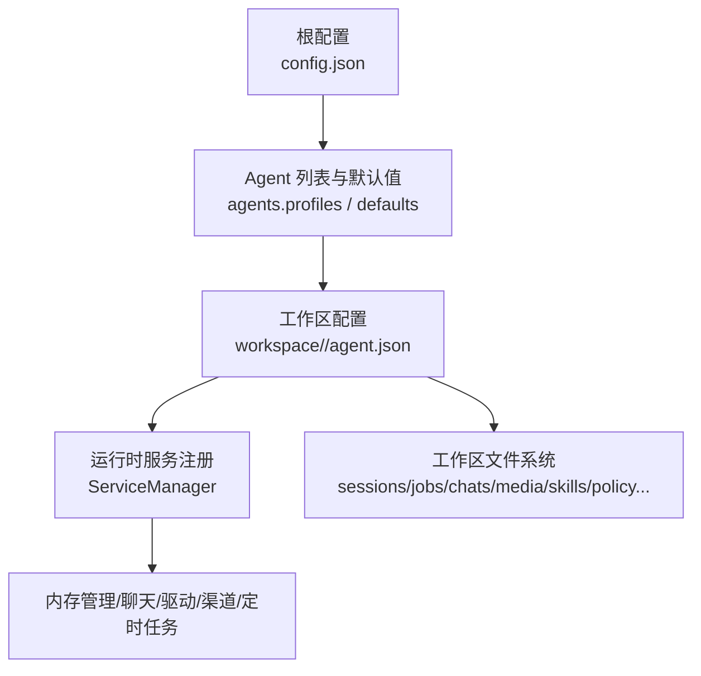
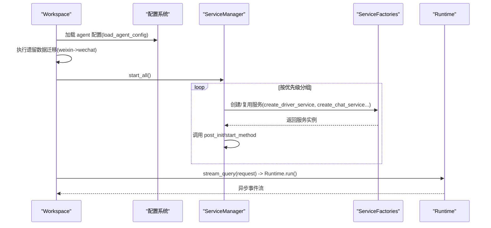
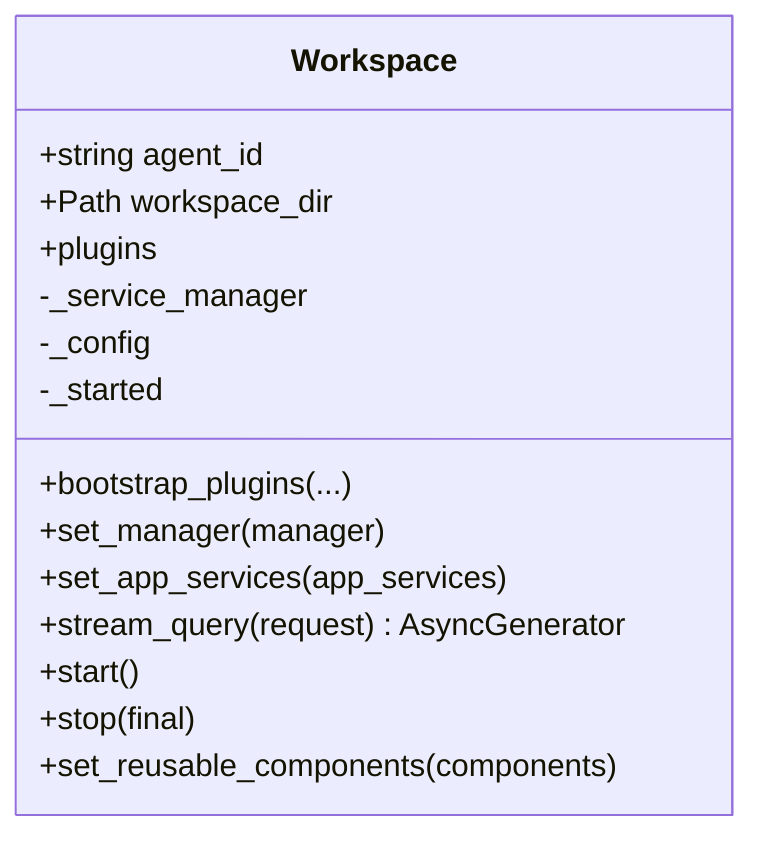
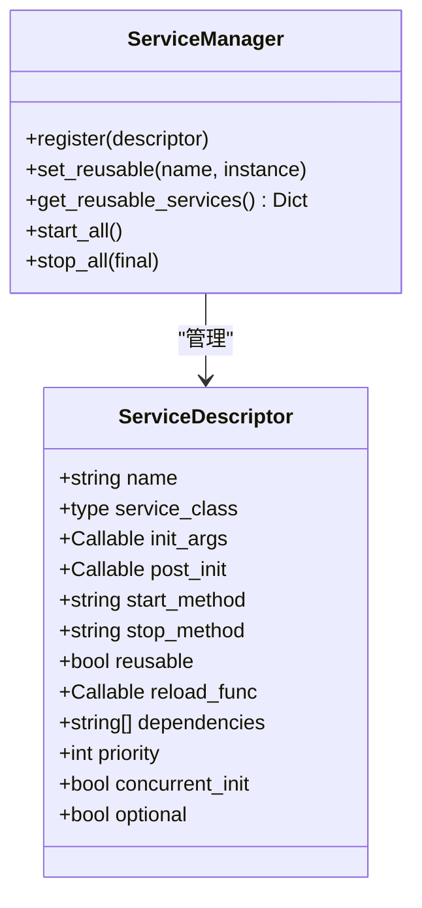
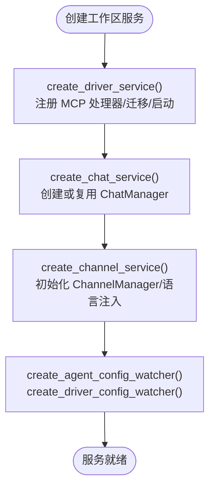
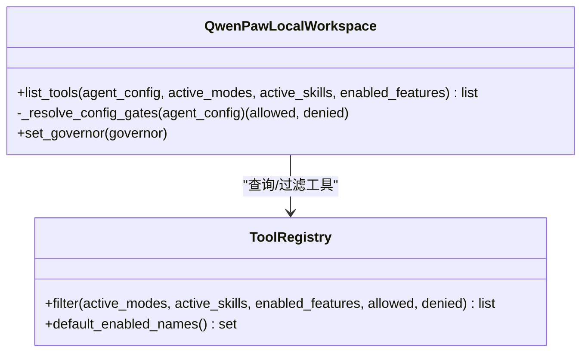
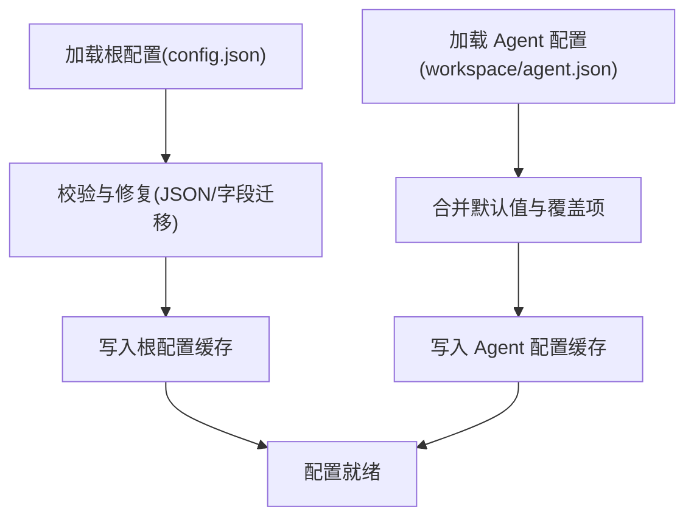
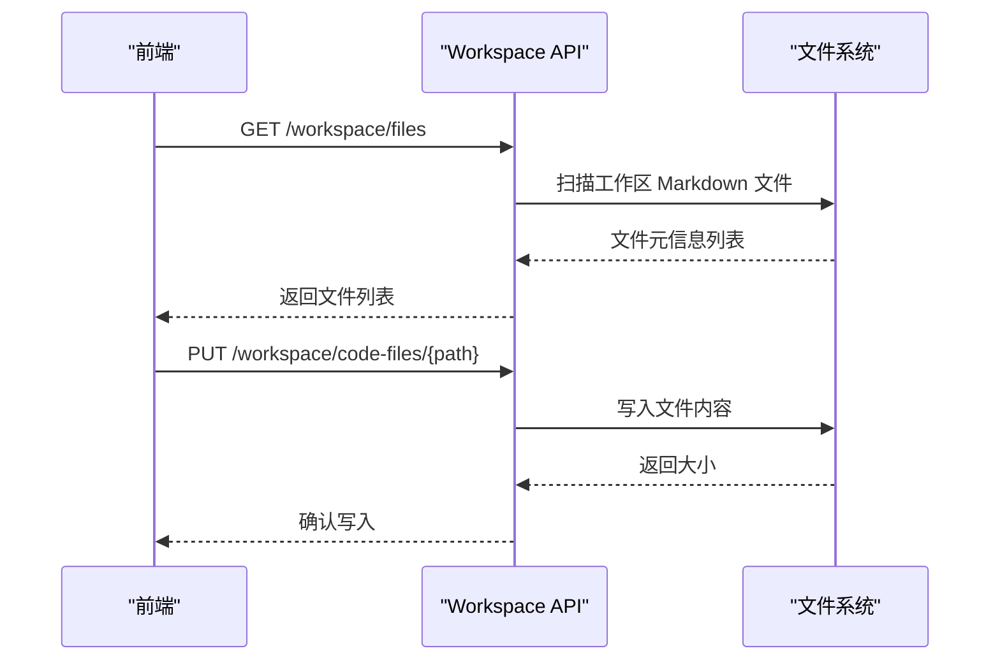
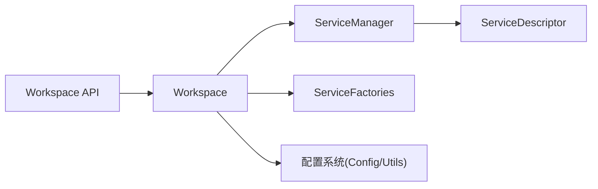

# 工作空间配置

<cite>
**本文引用的文件**   
- [src/qwenpaw/app/workspace/workspace.py](file://src/qwenpaw/app/workspace/workspace.py)
- [src/qwenpaw/app/workspace/service_manager.py](file://src/qwenpaw/app/workspace/service_manager.py)
- [src/qwenpaw/app/workspace/service_factories.py](file://src/qwenpaw/app/workspace/service_factories.py)
- [src/qwenpaw/app/workspace/local_workspace.py](file://src/qwenpaw/app/workspace/local_workspace.py)
- [src/qwenpaw/config/config.py](file://src/qwenpaw/config/config.py)
- [src/qwenpaw/config/utils.py](file://src/qwenpaw/config/utils.py)
- [src/qwenpaw/app/routers/workspace.py](file://src/qwenpaw/app/routers/workspace.py)
- [src/qwenpaw/services/workspace_manager/workspace_manager.py](file://src/qwenpaw/services/workspace_manager/workspace_manager.py)
- [src/qwenpaw/backup/models.py](file://src/qwenpaw/backup/models.py)
</cite>

## 目录
1. [简介](#简介)
2. [项目结构](#项目结构)
3. [核心组件](#核心组件)
4. [架构总览](#架构总览)
5. [详细组件分析](#详细组件分析)
6. [依赖关系分析](#依赖关系分析)
7. [性能与可扩展性](#性能与可扩展性)
8. [故障排查指南](#故障排查指南)
9. [结论](#结论)
10. [附录：最佳实践与示例](#附录最佳实践与示例)

## 简介
本文件系统化阐述 QwenPaw 的工作空间（Workspace）配置体系，覆盖多工作空间隔离、配置继承、资源分配与环境定制机制。文档从领域模型、实现细节、调用关系、接口到使用模式逐层展开，并提供面向开发环境、测试环境与生产环境的最佳实践建议。读者无需深入源码即可理解如何创建与管理多个工作空间，以及如何通过模板、默认值与个性化配置实现灵活的环境定制。

## 项目结构
QwenPaw 的工作空间配置围绕“根配置 + 工作区配置”的双层模型组织：
- 根配置（config.json）：全局设置，包含通道、MCP、工具、安全、ACP、插件、技能池路径等。
- 工作区配置（workspace/agent.json）：每个 Agent 的独立配置，包含运行参数、记忆后端、上下文压缩、工具开关、语言、模板等。

图表来源
- [src/qwenpaw/config/config.py:2128-2156](file://src/qwenpaw/config/config.py#L2128-L2156)
- [src/qwenpaw/config/config.py:1383-1420](file://src/qwenpaw/config/config.py#L1383-L1420)
- [src/qwenpaw/app/workspace/workspace.py:39-90](file://src/qwenpaw/app/workspace/workspace.py#L39-L90)

章节来源
- [src/qwenpaw/config/config.py:2128-2156](file://src/qwenpaw/config/config.py#L2128-L2156)
- [src/qwenpaw/config/config.py:1383-1420](file://src/qwenpaw/config/config.py#L1383-L1420)
- [src/qwenpaw/app/workspace/workspace.py:39-90](file://src/qwenpaw/app/workspace/workspace.py#L39-L90)

## 核心组件
- Workspace：封装一个完整的独立 Agent 运行时，负责加载配置、启动/停止服务、处理请求流。
- ServiceManager：统一管理服务生命周期（创建、启动、停止）、依赖顺序、并发初始化与复用。
- ServiceFactories：按声明式描述创建具体服务实例（如 DriverManager、ChatManager、ChannelManager）。
- LocalWorkspace：将工具清单路由到 QwenPaw 的 ToolRegistry，支持基于策略与上下文的过滤。
- 配置系统：根配置与工作区配置的加载、校验、迁移与缓存；Agent 配置合并与默认值继承。
- API 路由：提供工作区文件读写、编码模式文件浏览、SSE 变更监听、语言与音频配置等能力。
- 备份模型：定义备份范围（是否包含工作区、全局配置、密钥、技能池等）。

章节来源
- [src/qwenpaw/app/workspace/workspace.py:39-90](file://src/qwenpaw/app/workspace/workspace.py#L39-L90)
- [src/qwenpaw/app/workspace/service_manager.py:79-110](file://src/qwenpaw/app/workspace/service_manager.py#L79-L110)
- [src/qwenpaw/app/workspace/service_factories.py:18-59](file://src/qwenpaw/app/workspace/service_factories.py#L18-L59)
- [src/qwenpaw/app/workspace/local_workspace.py:28-85](file://src/qwenpaw/app/workspace/local_workspace.py#L28-L85)
- [src/qwenpaw/config/config.py:2128-2156](file://src/qwenpaw/config/config.py#L2128-L2156)
- [src/qwenpaw/app/routers/workspace.py:94-166](file://src/qwenpaw/app/routers/workspace.py#L94-L166)
- [src/qwenpaw/backup/models.py:16-32](file://src/qwenpaw/backup/models.py#L16-L32)

## 架构总览
下图展示工作空间在启动时的关键流程：加载配置、迁移数据、注册并启动服务、进入就绪状态。

图表来源
- [src/qwenpaw/app/workspace/workspace.py:459-500](file://src/qwenpaw/app/workspace/workspace.py#L459-L500)
- [src/qwenpaw/app/workspace/service_manager.py:176-217](file://src/qwenpaw/app/workspace/service_manager.py#L176-L217)
- [src/qwenpaw/app/workspace/service_factories.py:18-59](file://src/qwenpaw/app/workspace/service_factories.py#L18-L59)
- [src/qwenpaw/config/config.py:2302-2323](file://src/qwenpaw/config/config.py#L2302-L2323)

## 详细组件分析

### 工作空间（Workspace）
- 职责：维护 agent_id 与 workspace_dir；持有插件注册表；通过 ServiceManager 管理内存、聊天、驱动、渠道、定时任务等服务；对外暴露 stream_query 作为请求入口。
- 启动流程：加载 agent 配置 → 执行遗留数据迁移 → 启动所有服务 → 标记已启动。
- 停止流程：按优先级逆序停止服务，支持最终清理与非最终清理（热重载场景）。
- 可复用组件：支持 set_reusable_components 将旧实例中的可复用服务注入到新实例，减少重启开销。

图表来源
- [src/qwenpaw/app/workspace/workspace.py:39-90](file://src/qwenpaw/app/workspace/workspace.py#L39-L90)
- [src/qwenpaw/app/workspace/workspace.py:459-500](file://src/qwenpaw/app/workspace/workspace.py#L459-L500)
- [src/qwenpaw/app/workspace/workspace.py:427-458](file://src/qwenpaw/app/workspace/workspace.py#L427-L458)

章节来源
- [src/qwenpaw/app/workspace/workspace.py:39-90](file://src/qwenpaw/app/workspace/workspace.py#L39-L90)
- [src/qwenpaw/app/workspace/workspace.py:459-500](file://src/qwenpaw/app/workspace/workspace.py#L459-L500)
- [src/qwenpaw/app/workspace/workspace.py:427-458](file://src/qwenpaw/app/workspace/workspace.py#L427-L458)

### 服务管理器（ServiceManager）
- 职责：统一管理服务的注册、生命周期、依赖解析、并发启动与复用。
- 关键特性：
  - 按 priority 分组，组内可按 concurrent_init 并行或串行启动。
  - 支持 reusable 服务跨实例复用，配合 reload_func 进行热更新。
  - optional 服务失败不阻断工作空间启动，仅记录警告。
  - stop_all 支持 final 标志以决定是否关闭可复用服务。

图表来源
- [src/qwenpaw/app/workspace/service_manager.py:32-77](file://src/qwenpaw/app/workspace/service_manager.py#L32-L77)
- [src/qwenpaw/app/workspace/service_manager.py:79-110](file://src/qwenpaw/app/workspace/service_manager.py#L79-L110)
- [src/qwenpaw/app/workspace/service_manager.py:176-217](file://src/qwenpaw/app/workspace/service_manager.py#L176-L217)
- [src/qwenpaw/app/workspace/service_manager.py:372-463](file://src/qwenpaw/app/workspace/service_manager.py#L372-L463)

章节来源
- [src/qwenpaw/app/workspace/service_manager.py:32-77](file://src/qwenpaw/app/workspace/service_manager.py#L32-L77)
- [src/qwenpaw/app/workspace/service_manager.py:176-217](file://src/qwenpaw/app/workspace/service_manager.py#L176-L217)
- [src/qwenpaw/app/workspace/service_manager.py:372-463](file://src/qwenpaw/app/workspace/service_manager.py#L372-L463)

### 服务工厂（ServiceFactories）
- 职责：为特定服务提供创建与初始化逻辑，便于测试与解耦。
- 典型服务：
  - Driver 服务：创建 DriverManager，注册 MCP 处理器，迁移旧配置，启动外部能力运行时。
  - Chat 服务：创建或复用 ChatManager，持久化 chats.json。
  - Channel 服务：根据配置创建 ChannelManager，绑定 last_dispatch 回调，注入语言设置。
  - 配置监听器：AgentConfigWatcher 与 DriverConfigWatcher，用于自动重载。

图表来源
- [src/qwenpaw/app/workspace/service_factories.py:18-59](file://src/qwenpaw/app/workspace/service_factories.py#L18-L59)
- [src/qwenpaw/app/workspace/service_factories.py:85-106](file://src/qwenpaw/app/workspace/service_factories.py#L85-L106)
- [src/qwenpaw/app/workspace/service_factories.py:108-153](file://src/qwenpaw/app/workspace/service_factories.py#L108-L153)
- [src/qwenpaw/app/workspace/service_factories.py:156-189](file://src/qwenpaw/app/workspace/service_factories.py#L156-L189)

章节来源
- [src/qwenpaw/app/workspace/service_factories.py:18-59](file://src/qwenpaw/app/workspace/service_factories.py#L18-L59)
- [src/qwenpaw/app/workspace/service_factories.py:85-106](file://src/qwenpaw/app/workspace/service_factories.py#L85-L106)
- [src/qwenpaw/app/workspace/service_factories.py:108-153](file://src/qwenpaw/app/workspace/service_factories.py#L108-L153)
- [src/qwenpaw/app/workspace/service_factories.py:156-189](file://src/qwenpaw/app/workspace/service_factories.py#L156-L189)

### 本地工作区与工具治理（LocalWorkspace）
- 职责：将工具清单路由到 QwenPaw 的 ToolRegistry，支持基于模式、技能、功能开关与策略门控的四维过滤。
- 策略集成：通过 PolicyGuardedTool 包装工具函数，结合 ResourceGovernor 进行权限与资源限制。

图表来源
- [src/qwenpaw/app/workspace/local_workspace.py:28-85](file://src/qwenpaw/app/workspace/local_workspace.py#L28-L85)
- [src/qwenpaw/app/workspace/local_workspace.py:89-117](file://src/qwenpaw/app/workspace/local_workspace.py#L89-L117)

章节来源
- [src/qwenpaw/app/workspace/local_workspace.py:28-85](file://src/qwenpaw/app/workspace/local_workspace.py#L28-L85)
- [src/qwenpaw/app/workspace/local_workspace.py:89-117](file://src/qwenpaw/app/workspace/local_workspace.py#L89-L117)

### 配置系统与继承机制
- 根配置（Config）：集中管理 channels、mcp、tools、security、acp、plugins、skill_paths 等。
- Agent 配置（AgentProfileConfig）：存储于 workspace/agent.json，包含 id、name、description、workspace_dir、template_id、language、running、memory、context_compact、tool_result_pruning、heartbeat 等。
- 加载与缓存：load_config 与 load_agent_config 均使用 mtime 缓存避免频繁磁盘 IO；支持 JSON 修复与字段迁移。
- 默认值与继承：
  - 根配置提供全局默认值。
  - Agent 配置可覆盖默认值；未显式设置的字段回退到默认。
  - 历史键迁移（如 weixin→wechat、dm_policy/group_policy/allow_from 迁移至访问控制存储）。

图表来源
- [src/qwenpaw/config/utils.py:616-655](file://src/qwenpaw/config/utils.py#L616-L655)
- [src/qwenpaw/config/config.py:2128-2156](file://src/qwenpaw/config/config.py#L2128-L2156)
- [src/qwenpaw/config/config.py:2302-2323](file://src/qwenpaw/config/config.py#L2302-L2323)

章节来源
- [src/qwenpaw/config/utils.py:616-655](file://src/qwenpaw/config/utils.py#L616-L655)
- [src/qwenpaw/config/config.py:2128-2156](file://src/qwenpaw/config/config.py#L2128-L2156)
- [src/qwenpaw/config/config.py:2302-2323](file://src/qwenpaw/config/config.py#L2302-L2323)

### API 与文件操作
- 工作区文件管理：列出/读取/写入工作区 Markdown 文件。
- 编码模式文件树：递归列举非隐藏文件，支持二进制预览与文本读取（含 ETag 优化）。
- SSE 文件变更监听：实时推送文件增删改事件。
- 语言与音频配置：获取/更新 Agent 语言、音频处理模式、转录提供者类型与可用性检查。

图表来源
- [src/qwenpaw/app/routers/workspace.py:94-166](file://src/qwenpaw/app/routers/workspace.py#L94-L166)
- [src/qwenpaw/app/routers/workspace.py:242-254](file://src/qwenpaw/app/routers/workspace.py#L242-L254)
- [src/qwenpaw/app/routers/workspace.py:336-387](file://src/qwenpaw/app/routers/workspace.py#L336-L387)
- [src/qwenpaw/app/routers/workspace.py:423-506](file://src/qwenpaw/app/routers/workspace.py#L423-L506)

章节来源
- [src/qwenpaw/app/routers/workspace.py:94-166](file://src/qwenpaw/app/routers/workspace.py#L94-L166)
- [src/qwenpaw/app/routers/workspace.py:242-254](file://src/qwenpaw/app/routers/workspace.py#L242-L254)
- [src/qwenpaw/app/routers/workspace.py:336-387](file://src/qwenpaw/app/routers/workspace.py#L336-L387)
- [src/qwenpaw/app/routers/workspace.py:423-506](file://src/qwenpaw/app/routers/workspace.py#L423-L506)

### 资源边界与沙箱（WorkspaceManager 接口）
- 职责：定义工作空间资源管理器的生命周期契约（start/stop），由具体实现负责工作目录准备、路径校验与沙箱初始化。
- 工具权限：工具通过 requires_sandbox 声明需求，GuardedFunctionTool.check_permissions 在执行前调用沙箱检查。

章节来源
- [src/qwenpaw/services/workspace_manager/workspace_manager.py:24-59](file://src/qwenpaw/services/workspace_manager/workspace_manager.py#L24-L59)

## 依赖关系分析
- Workspace 依赖 ServiceManager 与 ServiceFactories 完成服务装配。
- ServiceManager 依赖 ServiceDescriptor 声明式配置，支持可选服务与并发启动。
- 配置系统依赖 utils 提供的缓存、修复与迁移能力。
- API 路由依赖 get_agent_for_request 获取当前工作空间上下文。

图表来源
- [src/qwenpaw/app/workspace/workspace.py:39-90](file://src/qwenpaw/app/workspace/workspace.py#L39-L90)
- [src/qwenpaw/app/workspace/service_manager.py:32-77](file://src/qwenpaw/app/workspace/service_manager.py#L32-L77)
- [src/qwenpaw/app/workspace/service_factories.py:18-59](file://src/qwenpaw/app/workspace/service_factories.py#L18-L59)
- [src/qwenpaw/config/utils.py:616-655](file://src/qwenpaw/config/utils.py#L616-L655)
- [src/qwenpaw/app/routers/workspace.py:94-166](file://src/qwenpaw/app/routers/workspace.py#L94-L166)

章节来源
- [src/qwenpaw/app/workspace/workspace.py:39-90](file://src/qwenpaw/app/workspace/workspace.py#L39-L90)
- [src/qwenpaw/app/workspace/service_manager.py:32-77](file://src/qwenpaw/app/workspace/service_manager.py#L32-L77)
- [src/qwenpaw/app/workspace/service_factories.py:18-59](file://src/qwenpaw/app/workspace/service_factories.py#L18-L59)
- [src/qwenpaw/config/utils.py:616-655](file://src/qwenpaw/config/utils.py#L616-L655)
- [src/qwenpaw/app/routers/workspace.py:94-166](file://src/qwenpaw/app/routers/workspace.py#L94-L166)

## 性能与可扩展性
- 配置缓存：根配置与 Agent 配置均采用 mtime 缓存，减少磁盘 IO。
- 并发启动：ServiceManager 对同优先级且允许的服务并发初始化，缩短启动时间。
- 可复用服务：支持跨实例复用 memory_manager、chat_manager 等，降低热重载成本。
- 可选服务：optional 服务失败不阻塞工作空间启动，提升鲁棒性。
- 文件 I/O 优化：代码文件读取使用 ETag 与 304 Not Modified 短路；大文件限制防止浏览器过载。

[本节为通用指导，不直接分析具体文件]

## 故障排查指南
- 配置不可用：utils 会尝试 json_repair 修复，若仍失败则备份原文件并回退默认配置。
- 字段迁移：legacy 键（如 weixin→wechat、dm_policy/group_policy/allow_from）会在加载时迁移，必要时生成备份文件。
- 服务启动失败：optional 服务失败仅记录警告；非可选服务失败会抛出异常并触发 stop 清理。
- 文件访问错误：API 路由对不存在或非文件路径返回 404；过大文件返回 413；二进制预览受 MIME 白名单限制。

章节来源
- [src/qwenpaw/config/utils.py:497-530](file://src/qwenpaw/config/utils.py#L497-L530)
- [src/qwenpaw/config/utils.py:532-576](file://src/qwenpaw/config/utils.py#L532-L576)
- [src/qwenpaw/app/workspace/service_manager.py:248-261](file://src/qwenpaw/app/workspace/service_manager.py#L248-L261)
- [src/qwenpaw/app/routers/workspace.py:336-387](file://src/qwenpaw/app/routers/workspace.py#L336-L387)
- [src/qwenpaw/app/routers/workspace.py:276-329](file://src/qwenpaw/app/routers/workspace.py#L276-L329)

## 结论
QwenPaw 的工作空间配置体系通过“根配置 + 工作区配置”的双层模型实现了清晰的多工作空间隔离与灵活的默认值继承。ServiceManager 的声明式服务管理与可复用机制显著提升了启动性能与热重载体验。API 路由提供了完善的工作区文件管理能力，配合 SSE 实时监听满足 IDE 级交互需求。结合策略治理与沙箱接口，系统在安全性与可控性方面具备良好扩展基础。

[本节为总结性内容，不直接分析具体文件]

## 附录：最佳实践与示例

### 多工作空间隔离
- 每个 Agent 拥有独立的 workspace_dir，包含 sessions、jobs、chats、media、skills、policy 等子目录，确保数据与运行时完全隔离。
- 通过 agents.profiles 定义多个 Agent，各自指向不同 workspace_dir，实现环境隔离（开发/测试/生产）。

章节来源
- [src/qwenpaw/config/config.py:2128-2156](file://src/qwenpaw/config/config.py#L2128-L2156)
- [src/qwenpaw/app/workspace/workspace.py:53-73](file://src/qwenpaw/app/workspace/workspace.py#L53-L73)

### 配置继承与模板
- 根配置提供全局默认值；Agent 配置可覆盖默认值。
- 使用 template_id 指定内置模板，创建 Agent 时复制对应 MD 文件到工作区。
- 语言切换接口支持重新复制目标语言的 MD 文件到工作区。

章节来源
- [src/qwenpaw/config/config.py:1383-1420](file://src/qwenpaw/config/config.py#L1383-L1420)
- [src/qwenpaw/app/routers/workspace.py:587-657](file://src/qwenpaw/app/routers/workspace.py#L587-L657)

### 资源分配与环境定制
- 通过 running.memory_manager_backend 选择记忆后端；context_compact 与 tool_result_pruning 控制上下文与工具结果压缩策略。
- heartbeat 与 dream_cron 配置定时任务；embedding_model_config 控制向量模型参数。
- skill_paths 添加只读技能池根路径，支持 ~ 展开与有序扫描。

章节来源
- [src/qwenpaw/config/config.py:729-800](file://src/qwenpaw/config/config.py#L729-L800)
- [src/qwenpaw/config/config.py:574-728](file://src/qwenpaw/config/config.py#L574-L728)
- [src/qwenpaw/config/config.py:2150-2156](file://src/qwenpaw/config/config.py#L2150-L2156)

### 资源共享、权限控制与数据隔离
- 工具通过 ToolRegistry 与 PolicyGuardedTool 进行权限与策略控制；ResourceGovernor 注入后生效。
- 沙箱接口（WorkspaceManager）定义资源边界检查契约，工具声明 requires_sandbox 以启用强隔离。
- 各工作区文件目录相互独立，避免数据交叉污染。

章节来源
- [src/qwenpaw/app/workspace/local_workspace.py:28-85](file://src/qwenpaw/app/workspace/local_workspace.py#L28-L85)
- [src/qwenpaw/services/workspace_manager/workspace_manager.py:24-59](file://src/qwenpaw/services/workspace_manager/workspace_manager.py#L24-L59)

### 工作空间的生命周期操作
- 创建：通过 CLI 或控制台创建 Agent，复制模板 MD 文件，初始化 skills 与 policy。
- 删除：移除 agents.profiles 中对应条目与 workspace_dir 目录。
- 迁移：利用备份模型定义范围（include_agents/include_global_config/include_secrets/include_skill_pool），按需打包/恢复。
- 备份：参考 backup/models.py 的 BackupScope 定义范围，结合编排逻辑执行。

章节来源
- [src/qwenpaw/backup/models.py:16-32](file://src/qwenpaw/backup/models.py#L16-L32)

### 不同场景下的最佳实践
- 开发环境：
  - 启用更多调试日志与可选服务；使用本地 Whisper 与宽松策略。
  - 开启 SSE 文件监听以提升 IDE 体验。
- 测试环境：
  - 固定模板与语言；禁用外部渠道或 Mock；严格策略与沙箱。
  - 使用最小化 skill_paths 与只读技能池。
- 生产环境：
  - 关闭非必要服务（optional=True）；启用严格的策略与沙箱。
  - 合理设置 context_compact 与 tool_result_pruning 阈值；限制上传文件大小。
  - 定期备份工作区与全局配置，保留密钥与技能池。

[本节为通用指导，不直接分析具体文件]