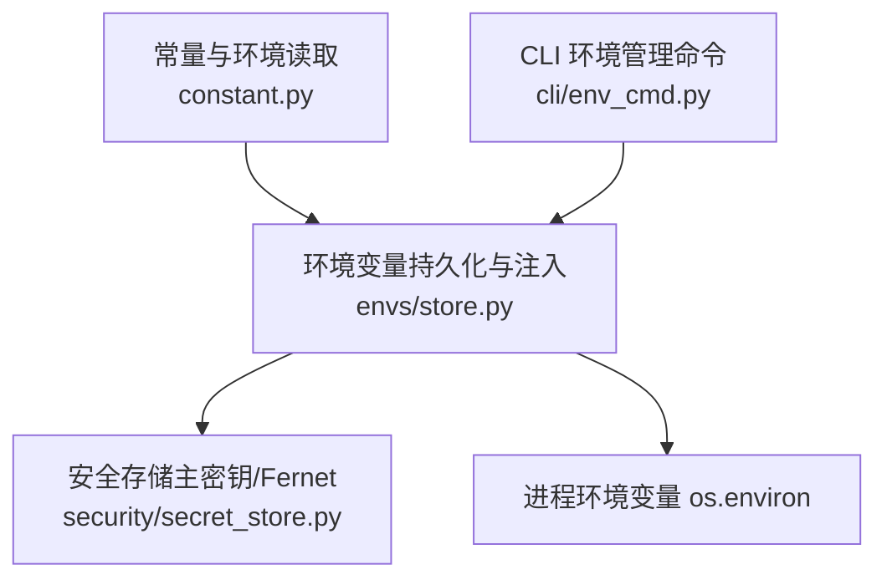
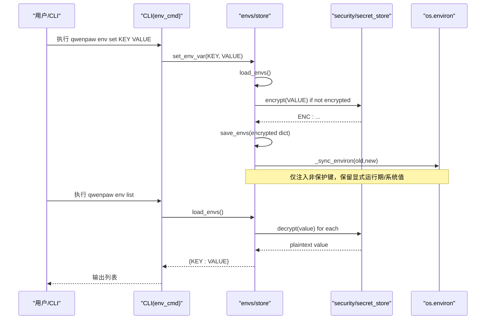
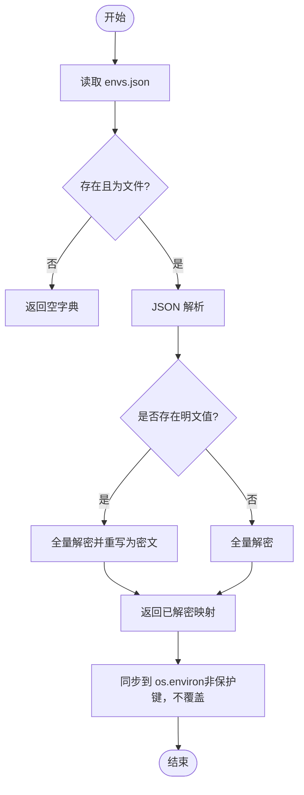
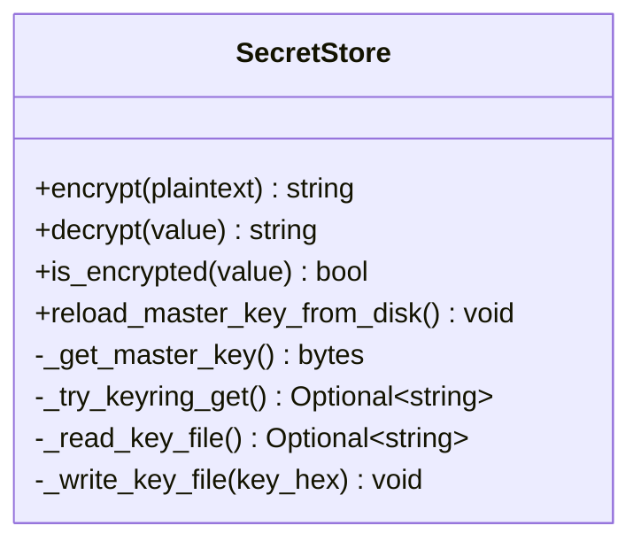
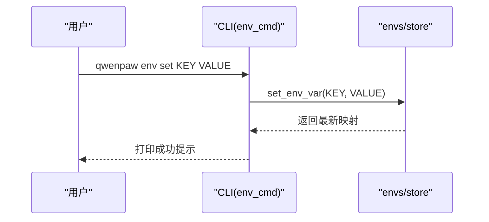
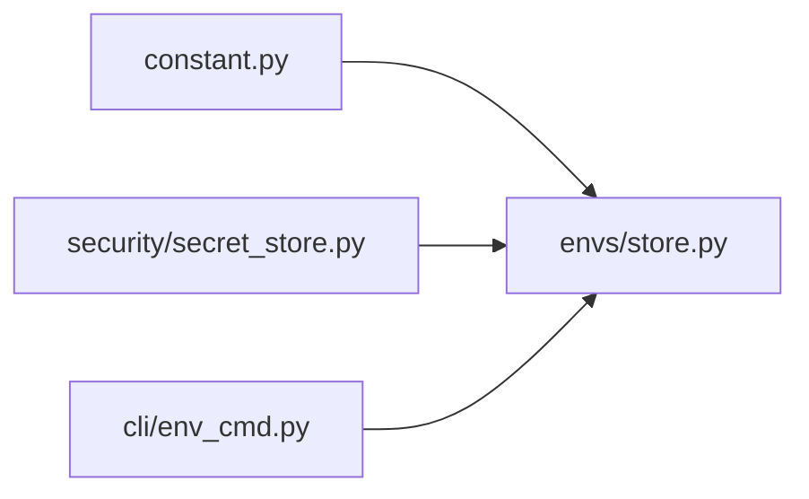

# 环境变量管理

<cite>
**本文引用的文件**   
- [src/qwenpaw/envs/__init__.py](file://src/qwenpaw/envs/__init__.py)
- [src/qwenpaw/envs/store.py](file://src/qwenpaw/envs/store.py)
- [src/qwenpaw/security/secret_store.py](file://src/qwenpaw/security/secret_store.py)
- [src/qwenpaw/constant.py](file://src/qwenpaw/constant.py)
- [src/qwenpaw/cli/env_cmd.py](file://src/qwenpaw/cli/env_cmd.py)
</cite>

## 目录
1. [简介](#简介)
2. [项目结构](#项目结构)
3. [核心组件](#核心组件)
4. [架构总览](#架构总览)
5. [详细组件分析](#详细组件分析)
6. [依赖关系分析](#依赖关系分析)
7. [性能与一致性考虑](#性能与一致性考虑)
8. [故障排查指南](#故障排查指南)
9. [结论](#结论)
10. [附录：关键环境变量清单与用法](#附录关键环境变量清单与用法)

## 简介
本文件系统性阐述 QwenPaw 的环境变量管理体系，包括命名规范、加载机制、优先级规则、动态更新策略、安全存储（加密与密钥管理）、冲突处理、格式校验与错误处理。文档同时提供调用关系图、数据流图与使用模式，帮助初学者快速上手，并为有经验的开发者提供足够的实现细节与优化建议。

## 项目结构
QwenPaw 的环境变量管理由以下模块协同完成：
- 常量与环境读取：负责 .env 预加载、通用读取工具、路径与默认值解析
- 持久化与运行时注入：负责 envs.json 的读写、加解密、进程内 os.environ 同步
- 安全存储：主密钥管理与 Fernet 加解密
- CLI 操作：提供 list/set/delete 等命令

**图表来源**
- [src/qwenpaw/constant.py:1-120](file://src/qwenpaw/constant.py#L1-L120)
- [src/qwenpaw/envs/store.py:1-120](file://src/qwenpaw/envs/store.py#L1-L120)
- [src/qwenpaw/security/secret_store.py:1-120](file://src/qwenpaw/security/secret_store.py#L1-L120)
- [src/qwenpaw/cli/env_cmd.py:1-60](file://src/qwenpaw/cli/env_cmd.py#L1-L60)

**章节来源**
- [src/qwenpaw/constant.py:1-120](file://src/qwenpaw/constant.py#L1-L120)
- [src/qwenpaw/envs/store.py:1-120](file://src/qwenpaw/envs/store.py#L1-L120)
- [src/qwenpaw/security/secret_store.py:1-120](file://src/qwenpaw/security/secret_store.py#L1-L120)
- [src/qwenpaw/cli/env_cmd.py:1-60](file://src/qwenpaw/cli/env_cmd.py#L1-L60)

## 核心组件
- 常量与环境读取（EnvVarLoader、_get_env、路径解析）
  - 支持从 .env 预加载；统一通过 EnvVarLoader.get_* 获取类型安全的值；兼容 COPAW_ 前缀的旧键名
  - 解析 WORKING_DIR、SECRET_DIR、BACKUP_DIR 等关键路径
- 环境变量持久化与注入（envs.store）
  - 以 SECRET_DIR/envs.json 为权威存储，启动时按需迁移旧位置
  - 写入时对明文值自动加密；读取时透明解密；将非保护键注入到 os.environ
  - 提供 set/delete/load/save 接口，并维护进程内 os.environ 的一致性
- 安全存储（security.secret_store）
  - 主密钥优先从系统钥匙串读取，回退到 SECRET_DIR/.master_key（权限 0o600）
  - 使用 Fernet（AES-128-CBC + HMAC-SHA256）对敏感字段进行加解密；带 ENC: 前缀标识
  - 提供 reload_master_key_from_disk 用于备份恢复后刷新缓存
- CLI 环境管理（cli.env_cmd）
  - 提供 qwenpaw env list/set/delete 子命令，便于交互式或脚本化管理

**章节来源**
- [src/qwenpaw/constant.py:1-120](file://src/qwenpaw/constant.py#L1-L120)
- [src/qwenpaw/envs/store.py:1-270](file://src/qwenpaw/envs/store.py#L1-L270)
- [src/qwenpaw/security/secret_store.py:1-467](file://src/qwenpaw/security/secret_store.py#L1-L467)
- [src/qwenpaw/cli/env_cmd.py:1-99](file://src/qwenpaw/cli/env_cmd.py#L1-L99)

## 架构总览
下图展示环境变量从磁盘到进程的完整生命周期，包括加密、迁移、注入与清理。

**图表来源**
- [src/qwenpaw/cli/env_cmd.py:1-99](file://src/qwenpaw/cli/env_cmd.py#L1-L99)
- [src/qwenpaw/envs/store.py:1-270](file://src/qwenpaw/envs/store.py#L1-L270)
- [src/qwenpaw/security/secret_store.py:1-467](file://src/qwenpaw/security/secret_store.py#L1-L467)

## 详细组件分析

### 组件一：常量与环境读取（constant.py）
- 功能要点
  - 在应用启动早期加载项目根目录 .env（若存在），使后续代码可直接通过 os.environ 访问
  - 提供 EnvVarLoader 工具类，封装 get_bool/get_int/get_float/get_str，支持边界检查与默认值
  - 兼容 COPAW_ 前缀的旧键名，降低迁移成本
  - 解析工作目录与密钥目录：WORKING_DIR、SECRET_DIR、BACKUP_DIR 等
- 关键行为
  - 当未显式设置 QWENPAW_WORKING_DIR 且存在 ~/.copaw 时，沿用旧路径以保证兼容性
  - SECRET_DIR 默认位于 WORKING_DIR 下的 .secret 子目录，可通过 QWENPAW_SECRET_DIR 覆盖
- 典型环境变量
  - QWENPAW_WORKING_DIR / COPAW_WORKING_DIR
  - QWENPAW_SECRET_DIR / COPAW_SECRET_DIR
  - QWENPAW_KEYRING_ACCOUNT（覆盖系统钥匙串账户）
  - QWENPAW_RUNNING_IN_CONTAINER（容器环境跳过钥匙串）
  - QWENPAW_OPENAPI_DOCS、QWENPAW_CORS_ORIGINS、QWENPAW_UPLOAD_MAX_SIZE_MB 等

**章节来源**
- [src/qwenpaw/constant.py:1-120](file://src/qwenpaw/constant.py#L1-L120)
- [src/qwenpaw/constant.py:220-360](file://src/qwenpaw/constant.py#L220-L360)

### 组件二：环境变量持久化与注入（envs/store.py）
- 存储位置与迁移
  - 权威存储：SECRET_DIR/envs.json
  - 首次加载时尝试从历史位置迁移（包内同级 envs.json 或 WORKING_DIR/envs.json）
- 加载流程（load_envs）
  - 读取 JSON → 识别明文值 → 全量解密 → 如存在明文则重写为密文
- 保存流程（save_envs）
  - 合并旧值与新值 → 对明文值加密 → 原子写入 → 调整权限（best-effort）→ 同步到 os.environ
- 进程内同步（_sync_environ/_apply_to_environ）
  - 删除不再存在的键（仅在当前进程值与旧值一致时移除）
  - 注入新值；支持 overwrite 控制是否覆盖现有进程值
- 启动注入（load_envs_into_environ）
  - 在恢复锁保护下清理残留工件
  - 加载 envs.json 并过滤“受保护的引导键”（如 QWENPAW_WORKING_DIR、QWENPAW_SECRET_DIR）
  - 以不覆盖方式注入到 os.environ，确保显式运行期/系统值优先
- 单键操作
  - set_env_var / delete_env_var：读-改-写-同步

**图表来源**
- [src/qwenpaw/envs/store.py:140-220](file://src/qwenpaw/envs/store.py#L140-L220)
- [src/qwenpaw/envs/store.py:240-270](file://src/qwenpaw/envs/store.py#L240-L270)

**章节来源**
- [src/qwenpaw/envs/store.py:1-270](file://src/qwenpaw/envs/store.py#L1-L270)

### 组件三：安全存储（security/secret_store.py）
- 主密钥管理
  - 优先从系统钥匙串读取（keyring），失败回退到 SECRET_DIR/.master_key（权限 0o600）
  - 支持 QWENPAW_DISABLE_KEYRING、QWENPAW_RUNNING_IN_CONTAINER 等开关避免阻塞
  - 支持 QWENPAW_KEYRING_ACCOUNT 指定钥匙串账户，避免多安装实例互相覆盖
- 加解密
  - 使用 Fernet（基于 AES-128-CBC + HMAC-SHA256）
  - 密文以 ENC: 前缀标识；解密失败时返回原始密文以便降级
- 辅助方法
  - encrypt_dict_fields / decrypt_dict_fields：批量处理字典中的敏感字段
  - reload_master_key_from_disk：备份恢复后刷新内存缓存并同步钥匙串

**图表来源**
- [src/qwenpaw/security/secret_store.py:1-467](file://src/qwenpaw/security/secret_store.py#L1-L467)

**章节来源**
- [src/qwenpaw/security/secret_store.py:1-467](file://src/qwenpaw/security/secret_store.py#L1-L467)

### 组件四：CLI 环境管理（cli/env_cmd.py）
- 命令
  - qwenpaw env list：列出所有配置的环境变量（来自 envs.json）
  - qwenpaw env set KEY VALUE：设置单个环境变量（自动加密并同步）
  - qwenpaw env delete KEY：删除单个环境变量（不存在时报错退出）
- 交互模式
  - configure_env_interactive：交互式添加/编辑变量，适合初始化阶段

**图表来源**
- [src/qwenpaw/cli/env_cmd.py:1-99](file://src/qwenpaw/cli/env_cmd.py#L1-L99)
- [src/qwenpaw/envs/store.py:220-240](file://src/qwenpaw/envs/store.py#L220-L240)

**章节来源**
- [src/qwenpaw/cli/env_cmd.py:1-99](file://src/qwenpaw/cli/env_cmd.py#L1-L99)

## 依赖关系分析
- constant.py 被 envs/store.py 和 security/secret_store.py 共同依赖，用于解析路径与基础环境变量
- envs/store.py 依赖 security/secret_store.py 进行加解密
- cli/env_cmd.py 依赖 envs/store.py 暴露命令行能力

**图表来源**
- [src/qwenpaw/constant.py:1-120](file://src/qwenpaw/constant.py#L1-L120)
- [src/qwenpaw/envs/store.py:1-60](file://src/qwenpaw/envs/store.py#L1-L60)
- [src/qwenpaw/security/secret_store.py:1-60](file://src/qwenpaw/security/secret_store.py#L1-L60)
- [src/qwenpaw/cli/env_cmd.py:1-30](file://src/qwenpaw/cli/env_cmd.py#L1-L30)

**章节来源**
- [src/qwenpaw/constant.py:1-120](file://src/qwenpaw/constant.py#L1-L120)
- [src/qwenpaw/envs/store.py:1-60](file://src/qwenpaw/envs/store.py#L1-L60)
- [src/qwenpaw/security/secret_store.py:1-60](file://src/qwenpaw/security/secret_store.py#L1-L60)
- [src/qwenpaw/cli/env_cmd.py:1-30](file://src/qwenpaw/cli/env_cmd.py#L1-L30)

## 性能与一致性考虑
- 启动阶段一次性加载并注入，避免重复 I/O
- 写入时先计算差异再同步 os.environ，减少不必要的变更
- 主密钥与 Fernet 实例采用进程内缓存，避免频繁 IO 与加解密开销
- 钥匙串访问具备超时保护，避免在无桌面环境的系统中阻塞
- 文件权限 best-effort 设置，提升安全性且不破坏跨平台兼容性

[本节为通用指导，无需具体文件引用]

## 故障排查指南
- 无法解密或提示主密钥变更
  - 现象：解密失败日志，返回原始密文字符串
  - 排查：确认 SECRET_DIR/.master_key 未被替换或损坏；必要时调用 reload_master_key_from_disk 刷新缓存
- 钥匙串不可用或超时
  - 现象：keyring 访问超时或异常
  - 排查：设置 QWENPAW_DISABLE_KEYRING=1 或 QWENPAW_RUNNING_IN_CONTAINER=1 强制回退到文件存储
- 环境变量未生效
  - 现象：进程内 os.getenv 取不到预期值
  - 排查：确认该键是否为受保护键（如 QWENPAW_WORKING_DIR、QWENPAW_SECRET_DIR），这些键不会从 envs.json 注入；检查是否在启动后修改了 envs.json 但未重启进程
- 权限问题
  - 现象：写入 envs.json 失败
  - 排查：检查 SECRET_DIR 及父目录权限；确认文件系统支持 chmod

**章节来源**
- [src/qwenpaw/security/secret_store.py:350-423](file://src/qwenpaw/security/secret_store.py#L350-L423)
- [src/qwenpaw/envs/store.py:140-220](file://src/qwenpaw/envs/store.py#L140-L220)

## 结论
QwenPaw 的环境变量管理以“安全、可迁移、易运维”为目标，通过统一的常量读取层、加密持久化层与 CLI 工具，实现了从开发到生产的一致体验。其设计兼顾了向后兼容（COPAW_ 前缀、历史 envs.json 位置）、安全（主密钥与 Fernet 加密、权限控制）与可用性（启动注入、差异同步）。建议在部署中遵循命名规范与最佳实践，结合 CLI 与配置文件进行集中管理。

[本节为总结性内容，无需具体文件引用]

## 附录：关键环境变量清单与用法
- 路径与工作区
  - QWENPAW_WORKING_DIR / COPAW_WORKING_DIR：自定义工作目录（未设置时回退到 ~/.qwenpaw 或 ~/.copaw）
  - QWENPAW_SECRET_DIR / COPAW_SECRET_DIR：自定义密钥目录（默认 <WORKING_DIR>.secret）
  - QWENPAW_BACKUP_DIR：备份目录（默认 <WORKING_DIR>.backups）
- 安全与钥匙串
  - QWENPAW_KEYRING_ACCOUNT：覆盖系统钥匙串账户名，避免多实例冲突
  - QWENPAW_DISABLE_KEYRING：禁用钥匙串访问，强制文件存储
  - QWENPAW_RUNNING_IN_CONTAINER：容器环境标志，跳过钥匙串
- 服务与连接
  - QWENPAW_BASE_URL：后端 API 基地址（测试与集成常用）
  - QWENPAW_DASHSCOPE_API_KEY：DashScope API Key（示例：E2E 配置中使用）
  - QWENPAW_MODEL_PROVIDER / QWENPAW_DEFAULT_MODEL：模型提供者与默认模型（测试场景）
- 开发与调试
  - QWENPAW_OPENAPI_DOCS：是否启用 OpenAPI 文档（开发模式）
  - QWENPAW_LOG_LEVEL：日志级别
  - QWENPAW_DESKTOP_PORT：固定桌面后端端口
  - QWENPAW_HEADLESS：浏览器无头模式（测试）
  - QWENPAW_TIMEOUT：测试超时时间（秒）
  - PLAYWRIGHT_SLOW_MO：Playwright 慢动作（毫秒）
  - PLAYWRIGHT_CHROMIUM_EXECUTABLE_PATH：系统 Chromium 路径（Docker 等）
- 其他
  - QWENPAW_USER_ID、QWENPAW_CHANNEL：测试用例参数
  - QWENPAW_JOBS_FILE、QWENPAW_CHATS_FILE、QWENPAW_CONFIG_FILE、QWENPAW_HEARTBEAT_FILE、QWENPAW_TOKEN_USAGE_FILE、QWENPAW_DEBUG_HISTORY_FILE：各类文件路径覆盖

说明：
- 上述部分变量在 e2e 配置与测试中被直接读取，体现实际使用模式
- 对于敏感信息（如 API Key、令牌、连接字符串），请通过 CLI 或控制台设置，系统将自动加密存储于 SECRET_DIR/envs.json

**章节来源**
- [src/qwenpaw/constant.py:88-120](file://src/qwenpaw/constant.py#L88-L120)
- [src/qwenpaw/constant.py:220-360](file://src/qwenpaw/constant.py#L220-L360)
- [src/qwenpaw/envs/store.py:80-120](file://src/qwenpaw/envs/store.py#L80-L120)
- [src/qwenpaw/security/secret_store.py:1-120](file://src/qwenpaw/security/secret_store.py#L1-L120)