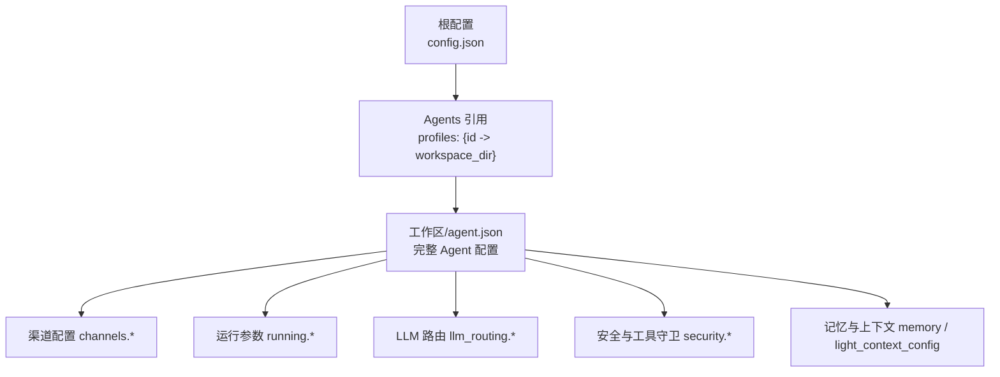
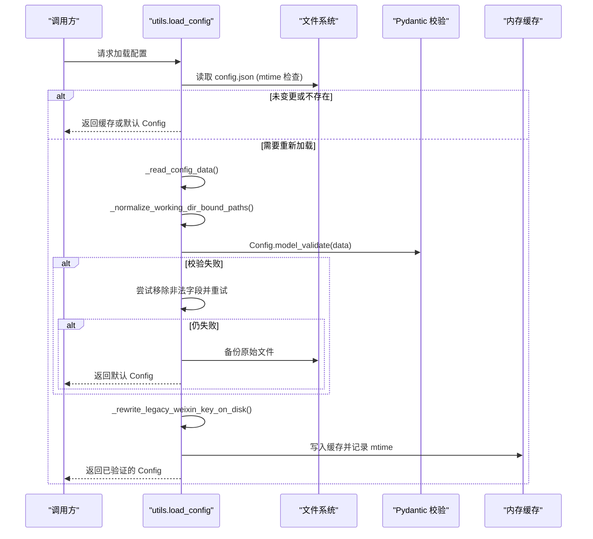
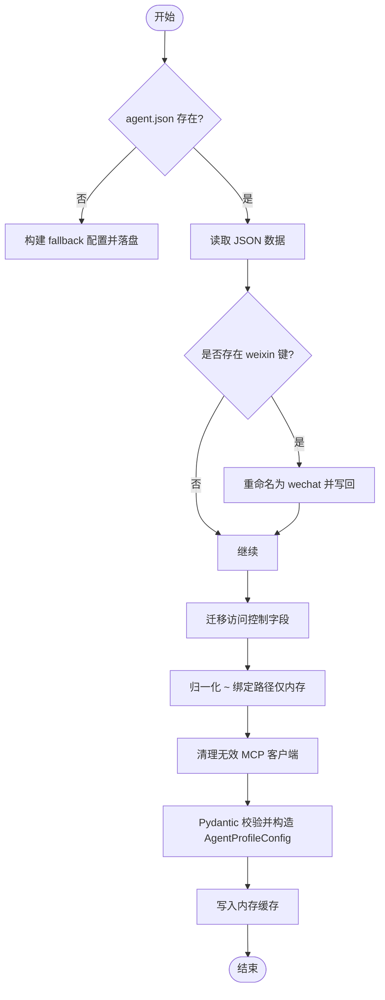
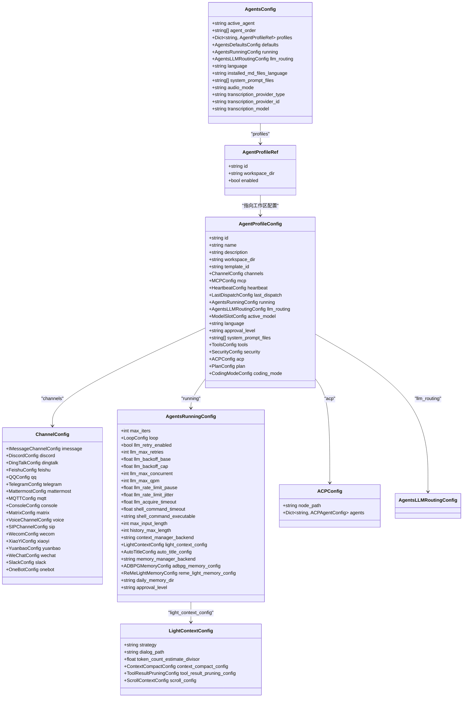

# 配置文件结构

<cite>
**本文引用的文件**
- [config.py](file://src/qwenpaw/config/config.py)
- [utils.py](file://src/qwenpaw/config/utils.py)
- [context.py](file://src/qwenpaw/config/context.py)
- [skills.zh.md](file://website/public/docs/skills.zh.md)
</cite>

## 目录
1. [简介](#简介)
2. [项目结构](#项目结构)
3. [核心组件](#核心组件)
4. [架构总览](#架构总览)
5. [详细组件分析](#详细组件分析)
6. [依赖关系分析](#依赖关系分析)
7. [性能考量](#性能考量)
8. [故障排查指南](#故障排查指南)
9. [结论](#结论)
10. [附录](#附录)

## 简介
本文件系统性梳理 QwenPaw 的配置文件结构与加载机制，重点覆盖：
- config.json 的顶层与子模块组织方式（Agent、渠道、模型路由、运行参数等）
- 默认值设置与字段校验策略
- 配置加载顺序、优先级与合并策略
- 常见配置错误及修复建议
- Agent 配置、渠道配置、模型配置等核心模块的结构设计

目标读者包括初次接触 QwenPaw 的用户与需要深入理解实现细节的开发者。

## 项目结构
QwenPaw 的配置体系由“根配置 + 工作区 Agent 配置”组成：
- 根配置：位于工作目录下的 config.json，描述全局行为、Agent 列表引用、默认运行参数、语言、音频转录等。
- Agent 配置：每个 Agent 的工作区目录下保存 agent.json，包含该 Agent 的完整配置（渠道、MCP、运行参数、安全级别、提示词文件等）。

图表来源
- [config.py:1470-1514](file://src/qwenpaw/config/config.py#L1470-L1514)
- [config.py:1383-1468](file://src/qwenpaw/config/config.py#L1383-L1468)

章节来源
- [config.py:1470-1514](file://src/qwenpaw/config/config.py#L1470-L1514)
- [config.py:1383-1468](file://src/qwenpaw/config/config.py#L1383-L1468)

## 核心组件
本节聚焦配置模型的关键模块与职责划分。

- 根配置入口与缓存
  - load_config：按 mtime 缓存读取 config.json；缺失时返回默认 Config。
  - save_config：持久化并失效缓存。
  - _load_and_validate_config：数据归一化、兼容迁移、Pydantic 校验、失败回退与备份。

- Agents 与 Agent 配置
  - AgentsConfig：维护 active_agent、agent_order、profiles 引用，以及全局默认（如 language、audio_mode、transcription_*）。
  - AgentProfileRef：仅保留 id、workspace_dir、enabled。
  - AgentProfileConfig：完整的 Agent 级配置（channels、mcp、heartbeat、running、llm_routing、active_model、language、approval_level、system_prompt_files、tools、security、acp、plan、coding_mode）。

- 渠道配置 ChannelConfig
  - 内置渠道集合：imessage、discord、dingtalk、feishu、qq、telegram、mattermost、mqtt、console、matrix、voice、sip、wecom、xiaoyi、yuanbao、wechat、slack、onebot。
  - 通用 BaseChannelConfig：开关、白名单/黑名单、是否要求 @mention、DM/群组策略、缓冲策略等。
  - 各渠道特有字段：鉴权凭据、代理、流式更新、媒体目录、会话共享策略等。

- 运行参数与上下文管理
  - AgentsRunningConfig：最大迭代次数、重试与退避、并发与 QPM、速率限制暂停与抖动、获取超时、Shell 命令超时与可执行路径、上下文窗口大小、历史输出长度、上下文后端选择、自动标题生成、记忆后端与 ReMeLight 配置、审批级别等。
  - LightContextConfig：上下文策略（native/scroll）、对话持久化路径、token 估算除数、压缩与裁剪策略、滚动上下文等。

- LLM 路由与槽位
  - AgentsLLMRoutingConfig：启用开关、模式（local_first/cloud_first）、本地槽位、云端槽位（可选）。
  - ModelSlotConfig：provider_id + model。

- ACP（Agent Communication Protocol）
  - ACPConfig：node_path、agents 字典（含默认内置 ACP Agent 合并逻辑）。

- 其他重要配置
  - HeartbeatConfig：心跳任务开关、周期、目标、超时、活跃时段。
  - AutoTitleConfig：异步聊天标题生成开关与超时。
  - LoopConfig/DoomLoopConfig/IterationGateConfig/RubricGateConfig：循环工程与安全门控。
  - ContextCompactConfig/ToolResultPruningConfig/ScrollContextConfig：上下文压缩、工具结果裁剪、滚动上下文存储与回放。

章节来源
- [utils.py:616-654](file://src/qwenpaw/config/utils.py#L616-L654)
- [utils.py:578-613](file://src/qwenpaw/config/utils.py#L578-L613)
- [config.py:1470-1514](file://src/qwenpaw/config/config.py#L1470-L1514)
- [config.py:1383-1468](file://src/qwenpaw/config/config.py#L1383-L1468)
- [config.py:197-518](file://src/qwenpaw/config/config.py#L197-L518)
- [config.py:1130-1310](file://src/qwenpaw/config/config.py#L1130-L1310)
- [config.py:1311-1334](file://src/qwenpaw/config/config.py#L1311-L1334)
- [config.py:109-124](file://src/qwenpaw/config/config.py#L109-L124)
- [config.py:549-572](file://src/qwenpaw/config/config.py#L549-L572)
- [config.py:957-987](file://src/qwenpaw/config/config.py#L957-L987)
- [config.py:1006-1128](file://src/qwenpaw/config/config.py#L1006-L1128)
- [config.py:729-915](file://src/qwenpaw/config/config.py#L729-L915)

## 架构总览
配置加载与验证的整体流程如下：

图表来源
- [utils.py:616-654](file://src/qwenpaw/config/utils.py#L616-L654)
- [utils.py:578-613](file://src/qwenpaw/config/utils.py#L578-L613)

章节来源
- [utils.py:616-654](file://src/qwenpaw/config/utils.py#L616-L654)
- [utils.py:578-613](file://src/qwenpaw/config/utils.py#L578-L613)

## 详细组件分析

### 根配置（config.json）
- 顶层关键字段（示例性说明，具体以模型定义为准）
  - agents：包含 active_agent、agent_order、profiles（ID 到工作区路径的映射），以及全局 defaults、running、llm_routing、language、installed_md_files_language、system_prompt_files、audio_mode、transcription_provider_type/id/model 等。
  - channels：内置渠道配置对象（见下节）。
  - last_api：上次 API 地址信息（兼容旧字段 last_api_host/port）。
  - skill_paths：外部技能根目录列表（用于将多个外部目录纳入同一技能池视图）。
- 加载与合并
  - 首次启动若缺少 config.json，返回默认 Config。
  - 支持 mtime 缓存，避免频繁磁盘 IO。
  - 对 legacy 字段进行一次性迁移（如 last_api_host/port → last_api；weixin → wechat）。

章节来源
- [config.py:1470-1514](file://src/qwenpaw/config/config.py#L1470-L1514)
- [utils.py:578-613](file://src/qwenpaw/config/utils.py#L578-L613)
- [skills.zh.md:120-143](file://website/public/docs/skills.zh.md#L120-L143)

### Agent 配置（workspace/agent.json）
- 加载流程
  - 通过 load_agent_config(agent_id) 从对应工作区的 agent.json 加载。
  - 若文件缺失，会构建 fallback 配置并落盘，供后续使用。
  - 支持 mtime 缓存，避免重复解析。
- 关键迁移与归一化
  - 一次性迁移：channels.weixin → channels.wechat。
  - 访问控制字段迁移（legacy ACL 字段规范化）。
  - 将旧版绑定路径（如 ~/.copaw）在当前 WORKING_DIR 下进行运行时归一化（不写回磁盘）。
  - MCP 客户端预校验：跳过无效条目，避免单个错误导致整个 Agent 无法加载。
- 保存流程
  - save_agent_config(agent_id, agent_config) 将配置序列化到 agent.json，并失效缓存。

图表来源
- [config.py:2302-2440](file://src/qwenpaw/config/config.py#L2302-L2440)
- [config.py:2443-2487](file://src/qwenpaw/config/config.py#L2443-L2487)

章节来源
- [config.py:2302-2440](file://src/qwenpaw/config/config.py#L2302-L2440)
- [config.py:2443-2487](file://src/qwenpaw/config/config.py#L2443-L2487)

### 渠道配置（channels.*）
- 通用字段（BaseChannelConfig）
  - enabled：是否启用该渠道。
  - bot_prefix：机器人前缀。
  - filter_tool_messages/filter_thinking：过滤工具消息与思考过程。
  - dm_policy/group_policy：私聊/群聊策略（open/allowlist）。
  - allow_from/deny_message：允许来源与拒绝消息。
  - require_mention：是否需要 @mention。
  - no_text_debounce：是否缓冲纯媒体消息直到文本到达再合并。
  - access_control_dm/access_control_group：是否开启访问控制。
  - dm_disabled/group_disabled：完全禁用 DM 或群组消息。
- 典型渠道特有字段（举例）
  - Discord：bot_token、http_proxy、streaming_enabled、media_dir。
  - DingTalk：client_id/client_secret、card_template_*、endpoint、streaming_enabled。
  - Feishu/Lark：app_id/app_secret、encrypt_key/verification_token、domain(feishu/lark)、share_session_in_group。
  - Telegram：bot_token、base_url、proxy、show_typing、streaming_enabled。
  - Matrix：homeserver/user_id/access_token、groups、encryption/vision/history_limit/password/device_name/sync_timeout_ms/mention_pill_in_body/outbound_structured_mentions/streaming_enabled。
  - WeCom：bot_id/secret/media_dir/welcome_text/share_session_in_group/max_reconnect_attempts/streaming_enabled。
  - Slack：bot_token/app_token/proxy/streaming_enabled/require_mention/media_dir/dm_policy/group_policy/allow_from/deny_message/access_control_*。
  - OneBot：ws_host/ws_port/access_token/share_session_in_group。
  - QQ/Yuanbao/WeChat/iMessage/Mattermost/MQTT/Voice/SIP/XiaoYi 等均有各自鉴权与行为字段。
- 兼容性处理
  - 在 ChannelConfig 中提供 _migrate_legacy_weixin_key，将 weixin 迁移为 wechat。
  - 在 Agent 配置加载时也会做同样的 key 重命名与写回。

章节来源
- [config.py:197-518](file://src/qwenpaw/config/config.py#L197-L518)
- [config.py:2302-2440](file://src/qwenpaw/config/config.py#L2302-L2440)

### 模型配置与路由（llm_routing、active_model、ModelSlotConfig）
- ModelSlotConfig：包含 provider_id 与 model，用于指定一个模型槽位。
- AgentsLLMRoutingConfig：
  - enabled：是否启用路由。
  - mode：local_first 或 cloud_first。
  - local：本地槽位（启用路由时必需）。
  - cloud：云端槽位（可选，为空时使用 providers.json 的 active_llm）。
- AgentProfileConfig.active_model：当前生效的模型槽位（provider_id + model）。

章节来源
- [config.py:47-58](file://src/qwenpaw/config/config.py#L47-L58)
- [config.py:1311-1334](file://src/qwenpaw/config/config.py#L1311-L1334)
- [config.py:1422-1429](file://src/qwenpaw/config/config.py#L1422-L1429)

### 运行参数与上下文管理（running.*、light_context_config）
- AgentsRunningConfig
  - max_iters：最大推理-行动迭代次数。
  - loop：循环工程配置（迭代上限、末日循环检测、完成检查）。
  - llm_retry_enabled/llm_max_retries/llm_backoff_base/llm_backoff_cap：重试与指数退避。
  - llm_max_concurrent/llm_max_qpm/llm_rate_limit_pause/jitter/acquire_timeout：并发与限流。
  - shell_command_timeout/shell_command_executable：Shell 命令超时与可执行路径。
  - max_input_length/history_max_length：上下文窗口与历史输出长度。
  - context_manager_backend/light_context_config/auto_title_config：上下文后端与自动标题。
  - memory_manager_backend/adbpg_memory_config/reme_light_memory_config/daily_memory_dir：记忆后端与目录。
  - approval_level：工具执行安全级别（STRICT/SMART/AUTO/OFF）。
- LightContextConfig
  - strategy：native 或 scroll。
  - dialog_path：对话持久化目录。
  - token_count_estimate_divisor：字节到 token 的估算除数。
  - context_compact_config/tool_result_pruning_config/scroll_config：压缩、裁剪与滚动上下文。

章节来源
- [config.py:1130-1310](file://src/qwenpaw/config/config.py#L1130-L1310)
- [config.py:917-955](file://src/qwenpaw/config/config.py#L917-L955)
- [config.py:729-915](file://src/qwenpaw/config/config.py#L729-L915)

### ACP 配置（acp）
- ACPConfig：node_path、agents（字典，包含默认内置 ACP Agent 的合并逻辑）。
- ACPAgentConfig：enabled/command/args/env/trusted/tool_parse_mode/stdio_buffer_limit_bytes 等。

章节来源
- [config.py:109-124](file://src/qwenpaw/config/config.py#L109-L124)
- [config.py:60-107](file://src/qwenpaw/config/config.py#L60-L107)

### 心跳与自动标题（heartbeat、auto_title_config）
- HeartbeatConfig：enabled/every/target/timeout_seconds/active_hours。
- AutoTitleConfig：enabled/timeout_seconds。

章节来源
- [config.py:549-572](file://src/qwenpaw/config/config.py#L549-L572)
- [config.py:957-987](file://src/qwenpaw/config/config.py#L957-L987)

### 上下文与工具结果裁剪（context_compact_config、tool_result_pruning_config、scroll_config）
- ContextCompactConfig：enabled、触发阈值比例、保留比例。
- ToolResultPruningConfig：enabled、最近 N 条、旧/新消息字节阈值、离线保留天数、缓存目录、豁免扩展名/工具名。
- ScrollContextConfig：history.db 文件名、单条工具输出 token 上限、REPL 超时、历史保留天数、是否允许非沙箱、是否归档 dialog、无 headline 的淘汰摘要与超时。

章节来源
- [config.py:729-915](file://src/qwenpaw/config/config.py#L729-L915)

### 外部技能路径（skill_paths）
- 作用：将多个外部目录注册为技能池的额外根目录，与主池合并展示。
- 语义：同池多根、顺序即优先级、外部目录只读索引、上传/导入始终落到主池。
- 配置位置：config.json 顶层字段 skill_paths。

章节来源
- [skills.zh.md:120-143](file://website/public/docs/skills.zh.md#L120-L143)

### 上下文变量（运行时注入）
- 提供当前 Agent 工作区目录、最近消息截断上限、Shell 命令超时与可执行路径、当前会话 ID、Toolkit 实例等上下文变量，便于工具函数在多 Agent 环境下正确解析相对路径与行为。

章节来源
- [context.py:1-164](file://src/qwenpaw/config/context.py#L1-L164)

## 依赖关系分析
- 配置模型之间的组合关系
  - AgentProfileConfig 组合了 channels、mcp、heartbeat、running、llm_routing、active_model、language、approval_level、system_prompt_files、tools、security、acp、plan、coding_mode。
  - AgentsConfig 聚合 profiles 引用与全局默认（running、llm_routing、language、audio_mode、transcription_*）。
  - ChannelConfig 聚合所有内置渠道配置类。
  - LightContextConfig 组合 context_compact_config、tool_result_pruning_config、scroll_config。

图表来源
- [config.py:1470-1514](file://src/qwenpaw/config/config.py#L1470-L1514)
- [config.py:1383-1468](file://src/qwenpaw/config/config.py#L1383-L1468)
- [config.py:197-518](file://src/qwenpaw/config/config.py#L197-L518)
- [config.py:1130-1310](file://src/qwenpaw/config/config.py#L1130-L1310)
- [config.py:917-955](file://src/qwenpaw/config/config.py#L917-L955)
- [config.py:109-124](file://src/qwenpaw/config/config.py#L109-L124)

章节来源
- [config.py:1470-1514](file://src/qwenpaw/config/config.py#L1470-L1514)
- [config.py:1383-1468](file://src/qwenpaw/config/config.py#L1383-L1468)
- [config.py:197-518](file://src/qwenpaw/config/config.py#L197-L518)
- [config.py:1130-1310](file://src/qwenpaw/config/config.py#L1130-L1310)
- [config.py:917-955](file://src/qwenpaw/config/config.py#L917-L955)
- [config.py:109-124](file://src/qwenpaw/config/config.py#L109-L124)

## 性能考量
- 配置加载采用 mtime 缓存，减少不必要的磁盘 I/O。
- 校验失败时的“移除非法字段并重试”策略有助于快速恢复可用配置，避免整进程崩溃。
- 大型配置（如大量渠道或 MCP 客户端）建议按需启用，避免初始化开销过大。
- 对于高频读取的配置项（如 running.*、channels.*），保持合理默认值可减少运行时分支判断成本。

[本节为通用指导，无需特定文件来源]

## 故障排查指南
- 配置文件缺失
  - 现象：首次启动或 config.json 丢失时，系统返回默认 Config。
  - 处理：创建 config.json 并按需填写必要字段。
- 校验失败
  - 现象：Pydantic 校验报错。
  - 处理：系统尝试移除非法字段并重试；若仍失败，会备份原始文件并返回默认 Config。请检查日志中的备份文件路径，修正后重启。
- 旧字段兼容
  - 现象：last_api_host/last_api_port 或 weixin 键。
  - 处理：系统会自动迁移至 last_api 与 wechat；必要时手动调整。
- Agent 配置缺失
  - 现象：工作区 agent.json 不存在。
  - 处理：系统会生成 fallback 配置并落盘；如需自定义，请在对应工作区编辑 agent.json。
- 通道配置异常
  - 现象：某个渠道凭据错误或网络不可达。
  - 处理：核对渠道特有字段（如 bot_token、client_id、app_id 等），确认代理与域名设置正确。
- 外部技能路径无效
  - 现象：skill_paths 指向的路径不存在或权限不足。
  - 处理：确保路径存在且可读；注意顺序即优先级，同名技能以前者为准。

章节来源
- [utils.py:616-654](file://src/qwenpaw/config/utils.py#L616-L654)
- [utils.py:578-613](file://src/qwenpaw/config/utils.py#L578-L613)
- [config.py:2302-2440](file://src/qwenpaw/config/config.py#L2302-L2440)
- [skills.zh.md:120-143](file://website/public/docs/skills.zh.md#L120-L143)

## 结论
QwenPaw 的配置体系以 Pydantic 模型为核心，结合 mtime 缓存与健壮的错误恢复机制，提供了清晰的分层结构：
- 根配置负责全局行为与 Agent 引用
- Agent 配置承载渠道、运行参数、安全策略与模型路由
- 丰富的内置渠道与可扩展的 ACP 生态
- 完善的上下文管理与工具结果裁剪能力

通过合理的默认值与严格的校验，系统在易用性与安全性之间取得平衡。建议用户优先使用控制台或 CLI 修改配置，并在必要时直接编辑 JSON 文件，遵循本文档的字段说明与迁移规则。

[本节为总结，无需特定文件来源]

## 附录
- 常用配置项速查（示例性）
  - agents.active_agent：当前激活的 Agent ID。
  - agents.profiles：Agent 列表与对应工作区路径。
  - agents.running.max_iters：最大迭代次数。
  - agents.running.llm_max_qpm：每分钟最大查询数。
  - agents.language：语言设置。
  - agents.audio_mode：音频处理方式（auto/native）。
  - agents.transcription_provider_type：语音转文本后端（disabled/whisper_api/local_whisper）。
  - channels.*：各渠道配置（详见渠道配置小节）。
  - llm_routing.enabled/mode/local/cloud：模型路由开关与模式。
  - skill_paths：外部技能根目录列表。

章节来源
- [config.py:1470-1514](file://src/qwenpaw/config/config.py#L1470-L1514)
- [config.py:197-518](file://src/qwenpaw/config/config.py#L197-L518)
- [config.py:1311-1334](file://src/qwenpaw/config/config.py#L1311-L1334)
- [skills.zh.md:120-143](file://website/public/docs/skills.zh.md#L120-L143)