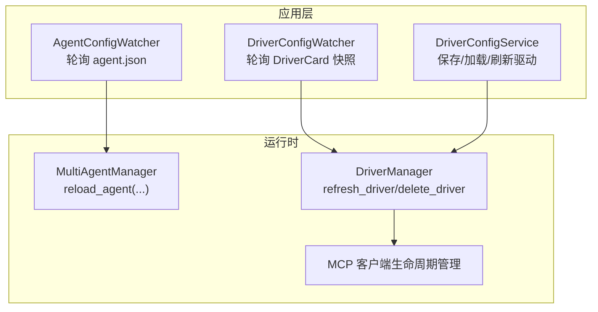
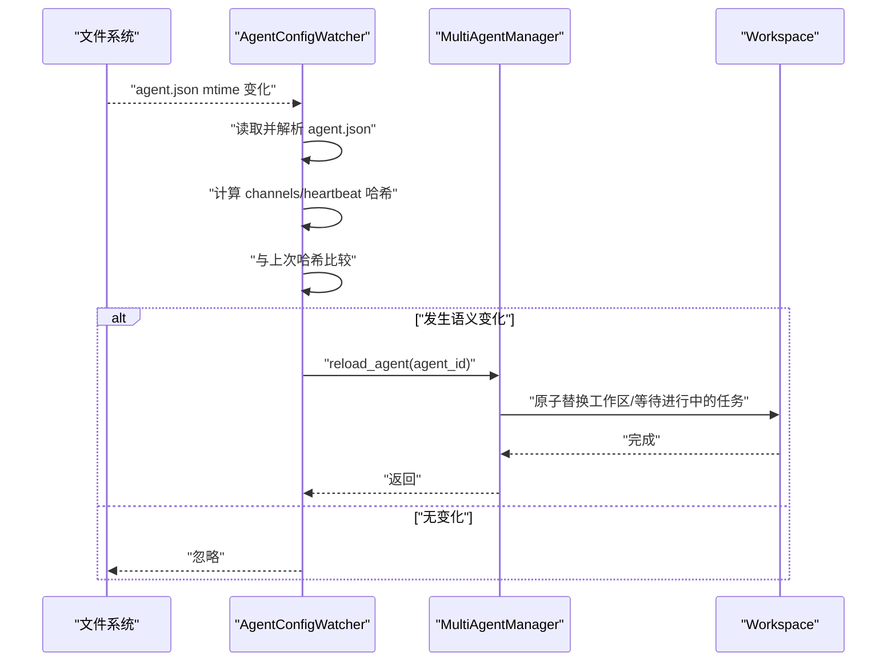
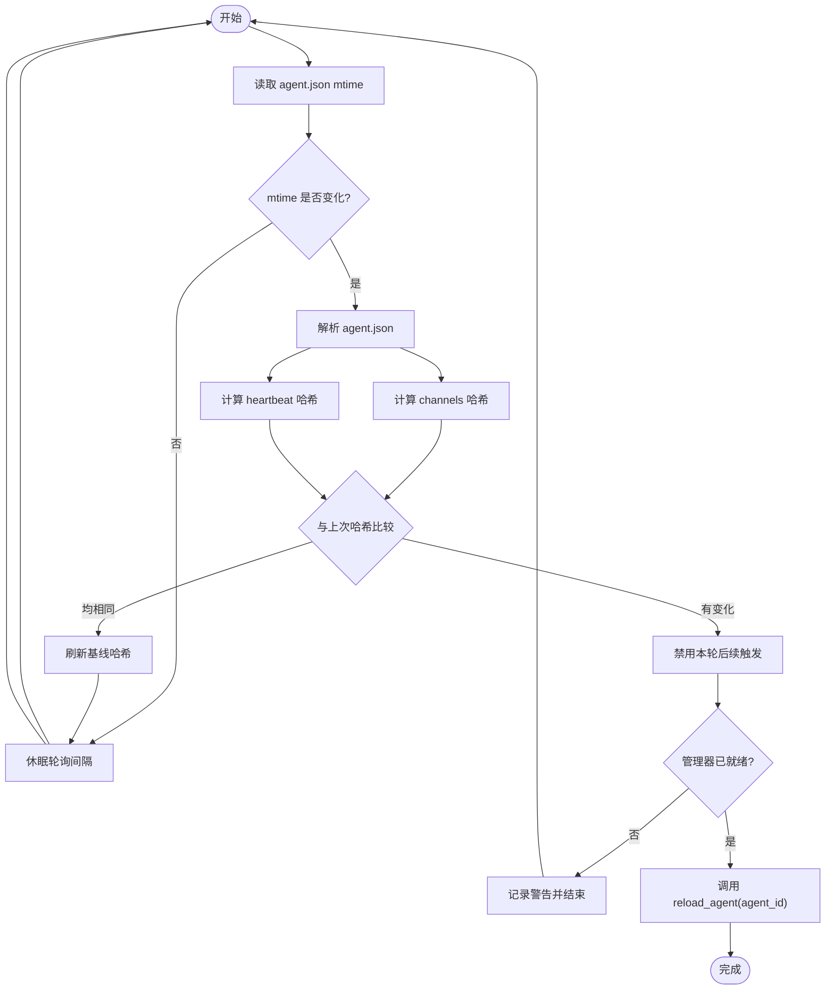
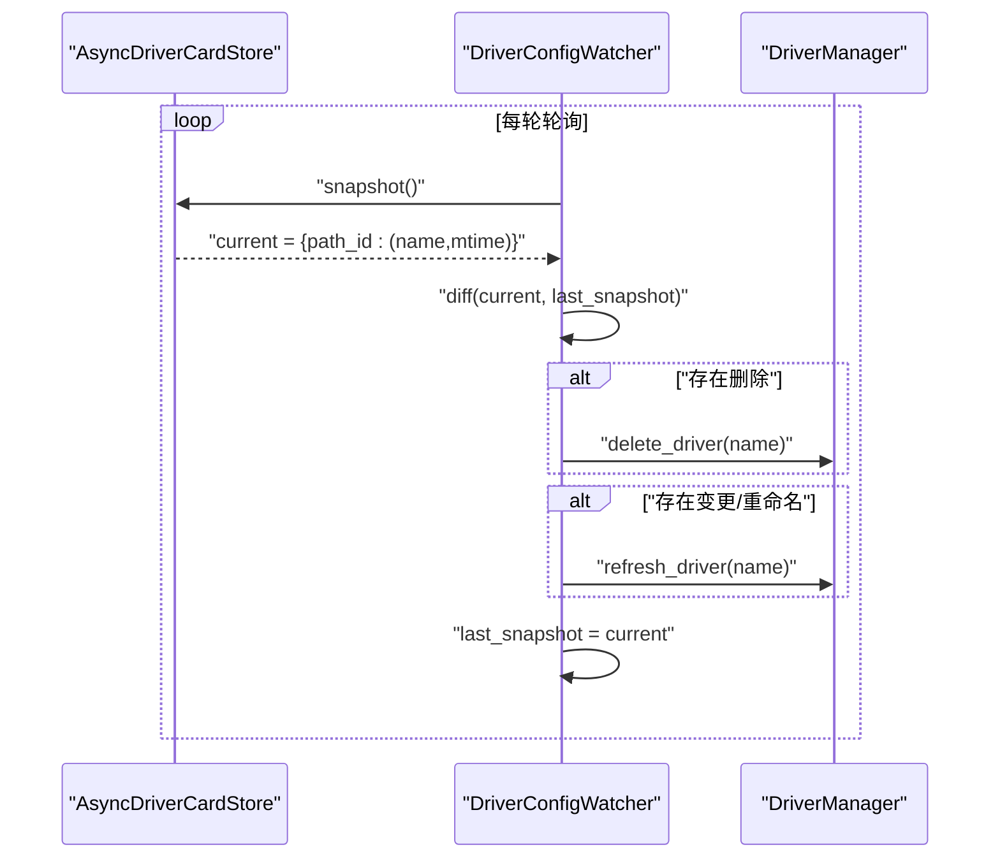
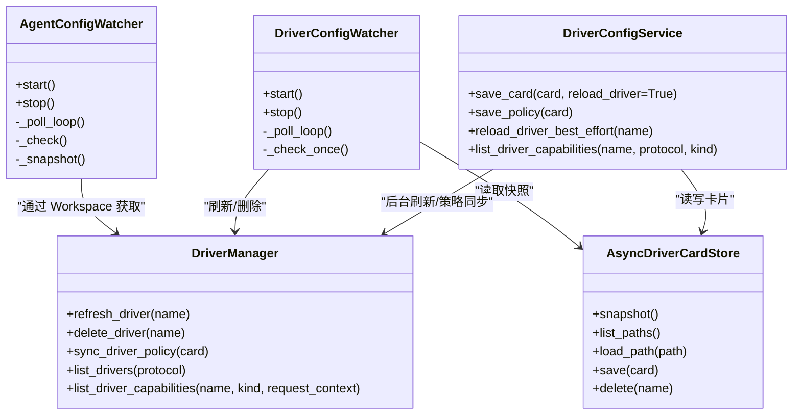

# 配置热重载机制

<cite>
**本文引用的文件**   
- [agent_config_watcher.py](file://src/qwenpaw/app/agent_config_watcher.py)
- [driver_config_watcher.py](file://src/qwenpaw/app/driver_config_watcher.py)
- [driver_config_service.py](file://src/qwenpaw/app/driver_config_service.py)
- [mcp_stateful_client.py](file://src/qwenpaw/drivers/handlers/mcp_stateful_client.py)
- [test_runtime_config.py](file://e2e/tests/test_runtime_config.py)
</cite>

## 目录
1. [简介](#简介)
2. [项目结构](#项目结构)
3. [核心组件](#核心组件)
4. [架构总览](#架构总览)
5. [详细组件分析](#详细组件分析)
6. [依赖关系分析](#依赖关系分析)
7. [性能考量](#性能考量)
8. [故障排查指南](#故障排查指南)
9. [结论](#结论)
10. [附录](#附录)

## 简介
本文件系统性梳理 QwenPaw 的配置热重载机制，覆盖 Agent 配置、驱动（Driver）配置两类关键路径。重点说明：
- 配置变更监听与增量更新策略
- 状态同步与服务重启策略
- 触发条件、调用关系、接口与领域模型
- 监控机制、变更检测算法与性能优化
- 即时生效、延迟生效与需要重启的配置类型
- 回滚、版本兼容性与错误恢复
- 面向初学者的流程图解与面向开发者的实现细节

## 项目结构
QwenPaw 在应用层提供两个独立的“配置监视器”：
- Agent 配置监视器：轮询 agent.json，仅当 channels 或 heartbeat 等关键字段变化时触发工作区级优雅重载
- Driver 配置监视器：轮询 DriverCard 存储快照，对新增/删除/变更的驱动执行刷新或删除

图表来源
- [agent_config_watcher.py:1-219](file://src/qwenpaw/app/agent_config_watcher.py#L1-L219)
- [driver_config_watcher.py:1-131](file://src/qwenpaw/app/driver_config_watcher.py#L1-L131)
- [driver_config_service.py:1-227](file://src/qwenpaw/app/driver_config_service.py#L1-L227)
- [mcp_stateful_client.py:612-649](file://src/qwenpaw/drivers/handlers/mcp_stateful_client.py#L612-L649)

章节来源
- [agent_config_watcher.py:1-219](file://src/qwenpaw/app/agent_config_watcher.py#L1-L219)
- [driver_config_watcher.py:1-131](file://src/qwenpaw/app/driver_config_watcher.py#L1-L131)
- [driver_config_service.py:1-227](file://src/qwenpaw/app/driver_config_service.py#L1-L227)
- [mcp_stateful_client.py:612-649](file://src/qwenpaw/drivers/handlers/mcp_stateful_client.py#L612-L649)

## 核心组件
- AgentConfigWatcher
  - 职责：定时读取 agent.json，计算 channels 与 heartbeat 的哈希，仅在语义变化时触发 MultiAgentManager.reload_agent
  - 关键点：避免非语义重写（如 last_dispatch）导致误重载；支持优雅停止
- DriverConfigWatcher
  - 职责：定时对比 DriverCard 快照差异，按名称集合计算受影响驱动，调用 DriverManager.refresh_driver 或 delete_driver
  - 关键点：以“当前快照”作为基线，防止并发编辑吞掉后续写入
- DriverConfigService
  - 职责：持久化 DriverCard 与凭据，提供 save_card/save_policy/reload_driver_best_effort 等 API
  - 关键点：后台任务异步刷新，失败不阻塞保存；确保活跃状态后再暴露能力列表

章节来源
- [agent_config_watcher.py:44-219](file://src/qwenpaw/app/agent_config_watcher.py#L44-L219)
- [driver_config_watcher.py:26-131](file://src/qwenpaw/app/driver_config_watcher.py#L26-L131)
- [driver_config_service.py:31-227](file://src/qwenpaw/app/driver_config_service.py#L31-L227)

## 架构总览
下图展示从“配置文件变更”到“服务侧热重载”的端到端流程。

图表来源
- [agent_config_watcher.py:156-219](file://src/qwenpaw/app/agent_config_watcher.py#L156-L219)

## 详细组件分析

### Agent 配置热重载（agent.json）
- 监控目标
  - 文件：workspace/<agent_id>/agent.json
  - 关注字段：channels、heartbeat（其他字段如 last_dispatch 的重写不应触发重载）
- 变更检测算法
  - 使用 JSON 序列化后的字符串哈希作为“语义指纹”，分别对 channels 和 heartbeat 计算
  - 只有任一指纹变化才视为有效变更
- 重载策略
  - 通过 MultiAgentManager.reload_agent 触发工作区级优雅重载，内部会等待进行中的任务并原子切换
- 容错与幂等
  - 解析失败记录异常日志但不中断轮询
  - 管理器未就绪时跳过重载并记录警告
  - 每次检查后都会刷新哈希基线，避免重复触发

图表来源
- [agent_config_watcher.py:112-219](file://src/qwenpaw/app/agent_config_watcher.py#L112-L219)

章节来源
- [agent_config_watcher.py:30-42](file://src/qwenpaw/app/agent_config_watcher.py#L30-L42)
- [agent_config_watcher.py:119-136](file://src/qwenpaw/app/agent_config_watcher.py#L119-L136)
- [agent_config_watcher.py:156-219](file://src/qwenpaw/app/agent_config_watcher.py#L156-L219)

### 驱动配置热重载（DriverCard）
- 监控目标
  - 存储：drivers/<protocol>/<name>.yaml（由 AsyncDriverCardStore 管理）
- 变更检测算法
  - 每轮取 snapshot() 得到 {path_id: (name, mtime)} 映射
  - 对比上一快照，识别 removed_paths 与 changed_paths
  - 基于 path_id 推导受影响的 name 集合（含重命名场景）
- 重载策略
  - 删除：调用 delete_driver(name)
  - 变更：调用 refresh_driver(name)
  - 保存后也可通过 DriverConfigService.reload_driver_best_effort 异步刷新
- 并发安全
  - 将本次触发的 current 快照设为新基线，避免在刷新期间被后续写入覆盖

图表来源
- [driver_config_watcher.py:78-131](file://src/qwenpaw/app/driver_config_watcher.py#L78-L131)
- [driver_config_service.py:127-149](file://src/qwenpaw/app/driver_config_service.py#L127-L149)

章节来源
- [driver_config_watcher.py:26-131](file://src/qwenpaw/app/driver_config_watcher.py#L26-L131)
- [driver_config_service.py:107-149](file://src/qwenpaw/app/driver_config_service.py#L107-L149)

### MCP 客户端生命周期与资源释放
- 背景
  - 旧实现存在 CPU 泄漏风险，新实现将上下文管理器生命周期放入独立后台任务，保证跨任务生命周期管理
- 影响
  - 驱动刷新/重连时能正确建立/销毁传输通道，避免资源泄露

章节来源
- [mcp_stateful_client.py:612-649](file://src/qwenpaw/drivers/handlers/mcp_stateful_client.py#L612-L649)

### 前端运行时配置持久化验证（参考用例）
- 行为
  - 修改 LLM 重试/限流等运行时配置项，保存后刷新页面，断言值持久化成功
- 意义
  - 间接验证后端保存与加载链路正常，为热重载提供稳定的配置源

章节来源
- [test_runtime_config.py:454-578](file://e2e/tests/test_runtime_config.py#L454-L578)

## 依赖关系分析
- AgentConfigWatcher
  - 依赖：config.load_agent_config、MultiAgentManager.reload_agent、Workspace
  - 耦合点：通过 Workspace._manager 懒解析管理器实例
- DriverConfigWatcher
  - 依赖：AsyncDriverCardStore.snapshot、DriverManager.refresh_driver/delete_driver
- DriverConfigService
  - 依赖：AsyncDriverCardStore、AsyncCredentialStore、DriverManager
  - 对外暴露：save_card、save_policy、list_cards、list_driver_capabilities 等

图表来源
- [agent_config_watcher.py:44-219](file://src/qwenpaw/app/agent_config_watcher.py#L44-L219)
- [driver_config_watcher.py:26-131](file://src/qwenpaw/app/driver_config_watcher.py#L26-L131)
- [driver_config_service.py:31-227](file://src/qwenpaw/app/driver_config_service.py#L31-L227)

章节来源
- [agent_config_watcher.py:137-141](file://src/qwenpaw/app/agent_config_watcher.py#L137-L141)
- [driver_config_watcher.py:35-40](file://src/qwenpaw/app/driver_config_watcher.py#L35-L40)
- [driver_config_service.py:38-56](file://src/qwenpaw/app/driver_config_service.py#L38-L56)

## 性能考量
- 轮询间隔
  - 默认 2s，兼顾实时性与系统开销
- 最小化变更面
  - Agent 配置仅对 channels/heartbeat 做语义哈希，避免 last_dispatch 等非语义重写触发重载
- 快照对比 O(n)
  - Driver 配置采用快照 diff，复杂度与卡片数量线性相关；建议控制卡片规模
- 异步刷新
  - Driver 保存后通过后台任务刷新，避免阻塞保存路径
- 资源管理
  - MCP 客户端生命周期放入独立任务，避免连接/传输对象泄漏

[本节为通用指导，无需源码引用]

## 故障排查指南
- Agent 配置重载未生效
  - 检查 agent.json 的 channels/heartbeat 是否真正变化（注意非语义字段不影响）
  - 查看日志中是否存在“管理器未就绪”的警告
- Driver 配置刷新失败
  - 确认卡片文件路径与协议匹配
  - 观察后台刷新任务是否抛出异常（保存仍成功但驱动未激活）
  - 若涉及网络/认证，检查 MCP 客户端生命周期与重连逻辑
- 前端配置持久化不一致
  - 参考 e2e 用例步骤，逐项校验输入框值与保存结果

章节来源
- [agent_config_watcher.py:195-219](file://src/qwenpaw/app/agent_config_watcher.py#L195-L219)
- [driver_config_service.py:127-162](file://src/qwenpaw/app/driver_config_service.py#L127-L162)
- [test_runtime_config.py:454-578](file://e2e/tests/test_runtime_config.py#L454-L578)

## 结论
QwenPaw 的配置热重载以“轻量轮询 + 语义哈希/快照 diff”为核心，结合“优雅重载/异步刷新”的策略，在保证稳定性的同时实现了低侵入的热更新。Agent 配置与工作区级重载解耦，驱动配置与卡片存储直连，二者共同构成可扩展、可观测、可回滚的热重载体系。

[本节为总结性内容，无需源码引用]

## 附录

### 配置类型与生效策略对照
- 即时生效
  - 驱动卡片变更：refresh_driver 立即重建外部能力
  - 策略变更：save_policy 直接同步至运行期
- 延迟生效
  - 驱动保存后后台任务刷新，失败不阻塞保存
- 需要重启
  - 当前实现未见需进程级重启的配置项；如需扩展，可在重载钩子中引入“软重启”或“隔离域重建”

[本节为概念性补充，无需源码引用]