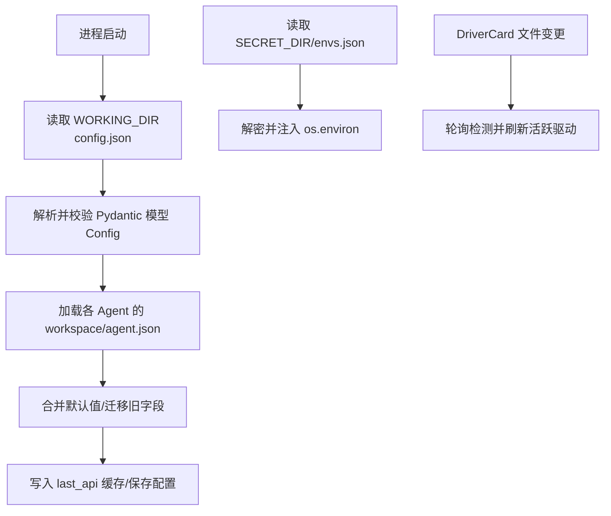
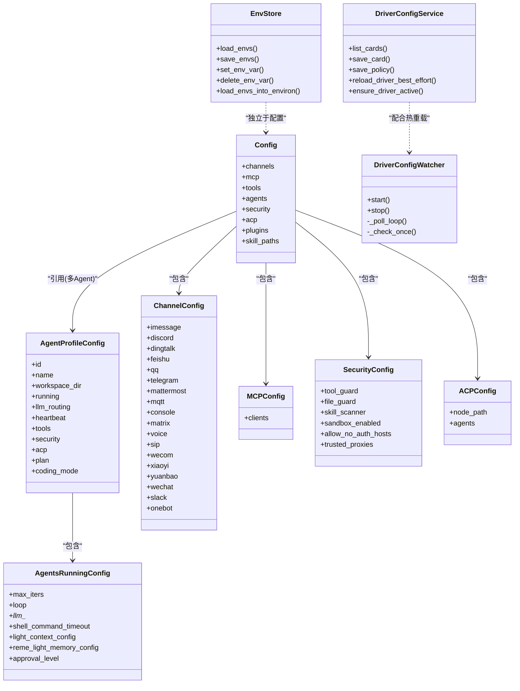
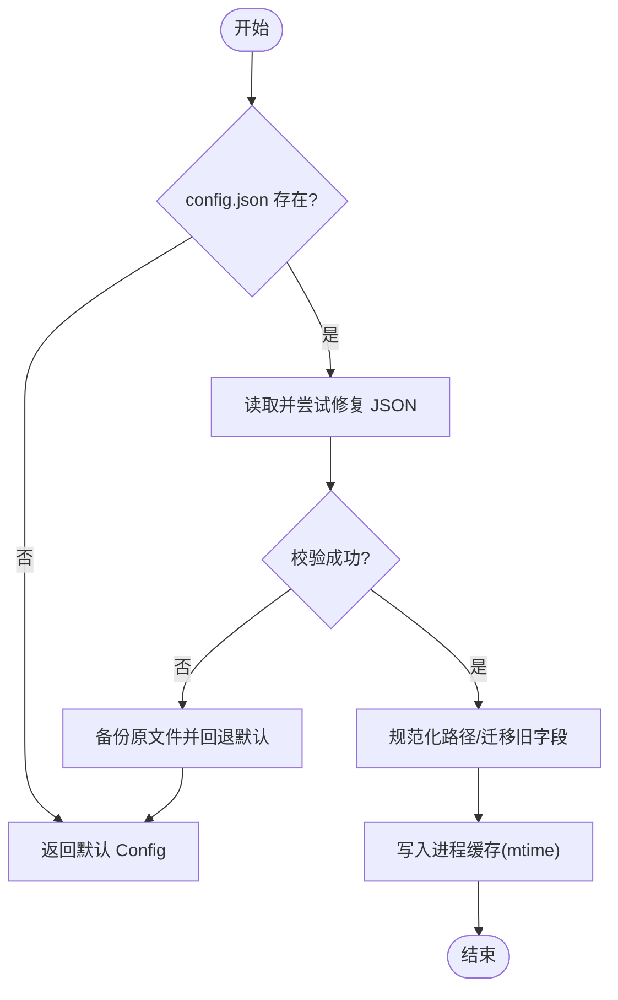
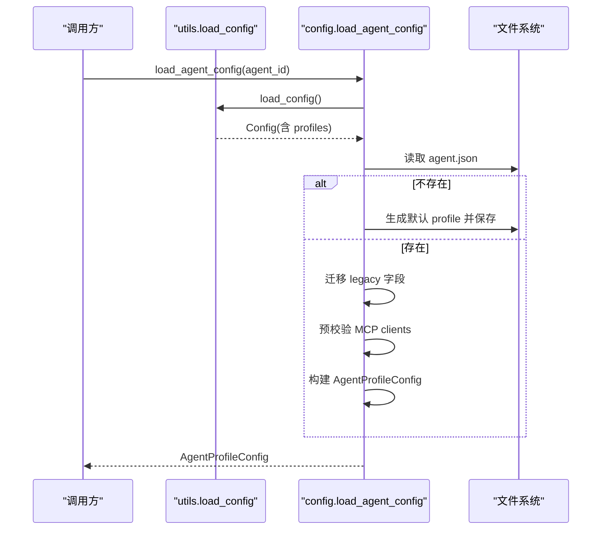
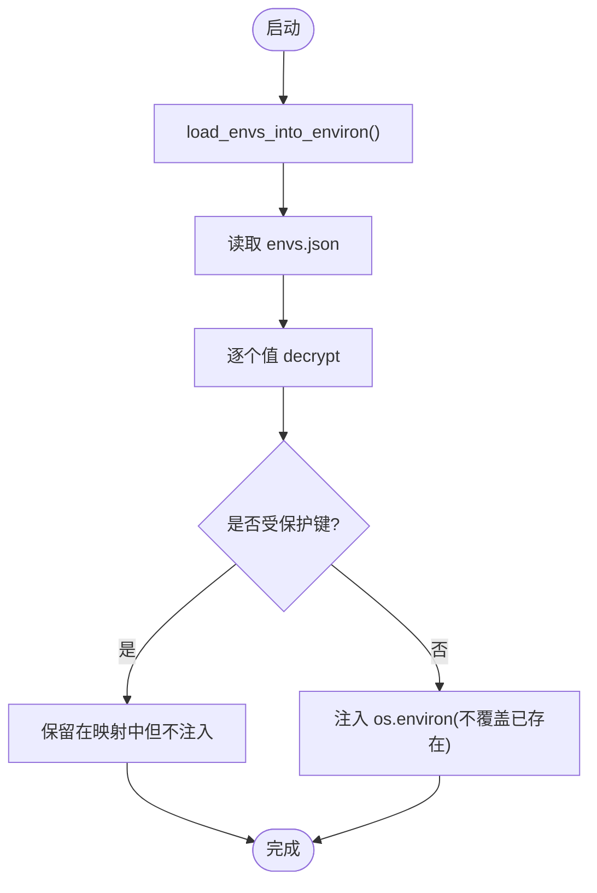
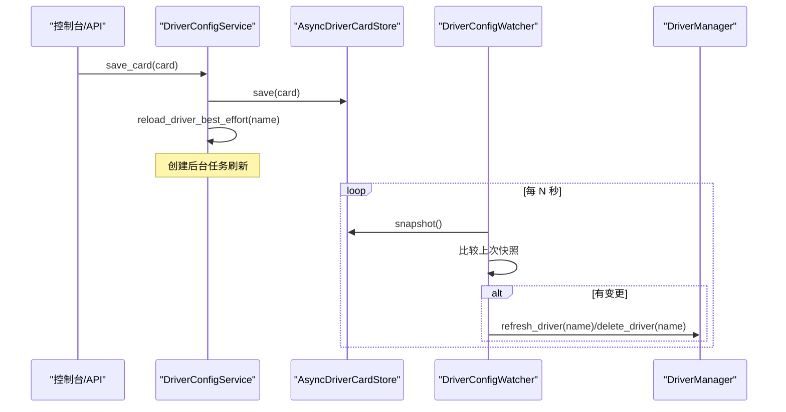
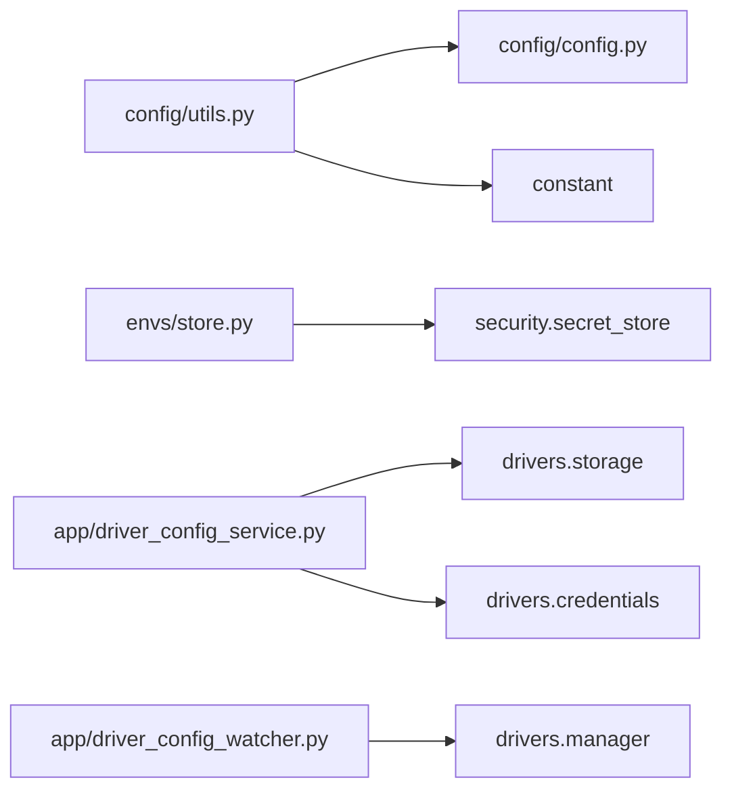

# 配置管理

<cite>
**本文引用的文件**   
- [config/__init__.py](file://src/qwenpaw/config/__init__.py)
- [config/config.py](file://src/qwenpaw/config/config.py)
- [config/utils.py](file://src/qwenpaw/config/utils.py)
- [config/context.py](file://src/qwenpaw/config/context.py)
- [envs/store.py](file://src/qwenpaw/envs/store.py)
- [app/driver_config_service.py](file://src/qwenpaw/app/driver_config_service.py)
- [app/driver_config_watcher.py](file://src/qwenpaw/app/driver_config_watcher.py)
</cite>

## 目录
1. [简介](#简介)
2. [项目结构](#项目结构)
3. [核心组件](#核心组件)
4. [架构总览](#架构总览)
5. [详细组件分析](#详细组件分析)
6. [依赖关系分析](#依赖关系分析)
7. [性能与热重载](#性能与热重载)
8. [常见问题与排障](#常见问题与排障)
9. [结论](#结论)
10. [附录：配置项速查](#附录配置项速查)

## 简介
本文件系统性梳理 QwenPaw 的配置管理体系，覆盖以下关键主题：
- 配置文件结构与加载流程（根配置 config.json、工作区 agent.json）
- 环境变量管理与持久化（envs.json + os.environ 注入）
- 密钥存储方案（加密存储与迁移）
- 配置热重载机制（驱动卡片 DriverCard 的轮询刷新）
- 领域模型与接口（Pydantic 模型、工具函数、服务类）
- 使用模式与最佳实践（工作空间配置、驱动配置、服务配置）

目标读者包括初学者与有经验的开发者。文档通过图示和源码路径帮助快速定位实现细节。

## 项目结构
QwenPaw 的配置体系围绕三个层次展开：
- 根级配置：config.json（全局频道、MCP、工具、安全、ACP、Agent 引用等）
- 工作区级配置：workspaces/{agent_id}/agent.json（每个 Agent 的运行参数、心跳、内存、路由等）
- 环境变量与密钥：SECRET_DIR/envs.json（加密持久化），运行时注入到 os.environ

图表来源
- [config/utils.py:616-716](file://src/qwenpaw/config/utils.py#L616-L716)
- [config/config.py:2302-2441](file://src/qwenpaw/config/config.py#L2302-L2441)
- [envs/store.py:142-221](file://src/qwenpaw/envs/store.py#L142-L221)
- [app/driver_config_watcher.py:42-131](file://src/qwenpaw/app/driver_config_watcher.py#L42-L131)

章节来源
- [config/utils.py:616-716](file://src/qwenpaw/config/utils.py#L616-L716)
- [config/config.py:2302-2441](file://src/qwenpaw/config/config.py#L2302-L2441)
- [envs/store.py:142-221](file://src/qwenpaw/envs/store.py#L142-L221)
- [app/driver_config_watcher.py:42-131](file://src/qwenpaw/app/driver_config_watcher.py#L42-L131)

## 核心组件
- 根配置模型与工具
  - 顶层模型：Config、AgentsConfig、ChannelConfig、MCPConfig、ToolsConfig、SecurityConfig、ACPConfig 等
  - 加载/保存：load_config、save_config、strict_validate_config_file
  - 兼容与迁移：_normalize_working_dir_bound_paths、_rewrite_legacy_weixin_key_on_disk、migrate_legacy_config_to_multi_agent
- 工作区配置模型与工具
  - 工作区模型：AgentProfileConfig、AgentsRunningConfig、HeartbeatConfig、LightContextConfig 等
  - 加载/保存：load_agent_config、save_agent_config
- 环境变量与密钥
  - 持久化：load_envs、save_envs、set_env_var、delete_env_var
  - 注入：load_envs_into_environ（保护键不覆盖）
  - 加密：encrypt/decrypt/is_encrypted（来自 security.secret_store）
- 驱动配置服务与热重载
  - 服务：DriverConfigService（读写 DriverCard、凭据、策略同步）
  - 监控：DriverConfigWatcher（轮询 cards 目录，触发 refresh/delete）

章节来源
- [config/__init__.py:1-59](file://src/qwenpaw/config/__init__.py#L1-L59)
- [config/config.py:2128-2157](file://src/qwenpaw/config/config.py#L2128-L2157)
- [config/config.py:1383-1468](file://src/qwenpaw/config/config.py#L1383-L1468)
- [config/config.py:2302-2441](file://src/qwenpaw/config/config.py#L2302-L2441)
- [config/utils.py:616-716](file://src/qwenpaw/config/utils.py#L616-L716)
- [envs/store.py:142-221](file://src/qwenpaw/envs/store.py#L142-L221)
- [app/driver_config_service.py:31-126](file://src/qwenpaw/app/driver_config_service.py#L31-L126)
- [app/driver_config_watcher.py:26-131](file://src/qwenpaw/app/driver_config_watcher.py#L26-L131)

## 架构总览
配置系统由“静态配置 + 动态环境 + 运行时热更新”三部分构成：
- 静态配置：config.json 与 agent.json 提供结构化配置，经 Pydantic 强校验
- 动态环境：envs.json 提供可加密的环境变量，启动时注入进程
- 运行时热更新：DriverCard 文件变更被轮询检测到后，自动刷新活跃驱动

图表来源
- [config/config.py:2128-2157](file://src/qwenpaw/config/config.py#L2128-L2157)
- [config/config.py:1383-1468](file://src/qwenpaw/config/config.py#L1383-L1468)
- [config/config.py:1130-1310](file://src/qwenpaw/config/config.py#L1130-L1310)
- [config/config.py:495-518](file://src/qwenpaw/config/config.py#L495-L518)
- [config/config.py:1655-1672](file://src/qwenpaw/config/config.py#L1655-L1672)
- [config/config.py:2070-2126](file://src/qwenpaw/config/config.py#L2070-L2126)
- [config/config.py:109-124](file://src/qwenpaw/config/config.py#L109-L124)
- [envs/store.py:142-221](file://src/qwenpaw/envs/store.py#L142-L221)
- [app/driver_config_service.py:31-126](file://src/qwenpaw/app/driver_config_service.py#L31-L126)
- [app/driver_config_watcher.py:26-131](file://src/qwenpaw/app/driver_config_watcher.py#L26-L131)

## 详细组件分析

### 根配置加载与校验（config.json）
- 入口：load_config(config_path=None)
  - 若文件不存在则返回默认 Config
  - 基于 mtime 的进程内缓存，避免频繁磁盘 IO
  - 读取 JSON 失败时使用 json_repair 尝试修复；不可恢复则备份原文件并回退默认
  - 执行向后兼容处理：last_api_host/port → last_api；weixin → wechat 迁移
  - 规范化工作目录绑定路径（~/.copaw → WORKING_DIR）
- 严格校验：strict_validate_config_file
  - 诊断用途，不进行自动修复，输出具体错误位置
- 保存：save_config
  - 序列化并写盘，同时失效进程内缓存

图表来源
- [config/utils.py:497-614](file://src/qwenpaw/config/utils.py#L497-L614)
- [config/utils.py:616-716](file://src/qwenpaw/config/utils.py#L616-L716)
- [config/utils.py:657-695](file://src/qwenpaw/config/utils.py#L657-L695)

章节来源
- [config/utils.py:497-614](file://src/qwenpaw/config/utils.py#L497-L614)
- [config/utils.py:616-716](file://src/qwenpaw/config/utils.py#L616-L716)
- [config/utils.py:657-695](file://src/qwenpaw/config/utils.py#L657-L695)

### 工作区配置加载与迁移（agent.json）
- 入口：load_agent_config(agent_id)
  - 从根配置获取 workspace_dir，再读取 workspaces/{agent_id}/agent.json
  - 若缺失则生成默认 profile 并落盘
  - 支持 mtime 缓存；加载前进行 legacy 迁移（weixin→wechat、访问控制字段迁移）
  - 对 MCP clients 做预校验，丢弃无效条目以避免阻塞整个 Agent 加载
- 保存：save_agent_config
  - 写入 agent.json，并失效对应 agent 的缓存

图表来源
- [config/config.py:2302-2441](file://src/qwenpaw/config/config.py#L2302-L2441)
- [config/utils.py:870-893](file://src/qwenpaw/config/utils.py#L870-L893)

章节来源
- [config/config.py:2302-2441](file://src/qwenpaw/config/config.py#L2302-L2441)
- [config/utils.py:870-893](file://src/qwenpaw/config/utils.py#L870-L893)

### 环境变量与密钥存储（envs.json）
- 存储位置：SECRET_DIR/envs.json（首次启动会尝试从旧位置迁移）
- 加密策略：
  - 写入时：未加密的值会被 encrypt 后再落盘
  - 读取时：统一 decrypt；若发现明文则自动重写为密文
- 进程注入：
  - load_envs_into_environ：将非受保护键注入 os.environ，且不会覆盖已有进程/系统环境变量
  - 受保护键（如 QWENPAW_WORKING_DIR、QWENPAW_SECRET_DIR）仅持久化，不注入

图表来源
- [envs/store.py:142-221](file://src/qwenpaw/envs/store.py#L142-L221)
- [envs/store.py:242-270](file://src/qwenpaw/envs/store.py#L242-L270)

章节来源
- [envs/store.py:142-221](file://src/qwenpaw/envs/store.py#L142-L221)
- [envs/store.py:242-270](file://src/qwenpaw/envs/store.py#L242-L270)

### 驱动配置服务与热重载（DriverCard）
- 服务层：DriverConfigService
  - 负责 DriverCard 的 CRUD、凭据存取、策略同步、状态检查
  - save_card/save_policy 后可异步触发 reload_driver_best_effort
- 监控层：DriverConfigWatcher
  - 定时轮询 cards 目录快照，对比差异
  - 删除或变更时，调用 manager.delete_driver/refresh_driver
- 典型流程：API 保存 → 落盘 → 后台任务刷新 → 活跃驱动生效

图表来源
- [app/driver_config_service.py:107-149](file://src/qwenpaw/app/driver_config_service.py#L107-L149)
- [app/driver_config_watcher.py:42-131](file://src/qwenpaw/app/driver_config_watcher.py#L42-L131)

章节来源
- [app/driver_config_service.py:31-126](file://src/qwenpaw/app/driver_config_service.py#L31-L126)
- [app/driver_config_watcher.py:26-131](file://src/qwenpaw/app/driver_config_watcher.py#L26-L131)

### 上下文变量与工作区隔离
- 通过 contextvars 传递当前 Agent 的工作区目录、最近消息截断阈值、Shell 命令超时与可执行、会话 ID、Toolkit 实例等
- 用于在多 Agent 并发场景下正确解析相对路径与资源

章节来源
- [config/context.py:1-164](file://src/qwenpaw/config/context.py#L1-164)

## 依赖关系分析
- 模块耦合
  - config.utils 依赖 constant（WORKING_DIR、HEARTBEAT_FILE 等）与 config.config 中的模型
  - envs.store 依赖 security.secret_store 进行加解密
  - app.driver_config_service 依赖 drivers.* 的存储与凭据接口
  - app.driver_config_watcher 依赖 drivers.manager 以刷新/删除驱动
- 外部依赖
  - json_repair：容错解析 JSON
  - pydantic：强类型校验与默认值合并
  - asyncio：异步任务与轮询

图表来源
- [config/utils.py:1-40](file://src/qwenpaw/config/utils.py#L1-L40)
- [envs/store.py:1-24](file://src/qwenpaw/envs/store.py#L1-L24)
- [app/driver_config_service.py:1-25](file://src/qwenpaw/app/driver_config_service.py#L1-L25)
- [app/driver_config_watcher.py:1-22](file://src/qwenpaw/app/driver_config_watcher.py#L1-L22)

章节来源
- [config/utils.py:1-40](file://src/qwenpaw/config/utils.py#L1-L40)
- [envs/store.py:1-24](file://src/qwenpaw/envs/store.py#L1-L24)
- [app/driver_config_service.py:1-25](file://src/qwenpaw/app/driver_config_service.py#L1-L25)
- [app/driver_config_watcher.py:1-22](file://src/qwenpaw/app/driver_config_watcher.py#L1-L22)

## 性能与热重载
- 配置缓存
  - 根配置与工作区配置均基于 mtime 的进程内缓存，减少磁盘 IO
  - 保存后主动失效缓存，保证一致性
- 驱动热重载
  - 轮询间隔可配置（默认 2.0s），增量比对快照，最小化刷新范围
  - 保存后立即尝试后台刷新，提升用户体验
- 建议
  - 批量修改配置后重启或等待一次轮询周期
  - 大体积 JSON 修复可能带来短暂延迟，必要时使用 strict_validate_config_file 提前诊断

章节来源
- [config/utils.py:616-716](file://src/qwenpaw/config/utils.py#L616-L716)
- [config/config.py:2302-2441](file://src/qwenpaw/config/config.py#L2302-L2441)
- [app/driver_config_watcher.py:42-131](file://src/qwenpaw/app/driver_config_watcher.py#L42-L131)

## 常见问题与排障
- 配置文件无法解析
  - 现象：启动报错或回退默认配置
  - 排查：使用 strict_validate_config_file 查看具体错误位置；检查 JSON 语法与字段类型
  - 参考：[config/utils.py:657-695](file://src/qwenpaw/config/utils.py#L657-L695)
- 旧字段不生效
  - 现象：weixin、dm_policy/group_policy 等旧字段无效
  - 说明：系统会在加载时自动迁移并备份原文件
  - 参考：[config/utils.py:532-576](file://src/qwenpaw/config/utils.py#L532-L576)、[config/config.py:2237-2300](file://src/qwenpaw/config/config.py#L2237-L2300)
- 环境变量未注入
  - 现象：进程内读不到期望的环境变量
  - 排查：确认是否为受保护键（不会被注入）；检查 envs.json 是否存在且可读
  - 参考：[envs/store.py:242-270](file://src/qwenpaw/envs/store.py#L242-L270)
- 驱动未生效
  - 现象：保存 DriverCard 后仍显示未激活
  - 排查：查看 DriverConfigWatcher 日志；确认 cards 目录与协议匹配；必要时手动刷新
  - 参考：[app/driver_config_watcher.py:67-131](file://src/qwenpaw/app/driver_config_watcher.py#L67-L131)

章节来源
- [config/utils.py:657-695](file://src/qwenpaw/config/utils.py#L657-L695)
- [config/utils.py:532-576](file://src/qwenpaw/config/utils.py#L532-L576)
- [config/config.py:2237-2300](file://src/qwenpaw/config/config.py#L2237-L2300)
- [envs/store.py:242-270](file://src/qwenpaw/envs/store.py#L242-L270)
- [app/driver_config_watcher.py:67-131](file://src/qwenpaw/app/driver_config_watcher.py#L67-L131)

## 结论
QwenPaw 的配置体系以 Pydantic 模型为核心，结合 mtime 缓存、JSON 容错解析、向后兼容迁移与加密环境变量注入，提供了稳定、可扩展且易维护的配置管理能力。驱动配置的轮询热重载进一步提升了运行时的灵活性。推荐在生产环境中：
- 使用 strict_validate_config_file 定期自检
- 通过环境变量集中管理敏感信息
- 借助 DriverConfigWatcher 实现无感热更新

## 附录：配置项速查
- 根配置（config.json）
  - channels：内置频道集合（Discord、钉钉、飞书、Telegram、Console 等）
  - mcp.clients：MCP 客户端定义（stdio/streamable_http/sse）
  - tools.builtin_tools：内置工具开关与展示设置
  - agents：多 Agent 列表与 active_agent
  - security：工具守卫、文件守卫、技能扫描器、沙箱开关、可信代理等
  - acp：外部 ACP Agent 定义
  - plugins：插件配置字典
  - skill_paths：外部技能池根目录（只读）
- 工作区配置（agent.json）
  - running：最大迭代次数、LLM 重试/限流、Shell 超时、上下文压缩、记忆后端等
  - llm_routing：本地/云端模型槽位与路由策略
  - heartbeat：心跳任务（频率、目标、超时、活跃时段）
  - tools/security/acp：继承或覆盖根配置
- 环境变量（envs.json）
  - 支持明文与密文混合存储，读取时统一解密，写入时自动加密
  - 受保护键不被注入进程环境

章节来源
- [config/config.py:2128-2157](file://src/qwenpaw/config/config.py#L2128-L2157)
- [config/config.py:1655-1672](file://src/qwenpaw/config/config.py#L1655-L1672)
- [config/config.py:1130-1310](file://src/qwenpaw/config/config.py#L1130-L1310)
- [config/config.py:549-572](file://src/qwenpaw/config/config.py#L549-L572)
- [envs/store.py:142-221](file://src/qwenpaw/envs/store.py#L142-L221)