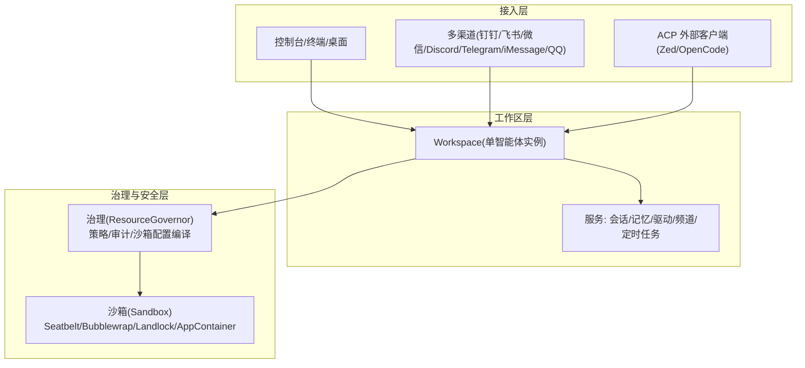
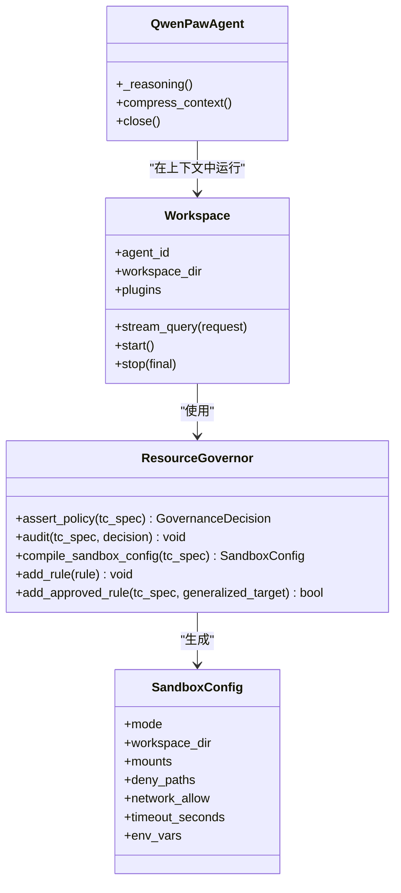
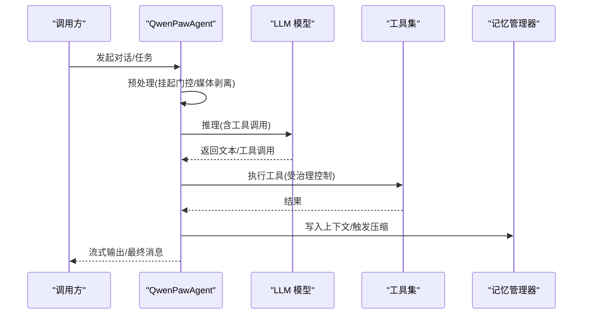
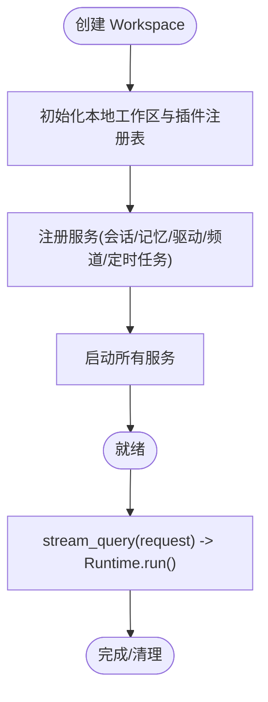
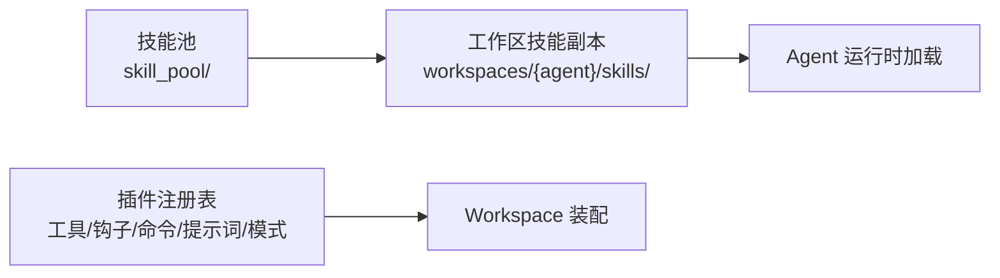
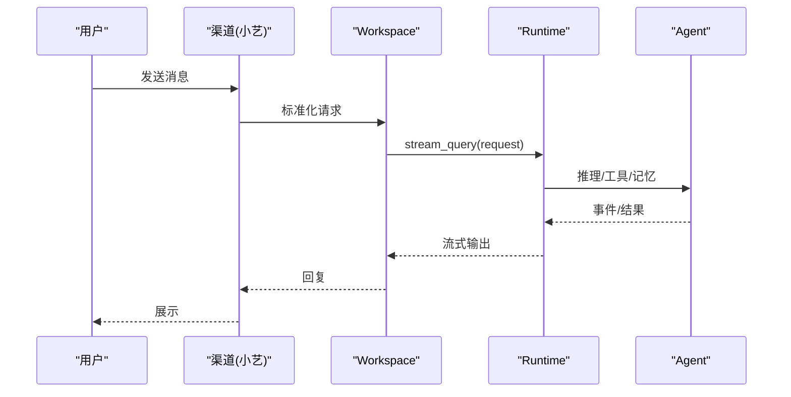
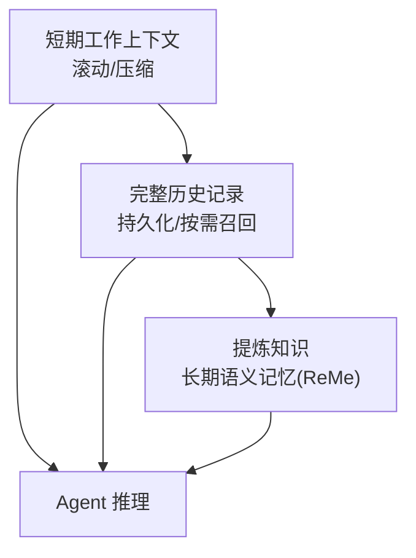
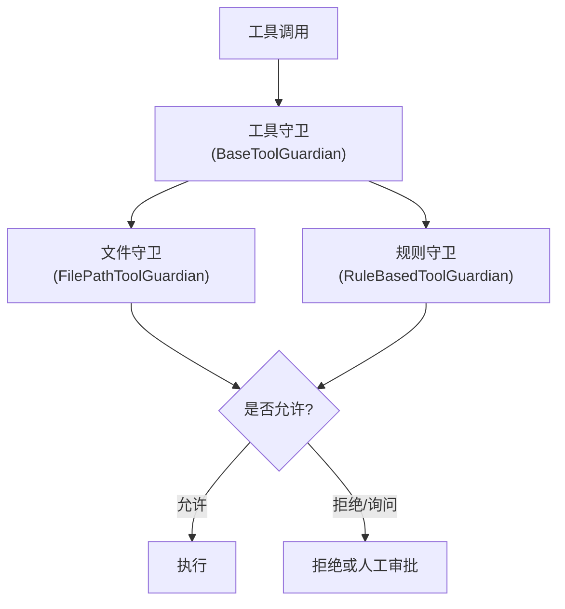
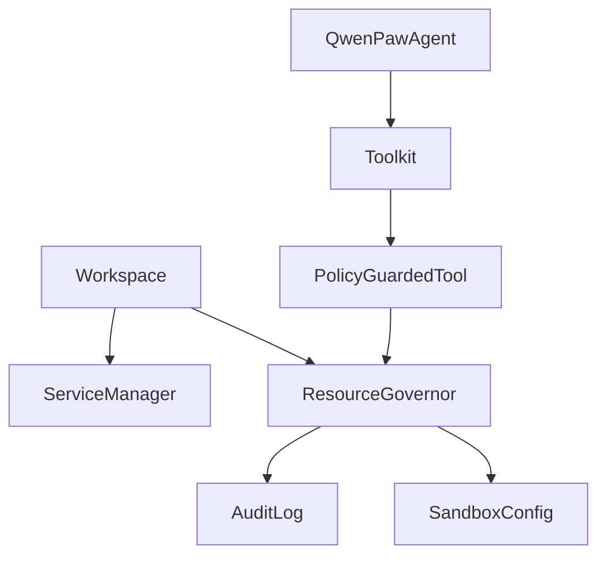

# 基本概念说明

<cite>
**本文引用的文件**   
- [README.md](file://README.md)
- [react_agent.py](file://src/qwenpaw/agents/react_agent.py)
- [workspace.py](file://src/qwenpaw/app/workspace/workspace.py)
- [resource_governor.py](file://src/qwenpaw/governance/resource_governor.py)
- [config.py](file://src/qwenpaw/sandbox/config.py)
- [server.py](file://src/qwenpaw/agents/acp/server.py)
- [channel.py](file://src/qwenpaw/app/channels/xiaoyi/channel.py)
- [skills.zh.md](file://website/public/docs/skills.zh.md)
- [test_policy.py](file://tests/unit/governance/test_policy.py)
- [guardian_contract.py](file://tests/contract/security/test_guardian_contract.py)
</cite>

## 目录
1. [引言](#引言)
2. [项目结构](#项目结构)
3. [核心组件](#核心组件)
4. [架构总览](#架构总览)
5. [详细组件分析](#详细组件分析)
6. [依赖关系分析](#依赖关系分析)
7. [性能考量](#性能考量)
8. [故障排查指南](#故障排查指南)
9. [结论](#结论)
10. [附录](#附录)

## 引言
本说明面向初学者与有经验的开发者，系统阐述 QwenPaw 的核心概念与 Agent OS 的三层架构：资源管理、治理控制、沙箱隔离。同时解释 ReAct 模式、工作空间（Workspace）、技能（Skills）与插件（Plugins）的区别与作用、多渠道接入机制，以及记忆系统的三层结构与基础安全机制（工具守卫、文件守卫、技能扫描器）。

## 项目结构
QwenPaw 采用“Agent OS”分层设计：
- 顶层：多通道接入（Console/TUI/Desktop/IM/A2A/ACP），统一路由到 Workspace
- 中间层：Workspace 编排服务（会话、记忆、驱动、频道、定时任务等）
- 底层：治理与安全（策略评估、审计、沙箱执行隔离）

图表来源
- [workspace.py:39-138](file://src/qwenpaw/app/workspace/workspace.py#L39-L138)
- [resource_governor.py:42-135](file://src/qwenpaw/governance/resource_governor.py#L42-L135)
- [config.py:40-129](file://src/qwenpaw/sandbox/config.py#L40-L129)
- [server.py:247-500](file://src/qwenpaw/agents/acp/server.py#L247-L500)
- [channel.py:350-504](file://src/qwenpaw/app/channels/xiaoyi/channel.py#L350-L504)

章节来源
- [README.md:32-43](file://README.md#L32-L43)
- [workspace.py:39-138](file://src/qwenpaw/app/workspace/workspace.py#L39-L138)

## 核心组件
- AI Agent：基于 ReAct 的智能体，具备工具调用、技能加载、记忆管理与上下文压缩能力。
- ReAct 模式：思考-行动-观察循环，结合工具与记忆进行推理与执行。
- 工作空间（Workspace）：单个智能体的完整运行环境，包含会话、记忆、驱动、频道、定时任务与插件注册表。
- 技能（Skills）：以 SKILL.md 描述的能力单元，支持共享池与工作区副本、频道路由与运行时配置注入。
- 插件（Plugins）：扩展点（工具、钩子、命令、提示词贡献者、模式等），通过工作区插件注册表装配。
- 渠道（Channels）：多渠道接入抽象，将不同 IM/平台消息标准化为统一请求进入 Workspace。
- 记忆系统：短期工作上下文、完整历史记录、提炼知识（长期语义记忆）。
- 安全机制：工具守卫（规则+路径检查）、文件守卫（敏感路径保护）、技能扫描器（激活前扫描）。

章节来源
- [react_agent.py:47-143](file://src/qwenpaw/agents/react_agent.py#L47-L143)
- [skills.zh.md:1-48](file://website/public/docs/skills.zh.md#L1-L48)
- [workspace.py:39-138](file://src/qwenpaw/app/workspace/workspace.py#L39-L138)
- [README.md:38-43](file://README.md#L38-L43)

## 架构总览
Agent OS 三层架构：
- 资源管理：Workspace 统一管理各服务生命周期与复用，提供会话、记忆、驱动、频道、定时任务等。
- 治理控制：ResourceGovernor 负责策略评估、审计记录、动态规则添加与沙箱配置编译。
- 沙箱隔离：按平台选择 Seatbelt/Bubblewrap/Landlock/AppContainer，限制文件系统、进程/内存、网络等。

图表来源
- [workspace.py:39-138](file://src/qwenpaw/app/workspace/workspace.py#L39-L138)
- [resource_governor.py:42-135](file://src/qwenpaw/governance/resource_governor.py#L42-L135)
- [config.py:80-129](file://src/qwenpaw/sandbox/config.py#L80-L129)
- [react_agent.py:47-143](file://src/qwenpaw/agents/react_agent.py#L47-L143)

## 详细组件分析

### AI Agent 与 ReAct 模式
- Agent 构造与能力集成：工具组、技能元数据注册、记忆工具注入、权限绕过由 PolicyGuardedTool 接管。
- ReAct 推理流程：每次迭代先处理挂起门控动作，必要时主动剥离媒体块以避免模型拒绝；若发生媒体相关错误则学习并回退重试；最终根据停止钩子决定是否继续。
- 上下文压缩：优先委托给上下文管理器（如滚动策略），否则回退到原生压缩；每次压缩前清理孤立 tool_result 消息，避免 400 错误。

图表来源
- [react_agent.py:411-551](file://src/qwenpaw/agents/react_agent.py#L411-L551)
- [react_agent.py:145-183](file://src/qwenpaw/agents/react_agent.py#L145-L183)

章节来源
- [react_agent.py:47-143](file://src/qwenpaw/agents/react_agent.py#L47-L143)
- [react_agent.py:145-183](file://src/qwenpaw/agents/react_agent.py#L145-L183)
- [react_agent.py:411-551](file://src/qwenpaw/agents/react_agent.py#L411-L551)

### 工作空间（Workspace）
- 职责：封装独立智能体实例，管理 ChannelManager、BaseMemoryManager、DriverManager、CronManager、WorkspacePlugins 等。
- 启动流程：初始化本地工作区路由、注册服务、加载配置、迁移旧数据、启动所有服务。
- 请求处理：通过 Runtime 管道执行 stream_query。

图表来源
- [workspace.py:39-138](file://src/qwenpaw/app/workspace/workspace.py#L39-L138)
- [workspace.py:255-268](file://src/qwenpaw/app/workspace/workspace.py#L255-L268)
- [workspace.py:459-500](file://src/qwenpaw/app/workspace/workspace.py#L459-L500)

章节来源
- [workspace.py:39-138](file://src/qwenpaw/app/workspace/workspace.py#L39-L138)
- [workspace.py:255-268](file://src/qwenpaw/app/workspace/workspace.py#L255-L268)
- [workspace.py:459-500](file://src/qwenpaw/app/workspace/workspace.py#L459-L500)

### 技能（Skills）与插件（Plugins）
- 技能：以 SKILL.md 描述，分为“技能池”和“工作区副本”，支持频道路由与运行时配置注入。
- 插件：工具、钩子、命令、提示词贡献者、模式等，通过工作区插件注册表装配。
- 区别与作用：技能是“可被 Agent 调用的能力包”，插件是“系统扩展点”。两者共同构成可扩展生态。

图表来源
- [skills.zh.md:1-48](file://website/public/docs/skills.zh.md#L1-L48)
- [skills.zh.md:372-406](file://website/public/docs/skills.zh.md#L372-L406)
- [workspace.py:139-241](file://src/qwenpaw/app/workspace/workspace.py#L139-L241)

章节来源
- [skills.zh.md:1-48](file://website/public/docs/skills.zh.md#L1-L48)
- [skills.zh.md:372-406](file://website/public/docs/skills.zh.md#L372-L406)
- [workspace.py:139-241](file://src/qwenpaw/app/workspace/workspace.py#L139-L241)

### 多渠道接入
- 渠道抽象：不同平台（钉钉、飞书、微信、Discord、Telegram、iMessage、QQ 等）通过 Channel 实现，统一转换为内部请求进入 Workspace。
- 示例：小艺渠道使用双 WebSocket 连接主备域名，确保冗余与稳定性。
- ACP 接入：外部客户端（Zed、OpenCode）通过 ACP 协议以 stdio JSON-RPC 连接，复用完整 Workspace 生命周期。

图表来源
- [channel.py:350-504](file://src/qwenpaw/app/channels/xiaoyi/channel.py#L350-L504)
- [server.py:247-500](file://src/qwenpaw/agents/acp/server.py#L247-L500)
- [workspace.py:255-268](file://src/qwenpaw/app/workspace/workspace.py#L255-L268)

章节来源
- [README.md:42-43](file://README.md#L42-L43)
- [channel.py:350-504](file://src/qwenpaw/app/channels/xiaoyi/channel.py#L350-L504)
- [server.py:247-500](file://src/qwenpaw/agents/acp/server.py#L247-L500)

### 记忆系统的三层结构
- 短期工作上下文：当前会话窗口内的消息与工具结果，支持压缩与滚动上下文。
- 完整历史记录：持久化保存，可按需召回，不被摘要替代。
- 提炼知识：长期语义记忆（ReMe），用于跨会话检索与总结。

图表来源
- [README.md:36-37](file://README.md#L36-L37)
- [react_agent.py:145-183](file://src/qwenpaw/agents/react_agent.py#L145-L183)

章节来源
- [README.md:36-37](file://README.md#L36-L37)
- [react_agent.py:145-183](file://src/qwenpaw/agents/react_agent.py#L145-L183)

### 安全机制：工具守卫、文件守卫、技能扫描器
- 工具守卫：对每个工具调用进行规则与路径检查，返回 GuardFinding 列表，未知工具名不崩溃。
- 文件守卫：独立于工具守卫，阻止访问敏感文件与目录（默认保护 ~/.qwenpaw.secret/、~/.ssh 等）。
- 技能扫描器：激活前扫描，检测提示注入、硬编码密钥、数据外泄等，支持白名单与阻断/警告/关闭模式。

图表来源
- [guardian_contract.py:1-289](file://tests/contract/security/test_guardian_contract.py#L1-L289)
- [README.md:38-39](file://README.md#L38-L39)

章节来源
- [guardian_contract.py:1-289](file://tests/contract/security/test_guardian_contract.py#L1-L289)
- [README.md:38-39](file://README.md#L38-L39)

## 依赖关系分析
- Workspace 依赖 ServiceManager 声明式注册服务（会话、记忆、驱动、频道、定时任务等）。
- ResourceGovernor 依赖策略与审计模块，并编译 SandboxConfig 交由沙箱执行。
- Agent 通过 Toolkit 与 PolicyGuardedTool 集成治理控制，并在推理过程中与记忆/上下文管理器协作。

图表来源
- [workspace.py:269-425](file://src/qwenpaw/app/workspace/workspace.py#L269-L425)
- [resource_governor.py:42-135](file://src/qwenpaw/governance/resource_governor.py#L42-L135)
- [react_agent.py:93-143](file://src/qwenpaw/agents/react_agent.py#L93-L143)

章节来源
- [workspace.py:269-425](file://src/qwenpaw/app/workspace/workspace.py#L269-L425)
- [resource_governor.py:42-135](file://src/qwenpaw/governance/resource_governor.py#L42-L135)
- [react_agent.py:93-143](file://src/qwenpaw/agents/react_agent.py#L93-L143)

## 性能考量
- 上下文压缩与滚动：在每次推理前清理孤立工具结果，避免 400 错误；优先使用滚动上下文管理器以减少模型输入体积。
- 媒体块处理：当模型不支持多模态时，主动剥离媒体块或启用请求时剥离，降低失败重试成本。
- 沙箱降级：当沙箱不可用时，SANDBOX_FALLBACK 升级为 ALLOW 而非 ASK，减少交互开销但保持 Phase 0-2 防护。

[本节为通用指导，无需具体文件分析]

## 故障排查指南
- 策略评估与审计：确认 ResourceGovernor 的决策日志与审计记录，验证 SANDBOX_FALLBACK 降级逻辑是否符合预期。
- 工具守卫契约：确保 BaseToolGuardian 子类实现 guard() 且返回 GuardFinding 列表；未知工具名不应导致崩溃。
- 工作区启动失败：检查服务注册顺序与可选服务（如 memory_manager）导入失败时的容错。

章节来源
- [test_policy.py:519-551](file://tests/unit/governance/test_policy.py#L519-L551)
- [guardian_contract.py:105-137](file://tests/contract/security/test_guardian_contract.py#L105-L137)
- [workspace.py:459-500](file://src/qwenpaw/app/workspace/workspace.py#L459-L500)

## 结论
QwenPaw 的 Agent OS 通过 Workspace 聚合资源、ResourceGovernor 实施治理、Sandbox 提供隔离，形成稳定可控的智能体运行基座。配合 ReAct 推理、三层记忆、多渠道接入与可扩展的技能/插件体系，既满足初学者的易用性，也为高级用户提供深度定制能力。

[本节为总结，无需具体文件分析]

## 附录
- 快速上手与安装：参考 README 中的多种安装方式与部署选项。
- 文档导航：官方文档涵盖 Console、TUI、Desktop、Models、Channels、Skills、Plugins、MCP、Persona、Memory、Context、Commands、Heartbeat、Cron、Multi-Agent、Security、Backup、API、CLI 等主题。

章节来源
- [README.md:104-174](file://README.md#L104-L174)
- [README.md:397-429](file://README.md#L397-L429)