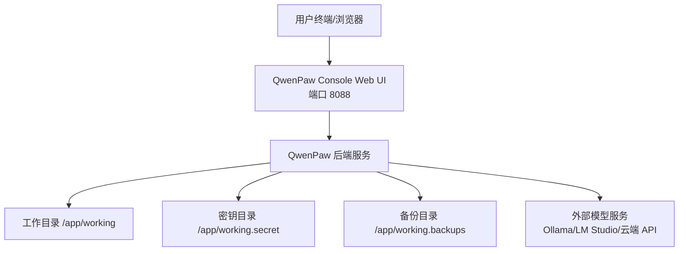
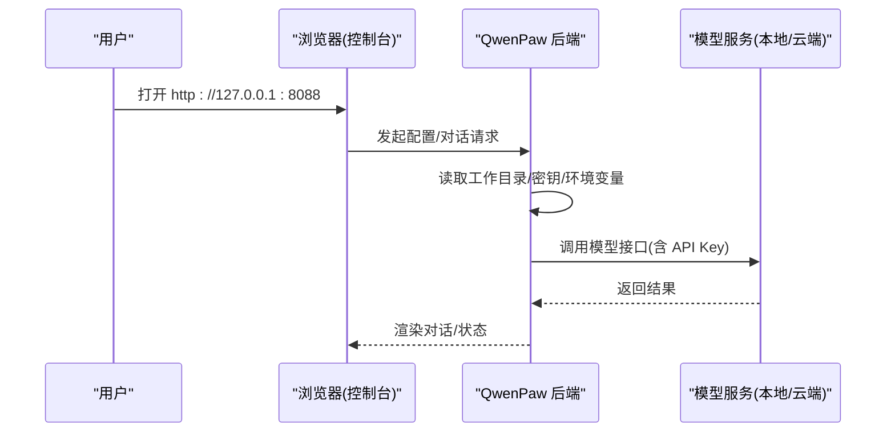
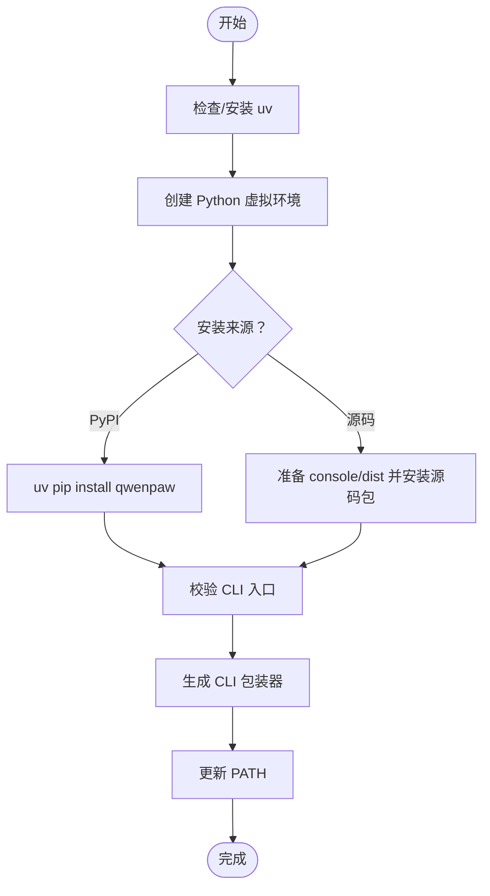

# 快速开始指南

<cite>
**本文引用的文件**   
- [README_zh.md](file://README_zh.md)
- [scripts/install.sh](file://scripts/install.sh)
- [scripts/install.ps1](file://scripts/install.ps1)
- [scripts/install.bat](file://scripts/install.bat)
- [deploy/Dockerfile](file://deploy/Dockerfile)
- [docker-compose.yml](file://docker-compose.yml)
</cite>

## 目录
1. [简介](#简介)
2. [项目结构](#项目结构)
3. [核心组件](#核心组件)
4. [架构总览](#架构总览)
5. [详细安装与部署指南](#详细安装与部署指南)
6. [依赖关系分析](#依赖关系分析)
7. [性能与兼容性建议](#性能与兼容性建议)
8. [故障排除指南](#故障排除指南)
9. [结论](#结论)
10. [附录：卸载与回滚](#附录卸载与回滚)

## 简介
本指南面向首次接触 QwenPaw 的用户，提供从本地到云端、从命令行到桌面应用的全链路快速上手路径。内容覆盖多种安装方式（pip、脚本、Docker、阿里云 ECS 一键部署、AgentScope Platform 云部署、ModelScope Studio 部署、桌面应用 Beta），并给出环境要求、首次启动后的基础配置流程（模型配置、API Key 设置、功能验证）、不同平台的特殊注意事项（尤其是 Windows LTSC 企业环境）以及安装选项详解与卸载方法。

## 项目结构
仓库包含前端控制台、后端服务、CLI 工具、打包与部署脚本等。与“快速开始”直接相关的核心位置如下：
- 安装脚本：scripts/install.sh、scripts/install.ps1、scripts/install.bat
- Docker 镜像构建与运行：deploy/Dockerfile、docker-compose.yml
- 官方中文说明与快速开始入口：README_zh.md

图表来源
- [deploy/Dockerfile:22-26](file://deploy/Dockerfile#L22-L26)
- [docker-compose.yml:17-26](file://docker-compose.yml#L17-L26)

章节来源
- [README_zh.md:104-336](file://README_zh.md#L104-L336)

## 核心组件
- 控制台（Console）：Web 界面，用于对话、智能体与模型配置、频道接入等。
- CLI（qwenpaw）：初始化、运行、管理任务与环境的命令行入口。
- 运行时与数据卷：工作目录、密钥目录、备份目录在容器或本地持久化。
- 模型后端：支持本地（QwenPaw Local/Ollama/LM Studio）与云端（DashScope/OpenAI 等）。

章节来源
- [README_zh.md:356-381](file://README_zh.md#L356-L381)

## 架构总览
下图展示了典型本地/容器部署的交互关系：用户在浏览器访问 Console，Console 调用后端服务；后端通过环境变量或配置文件读取模型提供商与 API Key，连接本地或云端模型服务。

图表来源
- [deploy/Dockerfile:22-26](file://deploy/Dockerfile#L22-L26)
- [README_zh.md:356-368](file://README_zh.md#L356-L368)

## 详细安装与部署指南

### 通用前置条件
- Python 版本：>= 3.11, < 3.14（pip 安装需要）
- 网络：能访问 PyPI 或国内镜像（脚本会自动选择）
- 可选：Node.js（仅当需要从源码构建前端控制台时）

章节来源
- [README_zh.md:106-116](file://README_zh.md#L106-L116)

### 方式一：pip 安装
适用人群：希望自行管理 Python 环境的用户。

步骤
1. 安装包：pip install qwenpaw
2. 初始化：qwenpaw init --defaults（或交互式 qwenpaw init）
3. 启动：qwenpaw app
4. 打开控制台：http://127.0.0.1:8088/

注意
- 若使用云端大模型 API，需在“设置 → 模型”中配置 API Key。
- 仅用本地模型（QwenPaw Local/Ollama/LM Studio）无需 API Key。

章节来源
- [README_zh.md:106-116](file://README_zh.md#L106-L116)
- [README_zh.md:356-368](file://README_zh.md#L356-L368)

### 方式二：脚本安装（推荐）
自动完成 uv、虚拟环境、Python、QwenPaw 及前端资源准备，适合大多数用户。

macOS / Linux
- 执行：curl -fsSL https://qwenpaw.agentscope.io/install.sh | bash

Windows (CMD)
- 下载并执行：curl -fsSL https://qwenpaw.agentscope.io/install.bat -o install.bat && install.bat

Windows (PowerShell)
- 执行：irm https://qwenpaw.agentscope.io/install.ps1 | iex

安装后
- 打开新终端：qwenpaw init --defaults（或交互式）
- 启动：qwenpaw app

安装选项（示例）
- 指定版本：--version X.Y.Z
- 从源码安装：--from-source 或 -FromSource/-FromSource
- 安装额外依赖：--extras dev,whisper
- 允许预发布：--prerelease

章节来源
- [README_zh.md:122-213](file://README_zh.md#L122-L213)
- [scripts/install.sh:58-97](file://scripts/install.sh#L58-L97)
- [scripts/install.ps1:17-64](file://scripts/install.ps1#L17-L64)
- [scripts/install.bat:27-101](file://scripts/install.bat#L27-L101)

#### Windows 企业版 LTSC 特别提示
受限语言模式可能导致：
- CMD 脚本执行成功但无法写入 Path：需手动将安装目录加入系统 Path
- PowerShell 脚本中断：需手动安装 uv 并配置环境变量后重试

处理要点
- 找到安装目录（uv 与 QwenPaw bin）
- 手动添加到系统 Path
- 重新运行安装脚本完成安装

章节来源
- [README_zh.md:146-167](file://README_zh.md#L146-L167)

### 方式三：Docker 部署
适用于隔离环境与服务器部署。

拉取镜像
- agentscope/qwenpaw:latest（稳定版）
- agentscope/qwenpaw:pre（预发布）

运行容器
- 映射端口：127.0.0.1:8088:8088
- 挂载数据卷：
  - qwenpaw-data:/app/working（配置、记忆、Skills）
  - qwenpaw-secrets:/app/working.secret（模型提供商设置与 API Key）
  - qwenpaw-backups:/app/working.backups（备份归档）

传入 API Key
- 使用 -e VAR=value 或 --env-file .env

连接宿主机上的 Ollama 等服务
- 方式 A：添加 host.docker.internal 并在“设置 → 模型”中将 Base URL 改为 http://host.docker.internal:<端口>
- 方式 B（Linux）：--network=host 共享宿主机网络

章节来源
- [README_zh.md:218-261](file://README_zh.md#L218-L261)
- [deploy/Dockerfile:22-26](file://deploy/Dockerfile#L22-L26)
- [docker-compose.yml:17-26](file://docker-compose.yml#L17-L26)

### 方式四：阿里云 ECS 一键部署
- 打开阿里云 ECS 一键部署链接，按页面提示创建实例并完成部署。
- 详细步骤可参考阿里云开发者社区文章。

章节来源
- [README_zh.md:265-267](file://README_zh.md#L265-L267)

### 方式五：AgentScope Platform 云部署
- 提供一键云端部署、插件分享与 Skill 市场，免费且 7×24 在线。

章节来源
- [README_zh.md:271-274](file://README_zh.md#L271-L274)

### 方式六：ModelScope Studio 部署
- 使用魔搭创空间进行云端部署，注意将创空间设为“非公开”，避免他人操控你的实例。

章节来源
- [README_zh.md:277-279](file://README_zh.md#L277-L279)

### 方式七：桌面应用（Beta）
- 零配置、跨平台（Windows 10+、macOS 14+），双击即可运行。
- 首次启动可能较慢，等待窗口自动打开。
- macOS 如需绕过安全限制，可使用右键“打开”或在“隐私与安全性”中允许。

章节来源
- [README_zh.md:283-324](file://README_zh.md#L283-L324)

### 首次启动后的基本配置流程
1. 打开控制台：http://127.0.0.1:8088/
2. 进入“设置 → 模型”
   - 选择提供商（如 DashScope/Qwen、OpenAI、Anthropic、Gemini 等）
   - 填写 API Key 并启用该提供商与模型
   - 若仅使用本地模型（QwenPaw Local/Ollama/LM Studio），则无需 API Key
3. 基础功能验证
   - 发送一条消息，确认模型回复正常
   - 如需网页搜索等工具，可在“设置 → 环境变量”中配置对应密钥（如 TAVILY_API_KEY）

章节来源
- [README_zh.md:356-368](file://README_zh.md#L356-L368)
- [README_zh.md:370-381](file://README_zh.md#L370-L381)

## 依赖关系分析
- 安装脚本负责：
  - 检测/安装 uv（Python 包管理器）
  - 创建 Python 虚拟环境（默认 3.12）
  - 安装 QwenPaw（PyPI 或源码）
  - 准备前端控制台资源（npm 构建或复制 dist）
  - 生成 CLI 包装器并更新 PATH
- Docker 镜像构建：
  - 先构建前端控制台（console/dist）
  - 安装 Python 依赖并注入 console 静态资源
  - 暴露 8088 端口，通过 entrypoint 启动服务

图表来源
- [scripts/install.sh:108-136](file://scripts/install.sh#L108-L136)
- [scripts/install.ps1:123-193](file://scripts/install.ps1#L123-L193)
- [scripts/install.bat:170-233](file://scripts/install.bat#L170-L233)
- [deploy/Dockerfile:8-11](file://deploy/Dockerfile#L8-L11)
- [deploy/Dockerfile:93-100](file://deploy/Dockerfile#L93-L100)

章节来源
- [scripts/install.sh:140-278](file://scripts/install.sh#L140-L278)
- [scripts/install.ps1:197-336](file://scripts/install.ps1#L197-L336)
- [scripts/install.bat:317-478](file://scripts/install.bat#L317-L478)
- [deploy/Dockerfile:19-100](file://deploy/Dockerfile#L19-L100)

## 性能与兼容性建议
- 本地模型上下文长度：Ollama 建议设置为 ≥ 32k
- 容器内连接宿主机模型服务：优先使用 host.docker.internal 或宿主网络模式
- 前端控制台构建：若未安装 Node.js，将无法构建 console/dist，可通过安装 Node.js 后重新运行安装脚本解决

章节来源
- [README_zh.md:376-381](file://README_zh.md#L376-L381)
- [README_zh.md:235-261](file://README_zh.md#L235-L261)
- [scripts/install.sh:191-210](file://scripts/install.sh#L191-L210)
- [scripts/install.ps1:246-273](file://scripts/install.ps1#L246-L273)
- [scripts/install.bat:258-298](file://scripts/install.bat#L258-L298)

## 故障排除指南
常见问题与定位思路
- 命令不可用（qwenpaw 未识别）
  - 检查 PATH 是否包含安装目录（~/.qwenpaw/bin 或 %USERPROFILE%\.qwenpaw\bin）
  - Windows LTSC 受限语言模式下需手动添加 PATH
- 控制台不可用（Web UI 缺失）
  - 缺少 Node.js 导致 console/dist 未构建；安装 Node.js 后重新运行安装脚本
- 容器无法访问宿主机模型服务
  - 使用 host.docker.internal 或 --network=host
- 权限/策略阻止环境变量修改
  - 遵循脚本提示手动添加 PATH

章节来源
- [README_zh.md:146-167](file://README_zh.md#L146-L167)
- [scripts/install.sh:316-345](file://scripts/install.sh#L316-L345)
- [scripts/install.ps1:380-455](file://scripts/install.ps1#L380-L455)
- [scripts/install.bat:515-544](file://scripts/install.bat#L515-L544)
- [README_zh.md:235-261](file://README_zh.md#L235-L261)

## 结论
通过以上多种方式，你可以在本地、容器或云端快速部署 QwenPaw。初次启动后，仅需在控制台完成模型与 API Key 配置即可开始对话。对于企业环境（特别是 Windows LTSC），请重点关注 PATH 与受限语言模式的兼容处理。

## 附录：卸载与回滚
- 卸载（保留配置与数据）：qwenpaw uninstall
- 彻底卸载（删除所有内容）：qwenpaw uninstall --purge
- 升级：重新运行安装脚本即可

章节来源
- [README_zh.md:176-213](file://README_zh.md#L176-L213)