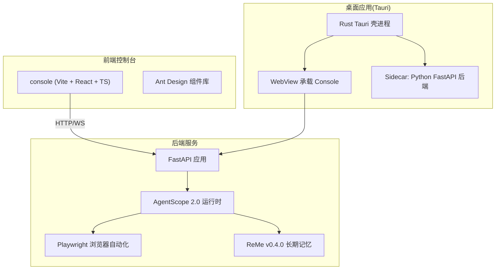
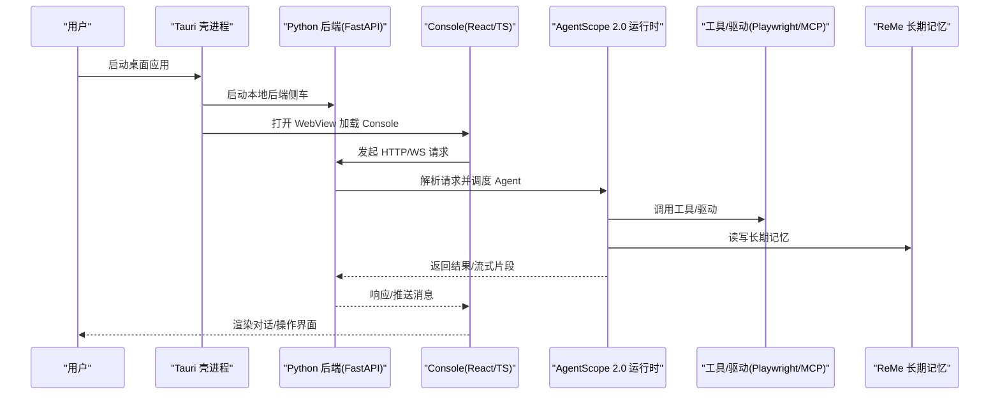
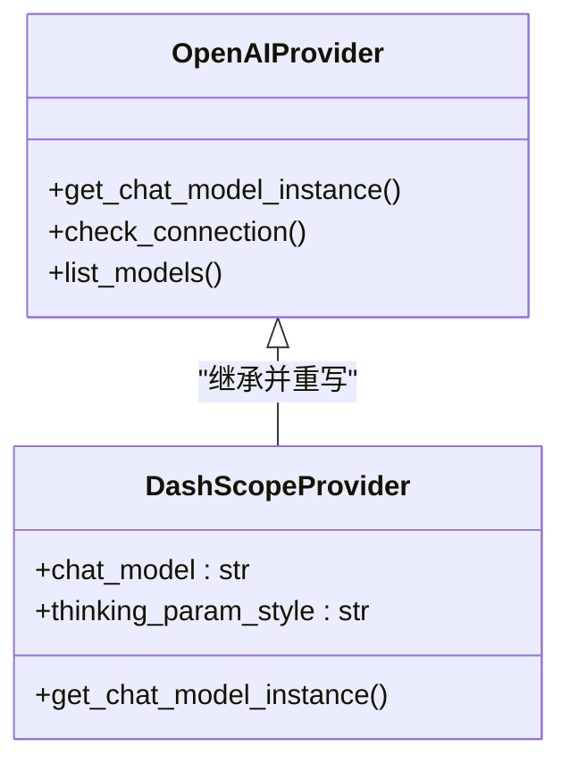
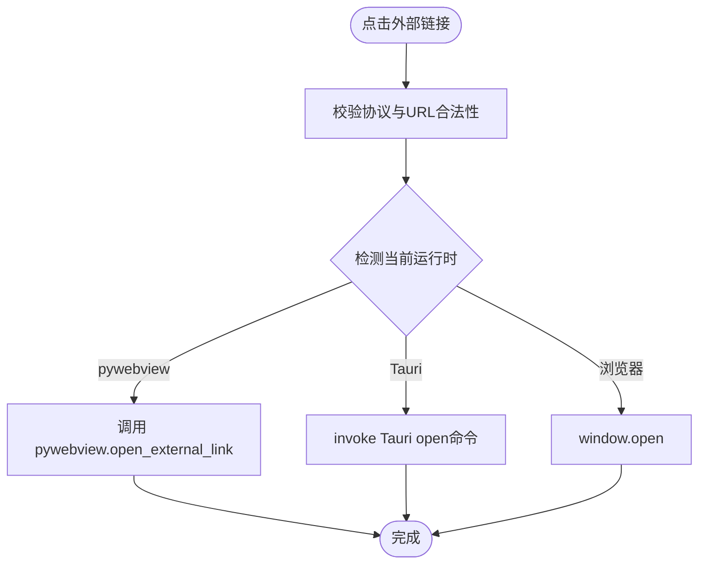
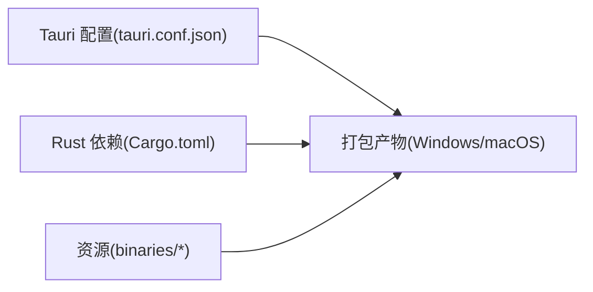
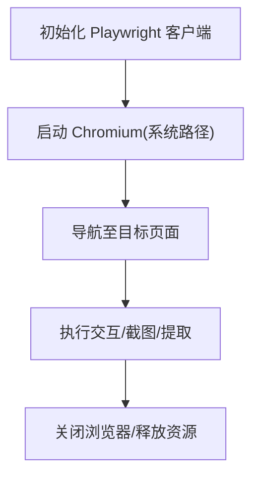
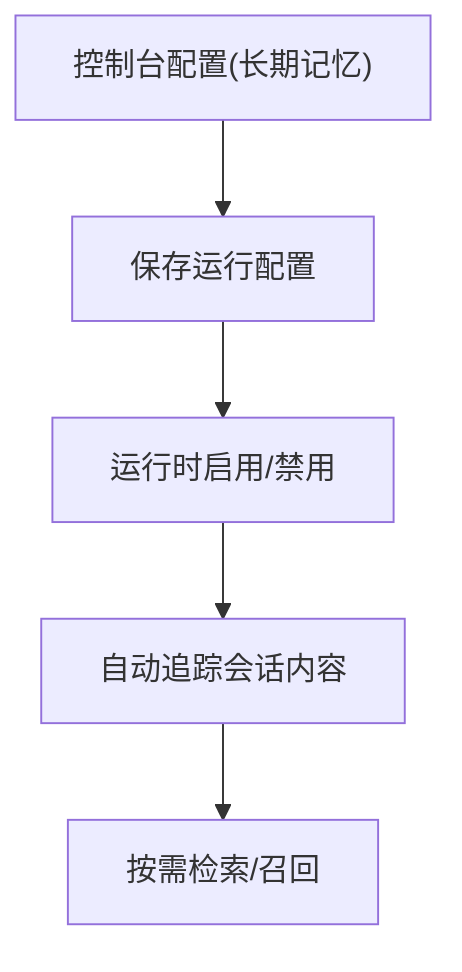
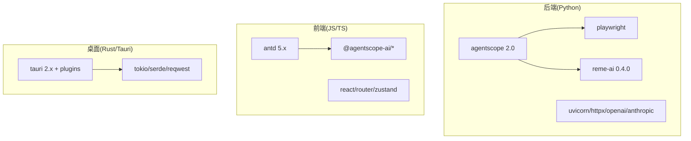

# 技术栈概览

<cite>
**本文引用的文件**   
- [README.md](file://README.md)
- [pyproject.toml](file://pyproject.toml)
- [console/package.json](file://console/package.json)
- [console/src-tauri/Cargo.toml](file://console/src-tauri/Cargo.toml)
- [console/src-tauri/tauri.conf.json](file://console/src-tauri/tauri.conf.json)
- [deploy/Dockerfile](file://deploy/Dockerfile)
- [scripts/pack-tauri/qwenpaw.spec](file://scripts/pack-tauri/qwenpaw.spec)
- [src/qwenpaw/providers/dashscope_provider.py](file://src/qwenpaw/providers/dashscope_provider.py)
- [src/qwenpaw/drivers/handlers/mcp_stateful_client.py](file://src/qwenpaw/drivers/handlers/mcp_stateful_client.py)
- [console/src/utils/openExternalLink.ts](file://console/src/utils/openExternalLink.ts)
</cite>

## 目录
1. [简介](#简介)
2. [项目结构](#项目结构)
3. [核心组件](#核心组件)
4. [架构总览](#架构总览)
5. [详细组件分析](#详细组件分析)
6. [依赖关系分析](#依赖关系分析)
7. [性能与部署考量](#性能与部署考量)
8. [故障排查指南](#故障排查指南)
9. [结论](#结论)
10. [附录：学习路径建议](#附录学习路径建议)

## 简介
本技术栈概览聚焦 QwenPaw 的核心选型与工程化落地，覆盖后端 Python 3.11+（FastAPI + AgentScope 2.0）、前端控制台（TypeScript/React + Ant Design）、Rust Tauri 桌面应用底层，以及关键依赖框架（AgentScope 2.0、Playwright、ReMe v0.4.0）和构建部署方案（Docker、Tauri 打包、PyInstaller）。文档同时给出架构图、时序图与流程图，帮助开发者快速理解系统边界、数据流与扩展点。

## 项目结构
QwenPaw 采用前后端分离与多端分发策略：
- 后端服务：Python 包 src/qwenpaw，提供 FastAPI 应用、Agent 运行时、驱动与工具生态等。
- 前端控制台：console 目录，基于 Vite + React + TypeScript，使用 Ant Design 组件库。
- 桌面应用：console/src-tauri，Rust 实现 Tauri 壳进程，负责启动本地后端 sidecar、承载 WebView 并处理系统能力。
- 容器化：deploy/Dockerfile 定义镜像构建与运行环境。
- 打包脚本：scripts/pack-tauri 下包含 PyInstaller spec 与 Tauri 相关脚本。

图表来源
- [console/package.json:1-89](file://console/package.json#L1-L89)
- [console/src-tauri/Cargo.toml:1-38](file://console/src-tauri/Cargo.toml#L1-L38)
- [console/src-tauri/tauri.conf.json:1-91](file://console/src-tauri/tauri.conf.json#L1-L91)
- [deploy/Dockerfile:1-112](file://deploy/Dockerfile#L1-L112)
- [pyproject.toml:1-186](file://pyproject.toml#L1-L186)

章节来源
- [README.md:104-175](file://README.md#L104-L175)
- [README.md:218-261](file://README.md#L218-L261)
- [README.md:283-325](file://README.md#L283-L325)

## 核心组件
- 后端运行时与模型接入
  - 基于 AgentScope 2.0 的 ChatModel 抽象，统一多提供商接入（如 DashScope 原生适配）。
  - MCP 状态化客户端封装，解决跨任务生命周期与资源泄漏问题。
- 前端控制台
  - React + TypeScript + Vite 构建；Ant Design 作为 UI 基础组件库。
  - 支持国际化、主题切换、插件注册与动态模块加载。
- 桌面应用
  - Rust Tauri 壳进程，管理本地 Python 后端 sidecar，提供系统级能力（托盘、更新、外部链接打开等）。
- 浏览器自动化
  - Playwright 用于网页抓取、截图、自动化交互等场景。
- 长期记忆
  - ReMe v0.4.0 提供会话级自动追踪、按需检索与后端嵌入能力。

章节来源
- [src/qwenpaw/providers/dashscope_provider.py:1-39](file://src/qwenpaw/providers/dashscope_provider.py#L1-L39)
- [src/qwenpaw/drivers/handlers/mcp_stateful_client.py:1-38](file://src/qwenpaw/drivers/handlers/mcp_stateful_client.py#L1-L38)
- [console/package.json:22-56](file://console/package.json#L22-L56)
- [console/src-tauri/Cargo.toml:1-38](file://console/src-tauri/Cargo.toml#L1-L38)
- [pyproject.toml:7-71](file://pyproject.toml#L7-L71)

## 架构总览
下图展示从用户到后端的关键调用链：Tauri 启动本地后端侧车，Console 通过 HTTP/WS 与后端通信，后端在 AgentScope 2.0 编排下调用工具与记忆系统。

图表来源
- [console/src-tauri/tauri.conf.json:1-91](file://console/src-tauri/tauri.conf.json#L1-L91)
- [console/src-tauri/Cargo.toml:1-38](file://console/src-tauri/Cargo.toml#L1-L38)
- [deploy/Dockerfile:1-112](file://deploy/Dockerfile#L1-L112)
- [pyproject.toml:7-71](file://pyproject.toml#L7-L71)

## 详细组件分析

### 后端：FastAPI + AgentScope 2.0
- 模型提供方抽象
  - 以 OpenAIProvider 为基类，DashScopeProvider 复用连接检查、模型列表与多模态探测逻辑，仅重写构造原生 DashScopeChatModel 的方法，体现良好的继承与复用设计。
- MCP 状态化客户端
  - 针对 uvicorn/FastAPI 中跨任务上下文管理器退出导致的 CPU 泄漏问题，将完整生命周期放入单一后台任务，并通过事件信号控制重载/停止，避免 anyio.CancelScope 跨任务错误。

图表来源
- [src/qwenpaw/providers/dashscope_provider.py:1-39](file://src/qwenpaw/providers/dashscope_provider.py#L1-L39)

章节来源
- [src/qwenpaw/providers/dashscope_provider.py:1-39](file://src/qwenpaw/providers/dashscope_provider.py#L1-L39)
- [src/qwenpaw/drivers/handlers/mcp_stateful_client.py:1-38](file://src/qwenpaw/drivers/handlers/mcp_stateful_client.py#L1-L38)

### 前端控制台：TypeScript/React + Ant Design
- 构建与依赖
  - 使用 Vite 构建，React 18 作为视图层，Ant Design 5.x 作为 UI 组件库，配合 i18next 实现国际化。
- 运行时桥接
  - 外部链接打开在不同运行时（浏览器、pywebview、Tauri）间智能选择目标，确保桌面端安全与一致性。

图表来源
- [console/src/utils/openExternalLink.ts:1-145](file://console/src/utils/openExternalLink.ts#L1-L145)

章节来源
- [console/package.json:22-56](file://console/package.json#L22-L56)
- [console/src/utils/openExternalLink.ts:1-145](file://console/src/utils/openExternalLink.ts#L1-L145)

### 桌面应用：Rust Tauri
- 壳进程职责
  - 启动本地 Python 后端 sidecar，承载 Console 前端，暴露系统能力（托盘、更新、外部链接打开等），并提供安全 CSP 配置。
- 打包与资源
  - tauri.conf.json 指定产物目标、图标、资源与 NSIS 安装器语言集；Cargo.toml 声明 Tauri 插件与依赖。

图表来源
- [console/src-tauri/tauri.conf.json:1-91](file://console/src-tauri/tauri.conf.json#L1-L91)
- [console/src-tauri/Cargo.toml:1-38](file://console/src-tauri/Cargo.toml#L1-L38)

章节来源
- [console/src-tauri/tauri.conf.json:1-91](file://console/src-tauri/tauri.conf.json#L1-L91)
- [console/src-tauri/Cargo.toml:1-38](file://console/src-tauri/Cargo.toml#L1-L38)

### 浏览器自动化：Playwright
- 作用与集成
  - 在容器环境中通过系统 Chromium 执行，避免重复下载；环境变量指示容器运行模式，便于无沙箱启动。
- 典型用途
  - 网页抓取、截图、自动化交互、页面元素定位与等待。

图表来源
- [deploy/Dockerfile:79-86](file://deploy/Dockerfile#L79-L86)
- [pyproject.toml:21-21](file://pyproject.toml#L21-L21)

章节来源
- [deploy/Dockerfile:79-86](file://deploy/Dockerfile#L79-L86)
- [pyproject.toml:21-21](file://pyproject.toml#L21-L21)

### 长期记忆：ReMe v0.4.0
- 功能要点
  - 会话级自动追踪、按使用感知的搜索、后端特定嵌入；在控制台“长期记忆”卡片中可配置开关与定时任务。
- 测试验证
  - E2E 用例覆盖配置页签渲染、开关状态持久化与路径遍历防护等。

图表来源
- [e2e/pages/memory_page.py:34-59](file://e2e/pages/memory_page.py#L34-L59)
- [pyproject.toml:24-24](file://pyproject.toml#L24-L24)

章节来源
- [e2e/pages/memory_page.py:34-59](file://e2e/pages/memory_page.py#L34-L59)
- [pyproject.toml:24-24](file://pyproject.toml#L24-L24)

## 依赖关系分析
- 后端依赖
  - agentscope==2.0.4 为核心 Agent 框架；playwright>=1.49.0 用于浏览器自动化；reme-ai==0.4.0.9 提供长期记忆；uvicorn 作为 ASGI 服务器；httpx、openai、anthropic 等用于模型与网络通信。
- 前端依赖
  - antd 5.x 作为 UI 组件库；@agentscope-ai/design 与 @agentscope-ai/chat 提供设计与聊天组件；react-router-dom、zustand 用于路由与状态管理。
- 桌面依赖
  - Tauri 2.x 及其插件（log、shell、dialog、updater）；Rust 标准库与 tokio 异步运行时。

图表来源
- [pyproject.toml:7-71](file://pyproject.toml#L7-L71)
- [console/package.json:22-56](file://console/package.json#L22-L56)
- [console/src-tauri/Cargo.toml:21-37](file://console/src-tauri/Cargo.toml#L21-L37)

章节来源
- [pyproject.toml:7-71](file://pyproject.toml#L7-L71)
- [console/package.json:22-56](file://console/package.json#L22-L56)
- [console/src-tauri/Cargo.toml:21-37](file://console/src-tauri/Cargo.toml#L21-L37)

## 性能与部署考量
- 容器化（Docker）
  - 多阶段构建：先构建前端 dist，再在运行时镜像中安装 Python 依赖；使用系统 Chromium 与 PLAYWRIGHT_SKIP_BROWSER_DOWNLOAD=1 减少体积与启动时间；设置 QWENPAW_RUNNING_IN_CONTAINER=1 以便在无沙箱环境下正确运行。
- 桌面打包（Tauri + PyInstaller）
  - Tauri 负责打包前端与系统能力；PyInstaller spec 收集 qwenpaw/console 静态资源、agentscope/reme 等包数据与元信息，生成 onedir 后端 bundle，供 Tauri 直接加载。
- 性能优化建议
  - 后端：合理设置超时与重试；对长耗时工具调用进行异步与限流；利用缓存与索引提升记忆检索效率。
  - 前端：按需加载与代码分割；减少重渲染；合理使用虚拟列表。
  - 桌面：最小化资源体积；按需启用插件；合理分配内存与线程。

章节来源
- [deploy/Dockerfile:1-112](file://deploy/Dockerfile#L1-L112)
- [scripts/pack-tauri/qwenpaw.spec:1-223](file://scripts/pack-tauri/qwenpaw.spec#L1-L223)
- [console/src-tauri/tauri.conf.json:35-76](file://console/src-tauri/tauri.conf.json#L35-L76)

## 故障排查指南
- 外部链接在桌面端无法打开
  - 检查运行时检测逻辑是否识别到 Tauri；确认 CSP 允许 ipc 与 http://127.0.0.1:*；查看 invoke 调用日志。
- MCP 客户端资源泄漏
  - 确认使用了状态化客户端封装；检查后台任务生命周期与事件信号是否正确触发。
- Docker 中 Playwright 失败
  - 确认已安装系统 Chromium 且设置了 PLAYWRIGHT_CHROMIUM_EXECUTABLE_PATH 与 SKIP_DOWNLOAD；确保 --no-sandbox 生效。

章节来源
- [console/src/utils/openExternalLink.ts:1-145](file://console/src/utils/openExternalLink.ts#L1-L145)
- [src/qwenpaw/drivers/handlers/mcp_stateful_client.py:1-38](file://src/qwenpaw/drivers/handlers/mcp_stateful_client.py#L1-L38)
- [deploy/Dockerfile:79-86](file://deploy/Dockerfile#L79-L86)

## 结论
QwenPaw 的技术栈以 AgentScope 2.0 为核心，结合 FastAPI 提供高性能后端服务；前端控制台采用成熟的 React + Ant Design 生态；桌面应用通过 Tauri 获得系统级能力与轻量打包体验；Playwright 与 ReMe 分别补齐浏览器自动化与长期记忆两大关键能力。整体架构清晰、可扩展性强，适合在多平台与多通道场景下持续演进。

## 附录：学习路径建议
- 后端（Python 3.11+）
  - 学习 FastAPI 与 ASGI 生态（uvicorn、httpx、WebSocket）；掌握 AgentScope 2.0 的模型抽象与工具注册机制；理解 MCP 客户端生命周期管理与资源清理。
- 前端（TypeScript/React）
  - 熟悉 Vite 构建流程与 React 18 新特性；掌握 Ant Design 组件与样式定制；了解 i18n、主题与插件注册机制。
- 桌面（Rust/Tauri）
  - 了解 Tauri 2.x 配置与插件体系；掌握 Cargo 依赖管理与打包流程；理解 WebView 与系统能力的桥接方式。
- 浏览器自动化（Playwright）
  - 掌握页面等待、元素定位、截图与自动化交互；理解容器内 Chromium 的安装与配置。
- 长期记忆（ReMe v0.4.0）
  - 理解会话追踪、检索召回与嵌入后端对接；关注配置项与持久化策略。
- 构建与部署
  - 掌握 Docker 多阶段构建与镜像优化；熟悉 Tauri 打包与 PyInstaller 打包流程；理解资源收集与元数据注入。

章节来源
- [README.md:104-175](file://README.md#L104-L175)
- [README.md:218-261](file://README.md#L218-L261)
- [README.md:283-325](file://README.md#L283-L325)
- [pyproject.toml:7-71](file://pyproject.toml#L7-L71)
- [console/package.json:22-56](file://console/package.json#L22-L56)
- [console/src-tauri/Cargo.toml:21-37](file://console/src-tauri/Cargo.toml#L21-L37)
- [deploy/Dockerfile:1-112](file://deploy/Dockerfile#L1-L112)
- [scripts/pack-tauri/qwenpaw.spec:1-223](file://scripts/pack-tauri/qwenpaw.spec#L1-L223)