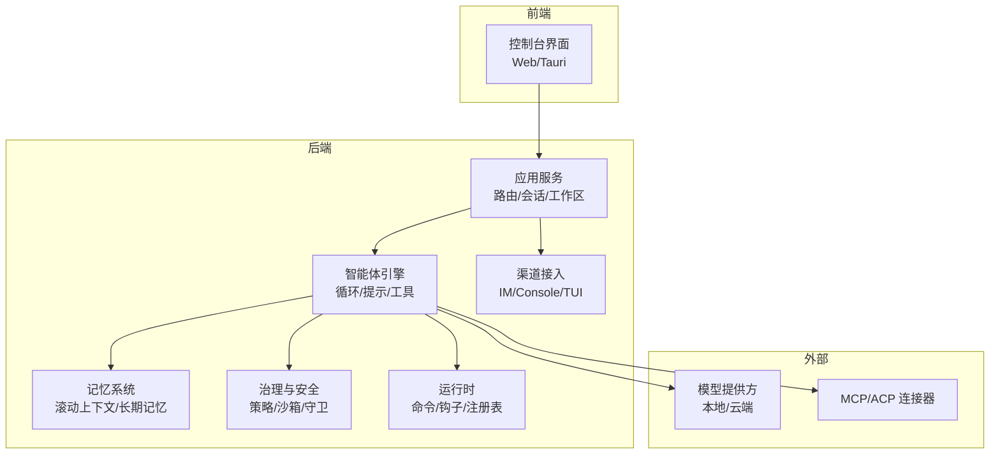
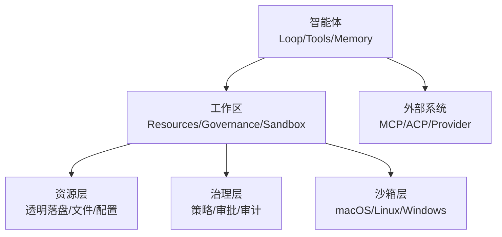
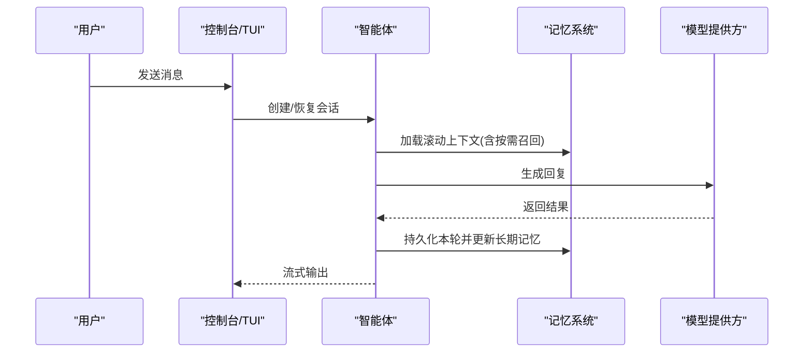
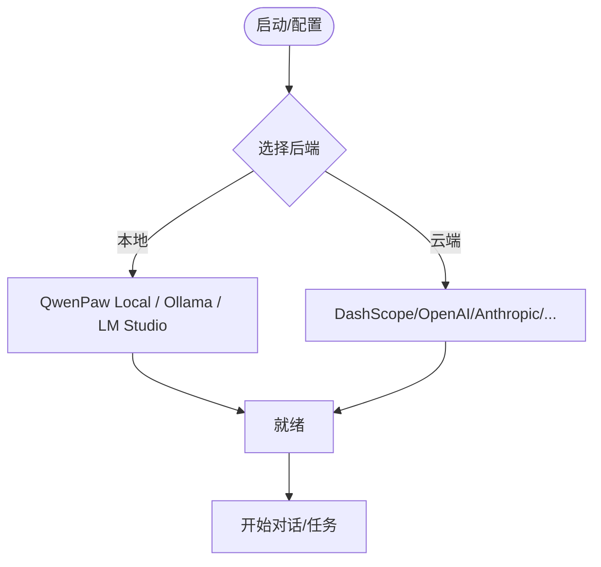
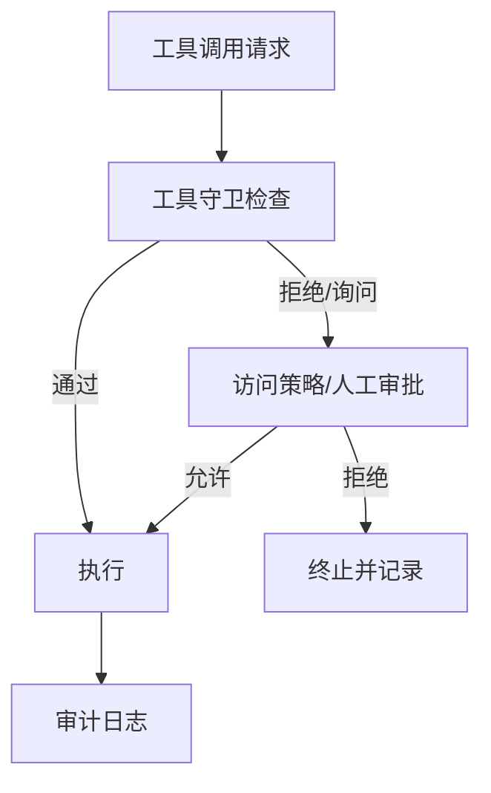
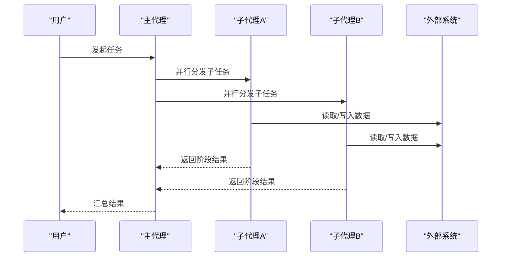
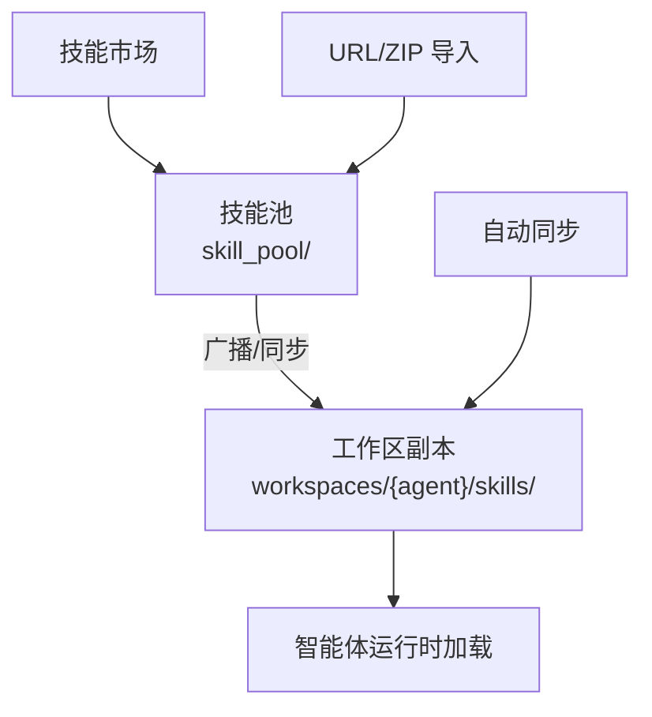
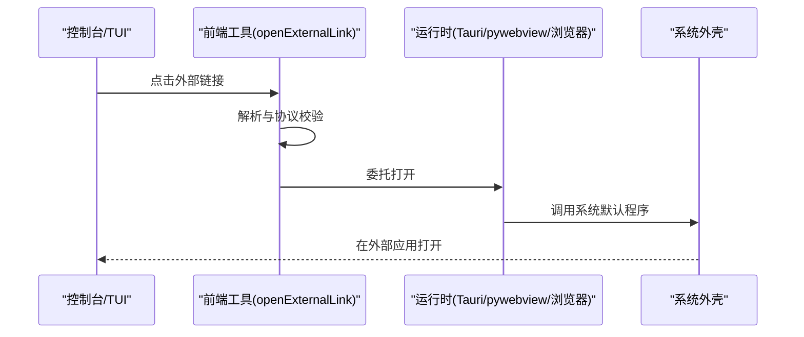
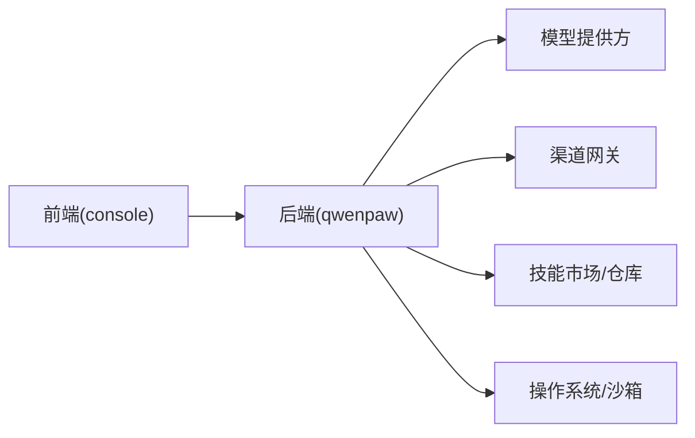

# 项目介绍与核心价值

<cite>
**本文引用的文件**   
- [README.md](file://README.md)
- [README_zh.md](file://README_zh.md)
- [skills.zh.md](file://website/public/docs/skills.zh.md)
- [start_test_server.sh](file://e2e/scripts/start_test_server.sh)
- [openExternalLink.ts](file://console/src/utils/openExternalLink.ts)
- [paths.py](file://src/qwenpaw/cli/tui/paths.py)
</cite>

## 目录
1. [引言](#引言)
2. [项目结构](#项目结构)
3. [核心组件](#核心组件)
4. [架构总览](#架构总览)
5. [详细组件分析](#详细组件分析)
6. [依赖分析](#依赖分析)
7. [性能考量](#性能考量)
8. [故障排查指南](#故障排查指南)
9. [结论](#结论)
10. [附录](#附录)

## 引言
QwenPaw 是“你的个人 AI 助手”，以「Works for you, grows with you」为核心价值主张，定位为 Agent OS（智能体操作系统）。它强调：
- 懂你所需，伴你左右：通过三层记忆、滚动上下文与长期语义记忆，让对话与知识随时间增长而更懂你。
- 本地或云端，自由运行：内置 QwenPaw Local 运行时，无需 API Key；同时兼容 Ollama、LM Studio 及多家云模型供应商。
- 安全机制内建：内核级沙箱、工具守卫、文件守卫、技能扫描器与访问策略，危险命令在执行前即被拦截。
- 多代理与并行：每个智能体拥有独立记忆与技能，支持运行时子代理与跨系统编排（ACP）。
- 随处可达：钉钉、飞书、微信、Discord、Telegram、iMessage、QQ 等全频道连接；Console、TUI 与桌面应用均可直接访问。
- 你的，不是我们的：本地部署，数据留在本机，无第三方托管与上传。

这些特性共同实现“你的数字生活中的智能温暖伙伴”的愿景：不冷冰冰的工具，而是随时准备帮忙的智慧“小爪子”。

章节来源
- [README.md:28-43](file://README.md#L28-L43)
- [README_zh.md:28-43](file://README_zh.md#L28-L43)

## 项目结构
仓库采用前后端分离与多模块组织：
- console：前端控制台（React + Tauri），提供 Web IDE、聊天、设置、插件市场等能力。
- src/qwenpaw：后端核心（Python），包含智能体、记忆、驱动、治理、沙箱、运行时、插件、渠道、CLI 等。
- e2e：端到端测试脚本与用例。
- website：文档站点源码。
- scripts：打包、构建、验证与发布脚本。
- deploy：Docker 部署相关。

图表来源
- [README.md:63-74](file://README.md#L63-L74)
- [README_zh.md:63-74](file://README_zh.md#L63-L74)

章节来源
- [README.md:63-74](file://README.md#L63-L74)
- [README_zh.md:63-74](file://README_zh.md#L63-L74)

## 核心组件
- 三层记忆系统
  - 实时工作上下文：当前轮次与滚动窗口内的活跃信息。
  - 完整逐字历史：所有历史轮次持久化，旧轮次可索引并按需召回。
  - 蒸馏知识：长期语义记忆（ReMe）自动抽取与检索。
- 本地或云端免费运行
  - QwenPaw-Flash 系列（2B/4B/9B）面向 Agent 场景训练。
  - 内置 QwenPaw Local 运行时，无需 API Key；亦支持 Ollama、LM Studio 与多家云提供商。
- 内置安全机制
  - 沙箱：Seatbelt/Bubblewrap/Landlock/AppContainer 内核级隔离。
  - 工具守卫：YAML 规则引擎与 ShellEvasionGuardian，检测注入、遍历、反连与混淆。
  - 文件守卫：默认保护敏感路径。
  - 技能扫描器：激活前扫描，支持 block/warn/off 与白名单。
  - 访问策略：allow/deny/ask 粒度控制。
- 多代理并行处理
  - 独立记忆与技能的智能体；运行时子代理；ACP 跨系统编排。

章节来源
- [README.md:36-43](file://README.md#L36-L43)
- [README_zh.md:36-43](file://README_zh.md#L36-L43)

## 架构总览
Agent OS 三大支柱：资源、治理、沙箱。围绕智能体工作区展开，形成透明落盘的资源视图、可组合的策略门控与平台级执行隔离。

图表来源
- [README.md:67-68](file://README.md#L67-L68)
- [README_zh.md:67-68](file://README_zh.md#L67-L68)

## 详细组件分析

### 三层记忆与滚动上下文
- 设计要点
  - 每轮持久化，旧轮次滚出但保留索引，按需回放，避免摘要压缩导致的信息丢失。
  - 长期记忆（ReMe v0.4.0）按轮自动追踪、使用感知搜索与后端特定嵌入。
- 典型流程
  - 用户输入 → 构造上下文（滚动窗口+按需召回）→ 调用模型 → 结果回写并更新长期记忆。

图表来源
- [README.md:70-71](file://README.md#L70-L71)
- [README_zh.md:70-71](file://README_zh.md#L70-L71)

章节来源
- [README.md:70-72](file://README.md#L70-L72)
- [README_zh.md:70-72](file://README_zh.md#L70-L72)

### 本地或云端模型与 Provider 管理
- 本地模式
  - QwenPaw Local（llama.cpp）跨平台，内置下载与硬件感知推荐。
  - Ollama/LM Studio 作为本地后端。
- 云端模式
  - 支持 DashScope/Qwen、OpenAI、Anthropic、Gemini、DeepSeek、Kimi、OpenRouter 等。
- 配置入口
  - Console → 设置 → 模型；环境变量；init 交互引导。

图表来源
- [README.md:370-381](file://README.md#L370-L381)
- [README_zh.md:370-381](file://README_zh.md#L370-L381)

章节来源
- [README.md:356-381](file://README.md#L356-L381)
- [README_zh.md:356-381](file://README_zh.md#L356-L381)

### 安全机制与治理
- 四层防护
  - 沙箱：内核级执行隔离。
  - 工具守卫：YAML 规则 + ShellEvasionGuardian，STRICT/SMART/AUTO/OFF 审批级别。
  - 文件守卫：默认保护敏感目录。
  - 技能扫描器：block/warn/off 与白名单。
- 访问策略
  - allow/deny/ask 声明式策略，工具级粒度与来源感知匹配。

图表来源
- [README.md:384-394](file://README.md#L384-L394)
- [README_zh.md:384-394](file://README_zh.md#L384-394)

章节来源
- [README.md:384-394](file://README.md#L384-L394)
- [README_zh.md:384-394](file://README_zh.md#L384-394)

### 多代理与并行协作
- 能力概览
  - 每个智能体拥有独立记忆与技能；运行时可生成子代理；通过 ACP 进行跨系统编排。
- 典型场景
  - 主代理协调多个子代理并行完成复杂任务（如调研+写作+排版）。

图表来源
- [README.md:39-40](file://README.md#L39-L40)
- [README_zh.md:39-40](file://README_zh.md#L39-L40)

章节来源
- [README.md:39-40](file://README.md#L39-L40)
- [README_zh.md:39-40](file://README_zh.md#L39-L40)

### 技能系统与技能池
- 两层结构
  - 技能池：共享本地仓库，集中管理与分发。
  - 工作区副本：各工作区实际运行的本地副本。
- 关键能力
  - 广播/导入/上传/URL 安装/市场浏览；自动同步；频道路由；运行时 config 注入。
- 常见用法
  - 从市场安装 PDF/Office/浏览器/新闻/Cron 等技能；为不同频道限定生效范围；将工作区技能发布到池复用。

图表来源
- [skills.zh.md:19-47](file://website/public/docs/skills.zh.md#L19-L47)
- [skills.zh.md:311-326](file://website/public/docs/skills.zh.md#L311-L326)

章节来源
- [skills.zh.md:19-47](file://website/public/docs/skills.zh.md#L19-L47)
- [skills.zh.md:311-326](file://website/public/docs/skills.zh.md#L311-L326)

### 渠道与外部链接打开
- 渠道覆盖
  - 钉钉、飞书、微信、Discord、Telegram、iMessage、QQ 等，一个实例全频道连接。
- 外部链接
  - 统一跨运行时（浏览器/pywebview/Tauri）的外部链接打开逻辑，校验协议与目标环境。

图表来源
- [openExternalLink.ts:1-145](file://console/src/utils/openExternalLink.ts#L1-L145)

章节来源
- [README.md:42](file://README.md#L42)
- [README_zh.md:42](file://README_zh.md#L42)
- [openExternalLink.ts:1-145](file://console/src/utils/openExternalLink.ts#L1-L145)

### CLI/TUI 状态目录
- TUI 自持状态目录，遵循 PAW_STATE_DIR/XDG_STATE_HOME，避免与工作目录耦合。
- 便于调试与日志定位。

章节来源
- [paths.py:1-34](file://src/qwenpaw/cli/tui/paths.py#L1-L34)

## 依赖分析
- 前端依赖
  - React 生态、Tauri SDK、Vite 构建。
- 后端依赖
  - Python 包与扩展（llama.cpp 本地推理、MCP/ACP 连接器、渠道 SDK 等）。
- 外部集成
  - 模型提供方（本地/云端）、多渠道 IM 网关、技能市场与上游仓库。

图表来源
- [README.md:63-74](file://README.md#L63-L74)
- [README_zh.md:63-74](file://README_zh.md#L63-74)

章节来源
- [README.md:63-74](file://README.md#L63-L74)
- [README_zh.md:63-74](file://README_zh.md#L63-74)

## 性能考量
- 本地推理优化
  - 优先选择量化模型（Q4/Q8）与硬件感知推荐，合理设置上下文长度。
- 记忆与上下文
  - 滚动上下文按需召回，避免一次性加载过长历史造成延迟。
- 并发与并行
  - 多代理并行与技能并行安装（串行队列保证一致性）提升吞吐与稳定性。
- 网络与缓存
  - 模型与技能缓存、CDN/镜像加速，减少首启与安装耗时。

[本节为通用指导，不涉及具体文件]

## 故障排查指南
- 快速自检
  - 确认端口占用与后端就绪：E2E 脚本会轮询 /api/version 判断后端是否就绪。
  - 检查工作目录与密钥卷挂载（Docker 场景）。
- 常见问题
  - 端口冲突：更换 E2E_PORT 或停止已有进程。
  - 权限问题：确保工作目录与密钥目录可读写。
  - 外部链接无法打开：检查协议白名单与 Tauri 能力配置。

章节来源
- [start_test_server.sh:109-120](file://e2e/scripts/start_test_server.sh#L109-L120)
- [openExternalLink.ts:1-145](file://console/src/utils/openExternalLink.ts#L1-L145)

## 结论
QwenPaw 以 Agent OS 的理念，将“资源、治理、沙箱”三大支柱贯穿智能体工作区，结合三层记忆、本地/云端自由运行、内置安全与多代理并行，真正实现了「Works for you, grows with you」。它既是强大的生产力底座，也是“你的数字生活中的智能温暖伙伴”。

[本节为总结性内容，不涉及具体文件]

## 附录
- 常用入口
  - Console：http://127.0.0.1:8088/
  - TUI：qwenpaw / qwenpaw tui --resume <id>
  - 桌面应用：官方下载页
- 参考文档
  - 技能、渠道、记忆、安全、备份、API、ACP 等详见网站文档。

[本节为补充信息，不涉及具体文件]