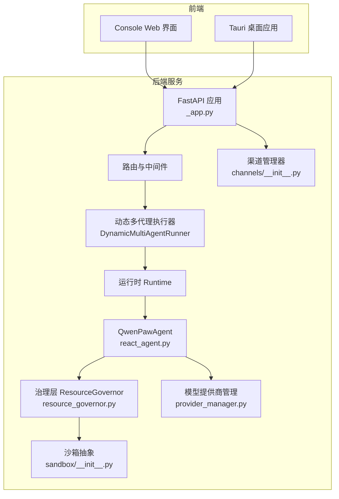
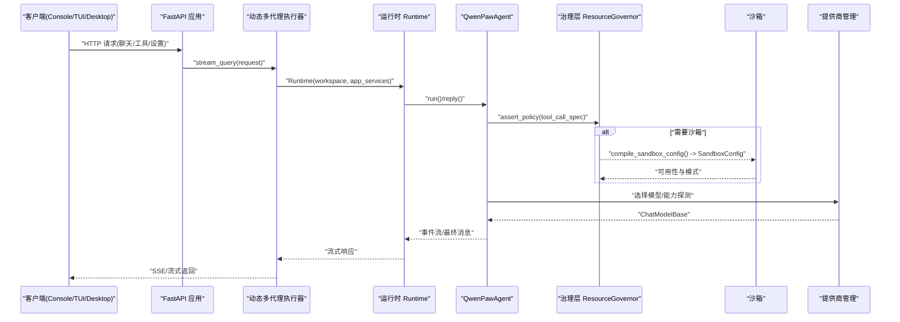
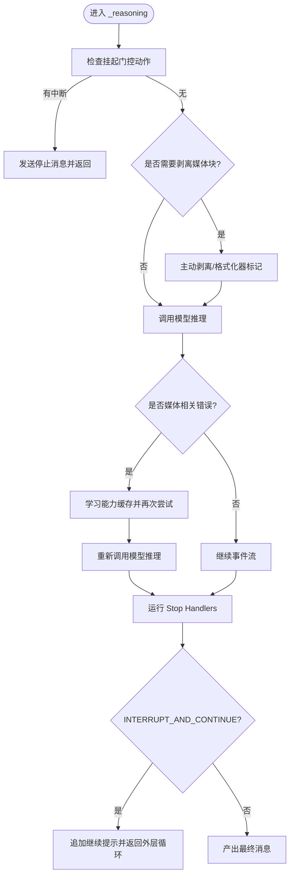
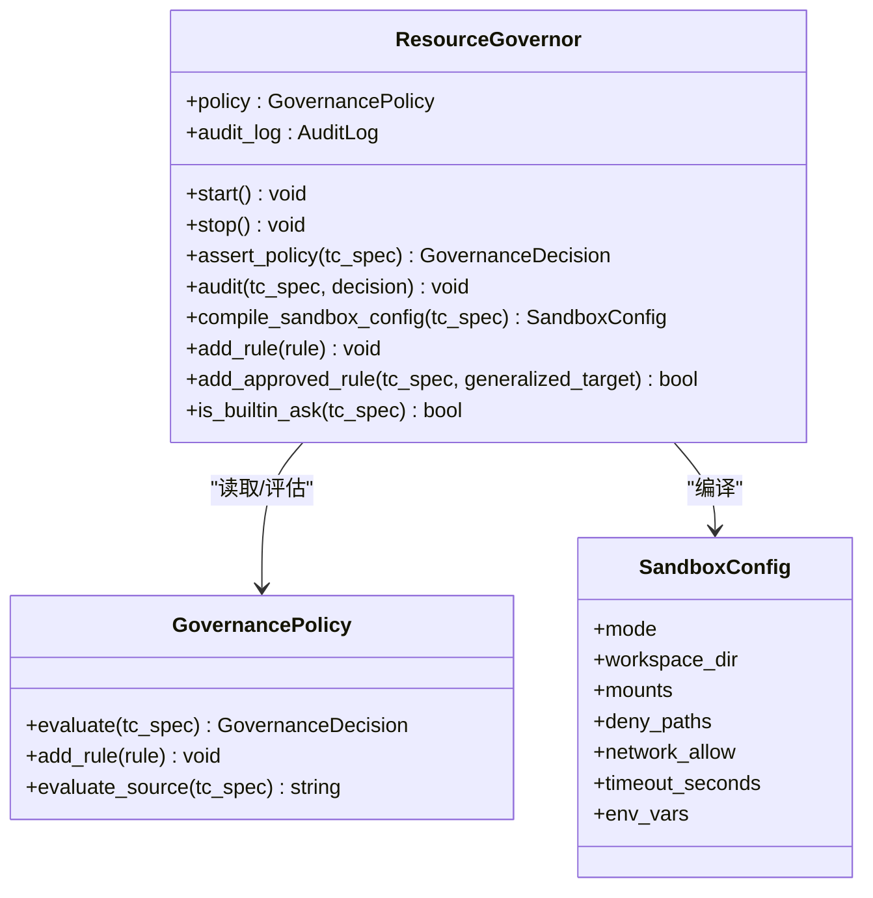
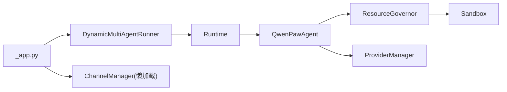

# 项目概述

<cite>
**本文引用的文件**   
- [README.md](file://README.md)
- [src/qwenpaw/__init__.py](file://src/qwenpaw/__init__.py)
- [src/qwenpaw/app/_app.py](file://src/qwenpaw/app/_app.py)
- [src/qwenpaw/agents/react_agent.py](file://src/qwenpaw/agents/react_agent.py)
- [src/qwenpaw/governance/__init__.py](file://src/qwenpaw/governance/__init__.py)
- [src/qwenpaw/governance/resource_governor.py](file://src/qwenpaw/governance/resource_governor.py)
- [src/qwenpaw/sandbox/__init__.py](file://src/qwenpaw/sandbox/__init__.py)
- [src/qwenpaw/app/channels/__init__.py](file://src/qwenpaw/app/channels/__init__.py)
- [src/qwenpaw/providers/provider_manager.py](file://src/qwenpaw/providers/provider_manager.py)
</cite>

## 目录
1. [简介](#简介)
2. [项目结构](#项目结构)
3. [核心组件](#核心组件)
4. [架构总览](#架构总览)
5. [详细组件分析](#详细组件分析)
6. [依赖关系分析](#依赖关系分析)
7. [性能考量](#性能考量)
8. [故障排查指南](#故障排查指南)
9. [结论](#结论)
10. [附录](#附录)

## 简介
QwenPaw 是一个“个人 AI 助手平台”，以「Works for you, grows with you」为设计理念，提供多模态交互、多渠道接入、安全可控与高度可扩展的 Agent OS。它既可作为本地或云端部署的个人智能体工作区，也可作为团队级协作与编排的基础设施。

核心价值主张
- 多模态交互：支持文本、图像、音频、视频等输入输出，具备媒体能力探测与自适应降级策略。
- 多渠道接入：统一接入钉钉、飞书、微信、Discord、Telegram、iMessage、QQ 等渠道，一次实例，全渠道可达。
- 安全可控：内核级沙箱、工具守卫、文件守卫、技能扫描与访问策略，危险命令在运行前被拦截。
- 高度可扩展：Skills、Plugins、MCP 集成，结合计划与自动化任务构建定制化工作流。
- 可观测与可治理：审计日志、资源治理、策略评估与动态规则扩展。

Agent OS 三层支柱
- 资源（Resources）：以工作区为中心的透明磁盘资源组织，包含会话历史、记忆、技能与插件等。
- 治理（Governance）：基于策略的规则引擎，对工具调用进行 ALLOW/DENY/ASK/SANDBOX_FALLBACK 决策，并持久化审计。
- 沙箱（Sandbox）：跨平台执行隔离（Seatbelt/Bubblewrap/Landlock/AppContainer），按策略编译挂载与权限边界。

面向初学者
- 通过 Console/TUI/Desktop 快速上手，配置模型后即刻对话；逐步启用 Skills、Channels、Cron 等能力。
- 使用内置安全机制，无需担心误操作带来的风险。

面向资深开发者
- 理解 Runtime 启动流程、Workspace/Agent 生命周期、ProviderManager 的多厂商模型适配、治理与沙箱的协同机制。
- 基于 Hooks、Slash Commands、Tool Guard 与 Policy 扩展系统行为。

章节来源
- [README.md:28-43](file://README.md#L28-L43)
- [README.md:62-74](file://README.md#L62-L74)

## 项目结构
仓库采用前后端分离与模块化后端设计：
- console：前端控制台（React + Tauri 桌面壳）。
- src/qwenpaw：Python 后端核心，包含应用服务、Agent、运行时、治理、沙箱、渠道、提供商、插件、CLI 等。
- plugins：示例与第三方插件（channel/tool）。
- scripts：打包、安装、验证脚本。
- e2e：端到端测试套件。
- website：文档站点源码。

图表来源
- [src/qwenpaw/app/_app.py:787-800](file://src/qwenpaw/app/_app.py#L787-L800)
- [src/qwenpaw/app/_app.py:77-159](file://src/qwenpaw/app/_app.py#L77-L159)
- [src/qwenpaw/agents/react_agent.py:47-133](file://src/qwenpaw/agents/react_agent.py#L47-L133)
- [src/qwenpaw/governance/resource_governor.py:42-104](file://src/qwenpaw/governance/resource_governor.py#L42-L104)
- [src/qwenpaw/sandbox/__init__.py:1-63](file://src/qwenpaw/sandbox/__init__.py#L1-L63)
- [src/qwenpaw/providers/provider_manager.py:1-41](file://src/qwenpaw/providers/provider_manager.py#L1-L41)
- [src/qwenpaw/app/channels/__init__.py:1-14](file://src/qwenpaw/app/channels/__init__.py#L1-L14)

章节来源
- [src/qwenpaw/app/_app.py:787-800](file://src/qwenpaw/app/_app.py#L787-L800)
- [src/qwenpaw/app/_app.py:77-159](file://src/qwenpaw/app/_app.py#L77-L159)

## 核心组件
- 应用与服务启动：FastAPI 应用负责中间件、静态资源、鉴权、路由注册、后台初始化与优雅关闭。
- 动态多代理执行器：根据请求上下文选择 Workspace，构造 Runtime 并流式执行。
- Agent：基于 ReAct 的智能体，集成工具、技能、记忆、上下文管理与媒体能力自适应。
- 治理层：策略评估、审计记录、动态规则添加与沙箱配置编译。
- 沙箱：跨平台执行隔离，按策略生成挂载与权限边界。
- 提供商管理：统一封装多家 LLM 提供商，支持多模型、多计划与能力探测。
- 渠道管理：懒加载 ChannelManager，避免不必要的依赖引入。

章节来源
- [src/qwenpaw/app/_app.py:162-210](file://src/qwenpaw/app/_app.py#L162-L210)
- [src/qwenpaw/app/_app.py:77-159](file://src/qwenpaw/app/_app.py#L77-L159)
- [src/qwenpaw/agents/react_agent.py:47-133](file://src/qwenpaw/agents/react_agent.py#L47-L133)
- [src/qwenpaw/governance/__init__.py:1-21](file://src/qwenpaw/governance/__init__.py#L1-L21)
- [src/qwenpaw/governance/resource_governor.py:42-104](file://src/qwenpaw/governance/resource_governor.py#L42-L104)
- [src/qwenpaw/sandbox/__init__.py:1-63](file://src/qwenpaw/sandbox/__init__.py#L1-L63)
- [src/qwenpaw/providers/provider_manager.py:1-41](file://src/qwenpaw/providers/provider_manager.py#L1-L41)
- [src/qwenpaw/app/channels/__init__.py:1-14](file://src/qwenpaw/app/channels/__init__.py#L1-L14)

## 架构总览
QwenPaw 以 FastAPI 为入口，承载 Console/TUI/Desktop 等客户端。请求经中间件与路由进入 DynamicMultiAgentRunner，按 agent_id 选择 Workspace，并通过 Runtime 驱动 QwenPawAgent 完成推理、工具调用与记忆更新。治理层在工具调用前进行策略评估与审计，必要时触发用户审批与沙箱执行。ProviderManager 统一管理多厂商模型，渠道层将消息分发至各 IM 平台。

图表来源
- [src/qwenpaw/app/_app.py:109-149](file://src/qwenpaw/app/_app.py#L109-L149)
- [src/qwenpaw/agents/react_agent.py:447-510](file://src/qwenpaw/agents/react_agent.py#L447-L510)
- [src/qwenpaw/governance/resource_governor.py:196-271](file://src/qwenpaw/governance/resource_governor.py#L196-L271)
- [src/qwenpaw/governance/resource_governor.py:300-379](file://src/qwenpaw/governance/resource_governor.py#L300-L379)
- [src/qwenpaw/providers/provider_manager.py:1-41](file://src/qwenpaw/providers/provider_manager.py#L1-L41)

## 详细组件分析

### 应用与服务启动（FastAPI）
- 职责：初始化日志、迁移、遥测、AppServiceManager、WorkspaceRegistry、插件系统、TokenUsage 后台任务、健康检查与文档路由。
- 关键流程：lifespan 中完成轻量同步初始化，随后后台任务并行加载插件、启动 Agent、注册控制命令与 Hook。
- 优雅关闭：执行插件 shutdown hooks、停止本地模型服务、AppServiceManager、MultiAgentManager，并并行清理浏览器、Hub 客户端与 TokenUsage。

章节来源
- [src/qwenpaw/app/_app.py:162-210](file://src/qwenpaw/app/_app.py#L162-L210)
- [src/qwenpaw/app/_app.py:497-677](file://src/qwenpaw/app/_app.py#L497-L677)
- [src/qwenpaw/app/_app.py:679-784](file://src/qwenpaw/app/_app.py#L679-L784)

### 动态多代理执行器（DynamicMultiAgentRunner）
- 职责：从请求解析当前 agent_id，获取对应 Workspace，构造 Runtime 并流式执行；注册外部任务以便优雅关闭。
- 错误处理：捕获异常并以结构化错误事件返回。

章节来源
- [src/qwenpaw/app/_app.py:77-159](file://src/qwenpaw/app/_app.py#L77-L159)

### 智能体（QwenPawAgent）
- 职责：整合工具、技能、记忆、上下文管理、媒体能力自适应与 Stop Hook 循环控制。
- 关键特性：
  - 压缩上下文：优先委托 Context Manager（Scroll），否则回退到原生压缩。
  - 媒体块处理：主动剥离不支持的媒体块，或在失败时被动重试并学习能力缓存。
  - 工具钩子：为不同工具注册默认超时与最大内部超时。
  - 状态序列化：兼容 2.0 与 1.x 格式，确保升级平滑。

图表来源
- [src/qwenpaw/agents/react_agent.py:411-510](file://src/qwenpaw/agents/react_agent.py#L411-L510)
- [src/qwenpaw/agents/react_agent.py:553-612](file://src/qwenpaw/agents/react_agent.py#L553-L612)
- [src/qwenpaw/agents/react_agent.py:653-706](file://src/qwenpaw/agents/react_agent.py#L653-L706)
- [src/qwenpaw/agents/react_agent.py:729-743](file://src/qwenpaw/agents/react_agent.py#L729-L743)

章节来源
- [src/qwenpaw/agents/react_agent.py:47-133](file://src/qwenpaw/agents/react_agent.py#L47-L133)
- [src/qwenpaw/agents/react_agent.py:145-184](file://src/qwenpaw/agents/react_agent.py#L145-L184)
- [src/qwenpaw/agents/react_agent.py:185-287](file://src/qwenpaw/agents/react_agent.py#L185-L287)
- [src/qwenpaw/agents/react_agent.py:411-510](file://src/qwenpaw/agents/react_agent.py#L411-L510)
- [src/qwenpaw/agents/react_agent.py:553-612](file://src/qwenpaw/agents/react_agent.py#L553-L612)
- [src/qwenpaw/agents/react_agent.py:653-706](file://src/qwenpaw/agents/react_agent.py#L653-L706)
- [src/qwenpaw/agents/react_agent.py:729-743](file://src/qwenpaw/agents/react_agent.py#L729-L743)

### 治理层（ResourceGovernor）
- 职责：策略评估、审计记录、动态规则添加、沙箱配置编译。
- 关键流程：
  - assert_policy：评估规则 → 处理 SANDBOX_FALLBACK 降级 → 编译沙箱配置 → 记录决策日志。
  - audit：持久化审计条目。
  - compile_sandbox_config：基于 user_rules 推导挂载与读写权限，注入 deny_paths 与环境变量黑名单。
  - add_rule/add_approved_rule：用户批准后追加 ALLOW 规则并持久化。

图表来源
- [src/qwenpaw/governance/resource_governor.py:42-104](file://src/qwenpaw/governance/resource_governor.py#L42-L104)
- [src/qwenpaw/governance/resource_governor.py:196-271](file://src/qwenpaw/governance/resource_governor.py#L196-L271)
- [src/qwenpaw/governance/resource_governor.py:300-379](file://src/qwenpaw/governance/resource_governor.py#L300-L379)
- [src/qwenpaw/governance/resource_governor.py:412-478](file://src/qwenpaw/governance/resource_governor.py#L412-L478)

章节来源
- [src/qwenpaw/governance/__init__.py:1-21](file://src/qwenpaw/governance/__init__.py#L1-L21)
- [src/qwenpaw/governance/resource_governor.py:42-104](file://src/qwenpaw/governance/resource_governor.py#L42-L104)
- [src/qwenpaw/governance/resource_governor.py:196-271](file://src/qwenpaw/governance/resource_governor.py#L196-L271)
- [src/qwenpaw/governance/resource_governor.py:300-379](file://src/qwenpaw/governance/resource_governor.py#L300-L379)
- [src/qwenpaw/governance/resource_governor.py:412-478](file://src/qwenpaw/governance/resource_governor.py#L412-L478)

### 沙箱（Sandbox）
- 职责：跨平台执行隔离，提供统一的 create_sandbox 接口与能力探测。
- 模式：SEATBELT（macOS）、BUBBLEWRAP/LANDLOCK（Linux）、APPCONTAINER（Windows）、NONE（无隔离）。
- 生命周期：每次工具调用创建与销毁，按策略生成挂载与权限边界。

章节来源
- [src/qwenpaw/sandbox/__init__.py:1-63](file://src/qwenpaw/sandbox/__init__.py#L1-L63)

### 渠道管理（ChannelManager）
- 职责：懒加载 ChannelManager，避免 CLI 环境引入重型依赖。
- 特点：模块级 __getattr__ 延迟导入，按需加载具体渠道实现。

章节来源
- [src/qwenpaw/app/channels/__init__.py:1-14](file://src/qwenpaw/app/channels/__init__.py#L1-L14)

### 提供商管理（ProviderManager）
- 职责：统一管理内置与自定义提供商，提供模型列表、能力信息与加密密钥字段处理。
- 特性：支持多厂商（DashScope、OpenAI、Gemini、Anthropic、Ollama、LM Studio 等），维护模型清单与计划分组。

章节来源
- [src/qwenpaw/providers/provider_manager.py:1-41](file://src/qwenpaw/providers/provider_manager.py#L1-L41)

## 依赖关系分析
- 低耦合高内聚：应用层仅依赖运行时与治理层接口；Agent 通过 Toolkit 与 PolicyGuardedTool 间接依赖治理与沙箱。
- 外部依赖：FastAPI、AgentScope、SQLite（审计）、平台沙箱工具（seatbelt/bubblewrap/landlock/appcontainer）。
- 潜在循环：通过懒加载与模块级 __getattr__ 避免启动期循环导入。

图表来源
- [src/qwenpaw/app/_app.py:77-159](file://src/qwenpaw/app/_app.py#L77-L159)
- [src/qwenpaw/agents/react_agent.py:47-133](file://src/qwenpaw/agents/react_agent.py#L47-L133)
- [src/qwenpaw/governance/resource_governor.py:42-104](file://src/qwenpaw/governance/resource_governor.py#L42-L104)
- [src/qwenpaw/sandbox/__init__.py:1-63](file://src/qwenpaw/sandbox/__init__.py#L1-L63)
- [src/qwenpaw/providers/provider_manager.py:1-41](file://src/qwenpaw/providers/provider_manager.py#L1-L41)
- [src/qwenpaw/app/channels/__init__.py:1-14](file://src/qwenpaw/app/channels/__init__.py#L1-L14)

章节来源
- [src/qwenpaw/app/_app.py:77-159](file://src/qwenpaw/app/_app.py#L77-L159)
- [src/qwenpaw/agents/react_agent.py:47-133](file://src/qwenpaw/agents/react_agent.py#L47-L133)
- [src/qwenpaw/governance/resource_governor.py:42-104](file://src/qwenpaw/governance/resource_governor.py#L42-L104)
- [src/qwenpaw/sandbox/__init__.py:1-63](file://src/qwenpaw/sandbox/__init__.py#L1-L63)
- [src/qwenpaw/providers/provider_manager.py:1-41](file://src/qwenpaw/providers/provider_manager.py#L1-L41)
- [src/qwenpaw/app/channels/__init__.py:1-14](file://src/qwenpaw/app/channels/__init__.py#L1-L14)

## 性能考量
- 启动优化：FastAPI lifespan 中只做轻量同步初始化，重活（插件、Agent、Skill 池）在后台任务并行执行，尽快接受请求。
- 流式响应：Runner 与 Agent 的事件流减少首字节延迟，提升交互体验。
- 能力缓存：媒体能力学习与拒绝标志缓存，避免反复失败重试。
- 资源回收：关闭阶段并行清理浏览器、Hub 客户端与 TokenUsage，降低资源泄漏风险。

[本节为通用指导，不直接分析具体文件]

## 故障排查指南
- 启动失败：检查恢复工件清理、遥测收集、迁移与 Session 同步步骤的日志；若失败不应阻塞启动。
- 策略与审计：查看 ResourceGovernor 的决策日志与审计数据库，确认规则匹配与 SANDBOX_FALLBACK 降级路径。
- 媒体错误：关注 Agent 的媒体剥离与重试逻辑，确认能力缓存是否被污染（如大小/上下文长度错误不应误判为媒体问题）。
- 渠道加载：确认 ChannelManager 懒加载未引发依赖缺失；在 CLI 环境下避免引入重型 SDK。

章节来源
- [src/qwenpaw/app/_app.py:162-210](file://src/qwenpaw/app/_app.py#L162-L210)
- [src/qwenpaw/governance/resource_governor.py:196-271](file://src/qwenpaw/governance/resource_governor.py#L196-L271)
- [src/qwenpaw/agents/react_agent.py:553-612](file://src/qwenpaw/agents/react_agent.py#L553-L612)
- [src/qwenpaw/app/channels/__init__.py:1-14](file://src/qwenpaw/app/channels/__init__.py#L1-L14)

## 结论
QwenPaw 以 Agent OS 的三层支柱（资源、治理、沙箱）为核心，结合多模态交互、多渠道接入与安全可控的设计，提供了可扩展且易于使用的个人 AI 助手平台。其架构清晰、组件职责明确，适合从个人使用到团队协作的多种场景。

[本节为总结性内容，不直接分析具体文件]

## 附录
- 公共接口与参数（概念性说明）
  - 应用入口：FastAPI 应用暴露 REST 与 OpenAPI 文档（可按配置启用）。
  - 动态执行：stream_query(request) 接收请求并返回流式事件。
  - 治理接口：assert_policy(tc_spec)、audit(tc_spec, decision)、compile_sandbox_config(tc_spec)。
  - 沙箱接口：create_sandbox(config) 返回可执行对象，支持 execute(...)。
  - 渠道接口：ChannelManager 懒加载，按需创建与管理渠道实例。
  - 提供商接口：ProviderManager 提供模型列表、能力信息与密钥字段加解密。

- 常见用例
  - 本地对话：Console/TUI 发起聊天，自动选择活跃 Agent 与模型。
  - 工具调用：在策略允许下执行 Shell/文件/浏览器等工具，必要时触发审批与沙箱。
  - 多渠道推送：配置渠道后，将摘要或告警推送到多个 IM 平台。
  - 定时任务：通过 Cron 调度新闻摘要、报告生成与广播。

[本节为概念性说明，不直接分析具体文件]